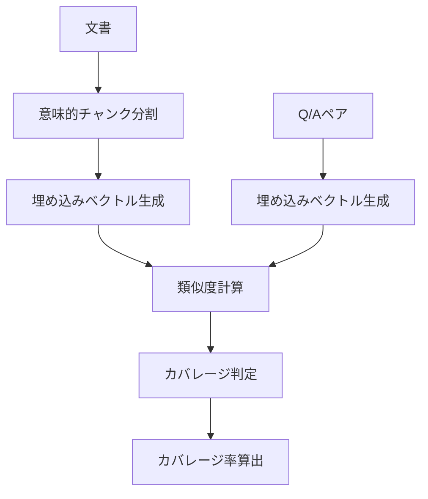

# OpenAI RAG Q&A 日本語システム

日本語文書に対するRAG（Retrieval-Augmented Generation）とQ&Aペアのセマンティックカバレージ分析システム

## 概要

このシステムは、日本語文書とQ&Aペアの間の意味的な網羅性（セマンティックカバレージ）を測定し、Q&Aデータセットの品質評価を行います。OpenAIの埋め込みモデルとQdrantベクトルデータベースを使用して、高精度な類似度検索とカバレージ分析を実現しています。

## インストール

```bash
pip install -r requirements.txt
```

## セットアップ

1. 環境変数の設定（`.env`ファイル）:
```bash
OPENAI_API_KEY=your-openai-api-key
QDRANT_URL=http://localhost:6333
```

2. Qdrantサーバーの起動:
```bash
docker-compose -f docker-compose/docker-compose.yml up -d
```

3. データの登録:
```bash
python a30_qdrant_registration.py --recreate --limit 100
```

## 使用方法
使用例：
#### 2. 結果確認後、CC-News全体 (お試し：　--max-docs 10)
- python a02_make_qa.py --dataset cc_news --analyze-coverage --max-docs 10
- python a02_make_qa.py --dataset japanese_text --analyze-coverage --max-docs 10

# 詳細なカバレージ分析
- cat qa_output/coverage_cc_news_*.json | jq '.covered_chunks, .total_chunks'

- カバレージ率が80%以上であれば良好です。
- 70%未満の場合は、--batch-chunksを減らすか、Q/A数を増やすことを検討してください。


##### cc_newsからQ/A生成
python a02_make_qa.py --dataset cc_news
python a02_make_qa.py --dataset cc_news --max-docs 5

##### 日本語テキストから生成（カバレージ分析付き）
python a02_make_qa.py --dataset japanese_text --analyze-coverage

##### Wikipedia日本語版から生成（最初の10文書のみ）
python a02_make_qa.py --dataset wikipedia_ja --max-docs 10

##### 出力先を指定
python a02_make_qa.py --dataset cc_news --output my_qa_output

出力ファイル：
- qa_output/qa_pairs_{dataset}_{timestamp}.json - Q/AペアJSON
- qa_output/qa_pairs_{dataset}_{timestamp}.csv - Q/AペアCSV
- qa_output/coverage_{dataset}_{timestamp}.json - カバレージ分析
- qa_output/summary_{dataset}_{timestamp}.json - サマリー情報


### 基本的な実行
```bash
# セマンティックカバレージ分析の実行
python example.py

# Streamlit UIの起動
streamlit run a50_rag_search_local_qdrant.py

# サーバーの起動
python server.py
```

## アーキテクチャ



### スコアの意味（重要度レベル）

| スコア | 意味            | 該当する単語の例              |
|-----|---------------|-----------------------|
| 2.0 | 最重要（固有名詞）     | 「東京」「Microsoft」「安倍晋三」 |
| 1.5 | 重要（専門用語・技術用語） | 「AI」「NLP」「トランスフォーマー」  |
| 1.0 | 標準（一般名詞）      | 「学習」「処理」「分野」          |
| 0.8 | やや低い（その他の名詞）  | 「こと」「もの」（ストップワード除外後）  |
| 0.5 | 低い（1文字名詞）     | 「本」「木」                |

## 主要な関数（make_qa.py）

| 関数名 | 概要 |
|--------|------|
| `demonstrate_semantic_coverage()` | セマンティックカバレージの処理を実演し、ドキュメントのチャンク化、埋め込み生成、カバレージ計算を行う |
| `visualize_semantic_coverage(coverage_matrix, doc_chunks, qa_pairs)` | カバレージマトリックスをヒートマップとヒストグラムで可視化する |
| `interpret_results(coverage_rate, uncovered_chunks)` | カバレージ率に基づいて結果を解釈し、改善のためのアクション提案を行う |
| `extract_keywords(text, top_n=5)` | テキストから重要なキーワードを抽出（日本語対応） |
| `calculate_priority(uncovered_chunks)` | 未カバーチャンクの優先度を計算し、Q&A追加の優先順位を決定 |
| `main()` | メイン関数（現在はexample_documentを出力するのみ） |

## 主要コンポーネント

### コアモジュール
- `rag_qa.py` - SemanticCoverageクラスの実装
- `helper_api.py` - OpenAI API統合
- `helper_rag.py` - RAGデータ前処理
- `helper_st.py` - Streamlitユーティリティ

### データ管理スクリプト
- `a01_load_set_rag_data.py` - RAGデータのロードと設定
- `a02_set_vector_store_vsid.py` - ベクトルストアIDの設定
- `a03_rag_search_cloud_vs.py` - クラウドベクトルストアの検索
- `a30_qdrant_registration.py` - Qdrantへのデータ登録
- `a35_qdrant_truncate.py` - Qdrantコレクションの削除
- `a40_show_qdrant_data.py` - Qdrantデータの表示
- `a50_rag_search_local_qdrant.py` - ローカルQdrant検索UI

## 技術仕様

- **埋め込みモデル**: text-embedding-3-small（デフォルト）
- **チャンクサイズ**: 最大200トークン
- **類似度閾値**: 0.7-0.8（カバレージ判定用）
- **対応モデル**: GPT-4o、GPT-4.1、O-series（o1、o3、o4）など

## ライセンス

[ライセンス情報を追加してください]


