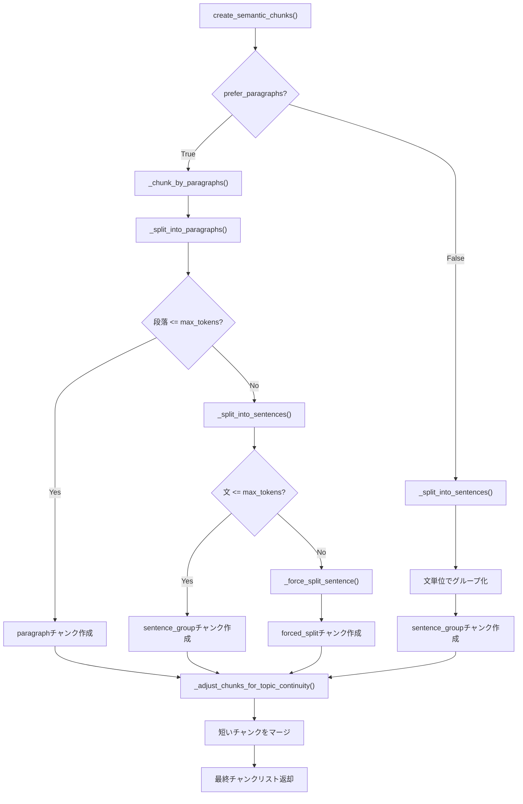

チャンク分割に使用しているクラス・関数を整理します。

### システムアーキテクチャ図：

[主関数] SemanticCoverage.create_semantic_chunks()



**処理の流れ:**

1. `prefer_paragraphs=True`（デフォルト）の場合、段落境界を最優先で分割
2. 段落が`max_tokens`を超える場合のみ文単位に再分割
3. 単一の文が`max_tokens`を超える場合は強制的にトークン単位で分割
4. 最後にトピック連続性を考慮して短いチャンクをマージ

#### a02_make_qa_para.py

- チャンク分割関連: [主関数] SemanticCoverage.create_semantic_chunks()
- create_semantic_chunks() (ローカル関数) - 487行目
- helper_rag_qa.SemanticCoverage クラスを使用 - 507行目
- SemanticCoverage.create_semantic_chunks() メソッドを内部で呼び出し
- merge_small_chunks() - 819行目

#### a03_rag_qa_coverage_improved.py

- チャンク分割関連:[主関数] SemanticCoverage.create_semantic_chunks()
- helper_rag_qa.SemanticCoverage クラスを直接インポート - 68行目
- SemanticCoverage.create_semantic_chunks() を使用 - 821行目
- process_with_improved_methods() 関数内で呼び出し

#### 10_qa_optimized_hybrid_batch.py

- チャンク分割関連:[主関数]
- helper_rag_qa.BatchHybridQAGenerator クラスを使用 - 140行目
- helper_rag_qa.OptimizedHybridQAGenerator クラスを使用 - 140行目
- 内部でSemanticCoverageを使用してチャンク分割を実行

#### これらの情報をまとめて、ユーザーに分かりやすく一覧表示します。

⏺ 3ファイルのチャンク分割に使用しているクラス・関数一覧

#### 1. a02_make_qa_para.py


| クラス/関数                               | 定義場所                                 | 概要                                           |
| ----------------------------------------- | ---------------------------------------- | ---------------------------------------------- |
| create_semantic_chunks()                  | ローカル関数 (487行目)                   | ラッパー関数。内部でSemanticCoverageを呼び出す |
| SemanticCoverage                          | helper_rag_qa.pyからインポート (505行目) | セマンティック分割のメインクラス               |
| SemanticCoverage.create_semantic_chunks() | helper_rag_qa.py (1513行目)              | 段落優先のセマンティック分割を実行             |
| merge_small_chunks()                      | ローカル関数 (819行目)                   | 小さすぎるチャンクを隣接チャンクと統合         |

チャンク分割フロー:

```
create_document_chunks() (756行目)
│   DataFrameの各行（文書）をループし、セマンティック分割を実行。
│   doc_id、chunk_idx等のメタデータを各チャンクに付与して返却。
│
└→ create_semantic_chunks() (487行目) [ローカル]
    │   SemanticCoverageクラスのラッパー関数。
    │   言語、max_tokens、chunk_id_prefixを設定してセマンティック分割を呼び出し、
    │   結果をa02用のフォーマット（id, text, tokens, type, sentences）に変換。
    │
    └→ SemanticCoverage.create_semantic_chunks() [helper_rag_qa.py:1513]
        │   メインのセマンティック分割関数。prefer_paragraphs=Trueで段落優先モード。
        │   文書を意味的なまとまりで分割し、トークン数制限を守りながらチャンク化。
        │
        ├→ _chunk_by_paragraphs() [helper_rag_qa.py:1623]
        │       段落（\n\n区切り）をベースにチャンク作成。
        │       段落がmax_tokens以下ならそのままparagraphチャンクに。
        │       超過する場合は文単位に再分割してsentence_groupチャンクに。
        │
        ├→ _split_into_sentences() [helper_rag_qa.py:1713]
        │       テキストを文単位に分割。日本語の場合はMeCabを優先使用。
        │       MeCab未インストール時は正規表現（。．？！等）にフォールバック。
        │       英語は正規表現（.!?）で分割。
        │
        └→ _adjust_chunks_for_topic_continuity() [helper_rag_qa.py:1767]
                短すぎるチャンク（min_tokens未満）を前のチャンクにマージ。
                マージ後300トークン以下なら統合、超えるなら独立チャンクとして保持。
                異なるtypeがマージされた場合はtype="merged"に更新。
```

---

2. a03_rag_qa_coverage_improved.py


| クラス/関数                               | 定義場所                                    | 概要                                          |
| ----------------------------------------- | ------------------------------------------- | --------------------------------------------- |
| SemanticCoverage                          | helper_rag_qa.pyから直接インポート (68行目) | セマンティック分割のメインクラス              |
| SemanticCoverage.create_semantic_chunks() | helper_rag_qa.py (1513行目)                 | 段落優先のセマンティック分割                  |
| analyze_chunk_complexity()                | ローカル関数 (254行目)                      | チャンクの複雑度を分析して適切なQ/A戦略を決定 |
| KeywordExtractor                          | ローカルクラス (95行目)                     | MeCab/正規表現によるキーワード抽出            |

チャンク分割フロー:
process_with_improved_methods() (798行目)
└→ SemanticCoverage.create_semantic_chunks() (821行目)
├→ prefer_paragraphs=True (段落優先モード)
├→ max_tokens=200
└→ min_tokens=50

---

3. a10_qa_optimized_hybrid_batch.py


| クラス/関数                | 定義場所                                 | 概要                            |
| -------------------------- | ---------------------------------------- | ------------------------------- |
| BatchHybridQAGenerator     | helper_rag_qa.pyからインポート (140行目) | バッチ処理版Q/A生成クラス       |
| OptimizedHybridQAGenerator | helper_rag_qa.pyからインポート (140行目) | 最適化版Q/A生成クラス（比較用） |
| 内部: SemanticCoverage     | BatchHybridQAGenerator内部で使用         | チャンク分割を内部で実行        |

チャンク分割フロー:　SemanticCoverage.create_semantic_chunks()
generate_batch_qa_from_dataset() (225行目)
└→ BatchHybridQAGenerator.generate_batch_hybrid_qa() (301行目)
└→ 内部でSemanticCoverageを使用してチャンク作成
└→ MeCab対応（日本語データセット時自動利用）

---

比較表


| ファイル                         | 主要クラス                      | チャンク分割方式           | 特徴                             |
| -------------------------------- | ------------------------------- | -------------------------- | -------------------------------- |
| a02_make_qa_para.py              | SemanticCoverage (ラッパー経由) | 段落優先セマンティック分割 | 小チャンク統合機能付き           |
| a03_rag_qa_coverage_improved.py  | SemanticCoverage (直接)         | 段落優先セマンティック分割 | 複雑度分析・品質スコアリング付き |
| a10_qa_optimized_hybrid_batch.py | BatchHybridQAGenerator          | 内部でSemanticCoverage使用 | バッチ処理最適化・キャッシュ対応 |

---

共通の基盤: helper_rag_qa.pyのSemanticCoverageクラス

全てのファイルが最終的にSemanticCoverage.create_semantic_chunks()を使用しています。主要メソッド:


| メソッド                              | 行番号 | 役割                             |
| ------------------------------------- | ------ | -------------------------------- |
| create_semantic_chunks()              | 1513   | メイン分割関数                   |
| _split_into_paragraphs()              | 1608   | 段落分割（\n\nで区切る）         |
| _chunk_by_paragraphs()                | 1623   | 段落ベースのチャンク化           |
| _split_into_sentences()               | 1713   | 文分割（MeCab/正規表現自動切替） |
| _split_sentences_mecab()              | 1733   | MeCabによる日本語文分割          |
| _force_split_sentence()               | 1685   | 長文の強制分割（最終手段）       |
| _adjust_chunks_for_topic_continuity() | 1767   | トピック連続性の調整             |

---

## 主要メソッド詳細解説

以下では、SemanticCoverageクラスの主要メソッドについて、設計思想と実装詳細を解説します。

---

### 1. `_split_into_sentences()` - インテリジェント文分割（1713行目）

#### 概要

テキストを**文単位**に分割する関数。言語（日本語 or 英語）を自動判定し、最適な分割方法を選択します。

#### 処理フロー図

```
入力テキスト
     │
     ▼
┌─────────────────────────────────────┐
│  _split_into_sentences()            │
│  ┌───────────────────────────────┐  │
│  │ 日本語判定（先頭100文字）     │  │
│  └───────────────────────────────┘  │
│       │                             │
│   日本語？ ─── NO ─────────────────────────────┐
│       │YES                          │          │
│       ▼                             │          │
│  MeCab利用可？ ─ NO ───────────────────────────┤
│       │YES                          │          │
│       ▼                             │          ▼
│  _split_sentences_mecab()           │   正規表現で分割
│                                     │   (?<=[。．.!?])\s*
└─────────────────────────────────────┘
```

#### 日本語判定の仕組み

```python
is_japanese = bool(re.search(r'[\u3040-\u309F\u30A0-\u30FF\u4E00-\u9FFF]', text[:100]))
```

| Unicode範囲 | 文字種 | 例 |
|------------|--------|-----|
| `\u3040-\u309F` | ひらがな | あ、い、う、を、ん |
| `\u30A0-\u30FF` | カタカナ | ア、イ、ウ、ヲ、ン |
| `\u4E00-\u9FFF` | 漢字 | 日、本、語 |

→ これらが**1文字でもあれば**日本語と判定（先頭100文字で高速判定）

#### 分割方法の優先順位

```
┌────────────────────────────────────────────────┐
│           分割方法の優先順位                    │
├────────────────────────────────────────────────┤
│ 1. MeCab (日本語)  ← 形態素解析で高精度        │
│    ↓ 失敗時                                    │
│ 2. 正規表現        ← 軽量・フォールバック      │
└────────────────────────────────────────────────┘
```

#### なぜMeCabを優先するのか？

正規表現だけだと誤分割が起きるケースがあります：

```
【正規表現の弱点】
「3.14は円周率です。」→ 「3」「14は円周率です。」（誤分割！）
「Yahoo!は検索サイトです。」→ 「Yahoo」「は検索サイトです。」（誤分割！）

【MeCabなら正しく分割】
「3.14は円周率です。」→ 「3.14は円周率です。」（正しい）
```

#### 正規表現フォールバック

```python
sentences = re.split(r'(?<=[。．.!?])\s*', text)
```

| パターン | 意味 |
|---------|------|
| `(?<=...)` | 肯定後読み（マッチ位置の直前がこのパターン） |
| `[。．.!?]` | 句点・ピリオド・感嘆符・疑問符のいずれか |
| `\s*` | 0個以上の空白 |

→ 句読点の**直後**で分割（句読点自体は前の文に残る）

---

### 2. `_split_sentences_mecab()` - MeCabによる文分割（1733行目）

#### MeCabとは？

**MeCab**は、日本語の形態素解析器です。テキストを最小意味単位（形態素）に分解します。

```
入力: 「私は東京に住んでいます。」
　↓ MeCab解析
出力: 私 / は / 東京 / に / 住ん / で / い / ます / 。
      ↑各形態素に分解
```

#### 処理フロー図

```
入力テキスト: 「日本語は難しい。でも面白い！」
              │
              ▼
         ┌─────────┐
         │ MeCab   │
         │ Tagger  │
         └─────────┘
              │ parseToNode()
              ▼
    ┌─────────────────────────────────────┐
    │ ノードチェーン（形態素の連結リスト）│
    │                                     │
    │ [日本語]→[は]→[難しい]→[。]→       │
    │ [でも]→[面白い]→[！]→[EOS]         │
    └─────────────────────────────────────┘
              │
              ▼ ノードを順次処理
         ┌─────────────────┐
         │ 文末記号を検出  │
         │ 。．？！?!      │
         └─────────────────┘
              │
              ▼
    出力: ["日本語は難しい。", "でも面白い！"]
```

#### MeCabノードの構造

```
┌──────────────────────────────────────────┐
│  MeCab.Node オブジェクト                 │
├──────────────────────────────────────────┤
│  .surface  = "東京"        (表層形)      │
│  .feature  = "名詞,固有名詞,地域,..."    │
│  .next     = 次のノード                  │
│  .prev     = 前のノード                  │
└──────────────────────────────────────────┘
         │
         ▼ node.next
┌──────────────────────────────────────────┐
│  .surface  = "に"                        │
│  .feature  = "助詞,格助詞,..."           │
│  ...                                     │
└──────────────────────────────────────────┘
```

#### 具体例：処理過程の追跡

入力: `「今日は天気が良い。明日も晴れるだろう。」`

```
MeCab解析結果（ノードチェーン）:
  今日 → は → 天気 → が → 良い → 。 → 明日 → も → 晴れる → だろう → 。

処理過程:
┌───────┬────────────────────────────────────┬─────────────────────────┐
│ステップ│ current_sentence                   │ sentences               │
├───────┼────────────────────────────────────┼─────────────────────────┤
│ 1     │ ["今日"]                           │ []                      │
│ 2     │ ["今日", "は"]                     │ []                      │
│ 3     │ ["今日", "は", "天気"]             │ []                      │
│ ...   │ ...                                │ []                      │
│ 6     │ ["今日","は","天気","が","良い","。"] │ []                    │
│       │ ↑「。」検出→文確定                 │                         │
│ 7     │ []  (リセット)                     │ ["今日は天気が良い。"]  │
│ 8     │ ["明日"]                           │ ["今日は天気が良い。"]  │
│ ...   │ ...                                │                         │
│ 11    │ ["明日","も","晴れる","だろう","。"] │                        │
│       │ ↑「。」検出→文確定                 │                         │
│ 12    │ []                                 │ ["今日は天気が良い。",  │
│       │                                    │  "明日も晴れるだろう。"]│
└───────┴────────────────────────────────────┴─────────────────────────┘

最終出力: ["今日は天気が良い。", "明日も晴れるだろう。"]
```

#### 文末判定の記号

```python
if surface in ['。', '．', '？', '！', '?', '!']:
```

| 記号 | 用途 |
|------|------|
| `。` | 和文句点 |
| `．` | 全角ピリオド |
| `？` `?` | 疑問符（全角/半角） |
| `！` `!` | 感嘆符（全角/半角） |

---

### 3. `_adjust_chunks_for_topic_continuity()` - トピック連続性調整（1767行目）

#### 目的

短すぎるチャンクを前のチャンクにマージし、意味的なまとまりを維持します。

#### 処理フロー図

```
入力チャンク列
[チャンク1: 150トークン] [チャンク2: 30トークン] [チャンク3: 180トークン]
                              ↑
                         min_tokens(50)未満
                              │
                              ▼
                    前のチャンクとマージ検討
                              │
              ┌───────────────┴───────────────┐
              ▼                               ▼
    結合後 <= 300トークン？           結合後 > 300トークン？
              │                               │
              ▼                               ▼
         マージ実行                    独立チャンク維持
              │
              ▼
[チャンク1+2: 180トークン] [チャンク3: 180トークン]
```

#### パラメータ設計

| パラメータ | 値 | 理由 |
|-----------|-----|------|
| `min_tokens` | 50 | これより短いと文脈不足でQ&A生成品質低下 |
| マージ上限 | 300 | embedding model の最適入力長を考慮 |

#### 具体例

```
【マージ前】
チャンク1: "機械学習は人工知能の一分野です。" (15トークン)
チャンク2: "データから学習します。" (8トークン)  ← 短すぎる
チャンク3: "深層学習はニューラルネットワークを使用した..." (120トークン)

【マージ後】
チャンク1+2: "機械学習は人工知能の一分野です。データから学習します。" (23トークン)
チャンク3: "深層学習はニューラルネットワークを使用した..." (120トークン)
```

#### タイプ管理

異なるタイプのチャンクがマージされた場合、`type="merged"`に更新：

```python
if prev_chunk.get("type") != chunk.get("type"):
    prev_chunk["type"] = "merged"
```

---

### 2つの文分割関数の関係図

```
create_semantic_chunks()     # チャンク生成のメイン関数
        │
        ▼
_split_into_sentences()      # 文分割（ルーティング）
        │
        ├── 日本語 & MeCab可 ───▶ _split_sentences_mecab()
        │                              │
        │                              ▼
        │                         MeCab形態素解析
        │                         句点で文を区切る
        │
        └── 英語 or MeCab不可 ──▶ 正規表現で分割
                                       │
                                       ▼
                                  (?<=[。．.!?])\s*

        │
        ▼
_adjust_chunks_for_topic_continuity()  # 短いチャンクをマージ
```

---

### 設計思想まとめ

| 観点 | 設計 | 理由 |
|------|------|------|
| **言語自動判定** | 先頭100文字でひらがな/カタカナ/漢字を検出 | 高速かつ十分な精度 |
| **MeCab優先** | 日本語ならMeCabを第一選択 | 形態素解析により「3.14」等の誤分割を防止 |
| **フォールバック** | MeCab失敗時は正規表現に切替 | MeCab未インストール環境でも動作 |
| **句読点保持** | 分割後も句点を文末に残す | 文の完全性を維持 |
| **最後の文処理** | ループ後に残りを追加 | 文末句点がないテキストにも対応 |
| **短チャンクマージ** | min_tokens未満は前チャンクに統合 | 意味的まとまりと品質確保 |
