# a02_make_qa.py - Q&Aペア自動生成システム

## 概要

`a02_make_qa.py`は、preprocessedされた文書データから自動的にQ&A（質問・回答）ペアを生成するシステムです。OpenAI APIを活用して高品質な学習用Q&Aペアを生成し、生成されたQ&Aペアの文書カバレージを分析します。

## システムアーキテクチャ（処理フロー図）

```mermaid
flowchart TD
    Start([開始]) --> LoadData[データ読み込み]
    LoadData --> CSV[(preprocessedファイル)]
    CSV --> CreateChunks[チャンク作成]

    CreateChunks --> MecabChunk[MeCabチャンク分割]
    MecabChunk --> LangCheck{言語判定}
    LangCheck -->|日本語| JaSplit[日本語文分割]
    LangCheck -->|英語| EnSplit[英語文分割]

    JaSplit --> TokenCount[トークン数計算]
    EnSplit --> TokenCount

    TokenCount --> ChunkSize{サイズ判定}
    ChunkSize -->|適切| AddChunk[チャンク追加]
    ChunkSize -->|大きい| SplitWords[単語分割]
    SplitWords --> AddChunk

    AddChunk --> MergeOpt{統合オプション}
    MergeOpt -->|Yes| MergeSmall[小チャンク統合]
    MergeOpt -->|No| GenerateQA[Q&A生成]

    MergeSmall --> CheckTokens{統合可能判定}
    CheckTokens -->|可能| MergeChunks[チャンク統合]
    CheckTokens -->|不可| GenerateQA
    MergeChunks --> GenerateQA

    GenerateQA --> BatchCheck{バッチサイズ判定}
    BatchCheck -->|1チャンク| SingleGen[単一チャンク処理]
    BatchCheck -->|2-5チャンク| BatchGen[バッチ処理]

    SingleGen --> GetConfig[設定取得]
    BatchGen --> GetConfig

    GetConfig --> DatasetType{データセット判定}
    DatasetType -->|cc_news| BaseCount5[基本数5]
    DatasetType -->|japanese_text| BaseCount2[基本数2]
    DatasetType -->|wikipedia_ja| BaseCount3[基本数3]

    BaseCount5 --> CountQA[Q&A数決定]
    BaseCount2 --> CountQA
    BaseCount3 --> CountQA

    CountQA --> TokenAnalysis[トークン数解析]
    TokenAnalysis --> TokenBased{トークン数判定}
    TokenBased -->|50未満| QA2[基本2個]
    TokenBased -->|50-100| QA3[基本3個]
    TokenBased -->|100-200| QABase1[基本数+1]
    TokenBased -->|200-300| QABase2[基本数+2]
    TokenBased -->|300以上| QABase3[基本数+3]

    QA2 --> ChunkPos[チャンク位置確認]
    QA3 --> ChunkPos
    QABase1 --> ChunkPos
    QABase2 --> ChunkPos
    QABase3 --> ChunkPos

    ChunkPos --> PosCheck{位置補正判定}
    PosCheck -->|6番目以降| AddOne[+1個追加]
    PosCheck -->|5番目以前| FinalCount[最終Q&A数確定]
    AddOne --> FinalCount

    FinalCount --> MaxCheck{上限チェック}
    MaxCheck -->|8以下| PrepPrompt[プロンプト準備]
    MaxCheck -->|8超過| Cap8[8個に制限]
    Cap8 --> PrepPrompt

    PrepPrompt --> LangPrompt{言語別プロンプト}
    LangPrompt -->|日本語| JaPrompt[日本語プロンプト作成]
    LangPrompt -->|英語| EnPrompt[英語プロンプト作成]

    JaPrompt --> QTypes[質問タイプ指定]
    EnPrompt --> QTypes

    QTypes --> TypeList[fact/reason/comparison/application]
    TypeList --> BuildPrompt[プロンプト構築]

    BuildPrompt --> BatchMerge{バッチ統合}
    BatchMerge -->|単一| SinglePrompt[単一プロンプト]
    BatchMerge -->|複数| MergedPrompt[統合プロンプト]

    SinglePrompt --> CallAPI[OpenAI API呼び出し]
    MergedPrompt --> CallAPI

    CallAPI --> ResponseCheck{レスポンス確認}
    ResponseCheck -->|成功| ParseResp[Pydantic解析]
    ResponseCheck -->|エラー| RetryLogic{リトライ判定}

    RetryLogic -->|リトライ可| WaitBackoff[指数バックオフ待機]
    RetryLogic -->|リトライ不可| Fallback[個別処理フォールバック]
    WaitBackoff --> CallAPI
    Fallback --> SingleGen

    ParseResp --> ValidateQA[Q&A検証]
    ValidateQA --> AssignMeta[メタデータ付与]
    AssignMeta --> StoreQA[Q&Aペア保存]

    StoreQA --> CovCheck{カバレージ分析}
    CovCheck -->|Yes| AnalyzeCov[カバレージ分析実行]
    CovCheck -->|No| SaveFiles[結果保存]

    AnalyzeCov --> GenEmbed[埋め込み生成]
    GenEmbed --> DocEmbed[文書埋め込み]
    GenEmbed --> QAEmbed[Q&A埋め込み]

    DocEmbed --> CalcMatrix[行列計算]
    QAEmbed --> CalcMatrix

    CalcMatrix --> MultiThresh[多段階評価]
    MultiThresh --> Strict[Strict評価]
    MultiThresh --> Standard[Standard評価]
    MultiThresh --> Lenient[Lenient評価]

    CalcMatrix --> ChunkAnal[特性分析]
    ChunkAnal --> ByLength[長さ別分析]
    ChunkAnal --> ByPosition[位置別分析]

    ByLength --> Insights[インサイト]
    ByPosition --> Insights
    Strict --> CovResults[カバレージ結果]
    Standard --> CovResults
    Lenient --> CovResults
    Insights --> CovResults

    CovResults --> SaveFiles

    SaveFiles --> JSONFile[(JSON出力)]
    SaveFiles --> CSVFile[(CSV出力)]
    SaveFiles --> CovFile[(カバレージ)]
    SaveFiles --> SummaryFile[(サマリー)]

    JSONFile --> End([終了])
    CSVFile --> End
    CovFile --> End
    SummaryFile --> End
```



### 主要機能

1. **マルチデータセット対応**
   - CC-News英語ニュース
   - 日本語Webテキスト
   - Wikipedia日本語版

2. **インテリジェントな文書処理**
   - MeCabベースの文境界検出（日本語）
   - トークン数に基づく適切なサイズへの分割
   - 小さいチャンクの自動統合機能

3. **高効率Q&Aペア生成**
   - OpenAI APIを使用した自動生成
   - バッチ処理対応（3-5チャンクを同時処理）
   - 動的なQ&A数調整（チャンクサイズ・位置に基づく）
   - 4種類の質問タイプ（fact/reason/comparison/application）

4. **詳細なカバレージ分析**
   - 生成Q&Aペアの文書カバー率計算
   - 多段階閾値評価（strict/standard/lenient）
   - チャンク特性別分析（長さ別・位置別）
   - データセット別の最適閾値設定

---

## 1. Q&A生成戦略

### 1.1 基本アーキテクチャ

```
文書 → MeCabベースチャンキング → チャンク統合 → バッチQ&A生成 → 多段階カバレージ分析
```

### 1.2 LLMベースアプローチ
- **GPT-5-mini使用**: 高品質な自然言語Q&A生成
- **構造化出力**: Pydanticモデルによる型安全な出力
- **多様な質問タイプ**: fact、reason、comparison、application

---

## 2. チャンク処理戦略

### 2.1 MeCabベースチャンキング

```python
def create_mecab_chunks(text: str, lang: str = "ja", max_tokens: int = 200) -> List[Dict]:
    """
    MeCabを使った文境界検出によるチャンク作成
    - 文境界を保持（日本語: 「。」、英語: ". "）
    - 最大トークン数: 200-300（データセット依存）
    - チャンクID付与: doc_id_chunk_番号
    """
```

**特徴**:
- MeCab利用可能時は形態素解析で正確な文境界検出
- フォールバック: 正規表現による文分割
- トークン数制限でチャンクサイズ最適化

### 2.2 チャンク統合戦略

```python
def merge_small_chunks(chunks: List[Dict], min_tokens: int = 150, max_tokens: int = 400):
    """
    小さいチャンクを統合して適切なサイズに調整

    統合ルール:
    - min_tokens未満のチャンクは統合対象
    - 同じ文書のチャンクのみ統合
    - max_tokensを超えない範囲で統合
    """
```

**統合効果**:
- 元チャンク数の5-10%削減
- コンテキストの改善
- API呼び出し数の削減

---

## 3. 動的Q&A数調整メカニズム

### 3.1 改善版determine_qa_count関数

```python
def determine_qa_count(chunk: Dict, config: Dict) -> int:
    """チャンクに最適なQ/A数を決定（改善版）"""
    base_count = config["qa_per_chunk"]  # cc_news: 5
    token_count = len(tokenizer.encode(chunk['text']))
    chunk_position = chunk.get('chunk_idx', 0)

    # トークン数に基づく基本Q&A数
    if token_count < 50:
        qa_count = 2  # 旧: 1 → 新: 2
    elif token_count < 100:
        qa_count = 3  # 旧: 2 → 新: 3
    elif token_count < 200:
        qa_count = base_count + 1  # 6個
    elif token_count < 300:
        qa_count = base_count + 2  # 7個
    else:
        qa_count = base_count + 3  # 8個

    # 位置バイアス補正（文書後半+1）
    if chunk_position >= 5:
        qa_count += 1

    return min(qa_count, 8)  # 上限8個
```

### 3.2 チャンク特性別Q&A数

| チャンクタイプ | トークン数 | 基本Q&A数 | 位置補正後 |
|---------------|-----------|-----------|------------|
| Very Short | < 50 | 2 | 2-3 |
| Short | 50-100 | 3 | 3-4 |
| Medium | 100-200 | 6 | 6-7 |
| Long | 200-300 | 7 | 7-8 |
| Very Long | > 300 | 8 | 8 |

---

## 4. バッチQ&A生成

### 4.1 バッチ処理の仕組み

```python
def generate_qa_pairs_for_batch(chunks: List[Dict], config: Dict, model: str) -> List[Dict]:
    """
    複数チャンクから一度にQ/Aペアを生成

    処理フロー:
    1. 3-5チャンクをバッチ化
    2. 各チャンクのQ&A数を計算
    3. 統合プロンプトを生成
    4. 一度のAPI呼び出しで全Q&A生成
    """
```

### 4.2 プロンプト設計

#### 日本語用プロンプト
```python
system_prompt = """あなたは教育コンテンツ作成の専門家です。
複数の日本語テキストから、学習効果の高いQ&Aペアを生成してください。

生成ルール:
1. 質問は明確で具体的に
2. 回答は簡潔で正確に（1-2文程度）
3. テキストの内容に忠実に
4. 多様な観点から質問を作成"""

# 質問タイプの指定
question_types = """
- fact: 事実確認型（〜は何ですか？）
- reason: 理由説明型（なぜ〜ですか？）
- comparison: 比較型（〜と〜の違いは？）
- application: 応用型（〜はどのように活用されますか？）
"""
```

### 4.3 バッチ処理の利点
- **API効率**: 5チャンク個別 → 1回のAPI呼び出し（80%削減）
- **コンテキスト共有**: 複数チャンクの関連性を考慮
- **コスト削減**: API呼び出し数減少による費用削減

---

## 5. 多段階カバレージ分析

### 5.1 3段階評価システム

```python
OPTIMAL_THRESHOLDS = {
    "cc_news": {
        "strict": 0.80,    # 厳格: 高品質なマッチングのみ
        "standard": 0.70,  # 標準: 実用的な基準
        "lenient": 0.60    # 寛容: 緩い基準
    }
}
```

### 5.2 カバレージ分析の詳細

```python
def multi_threshold_coverage(coverage_matrix, chunks, qa_pairs, thresholds):
    """複数閾値でカバレージを評価"""

    for level, threshold in thresholds.items():
        # 各レベルでのカバレージ計算
        covered = sum(1 for s in max_similarities if s >= threshold)
        coverage_rate = covered / len(chunks)

        # 未カバーチャンクの特定
        uncovered_chunks = [
            chunk for chunk, sim in zip(chunks, max_similarities)
            if sim < threshold
        ]
```

### 5.3 チャンク特性別分析

```python
def analyze_chunk_characteristics(chunks, coverage_matrix):
    """チャンクの長さ・位置別カバレージ分析"""

    # 長さ別分類
    length_categories = {
        'short': token_count < 100,
        'medium': 100 <= token_count < 200,
        'long': token_count >= 200
    }

    # 位置別分類
    position_categories = {
        'beginning': position < total/3,
        'middle': total/3 <= position < 2*total/3,
        'end': position >= 2*total/3
    }
```

---

## 6. データセット設定

### 6.1 データセット別パラメータ

```python
DATASET_CONFIGS = {
    "cc_news": {
        "name": "CC-News英語ニュース",
        "chunk_size": 300,      # トークン数
        "qa_per_chunk": 5,      # 改善: 3→5
        "lang": "en"
    },
    "japanese_text": {
        "name": "日本語Webテキスト",
        "chunk_size": 200,
        "qa_per_chunk": 2,
        "lang": "ja"
    },
    "wikipedia_ja": {
        "name": "Wikipedia日本語版",
        "chunk_size": 250,
        "qa_per_chunk": 3,
        "lang": "ja"
    }
}
```

---

## 7. 実行パラメータと最適化

### 7.1 推奨実行コマンド

```bash
# 本番運用向け（改善版）
python a02_make_qa.py \
    --dataset cc_news \
    --batch-chunks 3 \      # 5→3: より丁寧な処理
    --merge-chunks \         # チャンク統合有効
    --min-tokens 100 \       # 150→100: 小チャンク削減
    --max-tokens 300 \       # 400→300: 過度な統合防止
    --model gpt-5-mini \
    --analyze-coverage       # カバレージ分析有効
```

### 7.2 パラメータの影響

| パラメータ | デフォルト | 推奨値 | 影響 |
|----------|-----------|--------|------|
| batch-chunks | 5 | 3 | API精度とのトレードオフ |
| min-tokens | 150 | 100 | 統合対象チャンクの閾値 |
| max-tokens | 400 | 300 | 統合後の最大サイズ |
| qa-per-chunk | 3 | 5 | カバレージ向上 |

---

## 8. パフォーマンス特性

### 8.1 実測値（497文書処理時）

| 指標 | 値 |
|------|-----|
| 処理文書数 | 497 |
| 元チャンク数 | 1,325 |
| 統合後チャンク数 | ~1,320 |
| 生成Q&A数 | 4,646 |
| API呼び出し数 | ~265回 |
| 推定実行時間 | 60-75分 |
| カバレージ（Standard） | 70.6% |

### 8.2 質問タイプ分布

```
- fact: 3,157件 (68.0%)        # 事実確認が最多
- reason: 804件 (17.3%)         # 理由説明
- application: 410件 (8.8%)     # 応用
- comparison: 274件 (5.9%)      # 比較
- explanation: 1件 (0.02%)      # 説明（稀）
```

### 8.3 カバレージ詳細

#### チャンク長別
- Short (<100 tokens): 68.0% ⚠️
- Medium (100-200): 81.4% ✅
- Long (>200): 68.7% ⚠️

#### 位置別
- Beginning: 73.5%
- Middle: 69.8% ⚠️
- End: 68.6% ⚠️

---

## 9. キーワード抽出機能

### 9.1 KeywordExtractorクラス

```python
class KeywordExtractor:
    """MeCabと正規表現を統合したキーワード抽出"""

    def extract(self, text: str, top_n: int = 5) -> List[str]:
        # MeCab優先、フォールバックで正規表現
        if self.mecab_available:
            return self._extract_with_mecab(text, top_n)
        else:
            return self._extract_with_regex(text, top_n)
```

**特徴**:
- MeCab利用時: 複合名詞の正確な抽出
- フォールバック: カタカナ語・漢字複合語・英数字の抽出
- ストップワード除去: 頻出する意味のない語を除外

---

## 10. エラー処理とリトライ

### 10.1 リトライメカニズム

```python
max_retries = 3
for attempt in range(max_retries):
    try:
        qa_pairs = generate_qa_pairs_for_batch(batch, config, model)
        break
    except Exception as e:
        if attempt == max_retries - 1:
            # 最終試行失敗時は個別処理にフォールバック
            for chunk in batch:
                qa_pairs = generate_qa_pairs_for_chunk(chunk)
        else:
            wait_time = 2 ** attempt  # 指数バックオフ
            time.sleep(wait_time)
```

---

## 11. 長所と短所

### 長所
✅ **高品質Q&A**: LLMによる自然な質問生成
✅ **詳細分析**: 多段階カバレージと特性別評価
✅ **柔軟性**: チャンク統合とバッチ処理の最適化
✅ **堅牢性**: リトライとフォールバック機能
✅ **日英対応**: 言語別の最適化プロンプト

### 短所
❌ **カバレージ**: Standard閾値で70.6%（改善余地あり）
❌ **処理時間**: 60-75分（大規模処理には時間がかかる）
❌ **API依存**: LLM APIコストが発生
❌ **位置バイアス**: 文書後半のカバレージが低い

---

## 12. 改善提案

### 12.1 カバレージ向上策
1. **qa_per_chunk**: 3→5に増加済み（更に6-7へ）
2. **バッチサイズ**: 5→3に削減済み（品質向上）
3. **未カバーチャンク**: 追加Q&A生成パスの実装

### 12.2 効率化策
1. **並列処理**: 複数バッチの並行処理
2. **キャッシュ**: 生成済みQ&Aの再利用
3. **増分処理**: 差分のみ処理

---

## 使用推奨シナリオ

### 最適な用途
- ✅ **高品質Q&A必要**: 自然な質問文が求められる場合
- ✅ **詳細分析必要**: カバレージの多角的評価が必要
- ✅ **中規模データ**: 数百〜数千文書の処理

### 不適切な用途
- ❌ **低予算**: API費用を最小化したい場合
- ❌ **超大規模**: 数万文書以上の処理
- ❌ **リアルタイム**: 即座の結果が必要な場合

---

## まとめ

`a02_make_qa.py`は、**品質とカバレージのバランスを重視**したQ&Aペア生成システムです。動的Q&A数調整、チャンク統合、バッチ処理などの最適化により、70.6%のカバレージを達成しています。

多段階カバレージ分析により、生成されたQ&Aの品質を詳細に評価でき、継続的な改善が可能な設計となっています。

---

*作成日: 2025年11月6日*