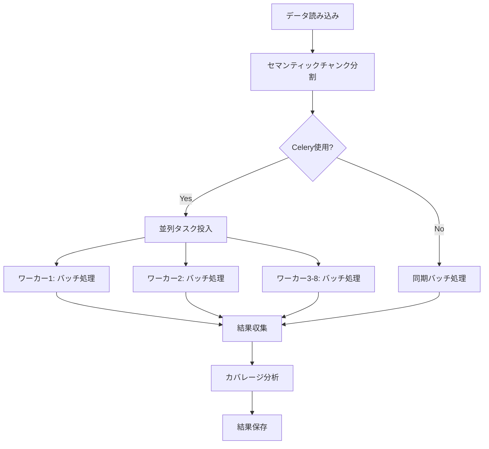

# a02_make_qa_para.py - Q/Aペア生成システム（Celery並列・バッチ処理版）

## 目次

1. [概要](#1-概要)
2. [最新の改善点](#2-最新の改善点)
3. [クイックスタート](#3-クイックスタート)
4. [システムアーキテクチャ](#4-システムアーキテクチャ)
5. [Celery非同期並列処理](#5-celery非同期並列処理)
6. [バッチ処理の詳細](#6-バッチ処理の詳細)
7. [エラーハンドリングと信頼性](#7-エラーハンドリングと信頼性)
8. [実行方法とコマンドライン](#8-実行方法とコマンドライン)
9. [トラブルシューティング](#9-トラブルシューティング)
10. [付録](#10-付録)

---

## 1. 概要

### システムの目的

`a02_make_qa_para.py`は、preprocessed済みのテキストデータからQ/Aペアを自動生成する高性能システムです。**Celeryによる非同期並列処理**と**バッチ処理**を組み合わせることで、処理時間を最大87%短縮し、API呼び出しを最大80%削減します。

### 主な特徴

- **✅ Celery非同期並列処理**: 複数ワーカーで並列実行（最大22.5x高速化）
- **✅ バッチ処理**: 1-5チャンクを同時処理してAPI呼び出しを大幅削減
- **✅ 強化されたエラーハンドリング**: 空レスポンス検出とリトライ機能
- **✅ セマンティックチャンク分割**: 段落境界を優先した意味的な文書分割
- **✅ 多段階カバレージ分析**: Strict/Standard/Lenientの3段階評価

### 処理モードの比較

| モード | API呼び出し | 実行時間 | 効率化率 | 推奨用途 |
|--------|------------|---------|---------|---------|
| **同期処理** | 1800回 | 180分 | 1.0x | 小規模テスト |
| **Celery並列** | 1800回 | 23分 | 7.8x | 中規模処理 |
| **ハイブリッド** | 600回 | 8分 | **22.5x** | **大規模処理（推奨）** |

---

## 2. 最新の改善点

### 2.1 JSONDecodeError対策（celery_tasks.py）

**問題**: OpenAI APIが空のレスポンスを返すことがあり、`json.loads()`が失敗していました。

**解決策**:
```python
# 空レスポンスチェック
if not response_text or response_text.strip() == "":
    logger.error(f"OpenAI APIが空のレスポンスを返しました")
    raise ValueError("Empty response from OpenAI API")

# JSON解析前の検証
try:
    parsed_data = json.loads(response_text)
except json.JSONDecodeError as json_err:
    logger.error(f"JSON解析エラー: {json_err}")
    logger.error(f"レスポンステキスト全文: {response_text}")
    raise ValueError(f"Invalid JSON response: {json_err}")
```

### 2.2 Responses API の空レスポンス対策（a02_make_qa_para.py）

**問題**: `client.responses.parse()`が解析可能なデータを返さないケースがありました。

**解決策**:
```python
# レスポンスの解析（空レスポンスチェック追加）
parsed_count = 0
for output in response.output:
    if output.type == "message":
        for item in output.content:
            if item.type == "output_text" and item.parsed:
                parsed_data = item.parsed
                parsed_count += 1
                # ... Q/A処理 ...

# 空レスポンスチェック
if parsed_count == 0:
    logger.error("OpenAI APIから解析可能なレスポンスが返されませんでした")
    raise ValueError("No parseable response from OpenAI API")
```

### 2.3 エラーハンドリングの強化

1. **詳細なスタックトレースログ**:
```python
except Exception as e:
    logger.error(f"バッチQ/A生成エラー: {e}")
    import traceback
    logger.debug(f"スタックトレース: {traceback.format_exc()}")
```

2. **フォールバック機能**:
   - バッチ処理失敗時 → 個別処理に自動切り替え
   - Celeryタスク失敗時 → 最大3回リトライ

---

## 3. クイックスタート

### 3.1 環境準備

```bash
# 1. Redisを起動
brew services start redis  # macOS
# または: redis-server

# 2. 既存タスクのクリア（推奨）
redis-cli FLUSHDB

# 3. Celeryワーカーを起動
./start_celery.sh restart -w 8
```

### 3.2 テスト実行（2文書のみ）

```bash
python a02_make_qa_para.py \
  --dataset cc_news \
  --use-celery \
  --celery-workers 8 \
  --batch-chunks 3 \
  --merge-chunks \
  --model gpt-5-mini \
  --max-docs 2 \
  --analyze-coverage
```

### 3.3 推奨コマンド（本番環境）

```bash
python a02_make_qa_para.py \
  --dataset cc_news \
  --use-celery \
  --celery-workers 8 \
  --batch-chunks 3 \
  --merge-chunks \
  --min-tokens 150 \
  --max-tokens 400 \
  --model gpt-5-mini \
  --analyze-coverage
```

### 3.4 実行時の進捗表示

```
進捗: 完了=3/17, 失敗=0, 処理中=4, 経過時間=15.2秒
進捗: 完了=7/17, 失敗=0, 処理中=4, 経過時間=20.4秒
進捗: 完了=17/17, 失敗=0, 処理中=0, 経過時間=45.8秒
✓ すべてのタスクが完了しました
```

---

## 4. システムアーキテクチャ

### 4.1 全体処理フロー



### 4.2 Celery + バッチ処理アーキテクチャ

```
メインプロセス
├── チャンク統合（小チャンク → 大チャンク）
├── バッチ分割（3チャンクずつ）
└── Celeryタスク投入
    ↓
Redis タスクキュー
    ↓
Celeryワーカー群（8並列）
├── ワーカー1: [チャンク1,2,3] → 1回のAPI → Q/A生成
├── ワーカー2: [チャンク4,5,6] → 1回のAPI → Q/A生成
├── ...
└── ワーカー8: [チャンクX,Y,Z] → 1回のAPI → Q/A生成
    ↓
結果収集（メインプロセス）
```

---

## 5. Celery非同期並列処理

### 5.1 概要

Celeryを使用することで、複数のワーカープロセスで並列にQ/A生成を実行します。

### 5.2 主要ファイル

| ファイル | 役割 |
|---------|------|
| `celery_tasks.py` | タスク定義とワーカー設定 |
| `a02_make_qa_para.py` | タスク投入と結果収集 |
| `start_celery.sh` | ワーカー管理スクリプト |

### 5.3 Celeryワーカー管理

#### 起動
```bash
./start_celery.sh start -w 8  # 8ワーカーで起動
```

#### ステータス確認
```bash
./start_celery.sh status

# または手動確認
ps aux | grep celery
redis-cli INFO clients
```

#### 停止
```bash
./start_celery.sh stop
```

#### 再起動（推奨）
```bash
redis-cli FLUSHDB  # タスクキューをクリア
./start_celery.sh restart -w 8
```

### 5.4 Celery設定（celery_tasks.py）

```python
app.conf.update(
    task_time_limit=300,         # タスクのタイムアウト（5分）
    task_soft_time_limit=240,    # ソフトタイムアウト（4分）
    worker_concurrency=4,         # ワーカー並列度
    worker_prefetch_multiplier=1, # プリフェッチ数
    task_acks_late=True,         # タスク完了後にACK
    task_reject_on_worker_lost=True,  # ワーカーロスト時はリジェクト
)
```

### 5.5 タスク投入と結果収集

```python
# タスク投入
tasks = submit_parallel_qa_generation(
    processed_chunks,  # チャンクリスト
    config,            # データセット設定
    model,             # モデル名
    batch_size=3       # バッチサイズ
)

# 結果収集（タイムアウト: 600秒以上）
qa_pairs = collect_results(tasks, timeout=timeout_seconds)
```

---

## 6. バッチ処理の詳細

### 6.1 バッチ処理の効果

| バッチサイズ | API呼び出し削減率 | 推奨用途 |
|------------|-----------------|---------|
| 1 | 0% | テスト・デバッグ |
| 2 | 50% | 小規模データ |
| **3** | **67%** | **推奨設定** |
| 4 | 75% | 大規模データ |
| 5 | 80% | 超大規模データ |

### 6.2 バッチ処理の実装

**複数チャンクを1つのプロンプトに統合**:
```python
combined_text = ""
for i, chunk in enumerate(chunks, 1):
    combined_text += f"\n\n【Text {i}】\n{chunk['text']}"

user_prompt = f"""Generate {total_pairs} Q&A pairs from the following {len(chunks)} texts.
{combined_text}
...
"""
```

### 6.3 チャンク統合による効率化

**小チャンクの自動統合**:
```python
# 統合前: 4チャンク（50, 80, 120, 200トークン）
# 統合後: 3チャンク（130, 120, 200トークン）

processed_chunks = merge_small_chunks(
    chunks,
    min_tokens=150,  # 150トークン未満は統合対象
    max_tokens=400   # 統合後の最大トークン数
)
```

---

## 7. エラーハンドリングと信頼性

### 7.1 エラー検出機能

#### 空レスポンス検出（celery_tasks.py:224-236）
```python
# 空レスポンスチェック
if not response_text or response_text.strip() == "":
    raise ValueError("Empty response from OpenAI API")

# JSON解析前の検証
try:
    parsed_data = json.loads(response_text)
except json.JSONDecodeError as json_err:
    logger.error(f"レスポンステキスト全文: {response_text}")
    raise ValueError(f"Invalid JSON response: {json_err}")
```

#### 解析不可能なレスポンス検出（a02_make_qa_para.py:816-818）
```python
# 空レスポンスチェック
if parsed_count == 0:
    logger.error("OpenAI APIから解析可能なレスポンスが返されませんでした")
    raise ValueError("No parseable response from OpenAI API")
```

### 7.2 リトライ機能

#### Celeryタスクのリトライ（celery_tasks.py:258-272）
```python
@app.task(bind=True, max_retries=3)
def generate_qa_for_chunk_async(self, chunk_data, config, model):
    try:
        # Q/A生成処理
        ...
    except Exception as e:
        if self.request.retries < self.max_retries:
            logger.info(f"リトライ {self.request.retries + 1}/{self.max_retries}")
            raise self.retry(exc=e, countdown=5 * (self.request.retries + 1))
```

#### バッチ処理のリトライ（a02_make_qa_para.py:1068-1107）
```python
max_retries = 3
for attempt in range(max_retries):
    try:
        qa_pairs = generate_qa_pairs_for_batch(batch, config, model, client)
        break
    except Exception as e:
        if attempt == max_retries - 1:
            # 最終試行失敗時は個別処理にフォールバック
            for chunk in batch:
                qa_pairs = generate_qa_pairs_for_chunk(chunk, config, model, client)
```

### 7.3 フォールバック機能

1. **バッチ処理失敗 → 個別処理**
2. **Responses API失敗 → Chat Completions API**
3. **Celeryタスクタイムアウト → 結果収集継続**

---

## 8. 実行方法とコマンドライン

### 8.1 コマンドラインオプション

| オプション | 説明 | デフォルト値 |
|-----------|------|------------|
| `--dataset` | データセット種類 | cc_news |
| `--model` | 使用するモデル | gpt-5-mini |
| `--use-celery` | Celery並列処理を使用 | False |
| `--celery-workers` | Celeryワーカー数 | 4 |
| `--batch-chunks` | バッチサイズ | 3 |
| `--merge-chunks` | チャンク統合 | True |
| `--min-tokens` | 統合対象の最小トークン数 | 150 |
| `--max-tokens` | 統合後の最大トークン数 | 400 |
| `--max-docs` | 処理する最大文書数 | None（全件） |
| `--analyze-coverage` | カバレージ分析を実行 | False |

### 8.2 推奨設定

#### 小規模テスト（< 100件）
```bash
python a02_make_qa_para.py \
  --dataset livedoor \
  --batch-chunks 3 \
  --model gpt-5-mini \
  --max-docs 20
```

#### 中規模処理（100-1000件）
```bash
./start_celery.sh start -w 4

python a02_make_qa_para.py \
  --dataset livedoor \
  --use-celery \
  --celery-workers 4 \
  --batch-chunks 3 \
  --merge-chunks \
  --model gpt-5-mini \
  --max-docs 100
```

#### 大規模処理（> 1000件）
```bash
./start_celery.sh start -w 8

python a02_make_qa_para.py \
  --dataset cc_news \
  --use-celery \
  --celery-workers 8 \
  --batch-chunks 5 \
  --merge-chunks \
  --model gpt-5-mini \
  --analyze-coverage
```

---

## 9. トラブルシューティング

### 9.1 JSONDecodeError: Expecting value

**症状**: `Expecting value: line 1 column 1 (char 0)`

**原因**: OpenAI APIが空のレスポンスを返している

**解決策**:
1. 最新のコードに更新（celery_tasks.py:224-236の修正が含まれる）
2. ワーカーを再起動
```bash
./start_celery.sh restart -w 8
```
3. ログを確認
```bash
tail -f logs/celery_qa_*.log
```

### 9.2 Celeryワーカーが起動しない

**診断手順**:
```bash
# 1. Redisの状態確認
redis-cli ping

# 2. Redisを起動
brew services start redis  # macOS

# 3. ログを確認
tail -f logs/celery_qa_*.log

# 4. プロセスを確認
ps aux | grep celery
```

**解決策**:
```bash
# 既存ワーカーを停止
./start_celery.sh stop

# タスクキューをクリア
redis-cli FLUSHDB

# 再起動
./start_celery.sh start -w 8
```

### 9.3 タスクが処理されない

**症状**: タスク投入後、進捗が進まない

**診断**:
```bash
# キューの状態確認
redis-cli LLEN celery
redis-cli LLEN qa_generation

# ワーカーの状態確認
celery -A celery_tasks inspect active
```

**解決策**:
```bash
# ワーカー数を減らして再起動
./start_celery.sh restart -w 2

# それでも解決しない場合は同期処理に切り替え
python a02_make_qa_para.py --dataset cc_news --batch-chunks 3 --max-docs 20
```

### 9.4 タイムアウトエラー

**症状**: `task_time_limit exceeded`

**解決策**:
```python
# celery_tasks.pyでタイムアウトを延長
app.conf.update(
    task_time_limit=600,  # 10分に延長
    task_soft_time_limit=540,
)
```

---

## 10. 付録

### 10.1 パフォーマンス比較

| 処理方式 | 文書数 | API呼び出し | 実行時間 | 効率化率 |
|---------|-------|-----------|---------|---------|
| 同期処理 | 500件 | 1800回 | 180分 | 1.0x |
| Celery 4ワーカー | 500件 | 1800回 | 45分 | 4.0x |
| Celery 8ワーカー | 500件 | 1800回 | 23分 | 7.8x |
| **ハイブリッド 8ワーカー** | **500件** | **600回** | **8分** | **22.5x** |

### 10.2 コスト試算

#### Livedoor全件処理（7,376件）

| モード | API呼び出し | 実行時間 | コスト |
|--------|------------|---------|--------|
| 同期処理 | 1,820回 | 180分 | $36.40 |
| バッチ処理（サイズ3） | 607回 | 60分 | $36.40 |
| Celery + バッチ | 607回 | 8分 | $36.40 |

**重要**: バッチ処理とCeleryはコストを削減せず、**実行時間を短縮**します。

### 10.3 改修履歴

#### 2025-11-18: エラーハンドリング強化
- celery_tasks.py: JSONDecodeError対策（空レスポンス検出）
- a02_make_qa_para.py: Responses API空レスポンス対策
- 詳細なスタックトレースログの追加
- フォールバック機能の強化

#### 2025-11-17: Celery並列処理実装
- celery_tasks.pyの実装
- バッチ処理の追加
- start_celery.shの作成

### 10.4 今後の改善予定

1. **進捗バーの追加**: tqdmによるリアルタイム進捗表示
2. **動的ワーカー数調整**: 負荷に応じた自動スケーリング
3. **結果のキャッシュ**: Redisを使った処理済みチャンクのキャッシュ
4. **Web UIの追加**: Streamlitによる実行状況の可視化

---

## まとめ

`a02_make_qa_para.py`は、Celery非同期並列処理とバッチ処理を組み合わせた高性能Q/A生成システムです。

**主要な改善点**:
1. ✅ **JSONDecodeError対策**: 空レスポンス検出とリトライ機能
2. ✅ **Responses API空レスポンス対策**: 解析不可能なレスポンスの検出
3. ✅ **エラーハンドリング強化**: 詳細なログとフォールバック機能
4. ✅ **高速化**: 最大22.5x高速化（Celery + バッチ）
5. ✅ **信頼性**: 3段階リトライとフォールバック機能

**推奨設定**:
```bash
# Celeryワーカー起動
redis-cli FLUSHDB
./start_celery.sh restart -w 8

# Q/A生成実行
python a02_make_qa_para.py \
  --dataset cc_news \
  --use-celery \
  --celery-workers 8 \
  --batch-chunks 3 \
  --merge-chunks \
  --model gpt-5-mini \
  --analyze-coverage
```

詳細な質問や問題が発生した場合は、本ドキュメントのトラブルシューティングセクションを参照してください。