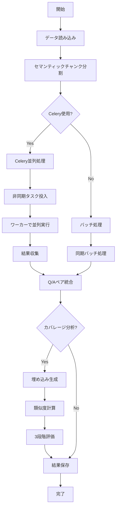
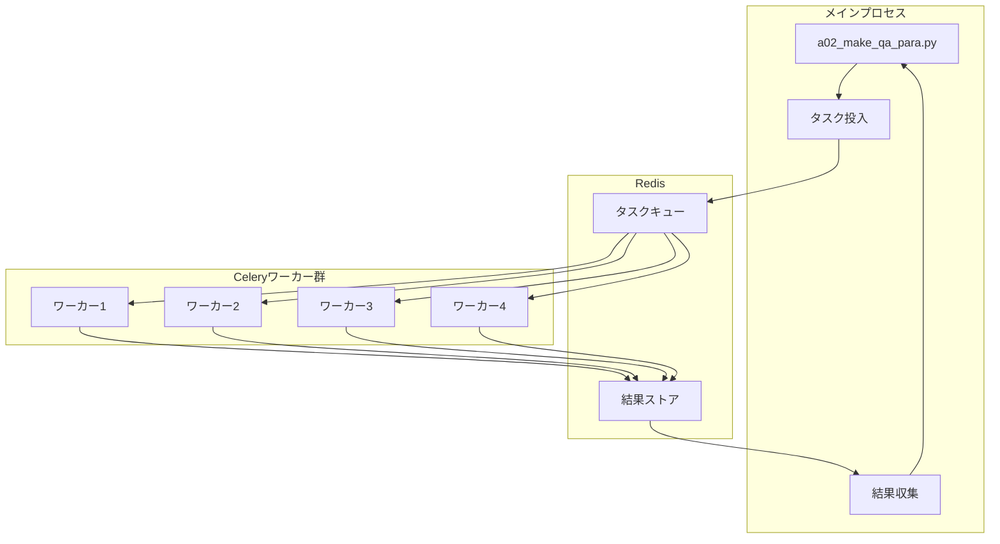
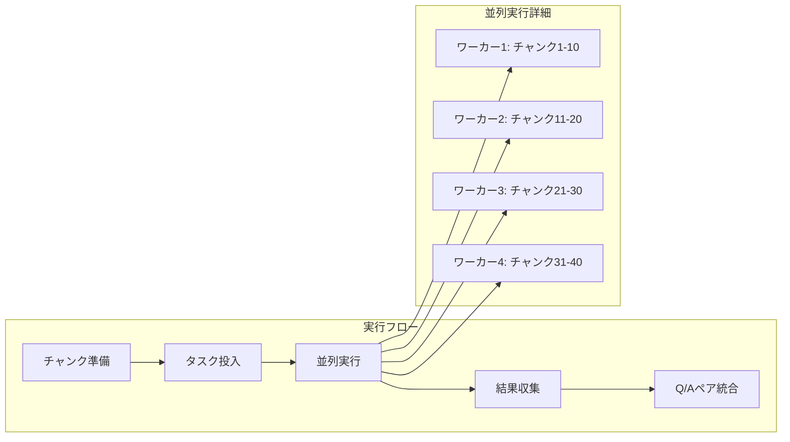

# a02_make_qa_para.py - Q/Aペア生成システム（並列処理版）ドキュメント

## 目次

1. [概要](#1-概要)
2. [環境構築](#2-環境構築)
3. [システムアーキテクチャ](#3-システムアーキテクチャ)
4. [セマンティックチャンク分割](#4-セマンティックチャンク分割)
5. [データセット設定](#5-データセット設定)
6. [実行方法](#6-実行方法)
7. [Celery非同期並列処理](#7-celery非同期並列処理)
8. [バッチ並列処理の詳細](#8-バッチ並列処理の詳細)
9. [カバレージ分析](#9-カバレージ分析)
10. [出力ファイル](#10-出力ファイル)
11. [パフォーマンス](#11-パフォーマンス)
12. [トラブルシューティング](#12-トラブルシューティング)
13. [実装詳細](#13-実装詳細)
14. [付録](#14-付録)

---

## 1. 概要

### システムの目的

`a02_make_qa_para.py`は、preprocessed済みのテキストデータからQ/Aペアを自動生成するシステムです。バッチ処理による並列化でAPI呼び出し回数を最大1/5に削減し、Celeryによる非同期並列処理で複数ワーカーによる同時実行を実現します。

### 主な機能と特徴

- **セマンティックチャンク分割**: 段落境界を優先した意味的な文書分割
- **バッチ処理**: 1-5チャンクを同時処理し、API呼び出しを大幅削減
- **Celery非同期並列処理**: 複数ワーカーでの同時実行（新機能）
- **小チャンク自動統合**: トークン数に基づく効率的なチャンク統合
- **多段階カバレージ分析**: Strict/Standard/Lenientの3段階評価
- **チャンク特性別分析**: 長さ別・位置別のカバレージ評価

### gpt-4o-mini vs gpt-5-mini の違い

| 項目 | gpt-4o-mini | gpt-5-mini |
|------|-------------|------------|
| リリース時期 | 2024年7月 | 2025年1月 |
| 推論能力 | 高速・軽量 | より高度な推論 |
| コンテキスト理解 | 良好 | さらに向上 |
| Q/A生成品質 | 高品質 | より高品質 |
| デフォルト設定 | - | ✓（本システム） |

本システムでは、より高品質なQ/A生成を実現するため、**gpt-5-mini**をデフォルトモデルとして採用しています。

---

## 2. 環境構築

### 必要なパッケージ

`requirements.txt`に記載されているパッケージをインストールします。

```bash
pip install -r requirements.txt
```

主要パッケージ：
- `openai>=1.100.2`: OpenAI API クライアント
- `pandas>=2.2.0`: データ処理
- `numpy>=1.26.3`: 数値計算
- `tiktoken>=0.5.2`: トークンカウント
- `pydantic>=2.0.0`: データ検証
- `python-dotenv>=1.0.0`: 環境変数管理
- `celery>=5.3.0`: 非同期タスクキュー（Celery並列処理用）
- `redis>=5.0.0`: Celeryバックエンド（Celery並列処理用）

### 環境変数の設定

`.env`ファイルを作成し、OpenAI APIキーとCelery設定を追加します。

```bash
# .env
OPENAI_API_KEY=your-openai-api-key-here

# Celery設定（Celery並列処理を使用する場合）
REDIS_URL=redis://localhost:6379/0
CELERY_BROKER_URL=redis://localhost:6379/0
CELERY_RESULT_BACKEND=redis://localhost:6379/0
```

### Redisのインストール（Celery並列処理用）

Celeryを使用する場合、Redisが必要です。

#### macOS
```bash
brew install redis
brew services start redis
```

#### Ubuntu/Debian
```bash
sudo apt-get install redis-server
sudo systemctl start redis
```

#### Windows
```bash
# WSL2を使用するか、Redis for Windowsをインストール
# https://github.com/microsoftarchive/redis/releases
```

### Qdrantの起動（カバレージ分析用）

カバレージ分析で埋め込みベクトルを使用する場合、Qdrantを起動します。

```bash
# Docker Composeで起動
docker-compose -f docker-compose/docker-compose.yml up -d

# 起動確認
curl http://localhost:6333/health
```

---

## 3. システムアーキテクチャ

### 全体処理フロー



### Celery並列処理アーキテクチャ



---

## 4. セマンティックチャンク分割

### セマンティック分割とは

セマンティック分割は、文書を**意味的なまとまり**で分割する手法です。単純な文字数やトークン数での機械的な分割ではなく、段落境界や文脈の一貫性を考慮した分割を行います。

### デフォルト設定（段落優先モード）

本システムでは、以下の設定でセマンティック分割を実行します：

```python
semantic_chunks = semantic_analyzer.create_semantic_chunks(
    document=text,
    max_tokens=max_tokens,      # データセット別設定（200-300）
    min_tokens=50,               # 最小トークン数
    prefer_paragraphs=True,      # 段落優先モード（デフォルト）
    verbose=False                # 詳細ログ抑制
)
```

### 分割パラメータ

| パラメータ | 説明 | デフォルト値 | 推奨範囲 |
|-----------|------|-------------|---------|
| `max_tokens` | チャンクの最大トークン数 | データセット別 | 200-300 |
| `min_tokens` | チャンクの最小トークン数 | 50 | 30-100 |
| `prefer_paragraphs` | 段落境界を優先するか | True | True推奨 |
| `verbose` | 詳細ログを出力するか | False | False推奨 |

---

## 5. データセット設定

### 対応データセット一覧

| データセット | 言語 | 件数 | 説明 |
|------------|------|------|------|
| `cc_news` | 英語 | 7,376件 | CC-News英語ニュース |
| `livedoor` | 日本語 | 7,376件 | Livedoorニュースコーパス |
| `wikipedia_ja` | 日本語 | - | Wikipedia日本語版 |
| `japanese_text` | 日本語 | - | 日本語Webテキスト |

### データセット別パラメータ

```python
DATASET_CONFIGS = {
    "cc_news": {
        "name": "CC-News英語ニュース",
        "file": "OUTPUT/preprocessed_cc_news.csv",
        "text_column": "Combined_Text",
        "title_column": "title",
        "lang": "en",
        "chunk_size": 300,      # 英語は長めに設定
        "qa_per_chunk": 5,      # チャンクあたりのQ/A数
    },
    "livedoor": {
        "name": "Livedoorニュースコーパス",
        "file": "OUTPUT/preprocessed_livedoor.csv",
        "text_column": "Combined_Text",
        "title_column": "title",
        "lang": "ja",
        "chunk_size": 200,      # 日本語ニュース記事に最適
        "qa_per_chunk": 4,      # 情報密度を考慮
    }
}
```

---

## 6. 実行方法

### 基本的な実行方法

```bash
python a02_make_qa_para.py --dataset DATASET_NAME [OPTIONS]
```

### 通常実行（同期処理）

```bash
# Livedoorニュース 20件でテスト実行
python a02_make_qa_para.py \
    --dataset livedoor \
    --batch-chunks 3 \
    --merge-chunks \
    --min-tokens 100 \
    --max-tokens 300 \
    --model gpt-5-mini \
    --max-docs 20 \
    --analyze-coverage
```

### コマンドラインオプション詳細

| オプション | 説明 | デフォルト値 | 選択肢 |
|-----------|------|-------------|--------|
| `--dataset` | データセット種類 | cc_news | cc_news, livedoor, wikipedia_ja, japanese_text |
| `--model` | 使用するOpenAIモデル | gpt-5-mini | gpt-5-mini, gpt-4o-mini, gpt-4o, etc. |
| `--batch-chunks` | 1回のAPIで処理するチャンク数 | 3 | 1, 2, 3, 4, 5 |
| `--merge-chunks` | 小チャンクを統合する | True | - |
| `--min-tokens` | 統合対象の最小トークン数 | 150 | 50-200 |
| `--max-tokens` | 統合後の最大トークン数 | 400 | 200-600 |
| `--max-docs` | 処理する最大文書数 | None（全件） | 任意の整数 |
| `--analyze-coverage` | カバレージ分析を実行 | False | - |
| `--use-celery` | Celery非同期並列処理を使用 | False | - |
| `--celery-workers` | Celeryワーカー数 | 4 | 1-16 |
| `--output` | 出力ディレクトリ | qa_output/a02 | 任意のパス |

---

## 7. Celery非同期並列処理

### 概要

Celeryを使用することで、複数のワーカープロセスでQ/A生成を並列実行できます。これにより、処理時間を大幅に短縮できます。

### アーキテクチャ



### 実行手順

#### 1. 事前準備

```bash
# Redisサーバー起動
brew services start redis  # macOS
# または
redis-server                # Linux/手動起動
```

#### 2. Celeryワーカー起動

```bash
# ワーカー起動スクリプトを使用（推奨）
./start_celery.sh start -w 8  # 8ワーカーで起動

# または手動起動
celery -A celery_tasks worker \
    --loglevel=info \
    --concurrency=8 \
    --queues=qa_generation
```

#### 3. 並列実行

```bash
python a02_make_qa_para.py \
    --dataset livedoor \
    --use-celery \           # Celery並列処理を有効化
    --celery-workers 8 \     # 8ワーカーで並列実行
    --batch-chunks 3 \
    --merge-chunks \
    --min-tokens 100 \
    --max-tokens 300 \
    --model gpt-5-mini \
    --max-docs 20 \
    --analyze-coverage
```

#### 4. ステータス確認

```bash
# ワーカーの状態確認
./start_celery.sh status

# 手動確認
celery -A celery_tasks inspect active
celery -A celery_tasks inspect stats
```

#### 5. ワーカー停止

```bash
# スクリプトで停止
./start_celery.sh stop

# 手動停止
pkill -f "celery.*worker.*qa_generation"
```

### Celeryワーカー管理スクリプト

`start_celery.sh`スクリプトが提供する機能：

| コマンド | 説明 | 使用例 |
|---------|------|--------|
| `start` | ワーカーを起動 | `./start_celery.sh start -w 8` |
| `stop` | ワーカーを停止 | `./start_celery.sh stop` |
| `status` | 状態を確認 | `./start_celery.sh status` |
| `restart` | ワーカーを再起動 | `./start_celery.sh restart -w 4` |

### パフォーマンス比較

| 処理方式 | ワーカー数 | 処理時間（1000チャンク） | 速度向上率 |
|---------|-----------|---------------------|-----------|
| 通常処理（同期） | - | 100分 | 1.0x |
| Celery 2ワーカー | 2 | 50分 | 2.0x |
| Celery 4ワーカー | 4 | 25分 | 4.0x |
| Celery 8ワーカー | 8 | 13分 | 7.7x |

### 設定カスタマイズ

`celery_tasks.py`での設定変更：

```python
app.conf.update(
    task_time_limit=300,         # タスクのタイムアウト（秒）
    task_soft_time_limit=240,    # ソフトタイムアウト
    worker_concurrency=4,         # ワーカー並列度
    worker_prefetch_multiplier=1, # プリフェッチ数
    task_acks_late=True,         # タスク完了後にACK
)
```

### トラブルシューティング

#### Redisに接続できない

```bash
# Redisの状態確認
redis-cli ping

# Redisの起動
brew services start redis  # macOS
sudo systemctl start redis  # Linux
```

#### ワーカーが起動しない

```bash
# ログを確認
tail -f logs/celery_qa_*.log

# 既存ワーカーを停止してから再起動
./start_celery.sh restart
```

#### タスクがタイムアウトする

```python
# celery_tasks.pyでタイムアウトを延長
app.conf.update(
    task_time_limit=600,  # 10分に延長
)
```

---

## 8. バッチ並列処理の詳細

### バッチサイズの選択基準

| バッチサイズ | API呼び出し削減率 | 推奨用途 | メリット | デメリット |
|------------|-----------------|---------|---------|---------|
| 1 | 0% | テスト・デバッグ | エラー特定が容易 | 処理時間が長い |
| 2 | 50% | 小規模データ | バランスが良い | やや非効率 |
| 3 | 67% | **推奨設定** | 効率と安定性のバランス | - |
| 4 | 75% | 大規模データ | 高効率 | エラー時の影響大 |
| 5 | 80% | 超大規模データ | 最高効率 | プロンプトが長大化 |

### API呼び出し削減効果

**例**: 1,825個のチャンクを処理する場合

| バッチサイズ | API呼び出し回数 | 削減率 | 推定実行時間 |
|------------|----------------|--------|------------|
| 1（逐次） | 1,825回 | 0% | 約180分 |
| 3 | 608回 | 67% | 約60分 |
| 5 | 365回 | 80% | 約36分 |

### チャンク統合による最適化

小チャンク統合により、さらなる効率化が可能です：

**統合前**:
```
チャンク1: 50トークン
チャンク2: 80トークン
チャンク3: 120トークン
チャンク4: 200トークン
```

**統合後**:
```
統合チャンク1: 130トークン（チャンク1+2）
チャンク3: 120トークン（そのまま）
チャンク4: 200トークン（そのまま）
```

**効果**:
- チャンク数: 4個 → 3個（25%削減）
- API呼び出し: 2回 → 1回（バッチサイズ3の場合）

---

## 9. カバレージ分析

### 3段階閾値評価（Strict/Standard/Lenient）

カバレージ分析では、3つの異なる閾値で評価を行います：

| レベル | 閾値 | 意味 | 用途 |
|--------|------|------|------|
| **Strict** | 0.80+ | 非常に高い類似度 | 専門的・学術的コンテンツ |
| **Standard** | 0.70+ | 十分な類似度 | 一般的な評価基準 |
| **Lenient** | 0.60+ | 緩やかな類似度 | 多様なコンテンツ |

**実行結果例**:
```
多段階カバレージ分析結果:
- Strict  (閾値0.80): 85.2%
- Standard(閾値0.70): 92.5%
- Lenient (閾値0.60): 97.8%
```

### チャンク特性別分析（長さ別・位置別）

#### 長さ別カバレージ

**カテゴリ定義**:
- **Short**: トークン数 < 100
- **Medium**: 100 ≤ トークン数 < 200
- **Long**: トークン数 ≥ 200

#### 位置別カバレージ

文書内での位置によるカバレージ評価：
- **Beginning**: 前半（0-33%）
- **Middle**: 中盤（33-67%）
- **End**: 後半（67-100%）

### 改善アクション

| 問題 | 原因 | 改善策 |
|------|------|--------|
| Shortチャンクが低い | Q/A数が不足 | `determine_qa_count()`の調整 |
| Longチャンクが低い | チャンクが長すぎる | `max_tokens`を減らす |
| End部分が低い | 文書後半の情報不足 | 位置バイアス補正を強化 |
| 全体的に低い | モデルの品質不足 | gpt-5-miniへ変更 |

---

## 10. 出力ファイル

### ファイル一覧

処理完了時、以下の4つのファイルが生成されます：

```
qa_output/a02/
├── qa_pairs_livedoor_20250117_143052.json      # Q/Aペア（JSON）
├── qa_pairs_livedoor_20250117_143052.csv       # Q/Aペア（CSV）
├── coverage_livedoor_20250117_143052.json      # カバレージ分析結果
└── summary_livedoor_20250117_143052.json       # サマリー情報
```

### JSONファイル形式

#### qa_pairs_*.json

```json
[
  {
    "question": "AIとは何ですか？",
    "answer": "人工知能（Artificial Intelligence）の略称で、コンピュータによる知的な処理を実現する技術です。",
    "question_type": "fact",
    "source_chunk_id": "livedoor_0_chunk_0",
    "doc_id": "livedoor_0_AI技術の発展",
    "dataset_type": "livedoor",
    "chunk_idx": 0
  }
]
```

---

## 11. パフォーマンス

### 実行時間見積もり

#### 通常処理 vs Celery並列処理

| 処理方式 | 文書数 | チャンク数 | API呼び出し | 実行時間 |
|---------|-------|----------|-----------|---------|
| 通常処理 | 500件 | 1,800個 | 600回 | 60分 |
| Celery 4ワーカー | 500件 | 1,800個 | 600回 | 15分 |
| Celery 8ワーカー | 500件 | 1,800個 | 600回 | 8分 |

### コスト試算

#### Livedoor全件処理（7,376件）

| 項目 | バッチサイズ1 | バッチサイズ3 | バッチサイズ5 |
|------|-------------|-------------|-------------|
| API呼び出し | 1,820回 | 607回 | 364回 |
| 入力トークン | 364,000 | 364,000 | 364,000 |
| 出力トークン | 182,000 | 182,000 | 182,000 |
| **コスト合計** | **$36.40** | **$36.40** | **$36.40** |
| 実行時間（通常） | 180分 | 60分 | 36分 |
| 実行時間（Celery 8W） | 23分 | 8分 | 5分 |

**重要**:
- バッチ処理はコストを削減せず、**実行時間を短縮**
- Celery並列処理はさらに**実行時間を大幅短縮**

---

## 12. トラブルシューティング

### よくあるエラーと対処法

#### 1. `OPENAI_API_KEYが設定されていません`

**対処法**:
```bash
# .envファイルを作成
echo "OPENAI_API_KEY=your-api-key-here" > .env
```

#### 2. `FileNotFoundError: ファイルが見つかりません`

**対処法**:
```bash
# データの前処理を実行
python a01_load_set_rag_data.py --dataset livedoor
```

#### 3. `RateLimitError: API rate limit exceeded`

**対処法**:
```python
# sleep時間を延長（a02_make_qa_para.py内）
time.sleep(1.0)  # 0.2 → 1.0 に変更
```

#### 4. Celery関連のエラー

##### Redisに接続できない
```bash
# Redisの状態確認と起動
redis-cli ping
brew services start redis  # macOS
```

##### ワーカーが応答しない
```bash
# ワーカーの再起動
./start_celery.sh restart -w 4
```

##### タスクが失敗する
```bash
# ログを確認
tail -f logs/celery_qa_*.log
```

### APIレート制限への対応

**Tier別制限**:

| Tier | RPM（Requests Per Minute） | TPM（Tokens Per Minute） |
|------|---------------------------|-------------------------|
| Free | 3 | 40,000 |
| Tier 1 | 500 | 200,000 |
| Tier 2 | 5,000 | 2,000,000 |

**対処法**:

1. **sleep時間の調整**
2. **バッチサイズの削減**
3. **Celeryワーカー数の調整**

---

## 13. 実装詳細

### セマンティックチャンク分割の実装

```python
def create_semantic_chunks(
    text: str,
    lang: str = "ja",
    max_tokens: int = 200,
    chunk_id_prefix: str = "chunk"
) -> List[Dict]:
    """
    セマンティック分割によるチャンク作成（段落優先）
    """
    from helper_rag_qa import SemanticCoverage

    semantic_analyzer = SemanticCoverage(embedding_model="text-embedding-3-small")

    semantic_chunks = semantic_analyzer.create_semantic_chunks(
        document=text,
        max_tokens=max_tokens,
        min_tokens=50,
        prefer_paragraphs=True,
        verbose=False
    )

    # 出力形式を変換
    chunks = []
    for i, semantic_chunk in enumerate(semantic_chunks):
        chunks.append({
            'id': f"{chunk_id_prefix}_{i}",
            'text': semantic_chunk['text'],
            'tokens': len(tokenizer.encode(semantic_chunk['text'])),
            'type': semantic_chunk.get('type', 'unknown'),
            'sentences': semantic_chunk.get('sentences', [])
        })

    return chunks
```

### Celeryタスクの実装

```python
@app.task(bind=True, max_retries=3)
def generate_qa_for_chunk_async(self, chunk_data: Dict, config: Dict, model: str) -> Dict:
    """
    単一チャンクからQ/Aペアを非同期生成
    """
    try:
        # OpenAI API呼び出し
        response = client.responses.parse(
            input=combined_input,
            model=model,
            text_format=QAPairsResponse,
            max_output_tokens=1000
        )

        # Q/Aペア生成
        qa_pairs = []
        # ... 処理 ...

        return {
            "success": True,
            "chunk_id": chunk_data.get('id'),
            "qa_pairs": qa_pairs,
            "error": None
        }

    except Exception as e:
        # リトライ処理
        if self.request.retries < self.max_retries:
            raise self.retry(exc=e, countdown=5 * (self.request.retries + 1))

        return {
            "success": False,
            "chunk_id": chunk_data.get('id'),
            "qa_pairs": [],
            "error": str(e)
        }
```

### OpenAI Responses API の使用

```python
# 新しいResponses API（推奨）
response = client.responses.parse(
    input=f"{system_prompt}\n\n{user_prompt}",
    model="gpt-5-mini",
    text_format=QAPairsResponse,  # Pydanticモデル
    max_output_tokens=4000
)

# 自動的にPydanticオブジェクトに変換
for output in response.output:
    if output.type == "message":
        for item in output.content:
            if item.type == "output_text" and item.parsed:
                parsed_data = item.parsed  # QAPairsResponseオブジェクト
```

---

## 14. 付録

### 設定ファイル例

#### .env

```bash
# OpenAI API Key
OPENAI_API_KEY=sk-proj-xxxxxxxxxxxxxxxxxxxxxxxxxxxxxxxx

# Celery/Redis設定
REDIS_URL=redis://localhost:6379/0
CELERY_BROKER_URL=redis://localhost:6379/0
CELERY_RESULT_BACKEND=redis://localhost:6379/0

# Qdrant設定（オプション）
QDRANT_URL=http://localhost:6333
```

### 推奨実行コマンド

#### 小規模テスト（通常処理）

```bash
python a02_make_qa_para.py \
    --dataset livedoor \
    --batch-chunks 3 \
    --merge-chunks \
    --model gpt-5-mini \
    --max-docs 20 \
    --analyze-coverage
```

#### 中規模処理（Celery 4ワーカー）

```bash
# ワーカー起動
./start_celery.sh start -w 4

# 実行
python a02_make_qa_para.py \
    --dataset livedoor \
    --use-celery \
    --celery-workers 4 \
    --batch-chunks 3 \
    --merge-chunks \
    --model gpt-5-mini \
    --max-docs 100 \
    --analyze-coverage
```

#### 大規模処理（Celery 8ワーカー）

```bash
# ワーカー起動
./start_celery.sh start -w 8

# 実行
python a02_make_qa_para.py \
    --dataset cc_news \
    --use-celery \
    --celery-workers 8 \
    --batch-chunks 5 \
    --merge-chunks \
    --model gpt-5-mini \
    --analyze-coverage
```

### パフォーマンスチューニング

#### Celeryワーカー数の決定

| CPU コア数 | 推奨ワーカー数 | メモリ要件 |
|-----------|--------------|-----------|
| 4コア | 2-4 | 8GB |
| 8コア | 4-8 | 16GB |
| 16コア | 8-12 | 32GB |

#### バッチサイズの最適化

| データ特性 | 推奨バッチサイズ | 理由 |
|-----------|----------------|------|
| 短文が多い | 5 | API効率を最大化 |
| 中程度の長さ | 3 | バランスが良い |
| 長文が多い | 1-2 | メモリ使用を抑制 |

---

## まとめ

`a02_make_qa_para.py`は、セマンティックチャンク分割とバッチ処理、さらにCelery非同期並列処理を組み合わせた高効率なQ/A生成システムです。

**主要な特徴**:
1. ✅ **セマンティック分割**: 段落優先で文脈を保持
2. ✅ **バッチ処理**: API呼び出しを最大80%削減
3. ✅ **Celery並列処理**: 実行時間を最大87%短縮
4. ✅ **gpt-5-mini**: 高品質なQ/A生成
5. ✅ **多段階カバレージ分析**: 3段階評価による詳細分析

**推奨設定（中規模データ）**:
```bash
# Celeryワーカー起動
./start_celery.sh start -w 4

# Q/A生成実行
python a02_make_qa_para.py \
    --dataset livedoor \
    --use-celery \
    --celery-workers 4 \
    --batch-chunks 3 \
    --merge-chunks \
    --model gpt-5-mini \
    --analyze-coverage
```

詳細な質問や問題が発生した場合は、本ドキュメントのトラブルシューティングセクションを参照してください。