# a03_rag_qa_coverage_improved.py - セマンティックカバレッジ分析とQ/A生成システム（改良版）

## 概要

`a03_rag_qa_coverage_improved.py`は、文書から高カバレッジのQ&Aペアを自動生成するシステムです。ルールベースとテンプレートベースの手法を組み合わせ、90%以上という高いカバレッジ率を達成します。

## 対応データセット

以下の4種類のデータセットに対応しています:

1. **cc_news**: CC-News英語ニュース
2. **japanese_text**: 日本語Webテキスト
3. **wikipedia_ja**: Wikipedia日本語版
4. **livedoor**: ライブドアニュース（日本語）

### 主要成果（CC-Newsデータセット実行例）
- **カバレッジ率**: 90.3%（閾値0.60）
- **生成Q&A数**: 4,278ペア（497文書、1,689チャンク）
- **実行時間**: 約3分
- **API呼び出し**: 埋め込み生成のみ（Q&A生成はルールベース）
- **コスト**: < $0.01

## システムアーキテクチャ（処理フロー図）
### 処理
### 内容

1. システムアーキテクチャ（処理フロー図） が概要の直後に配置
2. 詳細なMermaidフローチャートで以下を可視化：
- データ読み込みからチャンク作成まで
- MeCabベースの文境界検出とチャンク分割処理
- 小チャンクの統合プロセス
- バッチQ&A生成（1-5チャンクの同時処理）
- 動的Q&A数決定ロジック（トークン数と位置による調整）
- 多段階カバレージ分析（strict/standard/lenient評価）
- 結果ファイルの保存

```mermaid
flowchart TD
    Start([開始]) --> CheckEnv[環境チェック]
    CheckEnv --> CheckAPI{APIキー確認}
    CheckAPI -->|設定済み| LoadInput[入力データ読込]
    CheckAPI -->|未設定| DemoMode[デモモード]

    LoadInput --> DetectFormat{ファイル形式判定}
    DetectFormat -->|CSV| LoadCSV[CSV読込]
    DetectFormat -->|Text| LoadText[テキスト読込]
    DemoMode --> GenerateDemo[デモテキスト生成]

    LoadCSV --> ExtractText[テキスト抽出]
    LoadText --> CombineText[テキスト結合]
    GenerateDemo --> CombineText
    ExtractText --> CombineText

    CombineText --> CreateChunks[チャンク作成]
    CreateChunks --> SemanticChunk[セマンティックチャンキング]
    SemanticChunk --> ChunkLimit{チャンク数判定}

    ChunkLimit -->|多い| SampleChunks[均等サンプリング]
    ChunkLimit -->|適切| ProcessAll[全チャンク処理]

    SampleChunks --> InitExtractor[キーワード抽出器初期化]
    ProcessAll --> InitExtractor

    InitExtractor --> MecabCheck{MeCab利用可能?}
    MecabCheck -->|Yes| MecabExtractor[MeCab抽出器]
    MecabCheck -->|No| RegexExtractor[正規表現抽出器]

    MecabExtractor --> QAGenLoop[Q&A生成ループ]
    RegexExtractor --> QAGenLoop

    QAGenLoop --> LangDetect{言語判定}
    LangDetect -->|英語| EnglishQA[英語Q&A生成]
    LangDetect -->|日本語| JapaneseQA[日本語Q&A生成]

    EnglishQA --> ComprehensiveQA[包括的Q&A]
    JapaneseQA --> ComprehensiveQA

    ComprehensiveQA --> DetailedQA[詳細Q&A]
    DetailedQA --> ContextualQA[文脈Q&A]
    ContextualQA --> KeywordQA[キーワードQ&A]
    KeywordQA --> ThematicQA[テーマQ&A]

    ThematicQA --> ChunkNext{次チャンク?}
    ChunkNext -->|Yes| QAGenLoop
    ChunkNext -->|No| RemoveDup[重複除去]

    RemoveDup --> CheckCount{Q&A数確認}
    CheckCount -->|不足| AdditionalGen[追加生成]
    CheckCount -->|十分| CoverageAnalysis
    AdditionalGen --> CoverageAnalysis

    CoverageAnalysis --> GenEmbedDoc[文書埋め込み生成]
    GenEmbedDoc --> BatchEmbed1[バッチ埋め込み1]

    GenEmbedDoc --> GenEmbedQA[Q&A埋め込み生成]
    GenEmbedQA --> BatchCheck{バッチサイズ確認}

    BatchCheck -->|小| SingleBatch[単一バッチ処理]
    BatchCheck -->|大| MultiBatch[複数バッチ処理]

    SingleBatch --> BatchEmbed2[バッチ埋め込み2]
    MultiBatch --> BatchEmbed3[分割バッチ埋め込み]

    BatchEmbed1 --> CalcSimilarity[類似度計算]
    BatchEmbed2 --> CalcSimilarity
    BatchEmbed3 --> CalcSimilarity

    CalcSimilarity --> CosineSim[コサイン類似度]
    CosineSim --> BuildMatrix[カバレッジ行列構築]
    BuildMatrix --> MaxSim[最大類似度抽出]

    MaxSim --> ThresholdCheck{閾値判定}
    ThresholdCheck -->|以上| MarkCovered[カバー済みマーク]
    ThresholdCheck -->|未満| MarkUncovered[未カバーマーク]

    MarkCovered --> CalcStats[統計計算]
    MarkUncovered --> CalcStats

    CalcStats --> CovRate[カバレッジ率]
    CalcStats --> CovDist[カバレッジ分布]
    CalcStats --> AvgSim[平均類似度]

    CovRate --> Results[結果集約]
    CovDist --> Results
    AvgSim --> Results

    Results --> CheckThreshold{目標達成?}
    CheckThreshold -->|未達成| ShowWarning[改善提案表示]
    CheckThreshold -->|達成| SaveResults[結果保存]
    ShowWarning --> SaveResults

    SaveResults --> SaveJSON[JSON保存]
    SaveResults --> SaveCSV[CSV保存]
    SaveResults --> SaveCoverage[カバレッジ保存]
    SaveResults --> SaveSummary[サマリー保存]

    SaveJSON --> ShowStats[統計表示]
    SaveCSV --> ShowStats
    SaveCoverage --> ShowStats
    SaveSummary --> ShowStats

    ShowStats --> End([終了])
```




## 主要機能

### 1. **高カバレッジQ&A生成戦略**
   - 包括的Q&A: チャンク全体をカバーする質問
   - 詳細Q&A: 文ごとの具体的な質問
   - 文脈Q&A: 前後の文脈を含む質問
   - キーワードQ&A: 重要語句に焦点を当てた質問
   - テーマQ&A: チャンクの主要テーマに関する質問

### 2. **インテリジェントなキーワード抽出**
   - MeCabによる日本語複合名詞抽出
   - 正規表現フォールバック（MeCab不在時）
   - ストップワード除去
   - 頻度ベースの重要度判定

### 3. **効率的なバッチ処理**
   - 埋め込み生成の一括処理（最大2048個/バッチ）
   - API呼び出し回数の最小化
   - メモリ効率的な分割処理

### 4. **多段階カバレッジ分析**
   - 高カバレッジ（≥0.7）
   - 中カバレッジ（0.5-0.7）
   - 低カバレッジ（<0.5）
   - チャンクごとの最大類似度追跡

---

## 1. Q&A生成戦略

### 1.1 基本アーキテクチャ

```
文書 → セマンティックチャンキング → 5種類のQ&A生成戦略 → 重複排除 → カバレージ分析
```

### 1.2 ゼロLLMアプローチ
- **LLM呼び出し**: Q&A生成には一切使用しない
- **埋め込み生成のみ**: OpenAI APIはembedding生成だけに使用
- **ルールベース生成**: 事前定義されたテンプレートと抽出ルールを使用

---

## 2. 5つのQ&A生成タイプ

### 2.1 Comprehensive（包括的質問）
```python
# 生成ルール
質問: "このセクションにはどのような情報が含まれていますか？"
回答: chunk_text[:500]  # チャンクの最初の500文字

# 特徴
- カバレージ戦略: 'full_chunk'
- 全チャンクに対して必ず1つ生成
- チャンク全体をカバーする基本質問
```

### 2.2 Factual Detailed（事実詳細質問）
```python
# 日本語の場合
質問: "「{文の最初の30文字}」について詳しく説明してください。"
回答: current_sentence + next_sentence  # 現在の文 + 次の文

# 英語の場合
質問: "What specific information is provided about {抽出した固有名詞}?"
回答: current_sentence + next_sentence
```

**抽出パターン**:
- 英語: 正規表現 `\b[A-Z][a-z]+(?:\s+[A-Z][a-z]+)*\b`
- 日本語: 文頭30文字を使用

### 2.3 Contextual（文脈的質問）
```python
# 前後の文を関連付ける質問
質問: "How does {現在の概念} relate to {前の概念}?"
回答: previous_sentence + current_sentence

# 特徴
- 文章間の関係性を捉える
- 前文がある場合のみ生成
- コンテキストの連続性を確保
```

### 2.4 Keyword-Based（キーワードベース質問）
```python
# キーワード抽出方式
if MeCab利用可能:
    keywords = MeCab形態素解析による複合名詞抽出
else:
    keywords = 正規表現による名詞抽出

# 質問生成
質問: "「{keyword}」について何が述べられていますか？"
回答: keyword_を含む文
```

**キーワード抽出の特徴**:
- MeCab優先（利用可能な場合）
- 複合名詞の抽出に対応
- ストップワード除去（こと、もの、これ、それ等）

### 2.5 Thematic（テーマ的質問）
```python
# チャンクの主題に関する質問
質問: "「{主要キーワード}」に関する主要テーマは何ですか？"
回答: chunk_text[:400]  # チャンクの最初の400文字

# 生成ロジック
- チャンクの最初と最後の文から主題を抽出
- テーマを代表するキーワードを特定
```

---

## 3. 処理フロー

### 3.1 全体の処理フロー

```python
def main():
    # 1. 文書の読み込み
    documents = load_documents(args.input)

    # 2. セマンティックチャンキング
    for doc in documents:
        chunks = create_semantic_chunks(doc, max_tokens=200)

    # 3. Q&A生成（5種類 × 各チャンク）
    for chunk in chunks:
        qa_pairs = generate_comprehensive_qa_for_chunk(chunk)

    # 4. 重複排除
    unique_qas = deduplicate_qa_pairs(qa_pairs)

    # 5. カバレージ分析
    coverage = calculate_improved_coverage(chunks, unique_qas)
```

### 3.2 チャンク処理の詳細

#### セマンティックチャンキング
```python
# チャンク作成パラメータ
- max_tokens: 200トークン
- 文境界保持: 日本語は「。」、英語は「. 」で分割
- オーバーラップ: なし（独立したチャンク）
```

#### チャンクサンプリング戦略
```python
if total_chunks > max_chunks:
    # 均等サンプリング
    step = total_chunks // max_chunks_to_process
    selected_chunks = chunks[::step][:max_chunks_to_process]
```

### 3.3 Q&A生成の詳細フロー

```python
def generate_comprehensive_qa_for_chunk(chunk_text, chunk_idx, qa_per_chunk, lang):
    qa_pairs = []

    # 1. 言語検出
    lang = detect_language(chunk_text)

    # 2. 文分割
    sentences = split_into_sentences(chunk_text, lang)

    # 3. 各戦略でQ&A生成
    # 3.1 Comprehensive（1個）
    qa_pairs.append(generate_comprehensive_qa(chunk_text))

    # 3.2 Factual Detailed（文ごと）
    for sent in sentences:
        qa_pairs.append(generate_factual_qa(sent))

    # 3.3 Contextual（前後文の関連）
    for i, sent in enumerate(sentences[1:]):
        qa_pairs.append(generate_contextual_qa(sentences[i], sent))

    # 3.4 Keyword-based（キーワードごと）
    keywords = extract_keywords(chunk_text)
    for keyword in keywords[:3]:  # 上位3キーワード
        qa_pairs.append(generate_keyword_qa(keyword, chunk_text))

    # 3.5 Thematic（1個）
    qa_pairs.append(generate_thematic_qa(chunk_text))

    return qa_pairs[:qa_per_chunk]  # 指定数に制限
```

---

## 4. 言語処理の特徴

### 4.1 言語検出ロジック

```python
def detect_language(text):
    # 英語指標
    en_indicators = ['the ', 'The ', ' is ', ' are ', ' was ', ' were ']
    # 日本語指標
    ja_indicators = ['。', 'は', 'が', 'を', 'に', 'で', 'と', 'の']

    en_count = sum(1 for ind in en_indicators if ind in text)
    ja_count = sum(1 for ind in ja_indicators if ind in text)

    return 'ja' if ja_count > en_count else 'en'
```

### 4.2 MeCab統合（日本語処理）

```python
class KeywordExtractor:
    def __init__(self):
        try:
            import MeCab
            self.mecab = MeCab.Tagger()
            self.mecab_available = True
        except:
            self.mecab_available = False

    def extract_japanese_keywords(self, text):
        if self.mecab_available:
            # MeCabで複合名詞抽出
            return self._extract_with_mecab(text)
        else:
            # 正規表現フォールバック
            return self._extract_with_regex(text)
```

**MeCabの利点**:
- 複合名詞の正確な抽出
- 品詞情報の活用
- ストップワードの精密な除去

---

## 5. カバレージ分析メカニズム

### 5.1 カバレージ計算アルゴリズム

```python
def calculate_improved_coverage(chunks, qa_pairs, analyzer, threshold=0.6):
    # 1. チャンク埋め込み生成（バッチ処理）
    chunk_embeddings = generate_embeddings_batch(
        [c['text'] for c in chunks],
        batch_size=2048
    )

    # 2. Q&A埋め込み生成（回答を2倍重み付け）
    qa_texts = [f"{q} {a} {a}" for q, a in qa_pairs]
    qa_embeddings = generate_embeddings_batch(qa_texts, batch_size=2048)

    # 3. コサイン類似度計算
    similarities = cosine_similarity(chunk_embeddings, qa_embeddings)

    # 4. 各チャンクの最大類似度
    max_similarities = np.max(similarities, axis=1)

    # 5. カバレージ判定
    covered = max_similarities >= threshold
    coverage_rate = np.mean(covered)

    return {
        'coverage_rate': coverage_rate,
        'covered_chunks': np.sum(covered),
        'total_chunks': len(chunks),
        'max_similarities': max_similarities
    }
```

### 5.2 カバレージ分布分析

```python
coverage_distribution = {
    "high_coverage": (max_similarities >= 0.7).sum(),     # 高カバレージ
    "medium_coverage": ((0.5 <= max_similarities) & (max_similarities < 0.7)).sum(),  # 中
    "low_coverage": (max_similarities < 0.5).sum()        # 低
}
```

---

## 6. 最適化テクニック

### 6.1 バッチ処理最適化
```python
# 埋め込み生成のバッチ処理
MAX_BATCH_SIZE = 2048  # OpenAI APIの制限
if len(texts) > MAX_BATCH_SIZE:
    embeddings = []
    for i in range(0, len(texts), MAX_BATCH_SIZE):
        batch = texts[i:i+MAX_BATCH_SIZE]
        batch_embeddings = generate_embeddings(batch)
        embeddings.extend(batch_embeddings)
```

### 6.2 重複排除アルゴリズム
```python
def deduplicate_qa_pairs(qa_pairs):
    unique = {}
    for qa in qa_pairs:
        # 質問の最初の30文字をキーとして使用
        key = qa['question'][:30]
        if key not in unique:
            unique[key] = qa
    return list(unique.values())
```

### 6.3 カバレージベース補強
```python
# カバレージが不足している場合、追加生成
if len(unique_qas) < total_chunks * 2:
    # 追加チャンクから簡易Q&A生成
    for chunk in additional_chunks:
        qa_pairs.extend(
            generate_comprehensive_qa_for_chunk(
                chunk, qa_per_chunk=2  # 最小限のQ&A
            )
        )
```

---

## 7. 実行パラメータと設定

### 7.1 コマンドライン引数

```bash
python a03_rag_qa_coverage_improved.py \
    --dataset cc_news \                    # データセット名
    --qa-per-chunk 10 \                   # チャンクあたりQ&A数（推奨: 10）
    --coverage-threshold 0.60 \           # カバレージ閾値（0.60-0.65）
    --max-chunks 2000 \                    # 処理する最大チャンク数
    --output-dir qa_output/a03            # 出力ディレクトリ
```

### 7.2 推奨設定

| パラメータ | 推奨値 | 説明 |
|----------|--------|------|
| qa-per-chunk | 10 | 高カバレージ達成に必要 |
| coverage-threshold | 0.60 | 92.8%カバレージを達成する閾値 |
| max-chunks | 2000 | 大規模データセットの処理制限 |

---

## 8. パフォーマンス特性

### 8.1 実測値（CC-Newsデータセット、497文書処理）

| 指標 | 値 |
|------|-----|
| カバレージ率 | 90.3% |
| 生成Q&A数 | 4,278ペア |
| チャンク数 | 1,689 |
| Q&A/チャンク比 | 2.5 |
| LLM API呼び出し | 0回 |
| 埋め込みAPI呼び出し | 3回（バッチ処理） |
| 推定コスト | < $0.01 |
| 処理時間 | 約3分 |

### 8.2 Q&Aタイプ別分布（CC-News実行例）

```
- contextual: 2,753件 (64.3%)      # 文脈的質問が最多
- keyword_based: 1,520件 (35.5%)   # キーワードベース
- factual_detailed: 2件 (0.05%)    # 詳細事実
- thematic: 2件 (0.05%)            # テーマ的
- comprehensive: 1件 (0.02%)       # 包括的
```

### 8.3 カバレッジ詳細分析

```
カバレッジ分布:
- 高カバレッジ (≥0.7): 1,173チャンク (69.5%)
- 中カバレッジ (0.5-0.7): 484チャンク (28.7%)
- 低カバレッジ (<0.5): 32チャンク (1.9%)

統計値:
- 平均最大類似度: 0.745
- 最小類似度: 0.220
- 最大類似度: 0.889
```

---

## 9. 長所と短所

### 長所
✅ **超低コスト**: LLM API不要でQ&A生成
✅ **高カバレージ**: 92.8%を達成
✅ **予測可能**: ルールベースで動作が確定的
✅ **高速処理**: LLM呼び出しのオーバーヘッドなし
✅ **日英両対応**: 自動言語検出とMeCab統合

### 短所
❌ **質問の自然さ**: テンプレートベースで画一的
❌ **文脈理解**: 深い意味理解は不可能
❌ **創造性**: 新しい観点の質問生成は困難
❌ **閾値依存**: 0.6という緩い閾値でのみ高カバレージ

---

## 10. 使用推奨シナリオ

### 最適な用途
- ✅ **RAGシステムの初期構築**: 高速・低コストでベースライン構築
- ✅ **カバレージ最大化が必要**: 網羅性重視のシステム
- ✅ **予算制約がある**: API費用を最小化したい場合
- ✅ **大規模データセット**: 数千〜数万文書の処理

### 不適切な用途
- ❌ **高品質Q&Aが必要**: 自然な質問文が求められる場合
- ❌ **複雑な推論**: 深い理解や推論が必要な質問
- ❌ **教育用コンテンツ**: 学習用の多様な質問が必要な場合

---

## まとめ

`a03_rag_qa_coverage_improved.py`は、**コストとカバレージのトレードオフを極限まで最適化**したシステムです。LLMを使わないルールベースアプローチにより、極めて低コストで92.8%という高カバレージを実現しています。

質問の自然さを犠牲にする代わりに、**確実性、予測可能性、コスト効率**を獲得しており、特に大規模RAGシステムの初期構築や、カバレージ重視のユースケースに最適な選択肢となっています。

---

---

## API仕様

### コマンドライン引数

| 引数 | 型 | デフォルト | 説明 |
|------|-----|-----------|------|
| `--input` | str | None | 入力ファイルパス（CSV/テキスト） |
| `--dataset` | str | None | データセット選択（cc_news, japanese_text, wikipedia_ja, livedoor） |
| `--max-docs` | int | None | 処理する最大文書数（テスト用） |
| `--methods` | list | ['rule', 'template'] | 使用する手法（rule, template, llm） |
| `--model` | str | gpt-4o-mini | 使用するOpenAIモデル（LLM手法時） |
| `--output` | str | qa_output | 出力ディレクトリ |
| `--analyze-coverage` | flag | False | カバレッジ分析を実行 |
| `--coverage-threshold` | float | 0.65 | カバレッジ判定閾値（推奨: 0.60） |
| `--qa-per-chunk` | int | 4 | チャンクあたりのQ&A生成数 |
| `--max-chunks` | int | 300 | 処理する最大チャンク数 |
| `--demo` | flag | False | デモモード |

### セマンティックチャンキングパラメータ

```python
# create_semantic_chunksの内部設定
max_tokens = 200        # チャンクの最大トークン数
min_tokens = 50         # チャンクの最小トークン数
prefer_paragraphs = True  # 段落優先モード
```

### 出力ファイル形式

実行後、以下の4つのファイルが出力されます:

1. **Q/Aペア（JSON）**: `qa_pairs_{dataset}_{timestamp}.json`
   - 全Q/Aペアの詳細情報
   - メタデータ（type, chunk_idx, coverage_strategy等）を含む

2. **Q/Aペア（CSV）**: `qa_pairs_{dataset}_{timestamp}.csv`
   - スプレッドシートで開ける形式
   - Q/Aタイプ別の分析に便利

3. **カバレッジ分析結果**: `coverage_{dataset}_{timestamp}.json`
   - カバレッジ率、カバー済みチャンク数
   - カバレッジ分布（高/中/低）
   - 未カバーチャンクの詳細

4. **サマリー**: `summary_{dataset}_{timestamp}.json`
   - 処理の概要統計
   - ファイルパス情報
   - 基本メトリクス

### 依存関係

```python
# 主要パッケージ
openai>=1.100.2          # OpenAI API（埋め込み生成のみ）
pandas>=2.0.0            # データ処理
numpy>=1.24.0            # 数値計算
tiktoken>=0.5.0          # トークンカウント
python-dotenv>=1.0.0     # 環境変数管理

# オプション（日本語処理強化）
MeCab                    # 日本語形態素解析（推奨）
```

### 環境変数

```bash
# 必須
OPENAI_API_KEY=your-openai-api-key

# オプション
# なし（カバレッジ分析にQdrantは不要）
```

### 実行例

```bash
# CC-Newsデータセット処理（推奨設定）
python a03_rag_qa_coverage_improved.py \
    --input OUTPUT/preprocessed_cc_news.csv \
    --dataset cc_news \
    --analyze-coverage \
    --coverage-threshold 0.60 \
    --qa-per-chunk 10 \
    --max-chunks 2000 \
    --output qa_output

# Livedoorニュースデータセット処理例（20文書テスト）
python a03_rag_qa_coverage_improved.py \
    --input OUTPUT/preprocessed_livedoor.csv \
    --dataset livedoor \
    --analyze-coverage \
    --coverage-threshold 0.60 \
    --qa-per-chunk 10 \
    --max-docs 20 \
    --output qa_output

# デモモード
python a03_rag_qa_coverage_improved.py --demo --analyze-coverage
```

---

*作成日: 2025年11月6日*
*最終更新: 2025年11月12日*