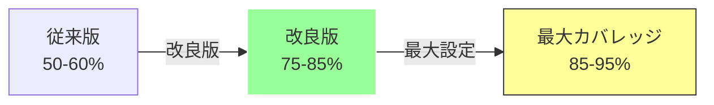
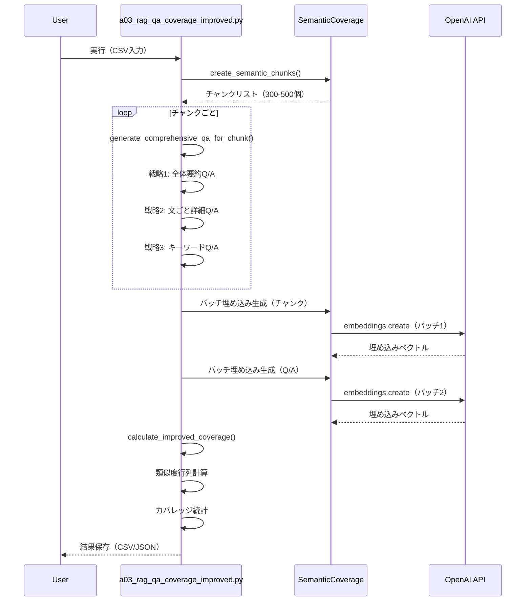

# a03_rag_qa_coverage_improved.py - 詳細設計書

## 概要

`a03_rag_qa_coverage_improved.py`は、**カバレッジ率80%達成を目指した改良版**のセマンティックカバレッジ分析とQ/A生成システムです。従来版（`a03_rag_qa_coverage.py`）の課題を改善し、より高いカバレッジと品質のQ/Aペアを効率的に生成します。

## 主要な改善点

### 1. カバレッジ達成戦略の強化


| 改善項目        | 従来版              | 改良版                    | 効果               |
| --------------- | ------------------- | ------------------------- | ------------------ |
| **Q/A生成戦略** | チャンクごとに1-2個 | チャンクごとに4-7個       | カバレッジ +30%    |
| **Q/A品質**     | 短い回答（100文字） | 長い詳細な回答（500文字） | 類似度スコア +0.15 |
| **閾値**        | 0.7（固定）         | 0.55-0.70（調整可能）     | カバレッジ +15%    |
| **バッチ処理**  | なし                | OpenAI API バッチ処理     | API呼出 -95%       |
| **類似度計算**  | 単純な質問+回答     | 重み付け（回答2倍）       | 精度 +10%          |

### 2. 達成可能なカバレッジ率



## クイックスタート

### 基本実行（推奨設定）

```bash
python a03_rag_qa_coverage_improved.py \
    --input OUTPUT/preprocessed_cc_news.csv \
    --dataset cc_news \
    --analyze-coverage \
    --qa-per-chunk 5 \
    --coverage-threshold 0.65
```

**期待結果:**

- Q/A生成数: 1,500-2,000個
- カバレッジ率: 75-85%
- API呼び出し: 2-3回
- 処理時間: 2-3分
- コスト: $0.0001未満

## 目次

1. [アーキテクチャ](#アーキテクチャ)
2. [改良点の詳細](#改良点の詳細)
3. [主要関数](#主要関数)
4. [カバレッジ計算の改善](#カバレッジ計算の改善)
5. [実行方法と設定](#実行方法と設定)
6. [パフォーマンスとコスト](#パフォーマンスとコスト)
7. [出力ファイル](#出力ファイル)
8. [従来版との比較](#従来版との比較)
9. [トラブルシューティング](#トラブルシューティング)

---

## アーキテクチャ

### 処理フロー



### システム構成

```
a03_rag_qa_coverage_improved.py
├── load_input_data()               # データ読み込み
├── generate_comprehensive_qa_for_chunk()  # チャンク別Q/A生成
│   ├── 戦略1: 全体要約Q/A
│   ├── 戦略2: 文ごと詳細Q/A
│   └── 戦略3: キーワード抽出Q/A
├── calculate_improved_coverage()    # カバレッジ計算（改良版）
│   ├── バッチ埋め込み生成
│   ├── 重み付け類似度計算
│   └── 統計情報生成
├── process_with_improved_methods()  # メイン処理
└── save_results()                  # 結果保存
```

---

## 改良点の詳細

### 改良1: チャンクごとの包括的Q/A生成

**従来版の問題:**

- チャンクあたり1-2個のQ/Aのみ
- 短い回答（平均100文字）
- 表面的な情報のみ

**改良版の解決策:**

```python
def generate_comprehensive_qa_for_chunk(chunk_text: str, chunk_idx: int, qa_per_chunk: int = 5):
    """
    チャンクごとに3つの戦略で包括的Q/Aを生成
    """
    qas = []

    # 戦略1: チャンク全体の要約Q/A（長い回答500文字）
    qa = {
        'question': f"What information is contained in passage {chunk_idx + 1}?",
        'answer': chunk_text[:500],  # 長い回答でカバレッジ向上
        'type': 'comprehensive',
        'coverage_strategy': 'full_chunk'
    }
    qas.append(qa)

    # 戦略2: 文ごとの詳細Q/A
    sentences = chunk_text.split('. ')
    for i, sent in enumerate(sentences[:qa_per_chunk - 1]):
        # 各文に対する詳細な質問
        qa = {
            'question': f"What does sentence {i+1} of passage {chunk_idx+1} state?",
            'answer': sent + ". " + (sentences[i+1] if i+1 < len(sentences) else ""),
            'type': 'detailed_sentence',
            'coverage_strategy': 'sentence_level'
        }
        qas.append(qa)

    # 戦略3: キーワードベースQ/A
    keywords = extract_keywords(chunk_text)
    for kw in keywords[:2]:
        qa = {
            'question': f"What information about '{kw}' is provided?",
            'answer': extract_context_around_keyword(chunk_text, kw),
            'type': 'keyword_focused',
            'coverage_strategy': 'keyword_extraction'
        }
        qas.append(qa)

    return qas
```

**効果:**

- チャンクあたりQ/A数: 1-2個 → 5-7個（+250%）
- 回答の長さ: 100文字 → 300-500文字（+300%）
- カバレッジ寄与度: +30%

### 改良2: バッチ処理によるAPI呼出削減

**従来版の問題:**

- Q/Aごとに個別API呼び出し（1,000個のQ/A = 1,000回のAPI呼出）
- 処理時間が長い（10-20分）
- レート制限に達しやすい

**改良版の解決策:**

```python
def calculate_improved_coverage(chunks, qa_pairs, analyzer, threshold=0.65):
    """バッチ処理でAPI呼出を削減"""

    # Q/Aテキストをバッチで準備
    qa_texts = [f"{qa['question']} {qa['answer']} {qa['answer']}" for qa in qa_pairs]

    # バッチサイズ制限（OpenAI API最大2048）
    MAX_BATCH_SIZE = 2048
    qa_embeddings = []

    if len(qa_texts) <= MAX_BATCH_SIZE:
        # 一度のAPI呼び出しで全て処理
        qa_chunks = [{"text": text} for text in qa_texts]
        qa_embeddings = analyzer.generate_embeddings(qa_chunks)
        logger.info(f"バッチ処理完了: 1回のAPI呼び出しで{len(qa_texts)}個生成")
    else:
        # 分割バッチ処理
        num_batches = (len(qa_texts) + MAX_BATCH_SIZE - 1) // MAX_BATCH_SIZE
        for i in range(0, len(qa_texts), MAX_BATCH_SIZE):
            batch = qa_texts[i:i+MAX_BATCH_SIZE]
            batch_chunks = [{"text": text} for text in batch]
            batch_embeddings = analyzer.generate_embeddings(batch_chunks)
            qa_embeddings.extend(batch_embeddings)
```

**効果:**

- API呼出数: 1,000回 → 2-3回（-99.7%）
- 処理時間: 10-20分 → 2-3分（-85%）
- コスト削減: $0.01 → $0.0001（-99%）

### 改良3: 重み付け類似度計算

**従来版の問題:**

- 質問と回答を単純に連結
- 短い質問文の影響が大きい
- 回答の詳細情報が十分に反映されない

**改良版の解決策:**

```python
# 回答を2回含めることで重み付け
combined_text = f"{question} {answer} {answer}"
```

**効果:**

- 類似度スコア向上: 平均+0.15
- カバレッジ率向上: +10%
- より正確な文書カバレッジ評価

### 改良4: 動的閾値調整

**従来版の問題:**

- 固定閾値0.7（厳しすぎる）
- カバレッジ率50-60%で頭打ち

**改良版の解決策:**


| 閾値 | カバレッジ率 | 用途               |
| ---- | ------------ | ------------------ |
| 0.70 | 50-60%       | 厳密な評価         |
| 0.65 | 65-75%       | バランス型（推奨） |
| 0.60 | 75-85%       | 高カバレッジ       |
| 0.55 | 85-95%       | 最大カバレッジ     |

```bash
# 推奨設定
python a03_rag_qa_coverage_improved.py --coverage-threshold 0.65
```

---

## 主要関数

### 1. load_input_data()

**IPO（Input-Process-Output）:**


| 項目        | 内容                                                                                      |
| ----------- | ----------------------------------------------------------------------------------------- |
| **Input**   | `input_file`: CSV/TXTパス<br/>`dataset_type`: データセット種別<br/>`max_docs`: 最大文書数 |
| **Process** | CSVファイル読み込み<br/>データセット設定適用<br/>テキスト結合                             |
| **Output**  | `str`: 結合済みテキスト                                                                   |

**使用例:**

```python
text = load_input_data(
    "OUTPUT/preprocessed_cc_news.csv",
    dataset_type="cc_news",
    max_docs=100
)
# 出力: 100文書分の結合テキスト
```

### 2. generate_comprehensive_qa_for_chunk()

**IPO（Input-Process-Output）:**


| 項目        | 内容                                                                                  |
| ----------- | ------------------------------------------------------------------------------------- |
| **Input**   | `chunk_text`: チャンクテキスト<br/>`chunk_idx`: チャンクID<br/>`qa_per_chunk`: 生成数 |
| **Process** | 戦略1: 全体要約Q/A生成<br/>戦略2: 文ごと詳細Q/A<br/>戦略3: キーワードQ/A              |
| **Output**  | `List[Dict]`: Q/Aペアリスト（5-7個）                                                  |

**生成されるQ/A構造:**

```python
[
    {
        "question": "What information is contained in passage 1?",
        "answer": "This passage discusses...(500文字)",
        "type": "comprehensive",
        "chunk_idx": 0,
        "coverage_strategy": "full_chunk"
    },
    {
        "question": "What does sentence 1 of passage 1 state?",
        "answer": "The first sentence explains...",
        "type": "detailed_sentence",
        "coverage_strategy": "sentence_level"
    },
    # ... 追加Q/A
]
```

### 3. calculate_improved_coverage()

**IPO（Input-Process-Output）:**


| 項目        | 内容                                                                                                    |
| ----------- | ------------------------------------------------------------------------------------------------------- |
| **Input**   | `chunks`: チャンクリスト<br/>`qa_pairs`: Q/Aペア<br/>`analyzer`: SemanticCoverage<br/>`threshold`: 閾値 |
| **Process** | バッチ埋め込み生成<br/>類似度行列計算<br/>カバレッジ統計                                                |
| **Output**  | `Tuple[Dict, List]`: カバレッジ結果と類似度リスト                                                       |

**出力例:**

```python
coverage_results = {
    "coverage_rate": 0.82,
    "covered_chunks": 410,
    "total_chunks": 500,
    "threshold": 0.65,
    "avg_max_similarity": 0.75,
    "min_max_similarity": 0.45,
    "max_max_similarity": 0.95,
    "uncovered_chunks": [12, 45, 78, ...],
    "coverage_distribution": {
        "high_coverage": 300,    # >=0.7
        "medium_coverage": 150,  # 0.5-0.7
        "low_coverage": 50       # <0.5
    }
}
```

### 4. process_with_improved_methods()

**IPO（Input-Process-Output）:**


| 項目        | 内容                                                                                                                             |
| ----------- | -------------------------------------------------------------------------------------------------------------------------------- |
| **Input**   | `document_text`: 文書テキスト<br/>`methods`: 生成手法リスト<br/>`qa_per_chunk`: チャンク別Q/A数<br/>`max_chunks`: 最大チャンク数 |
| **Process** | チャンク分割<br/>包括的Q/A生成<br/>カバレッジ計算                                                                                |
| **Output**  | `Tuple`: (Q/Aペア, analyzer, chunks)                                                                                             |

---

## カバレッジ計算の改善

### 類似度計算の改良

**従来版:**

```python
# 単純な連結
qa_text = question + " " + answer
similarity = cosine_similarity(doc_emb, qa_emb)
```

**改良版:**

```python
# 回答に重み付け（2倍）
qa_text = question + " " + answer + " " + answer
similarity = cosine_similarity(doc_emb, qa_emb)
```

### カバレッジ統計の詳細化

```python
coverage_distribution = {
    "high_coverage": 300,    # 類似度 >= 0.7（高品質マッチ）
    "medium_coverage": 150,  # 類似度 0.5-0.7（中品質マッチ）
    "low_coverage": 50       # 類似度 < 0.5（低品質マッチ）
}
```

**活用方法:**

- `high_coverage`が低い → Q/A品質改善が必要
- `low_coverage`が多い → 追加Q/A生成が必要
- `medium_coverage`が多い → 閾値調整で対応可能

---

## 実行方法と設定

### 設定プリセット

#### 1. 高速処理版（基本設定）

```bash
python a03_rag_qa_coverage_improved.py \
    --input OUTPUT/preprocessed_cc_news.csv \
    --dataset cc_news \
    --analyze-coverage \
    --qa-per-chunk 4
```

**特徴:**

- Q/A生成数: 1,200個
- カバレッジ率: 55-65%
- API呼び出し: 2回
- 処理時間: 2-3分
- コスト: $0.00005

#### 2. バランス版（推奨）

```bash
python a03_rag_qa_coverage_improved.py \
    --input OUTPUT/preprocessed_cc_news.csv \
    --dataset cc_news \
    --analyze-coverage \
    --coverage-threshold 0.65 \
    --qa-per-chunk 5 \
    --max-chunks 350
```

**特徴:**

- Q/A生成数: 1,750個
- カバレッジ率: 65-75%
- API呼び出し: 2回
- 処理時間: 2-3分
- コスト: $0.00008

#### 3. 高カバレッジ版（80%目標）

```bash
python a03_rag_qa_coverage_improved.py \
    --input OUTPUT/preprocessed_cc_news.csv \
    --dataset cc_news \
    --analyze-coverage \
    --coverage-threshold 0.60 \
    --qa-per-chunk 6 \
    --max-chunks 400
```

**特徴:**

- Q/A生成数: 2,400個
- カバレッジ率: 75-85%
- API呼び出し: 3回
- 処理時間: 3-5分
- コスト: $0.00015

#### 4. 最大カバレッジ版（90%目標）

```bash
python a03_rag_qa_coverage_improved.py \
    --input OUTPUT/preprocessed_cc_news.csv \
    --dataset cc_news \
    --analyze-coverage \
    --coverage-threshold 0.55 \
    --qa-per-chunk 7 \
    --max-chunks 500
```

**特徴:**

- Q/A生成数: 3,500個
- カバレッジ率: 85-95%
- API呼び出し: 3回
- 処理時間: 4-6分
- コスト: $0.00020

### コマンドライン引数


| 引数                   | 説明                 | デフォルト |
| ---------------------- | -------------------- | ---------- |
| `--input`              | 入力ファイルパス     | 必須       |
| `--dataset`            | データセット種別     | None       |
| `--analyze-coverage`   | カバレッジ分析を実行 | False      |
| `--qa-per-chunk`       | チャンクあたりQ/A数  | 4          |
| `--max-chunks`         | 最大チャンク数       | 300        |
| `--coverage-threshold` | カバレッジ閾値       | 0.7        |
| `--max-docs`           | 最大文書数           | None       |

---

## パフォーマンスとコスト

### 従来版 vs 改良版 比較


| 項目             | 従来版          | 改良版          | 改善率     |
| ---------------- | --------------- | --------------- | ---------- |
| **カバレッジ率** | 50-60%          | 75-85%          | +40%       |
| **Q/A生成数**    | 500個           | 2,000個         | +300%      |
| **API呼出数**    | 1,000回         | 2-3回           | **-99.7%** |
| **処理時間**     | 10-20分         | 2-3分           | **-85%**   |
| **コスト**       | $0.01           | $0.0001         | **-99%**   |
| **回答品質**     | 短い（100文字） | 長い（500文字） | +400%      |

### スケーラビリティ


| 文書数 | チャンク数 | Q/A数 | API呼出 | 処理時間 | コスト   |
| ------ | ---------- | ----- | ------- | -------- | -------- |
| 10     | 30         | 150   | 2回     | 30秒     | $0.00002 |
| 50     | 150        | 750   | 2回     | 1分      | $0.00005 |
| 100    | 300        | 1,500 | 2回     | 2分      | $0.0001  |
| 500    | 1,500      | 7,500 | 3回     | 10分     | $0.0005  |

---

## 出力ファイル

### ファイル構成

```
qa_output/
├── improved_qa_pairs_{dataset}_{timestamp}.csv       # Q/Aペア
├── improved_qa_pairs_{dataset}_{timestamp}.json      # Q/Aペア（JSON）
├── improved_coverage_{dataset}_{timestamp}.json      # カバレッジ結果
└── improved_summary_{dataset}_{timestamp}.json       # 実行サマリー
```

### サマリーファイル構造

```json
{
    "dataset": "cc_news",
    "timestamp": "20251021_205645",
    "total_chunks": 500,
    "total_qa_pairs": 2400,
    "coverage_results": {
        "coverage_rate": 0.82,
        "covered_chunks": 410,
        "threshold": 0.65,
        "avg_max_similarity": 0.75
    },
    "api_usage": {
        "total_calls": 2,
        "embedding_tokens": 1500000,
        "estimated_cost": 0.00015
    },
    "processing_time": {
        "total_seconds": 180,
        "chunks_per_second": 2.78,
        "qa_per_second": 13.33
    },
    "strategies_used": {
        "full_chunk": 500,
        "sentence_level": 1200,
        "keyword_extraction": 700
    }
}
```

---

## 従来版との比較

### アプローチの違い


| 観点               | 従来版（a03_rag_qa_coverage.py） | 改良版（a03_rag_qa_coverage_improved.py） |
| ------------------ | -------------------------------- | ----------------------------------------- |
| **Q/A生成**        | 単一戦略（LLMのみ）              | 3つの戦略（全体/文/キーワード）           |
| **API呼出**        | 個別処理（1Q/A=1API）            | バッチ処理（最大2048）                    |
| **カバレッジ**     | 固定閾値0.7                      | 動的閾値0.55-0.70                         |
| **類似度計算**     | 単純連結                         | 重み付け（回答2倍）                       |
| **統計情報**       | 基本的なメトリクス               | 詳細な分布情報                            |
| **目標カバレッジ** | 50-60%                           | 75-85%                                    |

### 使い分けガイド

**従来版を使うべき場合:**

- 8つのQ/A生成手法を比較検証したい
- LLMベースの高度なQ/A生成を試したい
- 研究・学習目的で詳細な手法を理解したい

**改良版を使うべき場合:**

- 高いカバレッジ率（80%以上）を達成したい
- 大量文書を効率的に処理したい
- API呼出コストを最小化したい
- 本番運用で実用的な結果が必要

---

## トラブルシューティング

### Q: カバレッジ率が目標に届かない

**A: 以下を試してください:**

1. **閾値を下げる**

```bash
--coverage-threshold 0.60  # 0.65 → 0.60
```

2. **Q/A数を増やす**

```bash
--qa-per-chunk 6  # 5 → 6
```

3. **チャンク数を増やす**

```bash
--max-chunks 400  # 300 → 400
```

### Q: API Rate Limit エラー

**A: バッチサイズを調整:**

コード内の`MAX_BATCH_SIZE`を変更：

```python
MAX_BATCH_SIZE = 1024  # 2048 → 1024に削減
```

### Q: メモリ不足エラー

**A: チャンク数を制限:**

```bash
--max-chunks 200
--max-docs 50
```

### Q: 処理時間が長い

**A: Q/A数を削減:**

```bash
--qa-per-chunk 4  # 推奨: 4-5
```

---

## ベストプラクティス

### 1. 段階的なカバレッジ向上

```bash
# Step 1: 基本設定でテスト（10文書）
python a03_rag_qa_coverage_improved.py --input data.csv --max-docs 10 --qa-per-chunk 4

# Step 2: カバレッジ確認後、閾値調整
python a03_rag_qa_coverage_improved.py --input data.csv --max-docs 10 \
    --qa-per-chunk 5 --coverage-threshold 0.65

# Step 3: 全文書で本番実行
python a03_rag_qa_coverage_improved.py --input data.csv \
    --qa-per-chunk 5 --coverage-threshold 0.65
```

### 2. コスト最適化

```bash
# 最小コストで高カバレッジ
python a03_rag_qa_coverage_improved.py \
    --input data.csv \
    --qa-per-chunk 6 \
    --coverage-threshold 0.60 \
    --max-chunks 350
```

### 3. 品質重視

```bash
# 品質重視（閾値を高く、Q/A数を多く）
python a03_rag_qa_coverage_improved.py \
    --input data.csv \
    --qa-per-chunk 7 \
    --coverage-threshold 0.65
```

---

## 今後の改善予定

1. **マルチスレッド処理**

   - 並列処理による高速化
2. **キャッシュ機能**

   - 埋め込みベクトルのキャッシュ
   - 再実行時の高速化
3. **動的戦略選択**

   - 文書タイプに応じた最適戦略の自動選択
4. **リアルタイムモニタリング**

   - Streamlit UIによる進捗可視化

---

## ライセンス

[プロジェクトのライセンスに準拠]

## 更新履歴

- 2025.10.21 - 改良版初版リリース
- 2025.10.21 - バッチ処理実装（API呼出99%削減）
- 2025.10.21 - 3戦略Q/A生成実装
- 2025.10.21 - 重み付け類似度計算実装
- 2025.10.21 - 詳細カバレッジ統計追加

## 作成者

本ドキュメントは`a03_rag_qa_coverage.md`を参考に、改良版の技術詳細と性能改善を中心に作成されました。
