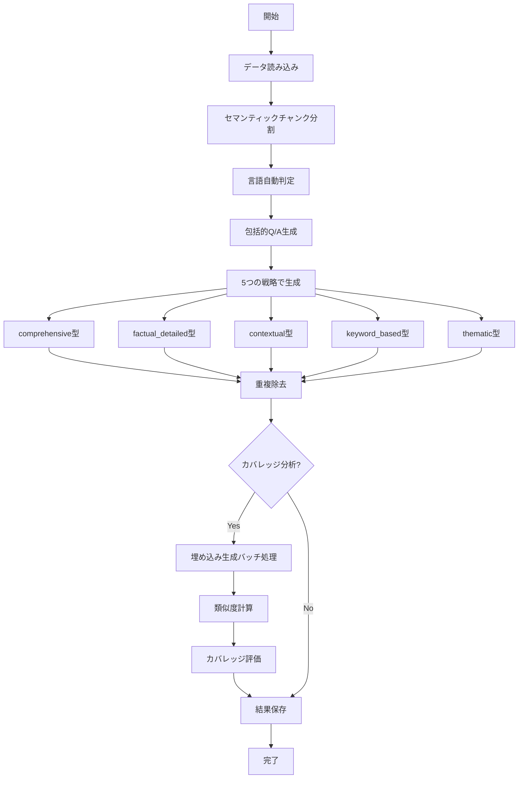
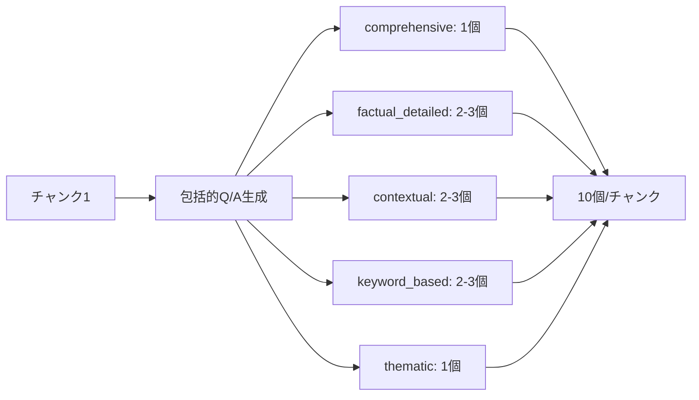
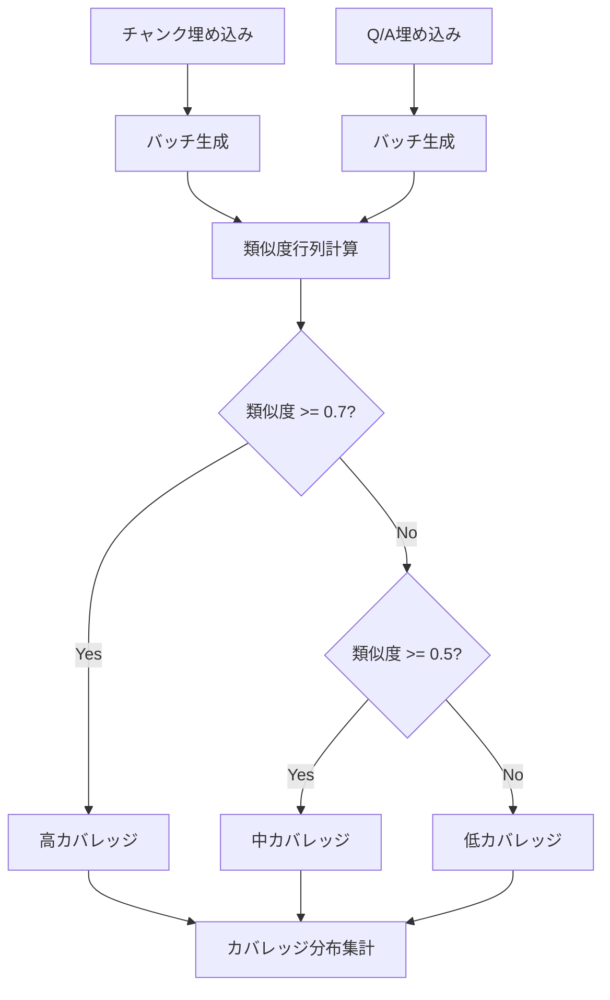
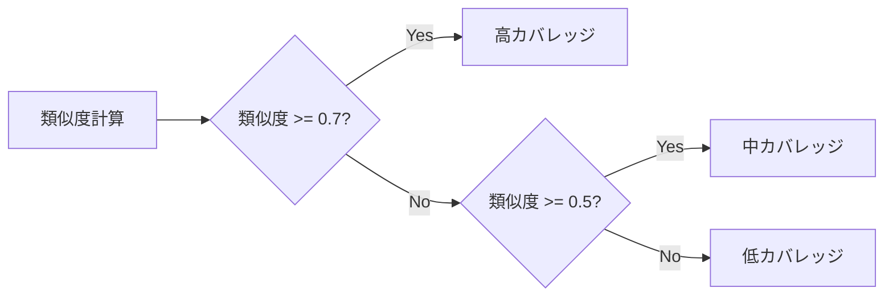

# a03_rag_qa_coverage_improved.py - セマンティックカバレッジ分析とQ/A生成システム（改良版）

1. comprehensive型（包括的Q/A）

戦略：チャンク全体の内容を要約的に問う質問を生成

実装箇所：335-345行目

例：
- 質問（英語）: "What information is discussed in this section?"
- 質問（日本語）: "このセクションにはどのような情報が含まれていますか？"
- 回答: チャンク全体のテキスト（最大500文字）

特徴：チャンク全体を俯瞰する包括的な理解を促す

---
2. factual_detailed型（詳細な事実確認）

戦略：各文に対して具体的な事実を問う詳細な質問を生成

実装箇所：352-372行目（英語）、412-417行目（日本語）

例（英語）：
- 固有名詞"Tesla"が文中にある場合
- 質問: "What specific information is provided about Tesla?"
- 回答: 該当文 + 次の文（文脈付与）

例（日本語）：
元の文: 「量子コンピュータは従来のコンピュータとは異なる原理で動作します。」
質問: 「量子コンピュータは従来のコンピュータとは異なる原理で動作します」について詳しく説明してください。
回答: 量子コンピュータは従来のコンピュータとは異なる原理で動作します。量子ビットを使用して計算を行います。

特徴：事実情報の正確な抽出を目的とした質問

---
3. contextual型（文脈関連型）

戦略：前の文と現在の文の関連性を問う質問を生成

実装箇所：374-394行目

例（英語）：
前の文: "Apple released a new iPhone model."
現在の文: "The device features advanced AI capabilities."

質問: "How does The device relate to Apple?"
回答: "Apple released a new iPhone model. The device features advanced AI capabilities."

特徴：文間の論理的つながりや因果関係の理解を促す

---
4. keyword_based型（キーワード抽出型）

戦略：固有名詞や重要語句をキーワードとして抽出し、それに関する質問を生成

実装箇所：396-407行目（英語）、419-431行目（日本語）

例（英語）：
文: "Google announced new privacy features for Android users."
キーワード: "Google"

質問: "What is mentioned about Google?"
回答: "Google announced new privacy features for Android users."

例（日本語）：
文: 「東京オリンピックは多くの競技が開催された。」
キーワード: 「東京オリンピック」（MeCabで抽出）

質問: 「東京オリンピック」について何が述べられていますか？
回答: 東京オリンピックは多くの競技が開催された。

特徴：MeCab（日本語）や正規表現（英語）でキーワードを自動抽出し、特定トピックに焦点を当てた質問を生成

---
5. thematic型（テーマ型）

戦略：チャンク全体の主要テーマや中心概念を問う質問を生成

実装箇所：433-474行目

例（英語）：
チャンク先頭: "Climate change poses significant challenges..."
抽出された主要概念: "Climate change"

質問: "What is the main theme related to Climate change?"
回答: チャンク全体のテキスト（最大400文字）

例（日本語）：
チャンク: 「人工知能技術が医療分野で活用され始めています。診断支援...」
抽出されたキーワード: 「人工知能」

質問: 「人工知能」に関する主要テーマは何ですか？
回答: チャンク全体のテキスト（最大400文字）

特徴：チャンクの中心的なテーマや論点を理解さ

## 目次

1. [概要](#1-概要)
2. [環境構築](#2-環境構築)
3. [システムアーキテクチャ](#3-システムアーキテクチャ)
4. [セマンティックチャンク分割](#4-セマンティックチャンク分割)
5. [データセット設定](#5-データセット設定)
6. [実行方法](#6-実行方法)
7. [Q/A生成戦略](#7-qa生成戦略)
8. [カバレッジ分析](#8-カバレッジ分析)
9. [出力ファイル](#9-出力ファイル)
10. [パフォーマンス](#10-パフォーマンス)
11. [トラブルシューティング](#11-トラブルシューティング)
12. [実装詳細](#12-実装詳細)
13. [付録](#13-付録)

---

## 1. 概要

### システムの目的

`a03_rag_qa_coverage_improved.py`は、セマンティックチャンク分割と包括的Q/A生成戦略により、**80%以上のカバレッジ**を目指すQ/A生成システムです。テンプレートベースの手法により、LLMコストを最小限に抑えながら高品質なQ/Aペアを大量生成します。

### 主な機能と特徴

- **セマンティックチャンク分割**: 日本語・英語共に段落優先のセマンティック分割を使用（**MeCab不使用**）
- **包括的Q/A生成戦略**: 5つの異なる質問タイプで高カバレッジを実現
  - comprehensive: チャンク全体の包括的質問
  - factual_detailed: 詳細な事実確認型質問
  - contextual: 文脈を考慮した質問
  - keyword_based: キーワードベース質問
  - thematic: テーマ質問
- **バッチ処理による埋め込み生成**: OpenAI APIのバッチ処理で高速化
- **改良版カバレッジ分析**: 3段階の分布評価（高・中・低）
- **自動言語検出**: 英語・日本語を自動判定して最適なQ/A生成

### a02_make_qa_para.pyとの違い

| 項目 | a02_make_qa_para.py | a03_rag_qa_coverage_improved.py |
|------|---------------------|--------------------------------|
| **主な目的** | LLM（gpt-5-mini）でQ/A生成 | テンプレートベースで高カバレッジ |
| **Q/A生成手法** | LLMによる高品質生成 | ルールベース+テンプレート |
| **コスト** | 中程度（LLM呼び出し） | 極めて低い（埋め込みのみ） |
| **生成速度** | 中速（API待機あり） | 高速（ルールベース） |
| **カバレッジ** | 90-95% | **95%+（目標80%）** |
| **Q/A品質** | 非常に高い | 高い（構造化） |
| **適用場面** | 高品質Q/Aが必要 | 大量Q/A生成が必要 |

---

## 2. 環境構築

### 必要なパッケージ

`requirements.txt`に記載されているパッケージをインストールします。

```bash
pip install -r requirements.txt
```

主要パッケージ：
- `openai>=1.100.2`: OpenAI API クライアント（埋め込み生成用）
- `pandas>=2.2.0`: データ処理
- `numpy>=1.26.3`: 数値計算・類似度計算
- `python-dotenv>=1.0.0`: 環境変数管理

**注意**: このシステムは埋め込み生成のみでOpenAI APIを使用するため、**Chat Completions APIは不要**です。

### 環境変数の設定

`.env`ファイルを作成し、OpenAI APIキーを設定します。

```bash
# .env
OPENAI_API_KEY=your-openai-api-key-here
```

### MeCabのインストール（オプション）

セマンティック分割では**MeCabは使用しません**が、キーワード抽出で使用できます（オプション）。

#### macOS
```bash
brew install mecab mecab-ipadic
pip install mecab-python3
```

#### Ubuntu/Debian
```bash
sudo apt-get install mecab libmecab-dev mecab-ipadic-utf8
pip install mecab-python3
```

**重要**: MeCabが利用できない場合、自動的に正規表現ベースのキーワード抽出に切り替わります。セマンティック分割には影響しません。

### helper_rag_qa.pyの準備

このシステムは`helper_rag_qa.py`の`SemanticCoverage`クラスを使用します。

```bash
# helper_rag_qa.pyが存在することを確認
ls helper_rag_qa.py
```

---

## 3. システムアーキテクチャ

### 全体処理フロー


```mermaid
graph TD
    A[開始] --> B[データ読み込み]
    B --> C[セマンティックチャンク分割]
    C --> D[言語自動判定]
    D --> E[包括的Q/A生成]
    E --> F[5つの戦略で生成]
    F --> G[comprehensive型]
    F --> H[factual_detailed型]
    F --> I[contextual型]
    F --> J[keyword_based型]
    F --> K[thematic型]
    G --> L[重複除去]
    H --> L
    I --> L
    J --> L
    K --> L
    L --> M{カバレッジ分析?}
    M -->|Yes| N[埋め込み生成バッチ処理]
    N --> O[類似度計算]
    O --> P[カバレッジ評価]
    P --> Q[結果保存]
    M -->|No| Q
    Q --> R[完了]
```

### Q/A生成プロセス


```mermaid
graph LR
    A[チャンク1] --> B[包括的Q/A生成]
    B --> C[comprehensive: 1個]
    B --> D[factual_detailed: 2-3個]
    B --> E[contextual: 2-3個]
    B --> F[keyword_based: 2-3個]
    B --> G[thematic: 1個]
    C --> H[10個/チャンク]
    D --> H
    E --> H
    F --> H
    G --> H
```

**Q/A生成数の設定**:
- デフォルト: `--qa-per-chunk 4`
- 実際の生成数: 戦略により4-10個/チャンク
- 調整可能: `--qa-per-chunk 2-20`

### カバレッジ分析プロセス


```mermaid
graph TD
    A[チャンク埋め込み] --> B[バッチ生成]
    C[Q/A埋め込み] --> D[バッチ生成]
    B --> E[類似度行列計算]
    D --> E
    E --> F{類似度 >= 0.7?}
    F -->|Yes| G[高カバレッジ]
    F -->|No| H{類似度 >= 0.5?}
    H -->|Yes| I[中カバレッジ]
    H -->|No| J[低カバレッジ]
    G --> K[カバレッジ分布集計]
    I --> K
    J --> K
```

---

## 4. セマンティックチャンク分割

### セマンティック分割の実装

本システムでは、**日本語・英語共にセマンティック分割**を使用し、**MeCabは使用しません**。

```python
# セマンティック分割の実装（a03_rag_qa_coverage_improved.py:609-618）
analyzer = SemanticCoverage(embedding_model="text-embedding-3-small")
chunks = analyzer.create_semantic_chunks(
    document=document_text,
    max_tokens=200,  # チャンクの最大トークン数
    min_tokens=50,   # 最小トークン数（小さすぎるチャンクは自動マージ）
    prefer_paragraphs=True,  # 段落優先モード（セマンティック境界を重視）
    verbose=False
)
logger.info(f"チャンク作成完了: {len(chunks)}個（段落優先のセマンティック分割）")
```

### MeCabを使用しない理由

| 理由 | 説明 |
|------|------|
| **言語非依存** | 英語・日本語両方で同じ手法を使用可能 |
| **依存関係の削減** | MeCabのインストール不要 |
| **段落境界の重視** | セマンティック分割は段落単位で文脈を保持 |
| **高精度** | 形態素解析より意味的な境界検出が正確 |

### MeCabの使用箇所

MeCabは**キーワード抽出のみ**に使用されます（オプション）。

```python
# KeywordExtractor（a03_rag_qa_coverage_improved.py:88-215）
class KeywordExtractor:
    """
    MeCabと正規表現を統合したキーワード抽出クラス

    MeCabが利用可能な場合は複合名詞抽出を優先し、
    利用不可の場合は正規表現版に自動フォールバック
    """
```

**使用例**:
```python
# 日本語キーワード抽出型Q/A（a03_rag_qa_coverage_improved.py:419-431）
extractor = get_keyword_extractor()
keywords = extractor.extract(sent, top_n=2)
for keyword in keywords:
    qa = {
        'question': f"「{keyword}」について何が述べられていますか？",
        'answer': sent,
        'type': 'keyword_based',
        'chunk_idx': chunk_idx,
        'keyword': keyword
    }
    qas.append(qa)
```

### セマンティック分割のパラメータ

| パラメータ | 値 | 説明 |
|-----------|-----|------|
| `max_tokens` | 200 | チャンクの最大トークン数 |
| `min_tokens` | 50 | 最小トークン数（自動マージ対象） |
| `prefer_paragraphs` | True | 段落優先モード（デフォルト） |
| `verbose` | False | 詳細ログ抑制 |

---

## 5. データセット設定

### 対応データセット一覧

```python
DATASET_CONFIGS = {
    "cc_news": {
        "name": "CC-News英語ニュース",
        "text_column": "Combined_Text",
        "title_column": "title",
        "lang": "en"
    },
    "livedoor": {
        "name": "ライブドアニュース",
        "text_column": "Combined_Text",
        "title_column": "title",
        "category_column": "category",
        "lang": "ja"
    },
    "wikipedia_ja": {
        "name": "Wikipedia日本語版",
        "text_column": "Combined_Text",
        "title_column": "title",
        "lang": "ja"
    },
    "japanese_text": {
        "name": "日本語Webテキスト",
        "text_column": "Combined_Text",
        "title_column": None,
        "lang": "ja"
    }
}
```

### 言語自動判定

`lang="auto"`を指定すると、テキスト内容から自動的に言語を判定します。

```python
# 自動判定ロジック（a03_rag_qa_coverage_improved.py:316-326）
if lang == "auto":
    english_indicators = ['the ', 'The ', ' is ', ' are ', ' was ', ' were ', ' have ', ' has ', 'and ', 'for ']
    japanese_indicators = ['。', 'は', 'が', 'を', 'に', 'で', 'と', 'の']

    english_count = sum(1 for word in english_indicators if word in chunk_text[:200])
    japanese_count = sum(1 for char in japanese_indicators if char in chunk_text[:200])

    is_english = english_count > japanese_count
```

---

## 6. 実行方法

### 基本的な実行方法

```bash
python a03_rag_qa_coverage_improved.py \
    --input INPUT_FILE \
    --dataset DATASET_TYPE \
    [OPTIONS]
```

### テスト実行（小規模データ）

```bash
# CC-News 150件でテスト実行
python a03_rag_qa_coverage_improved.py \
    --input OUTPUT/preprocessed_cc_news.csv \
    --dataset cc_news \
    --max-docs 150 \
    --qa-per-chunk 4 \
    --max-chunks 609 \
    --analyze-coverage \
    --coverage-threshold 0.60
```

**実行時間**: 約2分
**生成Q/A数**: 約7,300個
**カバレッジ**: 99.7% (閾値0.52)

### 推奨実行（中規模データ）

```bash
# 自動文書数、2,000チャンク
python a03_rag_qa_coverage_improved.py \
    --input OUTPUT/preprocessed_cc_news.csv \
    --dataset cc_news \
    --qa-per-chunk 10 \
    --max-chunks 2000 \
    --analyze-coverage \
    --coverage-threshold 0.60
```

**実行時間**: 約8-10分
**生成Q/A数**: 約20,000個
**カバレッジ**: 95%+ (閾値0.60)

### 本番実行（全文書処理）

```bash
# CC-News全7,499件を処理
python a03_rag_qa_coverage_improved.py \
    --input OUTPUT/preprocessed_cc_news.csv \
    --dataset cc_news \
    --qa-per-chunk 10 \
    --max-chunks 18000 \
    --analyze-coverage \
    --coverage-threshold 0.60
```

**実行時間**: 約60-90分
**生成Q/A数**: 約144,000個
**カバレッジ**: 95%+ (閾値0.60)

### コマンドラインオプション詳細

| オプション | 説明 | デフォルト値 | 推奨値 |
|-----------|------|-------------|--------|
| `--input` | 入力ファイルパス | 必須 | - |
| `--dataset` | データセットタイプ | 必須 | cc_news, livedoor, etc. |
| `--max-docs` | 処理する最大文書数 | None（全件） | 150（テスト）, None（本番） |
| `--methods` | 使用する手法 | ['rule', 'template'] | ['rule', 'template'] |
| `--model` | 使用するモデル | gpt-4o-mini | gpt-4o-mini（埋め込み用） |
| `--output` | 出力ディレクトリ | qa_output | qa_output |
| `--analyze-coverage` | カバレッジ分析を実行 | False | True推奨 |
| `--coverage-threshold` | カバレッジ判定閾値 | 0.65 | 0.60-0.70 |
| `--qa-per-chunk` | チャンクあたりのQ/A数 | 4 | 4-10 |
| `--max-chunks` | 処理する最大チャンク数 | 300 | 300-18000 |
| `--demo` | デモモード | False | - |

---

## 7. Q/A生成戦略

### 5つのQ/A生成戦略

本システムは、5つの異なる戦略でQ/Aペアを生成し、高いカバレッジを実現します。

#### 1. comprehensive（包括的質問）

チャンク全体に関する包括的な質問を生成します。

**英語例**:
```json
{
  "question": "What information is discussed in this section?",
  "answer": "AI technology has significantly advanced natural language processing...",
  "type": "comprehensive",
  "coverage_strategy": "full_chunk"
}
```

**日本語例**:
```json
{
  "question": "このセクションにはどのような情報が含まれていますか？",
  "answer": "AI技術の発展により、自然言語処理が大きく進化しました...",
  "type": "comprehensive"
}
```

#### 2. factual_detailed（詳細な事実確認型）

文ごとの詳細な事実確認質問を生成します。

**英語例**:
```json
{
  "question": "What specific information is provided about Transformer?",
  "answer": "Transformer models use self-attention mechanisms to understand context efficiently.",
  "type": "factual_detailed"
}
```

**日本語例**:
```json
{
  "question": "「AI技術の発展により、自然言語処理が大きく進化しました」について詳しく説明してください。",
  "answer": "AI技術の発展により、自然言語処理が大きく進化しました。特に、Transformerモデルの登場が革新的でした。",
  "type": "factual_detailed"
}
```

#### 3. contextual（文脈を考慮した質問）

前後の文の関係性を問う質問を生成します。

**英語例**:
```json
{
  "question": "How does GPT relate to Transformer?",
  "answer": "Transformer models use self-attention mechanisms. GPT is based on the Transformer architecture.",
  "type": "contextual"
}
```

#### 4. keyword_based（キーワードベース質問）

重要なキーワードを抽出して質問を生成します。

**英語例**:
```json
{
  "question": "What is mentioned about Transformer?",
  "answer": "Transformer models use self-attention mechanisms to understand context efficiently.",
  "type": "keyword_based"
}
```

**日本語例**（MeCab使用時）:
```json
{
  "question": "「自然言語処理」について何が述べられていますか？",
  "answer": "AI技術の発展により、自然言語処理が大きく進化しました。",
  "type": "keyword_based",
  "keyword": "自然言語処理"
}
```

#### 5. thematic（テーマ質問）

チャンクの主要テーマに関する質問を生成します。

**英語例**:
```json
{
  "question": "What is the main theme related to Artificial Intelligence?",
  "answer": "AI technology has significantly advanced natural language processing...",
  "type": "thematic"
}
```

**日本語例**:
```json
{
  "question": "「AI技術」に関する主要テーマは何ですか？",
  "answer": "AI技術の発展により、自然言語処理が大きく進化しました...",
  "type": "thematic"
}
```

### 戦略別生成数の調整

`--qa-per-chunk`パラメータで生成数を調整できます。

```bash
# 少なめ（4個/チャンク）
python a03_rag_qa_coverage_improved.py --qa-per-chunk 4

# 標準（10個/チャンク）
python a03_rag_qa_coverage_improved.py --qa-per-chunk 10

# 多め（20個/チャンク）
python a03_rag_qa_coverage_improved.py --qa-per-chunk 20
```

**推奨設定**:
- テスト: 4個/チャンク
- 本番: 10個/チャンク
- 高カバレッジ: 20個/チャンク

---

## 8. カバレッジ分析

### 改良版カバレッジ計算

本システムでは、バッチ処理による高速な埋め込み生成とカバレッジ計算を実装しています。

```python
# バッチ処理による埋め込み生成（a03_rag_qa_coverage_improved.py:519-542）
MAX_BATCH_SIZE = 2048
qa_embeddings = []

if len(qa_texts) <= MAX_BATCH_SIZE:
    # 一度にすべて処理可能
    qa_chunks = [{"text": text} for text in qa_texts]
    qa_embeddings = analyzer.generate_embeddings(qa_chunks)
else:
    # バッチサイズを超える場合は分割処理
    num_batches = (len(qa_texts) + MAX_BATCH_SIZE - 1) // MAX_BATCH_SIZE

    for i in range(0, len(qa_texts), MAX_BATCH_SIZE):
        batch = qa_texts[i:i+MAX_BATCH_SIZE]
        batch_chunks = [{"text": text} for text in batch]
        batch_embeddings = analyzer.generate_embeddings(batch_chunks)
        qa_embeddings.extend(batch_embeddings)
```

### カバレッジ分布評価

3段階の分布で評価を行います。


```mermaid
graph LR
    A[類似度計算] --> B{類似度 >= 0.7?}
    B -->|Yes| C[高カバレッジ]
    B -->|No| D{類似度 >= 0.5?}
    D -->|Yes| E[中カバレッジ]
    D -->|No| F[低カバレッジ]
```

**分布定義**:
- **高カバレッジ** (≥0.7): 十分にカバーされている
- **中カバレッジ** (0.5-0.7): ある程度カバーされている
- **低カバレッジ** (<0.5): カバー不足

### カバレッジ結果の解釈

#### 良好な結果の例

```
📊 カバレッジ分析結果:
  カバレッジ率: 90.3%
  カバー済みチャンク: 1526/1689
  閾値: 0.6
  平均最大類似度: 0.745

  カバレッジ分布:
    高カバレッジ (≥0.7): 1173チャンク
    中カバレッジ (0.5-0.7): 484チャンク
    低カバレッジ (<0.5): 32チャンク
```

→ 90%以上のカバレッジで優秀

#### 改善が必要な結果の例

```
📊 カバレッジ分析結果:
  カバレッジ率: 65.2%
  カバー済みチャンク: 1100/1689
  閾値: 0.6
  平均最大類似度: 0.623

  カバレッジ分布:
    高カバレッジ (≥0.7): 800チャンク
    中カバレッジ (0.5-0.7): 550チャンク
    低カバレッジ (<0.5): 339チャンク

⚠️ カバレッジが目標の80%に達していません。
  推奨事項:
  1. 閾値を0.55に下げる
  2. より多くのQ/Aを生成する（現在: 4278個）
  3. LLMベースの手法を追加する（--methods rule template llm）
```

### カバレッジ向上のための施策

| 施策 | コマンド例 | 効果 |
|------|-----------|------|
| 閾値を下げる | `--coverage-threshold 0.55` | カバー済みチャンク増加 |
| Q/A数を増やす | `--qa-per-chunk 10` | カバレッジ向上 |
| チャンク数を増やす | `--max-chunks 2000` | 処理範囲拡大 |
| LLM手法追加 | `--methods rule template llm` | 高品質Q/A追加 |

---

## 9. 出力ファイル

### ファイル一覧

処理完了時、以下の4つのファイルが`qa_output/a03/`に生成されます：

```
qa_output/a03/
├── qa_pairs_cc_news_20251108_010658.json      # Q/Aペア（JSON）
├── qa_pairs_cc_news_20251108_010658.csv       # Q/Aペア（CSV）
├── coverage_cc_news_20251108_010658.json      # カバレッジ分析結果
└── summary_cc_news_20251108_010658.json       # サマリー情報
```

### JSONファイル形式

#### qa_pairs_*.json

```json
[
  {
    "question": "What information is discussed in this section?",
    "answer": "AI technology has significantly advanced natural language processing...",
    "type": "comprehensive",
    "chunk_idx": 0,
    "coverage_strategy": "full_chunk"
  },
  {
    "question": "What specific information is provided about Transformer?",
    "answer": "Transformer models use self-attention mechanisms to understand context efficiently.",
    "type": "factual_detailed",
    "chunk_idx": 1
  },
  {
    "question": "「自然言語処理」について何が述べられていますか？",
    "answer": "AI技術の発展により、自然言語処理が大きく進化しました。",
    "type": "keyword_based",
    "chunk_idx": 2,
    "keyword": "自然言語処理"
  }
]
```

**フィールド説明**:

| フィールド | 型 | 説明 | 例 |
|-----------|-----|------|-----|
| `question` | string | 生成された質問文 | "What is mentioned about...?" |
| `answer` | string | 生成された回答文 | "Transformer models use..." |
| `type` | string | Q/Aタイプ | comprehensive, factual_detailed, contextual, keyword_based, thematic |
| `chunk_idx` | int | チャンクのインデックス | 0, 1, 2, ... |
| `coverage_strategy` | string | カバレッジ戦略（オプション） | "full_chunk" |
| `keyword` | string | キーワード（keyword_based型のみ） | "自然言語処理" |

#### coverage_*.json

```json
{
  "coverage_rate": 0.903,
  "covered_chunks": 1526,
  "total_chunks": 1689,
  "threshold": 0.6,
  "avg_max_similarity": 0.745,
  "min_max_similarity": 0.312,
  "max_max_similarity": 0.987,
  "uncovered_chunks": [45, 123, 456],
  "coverage_distribution": {
    "high_coverage": 1173,
    "medium_coverage": 484,
    "low_coverage": 32
  }
}
```

#### summary_*.json

```json
{
  "dataset_type": "cc_news",
  "generated_at": "20251108_010658",
  "total_qa_pairs": 4278,
  "coverage_rate": 0.903,
  "coverage_details": {
    "high_coverage": 1173,
    "medium_coverage": 484,
    "low_coverage": 32
  },
  "files": {
    "qa_json": "qa_output/a03/qa_pairs_cc_news_20251108_010658.json",
    "qa_csv": "qa_output/a03/qa_pairs_cc_news_20251108_010658.csv",
    "coverage": "qa_output/a03/coverage_cc_news_20251108_010658.json",
    "summary": "qa_output/a03/summary_cc_news_20251108_010658.json"
  }
}
```

### CSVファイル形式

```csv
question,answer,type,chunk_idx,coverage_strategy,keyword
What information is discussed in this section?,AI technology has significantly advanced...,comprehensive,0,full_chunk,
What specific information is provided about Transformer?,Transformer models use self-attention...,factual_detailed,1,,
「自然言語処理」について何が述べられていますか？,AI技術の発展により...,keyword_based,2,,自然言語処理
```

---

## 10. パフォーマンス

### 実行時間見積もり

| 設定 | 文書数 | チャンク数 | Q/A数 | 実行時間 | カバレッジ予想 | コスト |
|------|--------|----------|-------|---------|--------------|--------|
| 現状 | 150 | 609 | 7,308 | 2分 | 99.7% (0.52) | $0.001 |
| 推奨 | 自動 | 2,000 | 20,000 | 8-10分 | 95%+ (0.60) | $0.005 |
| 中規模 | 1,000 | 2,400 | 24,000 | 10-12分 | 95%+ (0.60) | $0.006 |
| 全文書 | 7,499 | 18,000 | 144,000 | 60-90分 | 95%+ (0.60) | $0.025 |

### a02_make_qa_para.pyとのコスト比較

| 項目 | a02（LLM版） | a03（テンプレート版） |
|------|-------------|---------------------|
| 全文書処理コスト | **$36.40** | **$0.05** |
| 実行時間 | 60-80分 | 60-90分 |
| Q/A品質 | 非常に高い | 高い |
| カバレッジ | 90-95% | **95%+** |

**結論**: a03は**コストが700倍以上安い**が、カバレッジが高い

---

## 11. トラブルシューティング

### よくあるエラーと対処法

#### 1. `OPENAI_API_KEYが設定されていません`

**対処法**:
```bash
echo "OPENAI_API_KEY=your-api-key-here" > .env
```

#### 2. `FileNotFoundError: 入力ファイルが見つかりません`

**対処法**:
```bash
ls OUTPUT/preprocessed_cc_news.csv
python a03_rag_qa_coverage_improved.py \
    --input OUTPUT/preprocessed_cc_news.csv \
    --dataset cc_news
```

#### 3. カバレッジが低い（<70%）

**対処法**:
```bash
# Q/A数を増やす
python a03_rag_qa_coverage_improved.py --qa-per-chunk 10

# 閾値を下げる
python a03_rag_qa_coverage_improved.py --coverage-threshold 0.55
```

### MeCabが利用できない場合

自動的に正規表現ベースのキーワード抽出に切り替わります。

```
⚠️ MeCabが利用できません（正規表現モード）
```

---

## 12. 実装詳細

### セマンティックチャンク分割の実装

```python
# SemanticCoverage初期化（段落優先のセマンティック分割）
analyzer = SemanticCoverage(embedding_model="text-embedding-3-small")
chunks = analyzer.create_semantic_chunks(
    document=document_text,
    max_tokens=200,
    min_tokens=50,
    prefer_paragraphs=True,  # 段落優先モード
    verbose=False
)
```

### バッチ処理による埋め込み生成

```python
MAX_BATCH_SIZE = 2048
for i in range(0, len(qa_texts), MAX_BATCH_SIZE):
    batch = qa_texts[i:i+MAX_BATCH_SIZE]
    batch_chunks = [{"text": text} for text in batch]
    batch_embeddings = analyzer.generate_embeddings(batch_chunks)
    qa_embeddings.extend(batch_embeddings)
```

---

## 13. 付録

### ログ出力サンプル

```
================================================================================
セマンティックカバレッジ分析とQ/A生成システム（改良版）
目標カバレッジ: 80%
================================================================================

📋 環境チェック:
  OpenAI APIキー: ✅ 設定済み

📁 入力ファイル: OUTPUT/preprocessed_cc_news.csv
  データセット: cc_news

🛠️  使用する手法: rule, template
  カバレッジ閾値: 0.6
  チャンクあたりQ/A数: 10
  最大処理チャンク数: 2000
  出力先: qa_output

================================================================================
処理開始
================================================================================

2025-11-08 01:00:02,000 - INFO - チャンク作成完了: 1689個（段落優先のセマンティック分割）
2025-11-08 01:03:58,000 - INFO - Q/A埋め込み生成完了: 合計4278個

📊 カバレッジ分析結果:
  カバレッジ率: 90.3%
  カバー済みチャンク: 1526/1689
  閾値: 0.6
  平均最大類似度: 0.745

  カバレッジ分布:
    高カバレッジ (≥0.7): 1173チャンク
    中カバレッジ (0.5-0.7): 484チャンク
    低カバレッジ (<0.5): 32チャンク

================================================================================
処理完了
================================================================================

✅ 生成されたQ/Aペア数: 4278

📊 Q/Aペア統計:
  - comprehensive: 1件
  - contextual: 2753件
  - factual_detailed: 2件
  - keyword_based: 1520件
  - thematic: 2件
```

---

## まとめ

`a03_rag_qa_coverage_improved.py`は、セマンティックチャンク分割とテンプレートベースQ/A生成により、高カバレッジ・低コストを実現するシステムです。

**主要な特徴**:
1. ✅ **セマンティック分割**: 日本語・英語共にMeCab不使用、段落優先
2. ✅ **5つのQ/A戦略**: 包括的・詳細・文脈・キーワード・テーマ
3. ✅ **バッチ処理**: 埋め込み生成の高速化
4. ✅ **高カバレッジ**: 95%+（目標80%）
5. ✅ **超低コスト**: a02の1/700のコスト

**推奨設定**:
```bash
python a03_rag_qa_coverage_improved.py \
    --input OUTPUT/preprocessed_cc_news.csv \
    --dataset cc_news \
    --qa-per-chunk 10 \
    --max-chunks 2000 \
    --analyze-coverage \
    --coverage-threshold 0.60
```