# a10_qa_optimized_hybrid_batch.py - バッチ処理版ハイブリッドQ&A生成システム

## 概要

`a10_qa_optimized_hybrid_batch.py`は、大規模バッチ処理に最適化されたQ&A生成システムです。複数文書を一度のAPI呼び出しで処理し、処理速度とコスト効率を大幅に改善。品質重視モードにより、カバレージ95%を目指す高品質なQ&A生成も可能です。

## 対応データセット

以下の4種類のデータセットに対応しています:

1. **cc_news**: CC-News英語ニュース
2. **japanese_text**: 日本語Webテキスト
3. **wikipedia_ja**: Wikipedia日本語版
4. **livedoor**: Livedoorニュースコーパス（日本語）

### 主要成果（CC-Newsデータセット、497文書処理）
- **API削減率**: 92.6%（110回 vs 従来1,491回）
- **処理速度**: 0.14文書/秒
- **処理時間**: 61.3分
- **総コスト**: < $0.20
- **カバレージ**: 74.6%（通常）/ 95%（品質モード）

## システムアーキテクチャ（処理フロー図）

```mermaid
flowchart TD
    Start([開始]) --> LoadConfig[設定読込]
    LoadConfig --> CheckMode{処理モード判定}

    CheckMode -->|通常| NormalConfig[通常設定]
    CheckMode -->|品質重視| QualityConfig[品質設定]
    CheckMode -->|比較| CompareMode[比較実行]

    NormalConfig --> LoadData[データ読込]
    QualityConfig --> LoadData

    LoadData --> DetectDataset{データセット判定}
    DetectDataset -->|cc_news| EnConfig[英語設定]
    DetectDataset -->|japanese_text| JaConfig[日本語設定]
    DetectDataset -->|wikipedia_ja| JaAcademicConfig[日本語学術設定]

    EnConfig --> CheckMeCab{MeCab確認}
    JaConfig --> CheckMeCab
    JaAcademicConfig --> CheckMeCab

    CheckMeCab -->|利用可能| MeCabChunking[MeCab文境界検出]
    CheckMeCab -->|利用不可| RegexChunking[正規表現分割]

    MeCabChunking --> CreateBatches[バッチ作成]
    RegexChunking --> CreateBatches

    CreateBatches --> BatchSize{バッチサイズ}
    BatchSize -->|10文書| Batch10[10文書バッチ]
    BatchSize -->|20文書| Batch20[20文書バッチ]
    BatchSize -->|カスタム| BatchCustom[カスタムバッチ]

    Batch10 --> ProcessBatch[バッチ処理開始]
    Batch20 --> ProcessBatch
    BatchCustom --> ProcessBatch

    ProcessBatch --> Phase1[Phase1: チャンク作成]
    Phase1 --> SemanticChunking[セマンティックチャンキング]
    SemanticChunking --> AllChunks[全チャンク収集]

    AllChunks --> Phase2[Phase2: LLM処理]
    Phase2 --> DetectDocType{文書タイプ判定}

    DetectDocType -->|news| NewsPrompt[ニュース用プロンプト]
    DetectDocType -->|academic| AcademicPrompt[学術用プロンプト]
    DetectDocType -->|auto| AutoPrompt[自動プロンプト]

    NewsPrompt --> LLMBatch[バッチLLM呼出]
    AcademicPrompt --> LLMBatch
    AutoPrompt --> LLMBatch

    LLMBatch --> LLMQuality{品質チェック}
    LLMQuality -->|成功| LLMQAs[LLM Q&A]
    LLMQuality -->|失敗| RuleFallback[ルールベース代替]

    LLMQAs --> RuleSupport[ルールベース補完]
    RuleFallback --> RuleSupport

    RuleSupport --> KeywordQA[キーワードQ&A]
    KeywordQA --> SummaryQA[サマリーQ&A]
    SummaryQA --> ContextQA[文脈Q&A]

    ContextQA --> Phase3[Phase3: 埋込生成]
    Phase3 --> EmbedBatchSize{埋込バッチサイズ}

    EmbedBatchSize -->|100| Embed100[100個バッチ]
    EmbedBatchSize -->|150| Embed150[150個バッチ]
    EmbedBatchSize -->|2048| EmbedMax[最大バッチ]

    Embed100 --> ChunkEmbed[チャンク埋込]
    Embed150 --> ChunkEmbed
    EmbedMax --> ChunkEmbed

    ChunkEmbed --> QAEmbed[Q&A埋込]
    QAEmbed --> StreamProcess{ストリーミング}

    StreamProcess -->|Yes| StreamEmbed[ストリーム処理]
    StreamProcess -->|No| BulkEmbed[一括処理]

    StreamEmbed --> Phase4[Phase4: カバレッジ]
    BulkEmbed --> Phase4

    Phase4 --> CalcSimilarity[類似度計算]
    CalcSimilarity --> CosineSim[コサイン類似度]
    CosineSim --> CoverageMatrix[カバレッジ行列]

    CoverageMatrix --> CoverageCheck{カバレッジ判定}
    CoverageCheck -->|目標達成| FinalizeBatch[バッチ完了]
    CoverageCheck -->|未達成| AdditionalGen[追加生成]

    AdditionalGen --> TargetCheck{目標確認}
    TargetCheck -->|95%目標| MoreQA[Q&A追加]
    TargetCheck -->|通常| FinalizeBatch

    MoreQA --> Phase2

    FinalizeBatch --> NextBatch{次バッチ?}
    NextBatch -->|Yes| ProcessBatch
    NextBatch -->|No| Aggregate[結果集約]

    Aggregate --> CalcStats[統計計算]
    CalcStats --> APIStats[API統計]
    APIStats --> CostCalc[コスト計算]
    CostCalc --> TimeStats[時間統計]

    TimeStats --> SaveResults[結果保存]
    SaveResults --> SaveJSON[JSON保存]
    SaveResults --> SaveCSV[CSV保存]
    SaveResults --> SaveSummary[サマリー保存]

    SaveJSON --> ShowResults[結果表示]
    SaveCSV --> ShowResults
    SaveSummary --> ShowResults

    ShowResults --> End([終了])

    CompareMode --> SplitSample[サンプル分割]
    SplitSample --> NormalRun[通常版実行]
    SplitSample --> BatchRun[バッチ版実行]

    NormalRun --> NormalTime[時間計測]
    NormalRun --> NormalAPI[API計測]
    BatchRun --> BatchTime[時間計測]
    BatchRun --> BatchAPI[API計測]

    NormalTime --> CompareResults[比較結果]
    NormalAPI --> CompareResults
    BatchTime --> CompareResults
    BatchAPI --> CompareResults

    CompareResults --> ShowImprovement[改善率表示]
    ShowImprovement --> End
```



## 主要機能

1. バッチ処理最適化
- 10文書同時処理で95.4%のAPI削減
- 従来1,491回→68回のAPI呼び出し
- コスト約1/25に削減
2. ハイブリッド戦略
- LLMとルールベースの組み合わせ
- 文書タイプ別処理（news/academic/auto）
- 2段階バッチ処理（LLM/埋め込み）
3. MeCab統合
- 日本語での高精度文境界検出
- 自動フォールバック機能
4. 実績
- 処理速度: 0.16文書/秒
- コスト: $0.1581（497文書）
- カバレージ: 74.6%

この方式は大規模処理とコスト効率を最優先し、本番環境での運用に最適です。

### 主要なポイント:

1. **バッチ処理最適化**
   - 10文書同時処理でAPI呼び出し95.4%削減
   - LLM API: 50回（従来1,491回）
   - 埋め込みAPI: 18回
2. **ハイブリッド生成戦略**
   - LLMとルールベースの組み合わせ
   - 文書タイプ自動判定（news/academic/auto）
   - コンテキスト保持による品質向上
3. **MeCab統合**
   - 日本語文書で高精度文境界検出
   - 自動フォールバック機能
   - 言語別最適化（ja/en）
4. **コスト効率**
   - 総コスト: $0.1581（500文書）
   - 従来比約1/25のコスト
   - 処理速度: 0.16文書/秒
5. **実績**
   - カバレージ: 74.6%
   - 生成Q&A数: 2,075ペア（497文書）
   - 処理時間: 52.14分

## 概要

`a10_qa_optimized_hybrid_batch.py`は、**大規模バッチ処理に最適化されたQ&Aペア生成システム**です。API呼び出しを極限まで削減し、コスト効率と処理速度を最大化しています。

### 主要な成果
- **API削減率**: 95.4%（68回 vs 従来1,491回）
- **処理速度**: 0.16文書/秒
- **総コスト**: $0.1581（497文書）
- **カバレージ**: 74.6%（平均）

---

## 1. バッチ処理アーキテクチャ

### 1.1 基本設計

```
文書群 → バッチ化（10文書） → 並列チャンク処理 → 統合Q&A生成 → バッチ埋め込み → カバレージ計算
```

### 1.2 BatchHybridQAGeneratorクラス

```python
class BatchHybridQAGenerator:
    def __init__(self,
        model: str = "gpt-5-mini",
        batch_size: int = 10,              # LLMバッチサイズ
        embedding_batch_size: int = 100    # 埋め込みバッチサイズ
    ):
```

**特徴**:
- **2段階バッチ処理**: LLM処理と埋め込み生成を別々に最適化
- **動的バッチサイズ**: 文書量に応じて自動調整
- **メモリ効率**: 大規模データセットでも安定動作

---

## 2. ハイブリッド生成戦略

### 2.1 文書タイプ別処理

```python
DOCUMENT_TYPE_PROMPTS = {
    "news": {
        "focus": "重要な事実、イベント、影響",
        "qa_style": "5W1H形式（What, When, Where, Who, Why, How）"
    },
    "academic": {
        "focus": "概念、理論、方法論、結論",
        "qa_style": "定義、説明、応用、比較"
    },
    "auto": {
        "focus": "キーポイントと重要情報",
        "qa_style": "多様な観点から"
    }
}
```

### 2.2 ルールベース補完

```python
def generate_rule_based_qa(text: str, lang: str) -> List[Dict]:
    """LLM生成を補完するルールベースQ&A"""
    qa_pairs = []

    # キーワード抽出型
    keywords = extract_keywords(text)
    for keyword in keywords[:3]:
        qa_pairs.append({
            "question": f"What is mentioned about {keyword}?",
            "answer": extract_context(text, keyword)
        })

    # サマリー型
    qa_pairs.append({
        "question": "What is the main topic?",
        "answer": text[:200] + "..."
    })

    return qa_pairs
```

---

## 3. バッチ処理の詳細

### 3.1 処理フロー

```python
def generate_batch_hybrid_qa(texts: List[str], batch_size: int = 10):
    """バッチ処理によるQ&A生成"""

    # Phase 1: チャンク作成（全文書並列）
    all_chunks = []
    for text in texts:
        chunks = create_semantic_chunks(text)
        all_chunks.extend(chunks)

    # Phase 2: バッチLLM処理
    for batch in batches(texts, batch_size):
        qa_pairs = generate_llm_batch(batch)

    # Phase 3: 統合埋め込み生成
    embeddings = generate_embeddings_batch(
        all_chunks + qa_pairs,
        batch_size=embedding_batch_size
    )

    # Phase 4: カバレージ計算
    coverage = calculate_batch_coverage(embeddings)
```

### 3.2 API呼び出し削減の仕組み

| 処理段階 | 従来方式 | バッチ方式 | 削減率 |
|---------|---------|-----------|--------|
| チャンク生成 | 0 | 0 | - |
| LLM Q&A生成 | 497回 | 50回 | 89.9% |
| チャンク埋め込み | 497回 | 10回 | 98.0% |
| Q&A埋め込み | 497回 | 8回 | 98.4% |
| **合計** | **1,491回** | **68回** | **95.4%** |

---

## 4. MeCab統合と言語処理

### 4.1 自動言語検出とMeCab利用

```python
def create_semantic_chunks(text: str, lang: str = "auto"):
    """言語別最適チャンキング"""

    # 言語自動検出
    if lang == "auto":
        lang = detect_language(text)

    if lang == "ja" and mecab_available:
        # MeCabによる高精度文境界検出
        return create_mecab_chunks(text)
    else:
        # 正規表現フォールバック
        return create_regex_chunks(text)
```

### 4.2 MeCab利用の効果

| 言語 | チャンキング方式 | 文境界精度 | 処理速度 |
|------|-----------------|-----------|----------|
| 日本語（MeCab有） | 形態素解析 | 95%+ | 中速 |
| 日本語（MeCab無） | 正規表現 | 85% | 高速 |
| 英語 | 正規表現 | 90% | 高速 |

---

## 5. 埋め込みバッチ処理

### 5.1 大規模バッチ最適化

```python
def generate_embeddings_batch(texts: List[str], batch_size: int = 100):
    """大規模埋め込みバッチ生成"""

    MAX_BATCH = 2048  # OpenAI API制限
    embeddings = []

    # 動的バッチサイズ調整
    actual_batch_size = min(batch_size, MAX_BATCH)

    for i in range(0, len(texts), actual_batch_size):
        batch = texts[i:i+actual_batch_size]
        batch_embeddings = openai_client.embeddings.create(
            input=batch,
            model="text-embedding-3-small"
        )
        embeddings.extend(batch_embeddings)

    return embeddings
```

### 5.2 メモリ管理

```python
# ストリーミング処理でメモリ効率化
def process_large_dataset(texts: List[str]):
    for batch in stream_batches(texts, size=100):
        embeddings = generate_embeddings_batch(batch)
        yield embeddings  # メモリを即座に解放
```

---

## 6. 実行パラメータと設定

### 6.1 推奨実行コマンド

```bash
# 95%カバレージ達成用（推奨）
python a10_qa_optimized_hybrid_batch.py \
    --dataset cc_news \
    --model gpt-5-mini \
    --batch-size 10 \              # LLMバッチサイズ
    --embedding-batch-size 150 \    # 埋め込みバッチサイズ
    --qa-count 12 \                # 文書あたりQ&A数
    --output qa_output

# 高速処理用
python a10_qa_optimized_hybrid_batch.py \
    --dataset cc_news \
    --batch-size 20 \              # 大きめバッチ
    --embedding-batch-size 200 \
    --qa-count 8                   # 少なめQ&A
```

### 6.2 パラメータ影響度

| パラメータ | デフォルト | 影響 | トレードオフ |
|----------|-----------|------|------------|
| batch-size | 10 | API呼び出し数 | 精度 vs 効率 |
| embedding-batch-size | 100 | 埋め込み処理速度 | メモリ vs 速度 |
| qa-count | 10 | カバレージ率 | 品質 vs コスト |
| use-llm | true | Q&A品質 | 自然さ vs コスト |

---

## 7. パフォーマンス特性

### 7.1 実測値（497文書）

| 指標 | 値 |
|------|-----|
| **処理文書数** | 497 |
| **生成Q&A総数** | 2,075 |
| **平均Q&A/文書** | 4.2 |
| **処理時間** | 52.14分 |
| **処理速度** | 0.16文書/秒 |
| **LLM API呼び出し** | 50回 |
| **埋め込みAPI呼び出し** | 18回 |
| **総API呼び出し** | 68回 |
| **API削減率** | 95.4% |
| **総コスト** | $0.1581 |

### 7.2 バッチ処理統計

```json
{
    "batch_statistics": {
        "total_batches": 50,
        "avg_batch_size": 9.94,
        "max_batch_size": 10,
        "min_batch_size": 7,
        "llm_api_calls": 50,
        "embedding_batches": 18,
        "api_reduction_rate": 95.4
    }
}
```

### 7.3 カバレージ分布

| カバレージ範囲 | 文書数 | 割合 |
|--------------|--------|------|
| 90-100% | 286 | 57.5% |
| 70-90% | 142 | 28.6% |
| 50-70% | 51 | 10.3% |
| 0-50% | 18 | 3.6% |
| **平均** | **74.6%** | - |

---

## 8. データセット別設定

### 8.1 設定詳細

```python
DATASET_CONFIGS = {
    "cc_news": {
        "lang": "en",
        "default_doc_type": "news",
        "chunk_strategy": "regex"
    },
    "japanese_text": {
        "lang": "ja",
        "default_doc_type": "auto",
        "chunk_strategy": "mecab_with_fallback"
    },
    "wikipedia_ja": {
        "lang": "ja",
        "default_doc_type": "academic",
        "chunk_strategy": "mecab_with_fallback"
    },
    "livedoor": {
        "lang": "ja",
        "default_doc_type": "news",
        "chunk_strategy": "mecab_with_fallback"
    }
}
```

---

## 9. エラー処理と堅牢性

### 9.1 フォールバック機構

```python
try:
    # バッチLLM処理
    qa_pairs = generate_llm_batch(batch)
except Exception as e:
    logger.warning(f"LLMエラー: {e}")
    # ルールベースにフォールバック
    qa_pairs = generate_rule_based_qa(batch)
```

### 9.2 プログレス表示

```python
# tqdmによる詳細な進捗表示
for batch in tqdm(batches, desc="バッチ処理"):
    process_batch(batch)
```

---

## 10. 比較実行機能

### 10.1 通常版との性能比較

```python
def compare_with_normal_version(sample_size: int = 10):
    """通常版とバッチ版の比較"""

    # 結果例（10文書）
    return {
        "normal_version": {
            "api_calls": 30,
            "time": 180秒,
            "cost": $0.15
        },
        "batch_version": {
            "api_calls": 3,
            "time": 35秒,
            "cost": $0.008,
            "improvement": "90%削減"
        }
    }
```

---

## 11. 長所と短所

### 長所
✅ **超高効率**: API呼び出し95.4%削減
✅ **低コスト**: 従来比約1/25のコスト
✅ **高速処理**: 52分で497文書処理
✅ **スケーラブル**: 大規模データセット対応
✅ **MeCab統合**: 日本語高精度処理

### 短所
❌ **カバレージ**: 74.6%（a03の92.8%より低い）
❌ **Q&A数**: 文書あたり4.2個（少なめ）
❌ **バッチ制約**: リアルタイム処理不向き
❌ **メモリ使用**: 大規模バッチでメモリ消費

---

## 12. 改善提案

### 12.1 カバレージ向上
1. **qa_count増加**: 4→6-8個/文書
2. **バッチサイズ削減**: 10→5でコンテキスト改善
3. **追加生成パス**: 低カバレージ文書への追加Q&A

### 12.2 効率化
1. **非同期処理**: asyncioによる並列化
2. **キャッシュ**: 頻出パターンのキャッシュ
3. **GPU活用**: 埋め込み生成の高速化

---

## 使用推奨シナリオ

### 最適な用途
- ✅ **大規模処理**: 数千〜数万文書の一括処理
- ✅ **コスト重視**: API費用を最小化したい
- ✅ **バッチ処理**: 定期的な大量処理
- ✅ **本番環境**: 安定性とコスト効率重視

### 不適切な用途
- ❌ **高カバレージ必要**: 90%以上のカバレージが必須
- ❌ **リアルタイム**: 即座の応答が必要
- ❌ **少量処理**: 数件程度の処理

---

## まとめ

`a10_qa_optimized_hybrid_batch.py`は、**コスト効率と処理速度を極限まで最適化**したQ&Aペア生成システムです。95.4%のAPI削減により、大規模データセットの処理を現実的なコストで実現しています。

カバレージ率は74.6%とやや低めですが、本番環境での大規模運用において最もコスト効率の高い選択肢となっています。

---

---

## API仕様

### コマンドライン引数

| 引数 | 型 | デフォルト | 説明 |
|------|-----|-----------|------|
| `--dataset` | str | cc_news | データセット選択（cc_news, japanese_text, wikipedia_ja, livedoor） |
| `--model` | str | gpt-5-mini | 使用するLLMモデル |
| `--batch-size` | int | 10 | LLMバッチサイズ（1-20） |
| `--embedding-batch-size` | int | 100 | 埋め込みバッチサイズ（1-2048） |
| `--max-docs` | int | None | 処理する最大文書数（テスト用） |
| `--qa-count` | int | None | 文書あたりのQ/A数 |
| `--doc-type` | str | None | 文書タイプ（news, technical, academic, auto） |
| `--no-llm` | flag | False | LLMを使用しない（ルールベースのみ） |
| `--no-coverage` | flag | False | カバレッジ計算を行わない |
| `--output` | str | qa_output | 出力ディレクトリ |
| `--compare` | flag | False | 通常版との比較実行 |
| `--compare-size` | int | 10 | 比較実行のサンプルサイズ |
| `--quality-mode` | flag | False | 品質重視モード（カバレッジ95%目標） |
| `--target-coverage` | float | 0.95 | 目標カバレッジ率（品質モード時） |
| `--use-cache` | flag | False | 埋め込みキャッシュを使用 |
| `--cache-dir` | str | qa_cache | キャッシュディレクトリ |
| `--progressive-quality` | flag | False | 段階的品質向上モード |
| `--initial-coverage` | float | 0.85 | 初期目標カバレッジ率 |
| `--final-coverage` | float | 0.95 | 最終目標カバレッジ率 |

### BatchHybridQAGeneratorパラメータ

```python
class BatchHybridQAGenerator:
    def __init__(
        self,
        model: str = "gpt-5-mini",
        batch_size: int = 10,              # LLMバッチサイズ
        embedding_batch_size: int = 100,    # 埋め込みバッチサイズ
        quality_mode: bool = False,         # 品質重視モード
        target_coverage: float = 0.95       # 目標カバレッジ率
    ):
```

### 出力ファイル形式

実行後、以下のファイルが出力されます:

1. **サマリー**: `batch_summary_{dataset}_{model}_b{batch_size}_{timestamp}.json`
   - 処理統計、API使用状況、カバレッジ情報
   - バッチ処理の詳細統計

2. **Q/Aペア（CSV）**: `batch_qa_pairs_{dataset}_{model}_b{batch_size}_{timestamp}.csv`
   - 全Q/Aペアのリスト
   - doc_id, question, answer, doc_title, text_lengthを含む

### 依存関係

```python
# 主要パッケージ
openai>=1.100.2          # OpenAI API
pandas>=2.0.0            # データ処理
numpy>=1.24.0            # 数値計算
tiktoken>=0.5.0          # トークンカウント
python-dotenv>=1.0.0     # 環境変数管理
tqdm                     # プログレスバー表示

# オプション（日本語処理強化）
MeCab                    # 日本語形態素解析（推奨）
```

### 環境変数

```bash
# 必須
OPENAI_API_KEY=your-openai-api-key

# オプション
# なし
```

### 実行例

```bash
# 基本実行（通常モード）
python a10_qa_optimized_hybrid_batch.py --dataset cc_news

# 品質重視モード（カバレッジ95%目標）
python a10_qa_optimized_hybrid_batch.py \
    --dataset cc_news \
    --quality-mode \
    --target-coverage 0.95 \
    --batch-size 5 \
    --embedding-batch-size 150

# Livedoorニュースデータセット処理例
python a10_qa_optimized_hybrid_batch.py \
    --dataset livedoor \
    --quality-mode \
    --max-docs 500 \
    --batch-size 20 \
    --embedding-batch-size 500 \
    --use-cache \
    --cache-dir qa_cache_livedoor

# 通常版との比較実行
python a10_qa_optimized_hybrid_batch.py \
    --dataset cc_news \
    --compare \
    --compare-size 10

# MeCab対応の日本語データセット処理
python a10_qa_optimized_hybrid_batch.py --dataset japanese_text
python a10_qa_optimized_hybrid_batch.py --dataset wikipedia_ja
```

---

*作成日: 2025年11月6日*
*最終更新: 2025年11月12日*