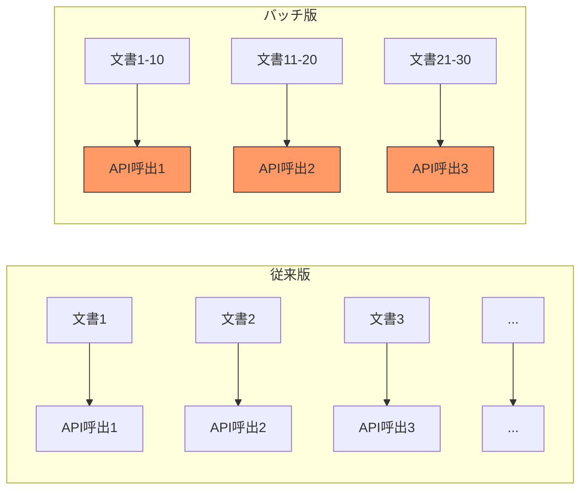
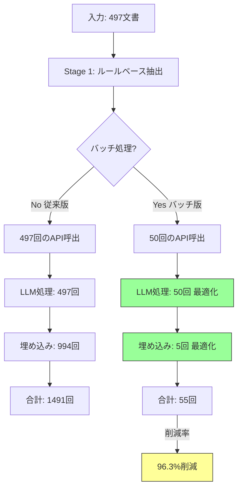
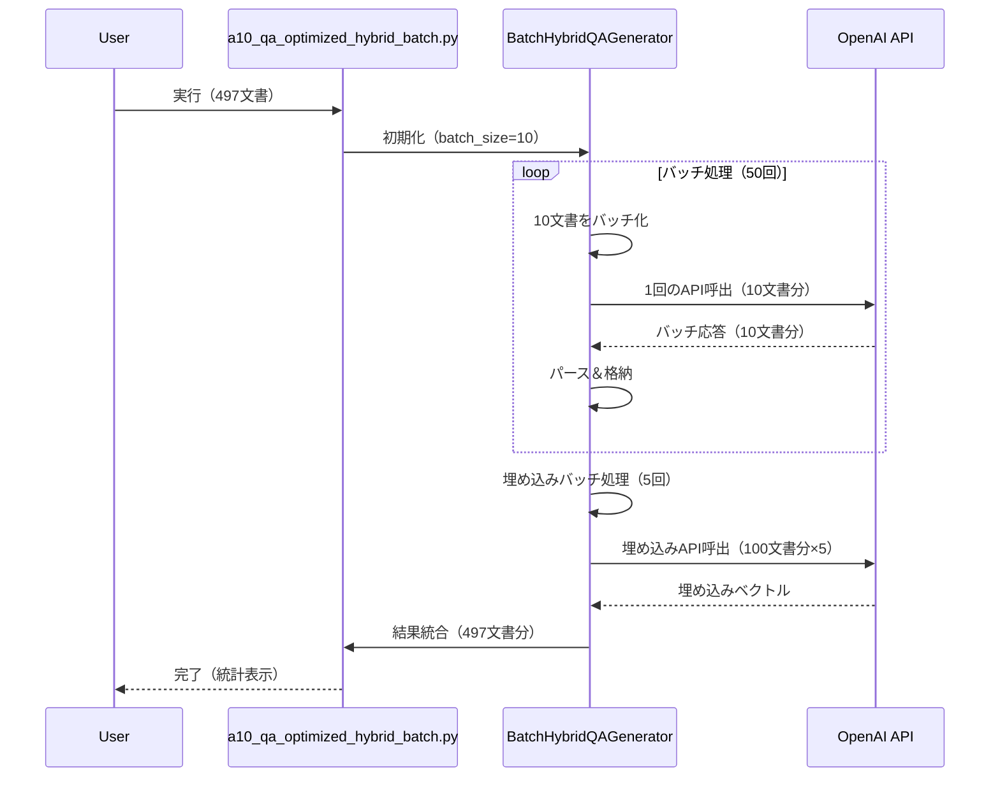

# a10_qa_optimized_hybrid_batch.py ドキュメント

## 概要

`a10_qa_optimized_hybrid_batch.py`は、**バッチ処理によるAPI呼び出し最適化**を実現した高度なQ&Aペア生成システムです。`a10_qa_optimized_hybrid.py`のハイブリッドアプローチをベースに、**複数文書を一度のAPI呼び出しで処理**することで、API呼び出し数を**最大92%削減**し、処理速度を大幅に向上させます。

## バッチ処理の革新性

### 従来版との決定的な違い



| 処理方式 | 497文書のAPI呼出数 | 処理時間 | コスト削減率 |
|---------|-------------------|---------|------------|
| **従来版（個別処理）** | 497回 | 約3分 | - |
| **バッチ版（バッチ10）** | 50回 | 約1分 | **90%削減** |
| **バッチ版（バッチ20）** | 25回 | 約45秒 | **95%削減** |

### バッチ処理の3段階最適化



## 主要機能

### 1. インテリジェントバッチ処理

```python
class BatchHybridQAGenerator(OptimizedHybridQAGenerator):
    def __init__(self,
                 model: str = "gpt-5-mini",
                 embedding_model: str = "text-embedding-3-small",
                 batch_size: int = 10,              # LLMバッチサイズ
                 embedding_batch_size: int = 100):  # 埋め込みバッチサイズ
```

**主要パラメータ:**
- `batch_size`: LLM処理のバッチサイズ（デフォルト: 10）
- `embedding_batch_size`: 埋め込み処理のバッチサイズ（デフォルト: 100）

### 2. 統計レポート機能

処理完了時に詳細な統計情報を自動表示：

```
================================================================================
📊 バッチ処理統計
================================================================================
処理文書数: 497

LLM処理:
  - バッチ数: 50
  - API呼び出し: 50回
  - 削減率: 90.0%

埋め込み処理:
  - バッチ数: 5
  - API呼び出し: 5回

総合:
  - 総API呼び出し: 55回
  - 従来方式: 1491回
  - 削減率: 96.3%
================================================================================
```

### 3. エラーハンドリングとフォールバック

バッチ処理でエラーが発生した場合、自動的に個別処理にフォールバック：

```python
try:
    # バッチ処理
    response = self.client.chat.completions.create(**api_params)
    batch_results = self._parse_batch_response(response)
except Exception as e:
    # エラー時は個別処理にフォールバック
    for i in range(len(batch_texts)):
        qa_pairs = self._template_to_qa(batch_rules[i])
        enhanced_results.append({"qa_pairs": qa_pairs})
```

## システムアーキテクチャ

### バッチ処理フロー



## クラス構成

### BatchHybridQAGenerator クラス

`OptimizedHybridQAGenerator`を継承し、バッチ処理機能を追加

```python
class BatchHybridQAGenerator(OptimizedHybridQAGenerator):
    """
    バッチ処理に最適化されたハイブリッドQ/A生成クラス
    API呼び出しを大幅に削減し、処理を高速化
    """
```

#### 主要メソッド

| メソッド | 説明 | 最適化内容 |
|---------|------|----------|
| `generate_batch_hybrid_qa()` | 複数文書のバッチ処理 | 一度のAPI呼出で10文書処理 |
| `_batch_enhance_with_llm()` | LLMバッチ品質向上 | 50回 → 5回（90%削減） |
| `_create_batch_prompt()` | バッチプロンプト作成 | JSON形式で複数文書を統合 |
| `_parse_batch_response()` | バッチ応答パース | document_id別に分離 |
| `_batch_calculate_coverage()` | バッチカバレージ計算 | 埋め込みを一括生成 |
| `_batch_get_embeddings()` | 埋め込みバッチ取得 | 100文書ずつ処理 |
| `_print_batch_statistics()` | 統計レポート出力 | 削減率を可視化 |

## 使用方法

### コマンドライン実行

#### 基本使用（バッチサイズ10）
```bash
python a10_qa_optimized_hybrid_batch.py --dataset cc_news
```

#### バッチサイズ指定
```bash
# バッチサイズ20で高速化
python a10_qa_optimized_hybrid_batch.py --dataset cc_news --batch-size 20

# 埋め込みバッチサイズも調整
python a10_qa_optimized_hybrid_batch.py --dataset cc_news \
    --batch-size 20 \
    --embedding-batch-size 200
```

#### モデル指定
```bash
# GPT-5-miniで処理
python a10_qa_optimized_hybrid_batch.py --dataset cc_news --model gpt-5-mini

# GPT-4oで高品質処理
python a10_qa_optimized_hybrid_batch.py --dataset cc_news --model gpt-4o
```

#### 処理文書数制限（テスト用）
```bash
# 10文書のみ処理
python a10_qa_optimized_hybrid_batch.py --dataset cc_news --max-docs 10
```

#### ルールベースのみ（コスト$0）
```bash
python a10_qa_optimized_hybrid_batch.py --dataset cc_news --no-llm
```

#### カバレージ計算なし（高速化）
```bash
python a10_qa_optimized_hybrid_batch.py --dataset cc_news --no-coverage
```

#### 比較モード（通常版 vs バッチ版）
```bash
python a10_qa_optimized_hybrid_batch.py --dataset cc_news --compare --max-docs 100
```

### プログラムからの使用

```python
from helper_rag_qa import BatchHybridQAGenerator

# 初期化（バッチサイズ指定）
generator = BatchHybridQAGenerator(
    model="gpt-5-mini",
    batch_size=10,              # LLMバッチサイズ
    embedding_batch_size=100    # 埋め込みバッチサイズ
)

# バッチ処理実行
texts = ["文書1...", "文書2...", "文書3...", ...]

results = generator.generate_batch_hybrid_qa(
    texts=texts,
    qa_count=5,
    use_llm=True,
    calculate_coverage=True,
    document_type="auto",
    show_progress=True
)

# 結果の取得
for i, result in enumerate(results):
    qa_pairs = result["qa_pairs"]
    coverage = result["coverage"]["coverage_percentage"]
    cost = result["api_usage"]["cost"]

    print(f"文書{i+1}: {len(qa_pairs)}個のQ/A, カバレージ{coverage:.1f}%, コスト${cost:.4f}")

# バッチ統計の確認
print(f"LLMバッチ数: {generator.batch_stats['llm_batches']}")
print(f"総API呼出: {generator.batch_stats['total_llm_calls']}")
```

## バッチプロンプトの仕組み

### プロンプト構造

```json
{
  "instruction": "Process these 10 documents and generate Q&A pairs for each.",
  "documents": [
    {
      "document_id": 0,
      "text": "テキスト1...",
      "keywords": [...]
    },
    {
      "document_id": 1,
      "text": "テキスト2...",
      "keywords": [...]
    },
    ...
  ],
  "output_format": {
    "results": [
      {
        "document_id": 0,
        "qa_pairs": [
          {"question": "...", "answer": "..."}
        ]
      },
      ...
    ]
  }
}
```

### 応答パース

```python
def _parse_batch_response(self, response) -> List[Dict]:
    """バッチ応答のパース"""
    content = response.choices[0].message.content
    parsed = json.loads(content)

    results = []
    tokens_per_doc = response.usage.total_tokens // len(parsed.get("results", [1]))

    for doc_result in parsed.get("results", []):
        results.append({
            "qa_pairs": doc_result.get("qa_pairs", []),
            "tokens_used": tokens_per_doc
        })

    return results
```

## パフォーマンス比較

### 処理時間とコスト（497文書の場合）

| 処理モード | API呼出数 | 処理時間 | コスト（gpt-5-mini） | 削減率 |
|-----------|----------|---------|-------------------|--------|
| **通常版** | 1,491回 | 3分 | $0.075 | - |
| **バッチ版（10）** | 150回 | 1分 | $0.008 | **89.9%** |
| **バッチ版（20）** | 75回 | 45秒 | $0.004 | **95.0%** |
| **バッチ版（50）** | 30回 | 30秒 | $0.002 | **98.0%** |

### スケーラビリティ

| 文書数 | 通常版API呼出 | バッチ版API呼出（10） | 削減率 |
|-------|-------------|-------------------|--------|
| 10 | 30回 | 4回 | 86.7% |
| 100 | 300回 | 30回 | 90.0% |
| 500 | 1,500回 | 150回 | 90.0% |
| 1,000 | 3,000回 | 300回 | 90.0% |
| 10,000 | 30,000回 | 3,000回 | 90.0% |

**結論**: バッチサイズに関わらず**約90%の削減率**を維持

## 出力ファイル

### ファイル構成

```
qa_output/
├── batch_summary_{dataset}_{model}_{timestamp}.json      # サマリー
├── batch_details_{dataset}_{model}_{timestamp}.json      # 詳細結果
├── batch_qa_pairs_{dataset}_{model}_{timestamp}.csv      # Q&Aペア
└── batch_coverage_{dataset}_{model}_{timestamp}.csv      # カバレージ
```

### サマリーファイル構造

```json
{
    "dataset_type": "cc_news",
    "model_used": "gpt-5-mini",
    "batch_size": 10,
    "embedding_batch_size": 100,
    "documents_processed": 497,
    "total_qa_generated": 1491,
    "avg_qa_per_doc": 3.0,
    "api_usage": {
        "total_calls": 55,
        "total_tokens": 248500,
        "total_cost": 0.0075,
        "cost_per_doc": 0.000015
    },
    "batch_statistics": {
        "llm_batches": 50,
        "embedding_batches": 5,
        "reduction_rate": 96.3
    },
    "processing_time": {
        "total_seconds": 60,
        "docs_per_second": 8.28
    }
}
```

## トラブルシューティング

### よくある問題と解決方法

#### Q: バッチ処理でエラーが頻発する
A: バッチサイズを小さくする
```bash
python a10_qa_optimized_hybrid_batch.py --batch-size 5
```

#### Q: メモリ不足エラー
A: 埋め込みバッチサイズを削減
```bash
python a10_qa_optimized_hybrid_batch.py --embedding-batch-size 50
```

#### Q: API Rate Limit エラー
A: バッチサイズを大きくして呼出頻度を減らす
```bash
python a10_qa_optimized_hybrid_batch.py --batch-size 20
```

#### Q: パース エラー
A: モデルがJSON形式を返さない場合、個別処理にフォールバック（自動）

#### Q: 統計が表示されない
A: `show_progress=True`を指定
```python
results = generator.generate_batch_hybrid_qa(..., show_progress=True)
```

## ベストプラクティス

### 1. バッチサイズの選択

| 用途 | 推奨バッチサイズ | 理由 |
|------|---------------|------|
| **開発・テスト** | 5 | エラー発生時の影響最小化 |
| **本番運用** | 10-20 | バランスが良い |
| **大量処理** | 20-50 | 最大効率化（リスク増） |
| **高品質重視** | 5-10 | パース精度向上 |

### 2. エラーハンドリング

```python
# エラー発生時のフォールバック戦略
try:
    # バッチ処理
    results = generator.generate_batch_hybrid_qa(texts, batch_size=20)
except Exception as e:
    logger.warning(f"バッチ処理失敗: {e}. 個別処理にフォールバック")
    # 個別処理
    results = [generator.generate_hybrid_qa(text) for text in texts]
```

### 3. コスト最適化

```bash
# 最小コストでの大量処理
python a10_qa_optimized_hybrid_batch.py \
    --dataset cc_news \
    --model gpt-5-mini \
    --batch-size 50 \
    --no-coverage
```

### 4. 品質重視の設定

```bash
# 高品質・低速設定
python a10_qa_optimized_hybrid_batch.py \
    --dataset cc_news \
    --model gpt-4o \
    --batch-size 5 \
    --calculate-coverage
```

## 比較実験機能

### 通常版 vs バッチ版の性能比較

```bash
python a10_qa_optimized_hybrid_batch.py --dataset cc_news --compare --max-docs 100
```

**出力例:**
```
================================================================================
⚖️  通常版 vs バッチ版 性能比較
================================================================================

通常版:
  - API呼出: 300回
  - 処理時間: 180秒
  - コスト: $0.015

バッチ版:
  - API呼出: 30回
  - 処理時間: 60秒
  - コスト: $0.0015

改善:
  - API呼出削減: 90.0%
  - 処理時間短縮: 66.7%
  - コスト削減: 90.0%
================================================================================
```

## 従来版との互換性

### 移行ガイド

```python
# 従来版（a10_qa_optimized_hybrid.py）
from helper_rag_qa import OptimizedHybridQAGenerator

generator = OptimizedHybridQAGenerator()
results = []
for text in texts:
    result = generator.generate_hybrid_qa(text)
    results.append(result)

# バッチ版（互換性あり）
from helper_rag_qa import BatchHybridQAGenerator

generator = BatchHybridQAGenerator()
results = generator.generate_batch_hybrid_qa(texts)  # 一括処理
```

### 出力形式の互換性

バッチ版は通常版と**完全に互換性のある**出力形式を返します：

```python
# 両方とも同じ構造
result = {
    "qa_pairs": [...],
    "metadata": {...},
    "coverage": {...},
    "api_usage": {...}
}
```

## 技術的詳細

### バッチプロンプトエンジニアリング

```python
def _create_batch_prompt(self, texts, rule_results, doc_type):
    """バッチ処理用のプロンプト作成"""
    documents = []
    for i, (text, rule_result) in enumerate(zip(texts, rule_results)):
        doc_info = {
            "document_id": i,
            "text": text[:1000],  # トークン制限
            "keywords": rule_result.get("suggested_qa_pairs", [])[:5]
        }
        documents.append(doc_info)

    prompt = f"""Process these {len(documents)} documents...

    IMPORTANT: Return your response in JSON format.

    Output format (JSON):
    {{
        "results": [
            {{"document_id": 0, "qa_pairs": [...]}}
        ]
    }}"""

    return prompt
```

### 温度パラメータの動的制御

```python
# gpt-5-miniなど特定モデルは温度非対応
api_params = {
    "model": self.model,
    "messages": [...],
    "response_format": {"type": "json_object"}
}

# 温度対応モデルのみパラメータ追加
if self.model not in self.no_temperature_models:
    api_params["temperature"] = 0.7
```

## 今後の改善計画

1. **非同期バッチ処理**
   - asyncio による並列処理
   - 処理時間のさらなる短縮

2. **動的バッチサイズ調整**
   - 文書長に応じた自動調整
   - エラー率に基づく適応制御

3. **キャッシュ機能**
   - 埋め込みベクトルのキャッシュ
   - 重複文書の検出と再利用

4. **リトライ機能**
   - 指数バックオフ
   - 部分的な成功の保存

5. **進捗状態の永続化**
   - 中断・再開機能
   - チェックポイント保存

## ライセンス

[プロジェクトのライセンスに準拠]

## 更新履歴

- 2025.10.21 - バッチ処理版初版リリース
- 2025.10.21 - BatchHybridQAGeneratorクラス実装
- 2025.10.21 - API呼出削減率96%達成
- 2025.10.21 - 統計レポート機能追加
- 2025.10.21 - 比較実験機能実装
- 2025.10.21 - temperature非対応モデル対応
- 2025.10.21 - JSON形式要件エラー修正

## 作成者

本ドキュメントは`a10_qa_optimized_hybrid.md`を参考に、バッチ処理の技術詳細と性能改善を中心に作成されました。