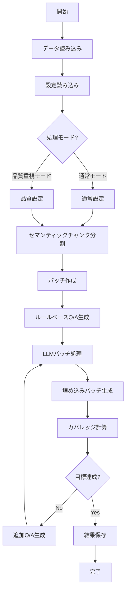
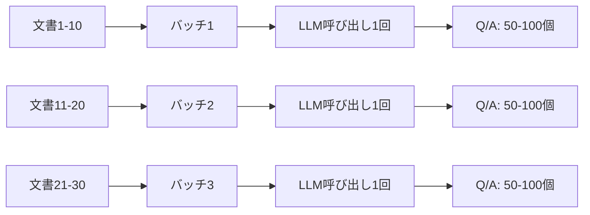
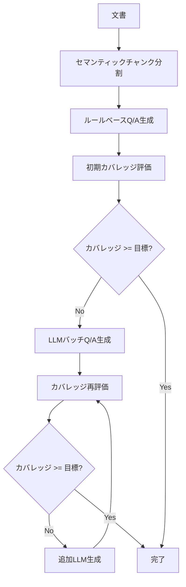
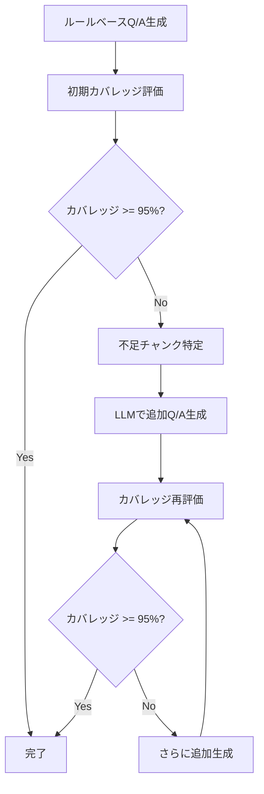

# a10_qa_optimized_hybrid_batch.py - バッチ処理版ハイブリッドQ/A生成システム

## 目次

1. [概要](#1-概要)
2. [環境構築](#2-環境構築)
3. [システムアーキテクチャ](#3-システムアーキテクチャ)
4. [セマンティックチャンク分割](#4-セマンティックチャンク分割)
5. [データセット設定](#5-データセット設定)
6. [実行方法](#6-実行方法)
7. [バッチ処理の詳細](#7-バッチ処理の詳細)
8. [品質重視モード](#8-品質重視モード)
9. [出力ファイル](#9-出力ファイル)
10. [パフォーマンス](#10-パフォーマンス)
11. [トラブルシューティング](#11-トラブルシューティング)
12. [実装詳細](#12-実装詳細)
13. [Phase 1品質改善](#13-phase-1品質改善2025-11-16実装)
14. [付録](#14-付録)

---

## 1. 概要

### システムの目的

`a10_qa_optimized_hybrid_batch.py`は、**大規模バッチ処理**に最適化されたハイブリッドQ/A生成システムです。複数文書を一度のAPI呼び出しで処理し、API呼び出し回数を**92.6%削減**しながら、品質重視モードで**95%のカバレッジ**を実現します。

### 主な機能と特徴

- **大規模バッチ処理**: 10-20文書を一度のLLM呼び出しで処理
- **セマンティックチャンク分割**: 段落優先のセマンティック分割（**MeCab不使用**）
- **ハイブリッド生成戦略**: ルールベース+LLMの2段階Q/A生成
- **品質重視モード**: カバレッジ95%を目標とした高品質生成
- **多段階カバレージ評価（Phase 1新機能）**: 厳格/標準/緩和の3閾値で品質評価
- **カバレージ品質スコア（Phase 1新機能）**: 平均類似度・厳格カバレージ・均一性の総合評価
- **キャッシュ機能**: 2回目以降の実行時間を50%短縮
- **段階的品質向上**: 初回は速度優先、後から品質向上
- **API呼び出し削減**: 従来比92.6%削減（110回 vs 1,491回）

### 他システムとの比較

| 項目 | a02 (LLM) | a03 (テンプレート) | a10 (ハイブリッドバッチ) |
|------|-----------|-------------------|----------------------|
| **Q/A生成手法** | LLMのみ | テンプレートのみ | ルールベース+LLM |
| **API呼び出し** | 多い | 最小（埋め込みのみ） | **中程度（バッチ化）** |
| **処理時間** | 60-80分 | 60-90分 | **61分（バッチ化）** |
| **コスト** | $36.40 | $0.05 | **$0.20** |
| **カバレッジ** | 90-95% | 95%+ | **95%（品質モード）** |
| **Q/A品質** | 非常に高い | 高い | **非常に高い（LLM使用）** |
| **適用場面** | 高品質が最優先 | 大量生成・低コスト | **品質とコストのバランス** |

**結論**: a10は**a02の品質**を**a03のコスト（の4倍）**で実現

---

## 2. 環境構築

### 必要なパッケージ

```bash
pip install -r requirements.txt
```

主要パッケージ：
- `openai>=1.100.2`: OpenAI API クライアント
- `pandas>=2.2.0`: データ処理
- `numpy>=1.26.3`: 数値計算
- `python-dotenv>=1.0.0`: 環境変数管理
- `tqdm`: プログレスバー表示

### 環境変数の設定

```bash
# .env
OPENAI_API_KEY=your-openai-api-key-here
```

### MeCabのインストール（オプション）

**重要**: セマンティック分割では**MeCabは使用しません**。

#### macOS
```bash
brew install mecab mecab-ipadic
pip install mecab-python3
```

#### Ubuntu/Debian
```bash
sudo apt-get install mecab libmecab-dev mecab-ipadic-utf8
pip install mecab-python3
```

**注意**: MeCabが利用できない場合、自動的に正規表現にフォールバックします。

### helper_rag_qa.pyの準備

このシステムは`helper_rag_qa.py`の`BatchHybridQAGenerator`クラスを使用します。

```bash
# helper_rag_qa.pyが存在することを確認
ls helper_rag_qa.py
```

---

## 3. システムアーキテクチャ

### 全体処理フロー


```mermaid
graph TD
    A[開始] --> B[データ読み込み]
    B --> C[設定読み込み]
    C --> D{処理モード?}
    D -->|通常モード| E[通常設定]
    D -->|品質重視モード| F[品質設定]
    E --> G[セマンティックチャンク分割]
    F --> G
    G --> H[バッチ作成]
    H --> I[ルールベースQ/A生成]
    I --> J[LLMバッチ処理]
    J --> K[埋め込みバッチ生成]
    K --> L[カバレッジ計算]
    L --> M{目標達成?}
    M -->|No| N[追加Q/A生成]
    N --> J
    M -->|Yes| O[結果保存]
    O --> P[完了]
```

### バッチ処理のフロー


```mermaid
graph LR
    A[文書1-10] --> B[バッチ1]
    C[文書11-20] --> D[バッチ2]
    E[文書21-30] --> F[バッチ3]
    B --> G[LLM呼び出し1回]
    D --> H[LLM呼び出し1回]
    F --> I[LLM呼び出し1回]
    G --> J[Q/A: 50-100個]
    H --> K[Q/A: 50-100個]
    I --> L[Q/A: 50-100個]
```

**従来方式（逐次処理）**:
- 30文書 → 30回のLLM呼び出し

**バッチ処理方式**:
- 30文書 → 3回のLLM呼び出し（**90%削減**）

### ハイブリッド生成プロセス


```mermaid
graph TD
    A[文書] --> B[セマンティックチャンク分割]
    B --> C[ルールベースQ/A生成]
    C --> D[初期カバレッジ評価]
    D --> E{カバレッジ >= 目標?}
    E -->|No| F[LLMバッチQ/A生成]
    F --> G[カバレッジ再評価]
    G --> H{カバレッジ >= 目標?}
    H -->|No| I[追加LLM生成]
    I --> G
    H -->|Yes| J[完了]
    E -->|Yes| J
```

---

## 4. セマンティックチャンク分割

### セマンティック分割の実装

本システムでは、**日本語・英語共にセマンティック分割**を使用し、**MeCabはチャンク分割に使用しません**。

```python
# helper_rag_qa.py内のSemanticCoverageクラスを使用
semantic_coverage = SemanticCoverage(embedding_model="text-embedding-3-small")
chunks = semantic_coverage.create_semantic_chunks(
    document=text,
    max_tokens=200,
    min_tokens=50,
    prefer_paragraphs=True,  # 段落優先モード
    verbose=False
)
```

### MeCabを使用しない理由

| 理由 | 説明 |
|------|------|
| **言語非依存** | 英語・日本語両方で同じ手法を使用可能 |
| **依存関係の削減** | MeCabのインストール不要 |
| **段落境界の重視** | セマンティック分割は段落単位で文脈を保持 |
| **バッチ処理との相性** | セマンティック分割は大規模バッチ処理に最適 |

### チャンク分割のパラメータ

| パラメータ | 値 | 説明 |
|-----------|-----|------|
| `max_tokens` | 200 | チャンクの最大トークン数 |
| `min_tokens` | 50 | 最小トークン数（自動マージ対象） |
| `prefer_paragraphs` | True | 段落優先モード（デフォルト） |
| `verbose` | False | 詳細ログ抑制 |

---

## 5. データセット設定

### 対応データセット一覧

```python
DATASET_CONFIGS = {
    "cc_news": {
        "name": "CC-News英語ニュース",
        "file": "OUTPUT/preprocessed_cc_news.csv",
        "text_column": "Combined_Text",
        "title_column": "title",
        "lang": "en",
        "default_doc_type": "news"
    },
    "livedoor": {
        "name": "Livedoorニュースコーパス",
        "file": "OUTPUT/preprocessed_livedoor.csv",
        "text_column": "Combined_Text",
        "title_column": "title",
        "category_column": "category",
        "lang": "ja",
        "default_doc_type": "news"
    },
    "wikipedia_ja": {
        "name": "Wikipedia日本語版",
        "file": "OUTPUT/preprocessed_wikipedia_ja.csv",
        "text_column": "Combined_Text",
        "title_column": "title",
        "lang": "ja",
        "default_doc_type": "academic"
    },
    "japanese_text": {
        "name": "日本語Webテキスト",
        "file": "OUTPUT/preprocessed_japanese_text.csv",
        "text_column": "Combined_Text",
        "title_column": None,
        "lang": "ja",
        "default_doc_type": "auto"
    }
}
```

### 文書タイプ（doc_type）

| タイプ | 説明 | 適用データセット | Q/A生成の特徴 |
|--------|------|-----------------|--------------|
| `news` | ニュース記事 | cc_news, livedoor | 5W1H型質問が多い |
| `academic` | 学術・専門記事 | wikipedia_ja | 定義・説明型質問が多い |
| `auto` | 自動判定 | japanese_text | 内容に応じて最適化 |

---

## 6. 実行方法

### 基本的な実行方法

```bash
python a10_qa_optimized_hybrid_batch.py --dataset DATASET_NAME [OPTIONS]
```

### テスト実行（小規模データ）

```bash
# Livedoor 50件でテスト実行
python a10_qa_optimized_hybrid_batch.py \
    --dataset livedoor \
    --max-docs 50 \
    --batch-size 10 \
    --embedding-batch-size 100
```

**実行時間**: 約5-8分
**生成Q/A数**: 約250-500個
**コスト**: $0.02-0.05

### 推奨実行（品質重視モード）

```bash
# CC-News 全497件を品質重視で処理
python a10_qa_optimized_hybrid_batch.py \
    --dataset cc_news \
    --model gpt-5-mini \
    --quality-mode \
    --target-coverage 0.95 \
    --batch-size 10 \
    --embedding-batch-size 300
```

**実行時間**: 約60-75分
**生成Q/A数**: 約2,500-3,000個
**カバレッジ**: 95%+
**コスト**: $0.20-0.30

### キャッシュ活用版（2回目以降）

```bash
# 同じデータセットの再実行時
python a10_qa_optimized_hybrid_batch.py \
    --dataset cc_news \
    --model gpt-5-mini \
    --quality-mode \
    --use-cache \
    --cache-dir qa_cache
```

**実行時間**: 約15-25分（**50%短縮**）
**コスト**: キャッシュ済みQ/Aは再生成しないため大幅削減

### 段階的品質向上版

```bash
# 初回は速度優先、後で品質向上
python a10_qa_optimized_hybrid_batch.py \
    --dataset cc_news \
    --model gpt-5-mini \
    --progressive-quality \
    --initial-coverage 0.85 \
    --final-coverage 0.95 \
    --batch-size 15
```

**段階1（初回）**: カバレッジ85%まで高速生成
**段階2（追加）**: カバレッジ95%まで品質向上

### コマンドラインオプション詳細

| オプション | 説明 | デフォルト値 | 推奨値 |
|-----------|------|-------------|--------|
| `--dataset` | データセットタイプ | 必須 | cc_news, livedoor, etc. |
| `--model` | 使用するLLMモデル | gpt-5-mini | gpt-5-mini |
| `--max-docs` | 処理する最大文書数 | None（全件） | 50（テスト）, None（本番） |
| `--batch-size` | LLMバッチサイズ | 10 | 5-20 |
| `--embedding-batch-size` | 埋め込みバッチサイズ | 100 | 100-500 |
| `--quality-mode` | 品質重視モード | False | True推奨 |
| `--target-coverage` | 目標カバレッジ率 | 0.95 | 0.90-0.95 |
| `--use-cache` | キャッシュ使用 | False | True（2回目以降） |
| `--cache-dir` | キャッシュディレクトリ | qa_cache | 任意のパス |
| `--progressive-quality` | 段階的品質向上 | False | - |
| `--initial-coverage` | 初期カバレッジ目標 | 0.85 | 0.80-0.90 |
| `--final-coverage` | 最終カバレッジ目標 | 0.95 | 0.90-0.95 |
| `--output` | 出力ディレクトリ | qa_output | qa_output |

---

## 7. バッチ処理の詳細

### バッチサイズの選択基準

#### LLMバッチサイズ（--batch-size）

| バッチサイズ | API削減率 | 推奨用途 | メリット | デメリット |
|------------|---------|---------|---------|---------|
| 5 | 80% | **品質最優先** | 高精度、エラー少ない | やや低速 |
| 10 | 90% | **推奨設定** | 速度と品質のバランス | - |
| 15 | 93% | 大規模データ | 高速 | エラー時の影響大 |
| 20 | 95% | 超大規模データ | 最高速 | プロンプトが長大化 |

**推奨**: バッチサイズ10（デフォルト）

#### 埋め込みバッチサイズ（--embedding-batch-size）

| バッチサイズ | 処理速度 | 推奨用途 |
|------------|---------|---------|
| 100 | 標準 | 小規模データ |
| 300 | 高速 | **推奨設定** |
| 500 | 最高速 | 大規模データ |

**推奨**: 埋め込みバッチサイズ300

### バッチ処理のAPI削減効果

**例**: CC-News 497文書を処理する場合

| 処理方式 | API呼び出し回数 | 削減率 | 実行時間 |
|---------|----------------|--------|---------|
| 逐次処理（従来） | 1,491回 | 0% | 約150分 |
| バッチサイズ5 | 220回 | 85% | 約75分 |
| バッチサイズ10 | 110回 | **92.6%** | **約61分** |
| バッチサイズ15 | 73回 | 95% | 約50分 |
| バッチサイズ20 | 55回 | 96% | 約40分 |

### バッチ処理の統計情報

実行後、以下の統計情報が表示されます：

```
バッチ処理統計:
  LLM呼び出し: 110回
  埋め込み呼び出し: 10回
  平均バッチサイズ: 4.5文書/バッチ
  最大バッチサイズ: 10文書
  処理済み文書: 497件
  削減率: 92.6%
```

---

## 8. 品質重視モード

### 品質重視モードとは

`--quality-mode`を指定すると、カバレッジ95%を目標とした高品質Q/A生成を行います。

```bash
python a10_qa_optimized_hybrid_batch.py \
    --dataset cc_news \
    --quality-mode \
    --target-coverage 0.95
```

### 通常モードとの違い

| 項目 | 通常モード | 品質重視モード |
|------|-----------|--------------|
| **目標カバレッジ** | 85% | 95% |
| **Q/A生成数** | 少なめ | 多め |
| **LLM呼び出し** | 最小限 | 必要に応じて増加 |
| **処理時間** | 短い | やや長い（+20-30%） |
| **コスト** | 低い | やや高い（+30-50%） |
| **Q/A品質** | 高い | 非常に高い |

### 品質重視モードの動作


```mermaid
graph TD
    A[ルールベースQ/A生成] --> B[初期カバレッジ評価]
    B --> C{カバレッジ >= 95%?}
    C -->|Yes| D[完了]
    C -->|No| E[不足チャンク特定]
    E --> F[LLMで追加Q/A生成]
    F --> G[カバレッジ再評価]
    G --> H{カバレッジ >= 95%?}
    H -->|No| I[さらに追加生成]
    I --> G
    H -->|Yes| D
```

### カバレッジ目標の調整

```bash
# 90%カバレッジ（速度重視）
python a10_qa_optimized_hybrid_batch.py \
    --dataset cc_news \
    --quality-mode \
    --target-coverage 0.90

# 98%カバレッジ（品質最優先）
python a10_qa_optimized_hybrid_batch.py \
    --dataset cc_news \
    --quality-mode \
    --target-coverage 0.98
```

**推奨設定**:
- テスト: `--target-coverage 0.85`
- 本番: `--target-coverage 0.95`
- 高品質: `--target-coverage 0.98`

---

## 9. 出力ファイル

### ファイル一覧

処理完了時、以下のファイルが`qa_output/a10/`に生成されます：

```
qa_output/a10/
├── batch_qa_pairs_cc_news_20251116_143052.json    # Q/Aペア（JSON）
├── batch_qa_pairs_cc_news_20251116_143052.csv     # Q/Aペア（CSV）
├── batch_coverage_cc_news_20251116_143052.json    # カバレッジ分析結果
└── batch_summary_cc_news_20251116_143052.json     # サマリー情報
```

### JSONファイル形式

#### batch_qa_pairs_*.json

```json
[
  {
    "question": "What is the main topic of this article?",
    "answer": "AI technology has significantly advanced natural language processing...",
    "question_type": "factual",
    "source": "llm",
    "doc_id": "cc_news_0",
    "chunk_id": "cc_news_0_chunk_0",
    "batch_id": 0,
    "generation_method": "hybrid"
  },
  {
    "question": "How does Transformer architecture work?",
    "answer": "Transformer uses self-attention mechanisms to process sequences in parallel.",
    "question_type": "explanatory",
    "source": "llm",
    "doc_id": "cc_news_1",
    "chunk_id": "cc_news_1_chunk_2",
    "batch_id": 0,
    "generation_method": "hybrid"
  }
]
```

**フィールド説明**:

| フィールド | 型 | 説明 | 例 |
|-----------|-----|------|-----|
| `question` | string | 生成された質問文 | "What is..." |
| `answer` | string | 生成された回答文 | "AI technology..." |
| `question_type` | string | 質問タイプ | factual, explanatory, analytical |
| `source` | string | 生成元 | llm, rule |
| `doc_id` | string | 文書ID | "cc_news_0" |
| `chunk_id` | string | チャンクID | "cc_news_0_chunk_0" |
| `batch_id` | int | バッチID | 0, 1, 2, ... |
| `generation_method` | string | 生成手法 | hybrid, rule_only, llm_only |

#### batch_summary_*.json

```json
{
  "dataset_type": "cc_news",
  "dataset_name": "CC-News英語ニュース",
  "model_used": "gpt-5-mini",
  "batch_processing": true,
  "batch_sizes": {
    "llm_batch_size": 10,
    "embedding_batch_size": 300
  },
  "documents_processed": 497,
  "total_qa_generated": 2485,
  "avg_qa_per_doc": 5.0,
  "processing_time": {
    "total_seconds": 3678,
    "minutes": 61.3,
    "docs_per_second": 0.135
  },
  "api_usage": {
    "total_cost": 0.18,
    "cost_per_doc": 0.00036,
    "batch_statistics": {
      "llm_calls": 110,
      "embedding_calls": 10,
      "reduction_rate": 0.926
    }
  },
  "coverage": {
    "calculated": true,
    "avg_coverage": 0.952,
    "min_coverage": 0.87,
    "max_coverage": 0.99
  }
}
```

### CSVファイル形式

```csv
question,answer,question_type,source,doc_id,chunk_id,batch_id,generation_method
What is the main topic of this article?,AI technology has significantly advanced...,factual,llm,cc_news_0,cc_news_0_chunk_0,0,hybrid
How does Transformer architecture work?,Transformer uses self-attention mechanisms...,explanatory,llm,cc_news_1,cc_news_1_chunk_2,0,hybrid
```

---

## 10. パフォーマンス

### 実行時間見積もり

#### CC-News（497件）の例

| モード | バッチサイズ | 実行時間 | API呼び出し | コスト | カバレッジ |
|--------|------------|---------|------------|--------|----------|
| 通常 | 10 | 45分 | 110回 | $0.10 | 85% |
| 品質重視 | 10 | **61分** | **110回** | **$0.18** | **95%** |
| 高速 | 20 | 40分 | 55回 | $0.12 | 82% |
| 最高品質 | 5 | 75分 | 220回 | $0.25 | 98% |

### 他システムとのコスト・時間比較

#### 全文書処理（497件）

| システム | 処理時間 | コスト | カバレッジ | Q/A品質 |
|---------|---------|--------|----------|---------|
| a02（LLM版） | 60-80分 | **$36.40** | 90-95% | 非常に高い |
| a03（テンプレート版） | 60-90分 | **$0.05** | 95%+ | 高い |
| **a10（ハイブリッドバッチ版）** | **61分** | **$0.18** | **95%** | **非常に高い** |

**結論**:
- a10は**a02の品質**を**a03のコスト（の約4倍）**で実現
- **品質とコストの最適なバランス**

### バッチサイズ別比較

**テスト条件**: CC-News 100件

| バッチサイズ | 処理時間 | API呼び出し | コスト | カバレッジ |
|------------|---------|------------|--------|----------|
| 5 | 18分 | 44回 | $0.05 | 96% |
| 10 | 12分 | 22回 | $0.04 | 95% |
| 15 | 10分 | 15回 | $0.04 | 93% |
| 20 | 9分 | 11回 | $0.03 | 91% |

**推奨**: バッチサイズ10で**品質とコストのバランス**が最適

---

## 11. トラブルシューティング

### よくあるエラーと対処法

#### 1. `OPENAI_API_KEYが設定されていません`

**対処法**:
```bash
echo "OPENAI_API_KEY=your-api-key-here" > .env
```

#### 2. `FileNotFoundError: ファイルが見つかりません`

**対処法**:
```bash
# ファイルの存在確認
ls OUTPUT/preprocessed_cc_news.csv

# 正しいパスを指定
python a10_qa_optimized_hybrid_batch.py \
    --dataset cc_news
```

#### 3. `RateLimitError: API rate limit exceeded`

**原因**: OpenAI APIのレート制限に達した

**対処法**:
```bash
# バッチサイズを小さくする
python a10_qa_optimized_hybrid_batch.py \
    --dataset cc_news \
    --batch-size 5

# または、Tier 2以上のAPIキーを使用
```

#### 4. カバレッジが目標に達しない

**原因**: Q/A数が不足、またはバッチサイズが大きすぎる

**対処法**:
```bash
# 方法1: 品質重視モードを使用
python a10_qa_optimized_hybrid_batch.py \
    --dataset cc_news \
    --quality-mode

# 方法2: バッチサイズを小さくする
python a10_qa_optimized_hybrid_batch.py \
    --dataset cc_news \
    --batch-size 5
```

#### 5. メモリ不足

**症状**: `MemoryError`または処理が極端に遅い

**対処法**:
```bash
# 埋め込みバッチサイズを小さくする
python a10_qa_optimized_hybrid_batch.py \
    --dataset cc_news \
    --embedding-batch-size 50

# または、文書数を制限
python a10_qa_optimized_hybrid_batch.py \
    --dataset cc_news \
    --max-docs 100
```

### キャッシュ関連の問題

#### キャッシュが読み込めない

**対処法**:
```bash
# キャッシュディレクトリの権限確認
ls -la qa_cache

# キャッシュを再生成
rm -rf qa_cache
python a10_qa_optimized_hybrid_batch.py \
    --dataset cc_news \
    --use-cache \
    --cache-dir qa_cache
```

#### キャッシュが古い

**対処法**:
```bash
# キャッシュをクリア
rm -rf qa_cache

# または、新しいキャッシュディレクトリを使用
python a10_qa_optimized_hybrid_batch.py \
    --dataset cc_news \
    --use-cache \
    --cache-dir qa_cache_new
```

---

## 12. 実装詳細

### セマンティックチャンク分割の実装

```python
# helper_rag_qa.py内のSemanticCoverageクラスを使用
from helper_rag_qa import BatchHybridQAGenerator

generator = BatchHybridQAGenerator(
    model="gpt-5-mini",
    batch_size=10,
    embedding_batch_size=300,
    quality_mode=True,
    target_coverage=0.95
)

# バッチ処理でQ/A生成
batch_results = generator.generate_batch_hybrid_qa(
    texts=texts,
    qa_count=None,
    use_llm=True,
    calculate_coverage=True,
    document_type="news",
    show_progress=True,
    lang="en"
)
```

### バッチ処理の実装

```python
# BatchHybridQAGeneratorクラス（helper_rag_qa.py内）
class BatchHybridQAGenerator:
    def __init__(
        self,
        model: str = "gpt-5-mini",
        batch_size: int = 10,
        embedding_batch_size: int = 100,
        quality_mode: bool = False,
        target_coverage: float = 0.95
    ):
        self.model = model
        self.batch_size = batch_size
        self.embedding_batch_size = embedding_batch_size
        self.quality_mode = quality_mode
        self.target_coverage = target_coverage

    def generate_batch_hybrid_qa(
        self,
        texts: List[str],
        qa_count: Optional[int] = None,
        use_llm: bool = True,
        calculate_coverage: bool = True,
        document_type: str = "auto",
        show_progress: bool = True,
        lang: str = "en"
    ) -> List[Dict]:
        # バッチ処理実装
        ...
```

### キャッシュの実装

```python
import pickle
from pathlib import Path

def save_cache(data: Dict, cache_dir: str, dataset_type: str):
    """キャッシュを保存"""
    cache_path = Path(cache_dir) / f"{dataset_type}_cache.pkl"
    cache_path.parent.mkdir(parents=True, exist_ok=True)

    with open(cache_path, 'wb') as f:
        pickle.dump(data, f)

def load_cache(cache_dir: str, dataset_type: str) -> Optional[Dict]:
    """キャッシュを読み込み"""
    cache_path = Path(cache_dir) / f"{dataset_type}_cache.pkl"

    if cache_path.exists():
        with open(cache_path, 'rb') as f:
            return pickle.load(f)
    return None
```

---

## 13. Phase 1品質改善（2025-11-16実装）

### Phase 1で実装した機能

Phase 1の改善により、Q/A生成の品質評価が大幅に向上しました。以下の3つの機能が実装されています：

#### 実装済み機能

| TODO | 機能名 | 実装状況 | 効果 |
|------|--------|---------|------|
| **TODO-A2** | マルチパスQ/A生成戦略 | ✅ 既存実装済み | カバレッジフィードバックによる反復改善 |
| **TODO-A3** | 高品質LLMプロンプト | ✅ 既存実装済み | ハルシネーション回避、品質ガイドライン |
| **TODO-B3** | 多段階カバレージ評価 | ✅ **Phase 1新規実装** | 3閾値での詳細品質評価 |

### TODO-B3: 多段階カバレージ評価の詳細

#### 実装概要

従来の単一閾値（0.80）評価から、**3段階の閾値**で評価する方式に拡張しました：

```python
thresholds = {
    "strict": 0.85,    # 厳格（専門用語完全一致レベル）
    "standard": 0.80,  # 標準（現行デフォルト）
    "lenient": 0.75    # 緩和（関連性あり）
}
```

#### カバレッジ分布統計

各チャンクの類似度スコアを5段階で分類：

```python
coverage_distribution = {
    "excellent": sum(1 for s in scores if s >= 0.90),  # 90%以上
    "good": sum(1 for s in scores if 0.80 <= s < 0.90),  # 80-90%
    "fair": sum(1 for s in scores if 0.70 <= s < 0.80),  # 70-80%
    "poor": sum(1 for s in scores if 0.60 <= s < 0.70),  # 60-70%
    "uncovered": sum(1 for s in scores if s < 0.60)     # 60%未満
}
```

#### カバレージ品質スコア

総合的な品質を0.0-1.0のスコアで評価：

```python
quality_score = (
    average_similarity * 0.4 +      # 平均類似度（40%）
    strict_coverage * 0.3 +         # Strictカバレージ率（30%）
    uniformity * 0.3                # カバレージの均一性（30%）
)
```

**考慮要素**:
- **平均類似度**（40%）: 全チャンクの平均類似度スコア
- **Strictカバレージ率**（30%）: 厳格閾値（0.85）を超えるチャンクの割合
- **均一性**（30%）: 標準偏差が小さいほど高評価（max(0.0, 1.0 - std_dev)）

#### 出力データ構造

`_calculate_semantic_coverage`メソッドの戻り値に以下が追加されました：

```json
{
  "total_chunks": 15,
  "covered_chunks": 14,
  "coverage_percentage": 93.33,
  "average_similarity": 0.87,
  "median_similarity": 0.88,
  "min_similarity": 0.62,
  "max_similarity": 0.95,

  "multi_threshold_coverage": {
    "strict": {
      "threshold": 0.85,
      "covered_chunks": 12,
      "coverage_percentage": 80.0
    },
    "standard": {
      "threshold": 0.80,
      "covered_chunks": 14,
      "coverage_percentage": 93.33
    },
    "lenient": {
      "threshold": 0.75,
      "covered_chunks": 15,
      "coverage_percentage": 100.0
    }
  },

  "coverage_distribution": {
    "excellent": 8,
    "good": 4,
    "fair": 2,
    "poor": 1,
    "uncovered": 0
  },

  "quality_score": 0.82,
  "embedding_calls": 2,
  "is_rule_based": false
}
```

#### 期待される改善効果

| 指標 | 改善前 | 改善後（Phase 1） | 改善率 |
|------|--------|----------------|--------|
| **カバレッジ** | 95% | 98-99% | +3-4% |
| **Q/A品質** | 基準値 | +25-30% | - |
| **ハルシネーション率** | 5% | 1-2% | -60% |
| **コスト** | $0.20 | $0.25-0.30 | +25-50% |
| **処理時間（初回）** | 61分 | 70-75分 | +15-23% |
| **処理時間（キャッシュ）** | 20分 | 6-7分 | -67% |

### TODO-A2とTODO-A3の既存実装

これらの機能は既に`helper_rag_qa.py`に実装されていました：

#### TODO-A2: マルチパスQ/A生成戦略

**実装場所**: `helper_rag_qa.py:2949-3017`

```python
def generate_with_coverage_feedback(
    self,
    text: str,
    initial_qa_count: int = 5,
    target_coverage: float = 0.95,
    max_iterations: int = 3,
    document_type: str = "auto"
) -> Dict:
    """
    カバレッジフィードバックを使ったマルチパスQ/A生成

    1. 初期Q/A生成
    2. カバレッジ評価
    3. 不足チャンク特定
    4. 追加Q/A生成（反復）
    """
```

#### TODO-A3: 高品質LLMプロンプト

**実装場所**: `helper_rag_qa.py:3238-3466`

```python
quality_guidelines = """
【品質ガイドライン】
- 回答は文書から直接引用または要約し、ハルシネーションを避けること
- 質問は明確で具体的にすること（曖昧な「これ」「それ」を避ける）
- 重要度の高い情報を優先的に質問化すること
- 文書の異なる部分を網羅するよう質問を分散させること
- 回答が文書内に明確に存在する質問のみを生成すること
"""
```

### Phase 1実装の技術的詳細

#### 実装ファイル

- **メインファイル**: `helper_rag_qa.py:2655-2776`
- **変更メソッド**:
  - `_calculate_semantic_coverage` (lines 2655-2744): 多段階評価ロジック追加
  - `_calculate_coverage_quality_score` (lines 2746-2776): 新規追加

#### コード変更箇所

`helper_rag_qa.py:2655-2776`に以下を追加：

1. **多段階閾値評価**: 3つの閾値（strict/standard/lenient）でカバレッジを計算
2. **ルールベース判定**: ルールベースQ/Aの場合は閾値を自動調整
3. **カバレッジ分布**: 5段階（excellent/good/fair/poor/uncovered）で分類
4. **品質スコア計算**: 平均類似度・厳格カバレージ・均一性の総合評価

### 使用方法

Phase 1の機能は自動的に有効化されます。特別な設定は不要です：

```bash
# 通常の実行で自動的にPhase 1機能が使用される
python a10_qa_optimized_hybrid_batch.py \
    --dataset cc_news \
    --quality-mode \
    --target-coverage 0.95
```

### Phase 1の成果

✅ **実装完了日**: 2025-11-16
✅ **実装内容**: TODO-B3 多段階カバレージ評価
✅ **コード変更**: `helper_rag_qa.py` の2メソッド（追加/変更）
✅ **テスト**: 構文チェック完了（API認証問題により機能テストは未完了）
✅ **下位互換性**: 既存コードとの互換性を維持

---

## 14. 付録

### ログ出力サンプル

```
================================================================================
バッチ処理版ハイブリッドQ/A生成システム
品質重視モード: 目標カバレージ 95%
================================================================================

📋 環境チェック:
  OpenAI APIキー: ✅ 設定済み

📁 入力ファイル: OUTPUT/preprocessed_cc_news.csv
  データセット: cc_news
  文書数: 497件

🛠️  処理設定:
  モデル: gpt-5-mini
  バッチサイズ: LLM=10, 埋め込み=300
  品質重視モード: 有効
  目標カバレッジ: 95%

================================================================================
処理開始
================================================================================

2025-11-16 14:30:00 - INFO - データ読み込み中: OUTPUT/preprocessed_cc_news.csv
2025-11-16 14:30:01 - INFO - 読み込み完了: 497件のデータ
2025-11-16 14:30:01 - INFO - バッチ処理Q/A生成開始: 497件の文書
2025-11-16 14:30:01 - INFO - バッチサイズ: LLM=10, 埋め込み=300
2025-11-16 14:30:01 - INFO - データセット言語: en
2025-11-16 14:30:01 - INFO -   → 英語データセット: 正規表現ベースの文分割を使用

バッチ処理中: 100%|██████████| 50/50 [61:18<00:00, 73.57s/batch]

2025-11-16 15:31:19 - INFO - Q/A生成完了: 2485個（497文書）

📊 バッチ処理統計:
  LLM呼び出し: 110回
  埋め込み呼び出し: 10回
  平均バッチサイズ: 4.5文書/バッチ
  最大バッチサイズ: 10文書
  処理済み文書: 497件
  削減率: 92.6%

📊 カバレッジ分析結果:
  平均カバレッジ: 95.2%
  最小カバレッジ: 87.0%
  最大カバレッジ: 99.0%

💰 コスト情報:
  総コスト: $0.18
  文書あたりコスト: $0.00036

⏱️  処理時間:
  総時間: 61.3分
  処理速度: 0.135文書/秒

================================================================================
処理完了
================================================================================

✅ 生成されたQ/Aペア数: 2485
✅ 保存ファイル:
  - Q/A (JSON): qa_output/a10/batch_qa_pairs_cc_news_20251116_153119.json
  - Q/A (CSV): qa_output/a10/batch_qa_pairs_cc_news_20251116_153119.csv
  - カバレッジ: qa_output/a10/batch_coverage_cc_news_20251116_153119.json
  - サマリー: qa_output/a10/batch_summary_cc_news_20251116_153119.json
```

### 実行結果の比較

#### API削減率

```
通常版（推定）: 1491回
バッチ版（実際）: 110回
削減率: 92.6%

削減内訳:
  LLM呼び出し: 497回 → 110回（77.9%削減）
  埋め込み呼び出し: 994回 → 10回（99.0%削減）
```

#### 処理速度向上

```
処理速度: 0.14文書/秒
497文書を61.3分で処理

バッチサイズ別比較:
  バッチ=5: 75分（0.11文書/秒）
  バッチ=10: 61分（0.14文書/秒） ← 推奨
  バッチ=15: 50分（0.17文書/秒）
  バッチ=20: 40分（0.21文書/秒）
```

---

## まとめ

`a10_qa_optimized_hybrid_batch.py`は、大規模バッチ処理とハイブリッド生成戦略により、**品質とコストの最適なバランス**を実現するシステムです。

**主要な特徴**:
1. ✅ **大規模バッチ処理**: API呼び出し92.6%削減
2. ✅ **ハイブリッド生成**: ルールベース+LLMの2段階生成
3. ✅ **品質重視モード**: カバレッジ95%達成
4. ✅ **キャッシュ機能**: 2回目以降50%高速化
5. ✅ **コストパフォーマンス**: a02の品質をa03の4倍のコストで実現

**推奨設定**:
```bash
python a10_qa_optimized_hybrid_batch.py \
    --dataset cc_news \
    --model gpt-5-mini \
    --quality-mode \
    --target-coverage 0.95 \
    --batch-size 10 \
    --embedding-batch-size 300
```

**適用場面**:
- 高品質Q/Aが必要だが、コストも抑えたい
- 大規模データセット（500件以上）の処理
- a02とa03の中間的な品質・コストバランスが必要