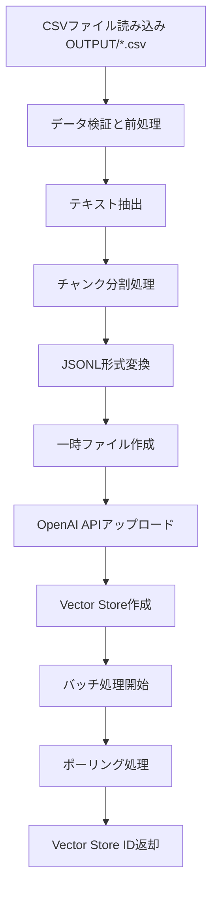

# a31_make_cloud_vector_store_vsid.py 技術仕様書

最終更新日: 2024-10-29

## 概要

OpenAI Vector Storeを作成・管理するためのStreamlitアプリケーション。複数のデータセットを個別または統合してVector Store化し、RAGシステムで利用可能な形式に変換する。

## ファイル情報

- **ファイル名**: a31_make_cloud_vector_store_vsid.py
- **行数**: 1441行
- **主要機能**: Vector Store作成、データセット管理、統合処理

## 主な機能

### 1. 個別Vector Store作成
- 5種類のデータセットから個別にVector Storeを作成
- データセット種別:
  - `cc_news`: CCニュースQ&A
  - `wiki`: Wikipedia Q&A
  - `mqa`: 医療QA
  - `customer_support_faq`: カスタマーサポート
  - `llama3_news`: LLaMA3ニュース

### 2. 統合Vector Store作成
- 複数のデータセットを1つのVector Storeに統合
- データセット別統計情報の収集
- データセット横断検索が可能

### 3. Vector Store管理
- 既存Vector Storeの一覧表示
- ファイル状況の確認
- ストレージ使用量の監視

## アーキテクチャ

### クラス構成

```
VectorStoreConfig (L48-178)
├── データセット設定管理
├── チャンク設定
└── ファイルパス管理

VectorStoreProcessor (L184-477)
├── データ読み込み・検証
├── チャンク生成
└── JSONL形式変換

VectorStoreManager (L483-768)
├── OpenAI API連携
├── Vector Store作成
└── データセット処理

VectorStoreUI (L774-1014)
├── Streamlit UI管理
├── 結果表示
└── ファイル状況管理
```

## 主要クラス

### 1. VectorStoreConfig (L48-178)

Vector Store作成のための設定管理クラス。

```python
@dataclass
class VectorStoreConfig:
    dataset_type: str        # データセット種別
    filename: str            # 入力ファイル名
    store_name: str         # Vector Store名
    chunk_size: int         # チャンクサイズ
    overlap: int            # オーバーラップサイズ
    description: str        # データセット説明
    max_file_size_mb: float # 最大ファイルサイズ
    max_chunks_per_file: int # 最大チャンク数
```

**静的メソッド**:
- `get_config(dataset_type: str)` (L66-75): 特定データセットの設定取得
- `get_all_configs()` (L77-108): 全データセット設定を辞書形式で返す
- `get_unified_config()` (L110-178): 統合データセット用設定取得

### 2. VectorStoreProcessor (L184-477)

データ処理とJSONL形式への変換を担当。

**主要メソッド**:

#### read_csv_file (L190-237)
CSVファイル読み込みと検証。
```python
def read_csv_file(filepath: Path) -> Tuple[List[Dict], Dict]
```
- エンコーディング自動検出 (L195-199)
- 必須カラム検証 (L206-215)
- データ統計収集 (L222-235)

#### validate_data (L239-276)
データ検証と前処理。
- 空文字列・欠損値除去 (L248-254)
- 重複除去 (L256-259)
- テキスト長チェック (L261-270)

#### create_chunks (L278-319)
テキストのチャンク分割。
```python
def create_chunks(
    text: str,
    chunk_size: int,
    overlap: int
) -> List[str]
```
- 単語境界でのチャンク分割 (L293-313)
- オーバーラップ処理 (L309-311)

#### convert_to_jsonl (L321-477)
データセット別のJSONL変換処理。

### 3. VectorStoreManager (L483-768)

OpenAI APIとの連携とVector Store管理。

**初期化** (L486-492):
```python
def __init__(self):
    self.client = OpenAI()  # OpenAI クライアント
    self.created_stores = {}  # 作成済みStore管理
```

#### create_vector_store_from_jsonl_data (L494-578)
JSONL データからVector Store作成。

処理フロー:
1. 一時ファイル作成 (L502-510)
2. JSONLデータ書き込み (L512-514)
3. Vector Store作成 (L517-520)
4. ファイルアップロード (L523-527)
5. バッチ処理 (L530-551)
6. ポーリング処理 (L553-568)

#### process_unified_datasets (L580-618)
複数データセットの統合処理。

#### process_single_dataset (L620-746)
個別データセット処理。

処理ステップ:
1. データ読み込み (L633-643)
2. JSONL変換 (L646-658)
3. サイズチェックと制限 (L661-715)
4. Vector Store作成 (L718-722)

### 4. VectorStoreUI (L774-1014)

Streamlit UIの管理。

#### setup_sidebar (L798-832)
サイドバー設定とモデル選択。

#### display_dataset_selection (L834-866)
データセット選択UI。

#### display_results (L903-971)
処理結果の表示。

#### display_existing_stores (L973-1013)
既存Vector Store一覧表示。

## データフロー



### データセット別処理 (L342-430)

**cc_news/wiki** (L342-365):
```python
{
    "custom_id": f"{dataset_type}_{idx}",
    "text": f"Question: {q}\nAnswer: {a}"
}
```

**mqa (医療QA)** (L366-386):
- 質問と回答を結合してチャンク化
- チャンクごとにcustom_id付与

**customer_support_faq** (L387-408):
- questionとanswerカラムを処理
- Q&A形式でフォーマット

**llama3_news** (L409-430):
- titleとdescriptionを結合
- ニュース記事形式でフォーマット

## 設定

### データセット設定

**データセット種別**:

1. **cc_news** (L80-87): CCニュースQ&A
   - チャンクサイズ: 800, オーバーラップ: 200
   - 最大15MB, 10000チャンク

2. **wiki** (L88-95): Wikipedia Q&A
   - チャンクサイズ: 600, オーバーラップ: 150
   - 最大15MB, 8000チャンク

3. **mqa** (L96-103): 医療QA
   - チャンクサイズ: 400, オーバーラップ: 100
   - 最大15MB, 5000チャンク

4. **customer_support_faq** (L104-111): カスタマーサポート
   - チャンクサイズ: 500, オーバーラップ: 125
   - 最大10MB, 5000チャンク

5. **llama3_news** (L112-119): LLaMA3ニュース
   - チャンクサイズ: 700, オーバーラップ: 175
   - 最大12MB, 7000チャンク

### 統合設定 (L110-178)

```python
VectorStoreConfig.get_unified_config():
    chunk_size=1000
    overlap=200
    max_file_size_mb=100.0
    max_chunks_per_file=50000
    store_name="Unified Knowledge Base - All Datasets"
```

## エラーハンドリング

### 404エラー対策
ファイルがVector Storeに登録される際、初期段階で404エラーが発生する可能性があるため:

```python
# 初回待機（3秒）
time.sleep(initial_wait)

# リトライロジック
try:
    file_status = client.vector_stores.files.retrieve(...)
except Exception as e:
    if "404" in str(e) or "not found" in str(e).lower():
        # リトライ継続
        time.sleep(wait_interval)
    else:
        raise
```

### サイズ制限チェック
- **個別作成**: 25MB制限
- **統合作成**: 100MB制限（90%を目標に自動削減）
- チャンク数制限: 4,000～50,000（データセットにより異なる）

### ファイル処理ステータス
- `completed`: 成功
- `failed`: 失敗（詳細エラーログ出力）
- `in_progress`: 処理中（待機継続）
- `cancelling`: キャンセル中（待機継続）

## 使用方法

### 環境変数設定

```bash
export OPENAI_API_KEY='your-openai-api-key-here'
```

### アプリ起動

```bash
streamlit run a31_make_cloud_vector_store_vsid.py --server.port=8502
```

### 個別作成の手順

1. 「個別作成」タブを選択
2. 作成したいデータセットにチェック
3. 「Vector Store作成開始」ボタンをクリック
4. 進行状況を確認
5. 完了後、Vector Store IDをコピー

### 統合作成の手順

1. 「統合作成」タブを選択
2. 統合したいデータセットを選択
3. 推定サイズを確認
4. 「統合Vector Store作成」ボタンをクリック
5. 完了後、統合Vector Store IDをコピー

## 出力

### 成功時の出力例

```python
# CCニュースQ&A
CC_NEWS_VECTOR_STORE_ID = "vs_68fcbd4bb2d08191b0ef5606b5971c3d"

# Wikipedia Q&A
WIKI_VECTOR_STORE_ID = "vs_68fcbd5a90988191b3e1aff1e5430089"

# 医療QA
MQA_VECTOR_STORE_ID = "vs_68fcbd5d94e081918d4e7cd45f6d0eea"

# カスタマーサポート
CUSTOMER_SUPPORT_FAQ_VECTOR_STORE_ID = "vs_12345678901234567890"

# LLaMA3ニュース
LLAMA3_NEWS_VECTOR_STORE_ID = "vs_09876543210987654321"
```

### 結果JSONのダウンロード

処理結果の詳細情報をJSON形式でダウンロード可能:

```json
{
  "cc_news": {
    "success": true,
    "vector_store_id": "vs_68fcbd4bb2d08191b0ef5606b5971c3d",
    "store_name": "CC News Q&A Dataset",
    "processed_lines": 4000,
    "total_lines": 5389,
    "created_chunks": 4000,
    "estimated_size_mb": 14.9,
    "warnings": [],
    "config_used": {
      "chunk_size": 800,
      "overlap": 200
    }
  }
}
```

## 前提条件

### 必須パッケージ

```
openai>=1.100.2
streamlit>=1.48.1
pandas>=2.0.0
```

### 入力ファイル

- CSVファイルは `OUTPUT/` ディレクトリに配置
- 必須カラムはデータセットにより異なる:
  - **cc_news/wiki**: `question`, `answer`
  - **mqa**: `question`, `answer`
  - **customer_support_faq**: `question`, `answer`
  - **llama3_news**: `title`, `description`
- ファイル命名規則:
  - `preprocessed_cc_news.csv`
  - `preprocessed_wiki.csv`
  - `preprocessed_mqa.csv`
  - `preprocessed_customer_support_faq.csv`
  - `preprocessed_llama3_news.csv`

## トラブルシューティング

### 404エラーが継続する場合
- 待機時間を延長（`max_wait_time`を増加）
- ネットワーク接続を確認
- OpenAI APIの状態を確認

### ファイルサイズ超過
- `chunk_size`を増加（2000 → 3000等）
- データを分割して複数のVector Storeに分ける
- 不要な行をフィルタリング

### メモリ不足
- `max_chunks_per_file`を減少
- 処理を複数回に分割

## 関連ファイル

- `a02_make_qa_pairs.py`: 基本Q&A生成
- `a03_coverage_qa_pairs.py`: カバレッジ改良Q&A生成
- `a10_hybrid_qa_pairs.py`: ハイブリッドQ&A生成
- `a32_rag_search_cloud_vs.py`: Vector Store検索（作成したIDを使用）
- `helper_rag.py`: 共通ヘルパー関数

## メタデータ

- **作成日**: 2025-01
- **バージョン**: 2025.1
- **データ形式**: jsonl_as_txt
- **ポート**: 8502
- **最大待機時間**: 600秒（10分）
- **ポーリング間隔**: 5秒

## 注意事項

1. OpenAI APIの利用料金が発生します
2. Vector Storeには保存期限があります（デフォルト: 永続）
3. 一度作成したVector Storeの削除は手動で行う必要があります
4. 同名のVector Storeを複数作成可能（IDで区別）
5. メタデータはOpenAI側の制限により、Vector Storeには保存されません（id, textのみ）