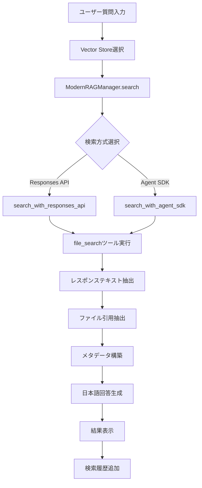
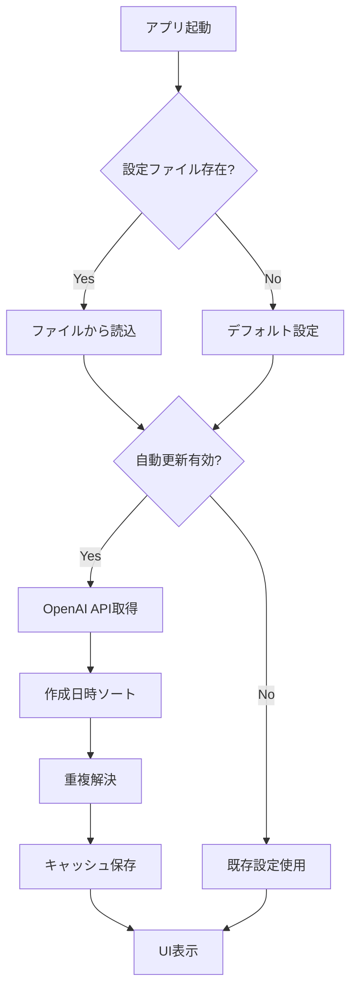

# a34_rag_search_cloud_vs.py 技術仕様書

最終更新日: 2024-10-29

## 概要

OpenAI Vector StoreとResponses APIを使用した最新RAG検索Streamlitアプリケーション。動的なVector Store管理と重複ID問題の解決機能を実装。

## ファイル情報

- **ファイル名**: a34_rag_search_cloud_vs.py
- **行数**: 1458行
- **実行方法**: `streamlit run a34_rag_search_cloud_vs.py --server.port=8503`
- **主要機能**: OpenAI Vector Store検索、動的ID管理、日本語回答生成

## 主要機能

### 1. 最新技術スタック
- ✅ OpenAI Responses API使用
- ✅ file_searchツールでVector Store検索
- ✅ 動的Vector Store ID管理
- ✅ 重複Vector Store対応（最新優先選択）
- ✅ 環境変数でAPIキー管理
- ✅ 型安全実装

### 2. Vector Store管理機能
- 動的ID管理（vector_stores.json）
- 重複Store自動解決
- OpenAI APIからの最新情報取得
- キャッシュ機能（5分間有効）
- 設定ファイル永続化

### 3. 検索機能
- 英語/日本語質問対応
- ファイル引用表示
- カスタマイズ可能な検索オプション
- 日本語回答の自動生成
- 検索履歴管理

## アーキテクチャ

### クラス構成

```
VectorStoreManager (L75-351)
├── 動的Vector Store設定管理
├── 重複ID解決（最新優先）
└── OpenAI API連携

ModernRAGManager (L449-674)
├── Responses API検索
├── Agent SDK検索（オプション）
└── メタデータ抽出
```

## 主要クラス

### 1. VectorStoreManager (L75-351)

動的Vector Store管理と重複ID問題の解決を担当。

#### 初期化
```python
def __init__(self, openai_client: OpenAI = None):
    self.openai_client = openai_client
    self._cache = {}
    self._last_update = None
```

#### 主要メソッド

**load_vector_stores() (L123-145)**
- 設定ファイルからVector Store情報を読み込み
- フォールバック: デフォルト設定を使用

**save_vector_stores() (L147-166)**
- Vector Store設定をJSONファイルに保存
- バージョン管理とタイムスタンプ記録

**fetch_latest_vector_stores() (L168-260)** - 重複問題修正版
```python
def fetch_latest_vector_stores(self) -> Dict[str, str]:
    # 1. OpenAI APIからVector Store一覧を取得
    stores_response = self.openai_client.vector_stores.list()

    # 2. 作成日時でソート（新しい順）
    sorted_stores = sorted(
        stores_response.data,
        key=lambda x: x.created_at,
        reverse=True
    )

    # 3. 重複チェックと最新選択
    for store in sorted_stores:
        if matched_display_name not in store_candidates:
            # 新規候補として登録
        else:
            # 既存候補と比較、新しい方を選択
            if created_at > existing['created_at']:
                # 更新
```

**特徴**:
- 作成日時（`created_at`）でソート
- 同名Store候補の最新を自動選択
- 詳細なログ出力で追跡可能

**get_vector_stores() (L262-292)**
- キャッシュ機能付き取得
- 5分間のキャッシュ有効期限
- 強制リフレッシュオプション

**refresh_and_save() (L294-326)**
- 最新情報の強制取得と保存
- UI通知機能
- 詳細情報の表示

### 2. ModernRAGManager (L449-674)

Responses APIとfile_searchツールを使用したRAG検索。

#### 主要メソッド

**search_with_responses_api() (L455-544)**
```python
def search_with_responses_api(
    self,
    query: str,
    store_name: str,
    store_id: str,
    **kwargs
) -> Tuple[str, Dict[str, Any]]:
```

処理フロー (L459-489):
1. file_searchツール設定
2. オプション設定（max_results, filters等）
3. Responses API呼び出し
4. レスポンステキスト抽出
5. ファイル引用抽出
6. メタデータ構築

**search_with_agent_sdk() (L546-603)**
- Agent SDKを使用した検索（簡易版）
- セッション管理機能
- Responses APIへのフォールバック

**search() (L605-611)**
- 統合検索メソッド
- Agent SDKまたはResponses APIを選択

#### ヘルパーメソッド

**_extract_response_text() (L613-633)**
- レスポンスからテキストを抽出
- output_text属性の確認
- output配列からの抽出

**_extract_citations() (L635-655)**
- ファイル引用情報を抽出
- file_citation annotationsの処理

**_extract_tool_calls() (L657-673)**
- ツール呼び出し情報を抽出
- file_search_call情報の取得

## 主要関数

### 1. 日本語回答生成 (L937-1017)

**generate_enhanced_response()**
```python
def generate_enhanced_response(
    query: str,
    search_result: str,
    has_result: bool = True
) -> Tuple[str, Dict[str, Any]]:
```

機能:
- 検索結果を基に日本語回答を生成
- ChatCompletion APIを使用
- モデル別パラメータ調整
- トークン使用量の記録

モデル別処理 (L972-992):
- o-seriesモデル: temperatureなし
- gpt-5-mini: temperatureなし
- その他: temperature=0.7
- 新モデル: max_completion_tokens使用

### 2. UI関連関数

**initialize_session_state() (L683-704)**
- セッション状態の初期化
- デフォルト値の設定
- 検索オプションの初期化

**display_search_results() (L1020-1089)**
- 検索結果の表示
- ファイル引用の表示
- メタデータの表示
- 日本語回答の生成と表示

**display_test_questions() (L777-802)**
- Vector Store別テスト質問の表示
- 動的質問マッピング
- ボタンクリックでクエリ設定

**display_vector_store_management() (L805-846)**
- Vector Store管理UI
- 最新情報更新ボタン
- デバッグ情報表示
- 設定ファイル表示

**display_search_options() (L890-935)**
- 検索オプション設定UI
- 最大結果数（1-50）
- 検索結果詳細の有効化
- ファイル引用表示の有効化

## データフロー

### 検索フロー



### Vector Store管理フロー



## 設定ファイル

### vector_stores.json (L78, L150-158)

```json
{
  "vector_stores": {
    "Customer Support FAQ": "vs_xxx...",
    "Medical Q&A": "vs_yyy...",
    "Science & Technology Q&A": "vs_zzz...",
    "Legal Q&A": "vs_aaa...",
    "Trivia Q&A": "vs_bbb...",
    "CC News Q&A (Basic)": "vs_ccc...",
    "CC News Q&A (Coverage)": "vs_ddd...",
    "CC News Q&A (Hybrid)": "vs_eee...",
    "Unified Knowledge Base": "vs_fff..."
  },
  "last_updated": "2025-01-XX...",
  "source": "a34_rag_search_cloud_vs.py",
  "version": "1.1"
}
```

### デフォルトVector Store設定 (L82-92)

```python
DEFAULT_VECTOR_STORES = {
    "CC News Q&A (Basic)": "vs_cc_news_basic_placeholder",
    "CC News Q&A (Coverage)": "vs_cc_news_coverage_placeholder",
    "CC News Q&A (Hybrid)": "vs_cc_news_hybrid_placeholder",
    "Customer Support FAQ": "vs_68c94da49c80819189dd42d6e941c4b5",
    "Science & Technology Q&A": "vs_68c94db932fc8191b6e17f86e6601bc1",
    "Medical Q&A": "vs_68c94daffc708191b3c561f4dd6b2af8",
    "Legal Q&A": "vs_68c94dc1cc008191a197bdbc3947a67b",
    "Trivia Q&A": "vs_68c94dc9e6b08191946d7cafcd9880a3",
    "Unified Knowledge Base": "vs_unified_placeholder"
}
```

## テスト質問 (L385-433)

### Customer Support FAQ (L385-391)
```python
test_questions_en = [
    "How do I create a new account?",
    "What payment methods are available?",
    "Can I return a product?",
    "I forgot my password",
    "How can I contact the support team?"
]
```

### Science & Technology (L393-399)
```python
test_questions_2_en = [
    "What are the latest trends in artificial intelligence?",
    "What is the principle of quantum computing?",
    ...
]
```

### Medical Q&A (L401-407)
```python
test_questions_3_en = [
    "How to prevent high blood pressure?",
    "What are the symptoms and treatment of diabetes?",
    ...
]
```

### CC News Q&A (L426-433)
```python
test_questions_cc_news_en = [
    "What are the latest developments in artificial intelligence?",
    "What happened in the recent tech industry news?",
    ...
]
```

## 使用方法

### 1. 環境設定

```bash
# OpenAI APIキー設定（必須）
export OPENAI_API_KEY='your-api-key-here'

# 永続化（.bashrc/.zshrcに追加）
echo 'export OPENAI_API_KEY="your-api-key-here"' >> ~/.bashrc

# 必要なライブラリインストール
pip install streamlit openai
pip install openai-agents  # オプション
```

### 2. アプリケーション起動

```bash
# デフォルトポート（8503）
streamlit run a34_rag_search_cloud_vs.py --server.port=8503

# または8501
streamlit run a34_rag_search_cloud_vs.py --server.port=8501
```

### 3. 基本操作

1. **Vector Storeの選択**
   - 左サイドバーでVector Storeを選択
   - 各Storeには異なるドメインの知識を格納

2. **質問の入力**
   - テスト質問から選択
   - または直接入力

3. **検索実行**
   - 「🔍 検索実行」ボタンをクリック
   - 英語質問を推奨（RAGデータが英語）

4. **結果確認**
   - 英語検索結果
   - ファイル引用情報
   - 日本語回答（自動生成）

### 4. Vector Store管理

**最新情報に更新**:
```
サイドバー → Vector Store管理 → 🔄 最新情報に更新
```

**デバッグ情報表示**:
```
サイドバー → Vector Store管理 → 📊 デバッグ情報表示
```

## 重複ID問題の解決

### 問題 (L1354-1358)

- 同じ名前で複数のVector Storeが存在
- 古いIDが選択されるバグ
- 作成日時での優先度が未実装

### 解決方法 (L168-260)

```python
# 1. 作成日時でソート
sorted_stores = sorted(
    stores_response.data,
    key=lambda x: x.created_at,
    reverse=True  # 新しい順
)

# 2. 重複チェック
for store in sorted_stores:
    if matched_display_name not in store_candidates:
        # 新規登録
        store_candidates[matched_display_name] = {
            'id': store_id,
            'created_at': created_at
        }
    else:
        # 既存と比較
        if created_at > existing['created_at']:
            # 更新（新しい方を優先）
            store_candidates[matched_display_name] = {...}
```

### 確認方法

1. ログ出力の確認
   ```
   🔍 処理中: 'Store Name' (vs_xxx) - 作成日時: 1234567890
   ✅ 新規候補: 'Display Name' -> 'Store Name' (vs_xxx)
   🔄 更新: 'Display Name' -> 'New Store' (vs_yyy) [新: 1234567891 > 旧: 1234567890]
   ```

2. デバッグ情報の確認
   ```
   サイドバー → Vector Store管理 → デバッグ情報表示
   ```

## モデル選択機能 (L1190-1233)

### helper_rag利用時 (L1194-1222)

```python
if HELPER_AVAILABLE:
    models = AppConfig.AVAILABLE_MODELS
    selected_model = st.selectbox(...)

    # モデル情報表示
    limits = AppConfig.get_model_limits(selected_model)
    pricing = AppConfig.get_model_pricing(selected_model)
```

### フォールバック時 (L1224-1233)

```python
models = ["gpt-4o", "gpt-4o-mini", "gpt-4.1", "gpt-4.1-mini"]
selected_model = st.selectbox(...)
```

## エラー処理

### API呼び出しエラー (L530-544)

```python
except Exception as e:
    error_msg = f"Responses API検索でエラーが発生: {str(e)}"
    logger.error(error_msg)
    logger.error(traceback.format_exc())

    error_metadata = {
        "error": str(e),
        "method": "responses_api_error",
        ...
    }
    return error_msg, error_metadata
```

### Vector Store読み込みエラー (L142-145)

```python
except Exception as e:
    logger.error(f"❌ Vector Store設定読み込みエラー: {e}")
    st.warning(f"設定ファイル読み込みエラー: {e}")
    return self.DEFAULT_VECTOR_STORES.copy()
```

### 日本語回答生成エラー (L1013-1017)

```python
except Exception as e:
    error_msg = f"回答生成エラー: {str(e)}"
    logger.error(error_msg)
    return error_msg, {"error": str(e)}
```

## パフォーマンス最適化

### 1. キャッシュ機能 (L262-292)

```python
@st.cache_resource
def get_vector_store_manager():
    return VectorStoreManager(openai_client)

# 5分間のキャッシュ有効期限
if (now - self._last_update).seconds >= 300:
    return self.get_vector_stores(force_refresh=True)
```

### 2. セッション状態管理 (L683-704)

```python
if 'search_history' not in st.session_state:
    st.session_state.search_history = []
if 'current_query' not in st.session_state:
    st.session_state.current_query = ""
# ...
```

### 3. 重複チェック (L1322-1326)

```python
if not any(item['query'] == query and item['store_name'] == selected_store
           for item in st.session_state.search_history):
    st.session_state.search_history.insert(0, history_item)
    st.session_state.search_history = st.session_state.search_history[:50]
```

## トラブルシューティング

### 問題1: 重複ID選択エラー

**症状**: 古いVector Store IDが選択される
**対処**:
1. サイドバー「Vector Store管理」→「最新情報に更新」
2. デバッグ情報で選択されたIDを確認
3. ログで最新作成日時のIDが選択されているか確認

### 問題2: APIキーエラー

**症状**: "OpenAI API キーの設定に問題があります"
**対処**:
```bash
# 環境変数確認
echo $OPENAI_API_KEY

# 設定
export OPENAI_API_KEY='your-api-key-here'

# 永続化
echo 'export OPENAI_API_KEY="your-api-key-here"' >> ~/.bashrc
source ~/.bashrc
```

### 問題3: Vector Store IDエラー

**症状**: "Vector Store ID が見つかりません"
**対処**:
1. 「最新情報に更新」ボタンをクリック
2. a31_make_cloud_vector_store_vsid.py で新規作成後は更新が必要
3. 設定ファイル（vector_stores.json）を確認

### 問題4: 検索結果なし

**症状**: "レスポンステキストの抽出に失敗"
**対処**:
1. Vector Store IDが正しいか確認
2. 選択したVector Storeにデータが存在するか確認
3. 質問内容がVector Storeのドメインに適合しているか確認

## 連携プログラム

### a31_make_cloud_vector_store_vsid.py
- Vector Store作成プログラム
- 作成されたIDをvector_stores.jsonで管理
- a34で自動認識

### helper_rag.py
- AppConfig: モデル設定管理
- select_model: モデル選択UI
- show_model_info: モデル情報表示

## セキュリティ

### APIキー管理 (L437-446, L865-868)

```python
# 環境変数から自動取得
openai_client = OpenAI()

# Streamlit secrets.toml 不要
st.write("- 環境変数 `OPENAI_API_KEY` から自動取得")
st.write("- Streamlit secrets.toml 不要")
```

### 型安全実装 (L460-476)

```python
# 型安全な辞書定義
file_search_tool_dict: Dict[str, Any] = {
    "type": "file_search",
    "vector_store_ids": [store_id]
}

# 型安全な更新
if max_results and isinstance(max_results, int):
    file_search_tool_dict["max_num_results"] = max_results
```

## 注意事項

1. **APIキー設定必須**
   - 環境変数 OPENAI_API_KEY が必須
   - 起動前に設定すること

2. **RAGデータは英語**
   - 英語質問が最適
   - 日本語回答は自動生成される

3. **Vector Store更新**
   - 新規作成後は「最新情報に更新」が必要
   - キャッシュは5分間有効

4. **重複ID問題**
   - 自動解決（最新優先）
   - ログで確認可能

5. **検索履歴**
   - 最新50件まで保持
   - セッション単位で管理

## 今後の改善案

### 1. 機能拡張
- [ ] 並列Vector Store検索
- [ ] 検索結果の比較機能
- [ ] カスタムフィルタリング
- [ ] 検索履歴のエクスポート

### 2. パフォーマンス
- [ ] 非同期API呼び出し
- [ ] 検索結果のキャッシュ
- [ ] ストリーミング回答表示

### 3. UI/UX
- [ ] ダークモード対応
- [ ] レスポンシブデザイン
- [ ] 検索結果のハイライト
- [ ] グラフ可視化

## まとめ

a34_rag_search_cloud_vs.pyは、OpenAI Vector StoreとResponses APIを活用した最新RAG検索アプリケーションです。

### 主要な特徴
1. **動的Vector Store管理**: 自動ID更新と設定ファイル連携
2. **重複ID解決**: 最新作成日時を優先
3. **日本語回答生成**: 検索結果を基に自然な日本語で回答
4. **型安全実装**: エラーの少ない堅牢な実装
5. **セキュアな設定**: 環境変数でのAPIキー管理

### 推奨用途
- OpenAI Vector Storeを利用したRAG検索
- 複数ドメインの知識ベース検索
- 英語データからの日本語回答生成
- 研究・開発環境でのRAGテスト

---
最終更新: 2024-10-29
作成者: OpenAI RAG Q/A JP Development Team