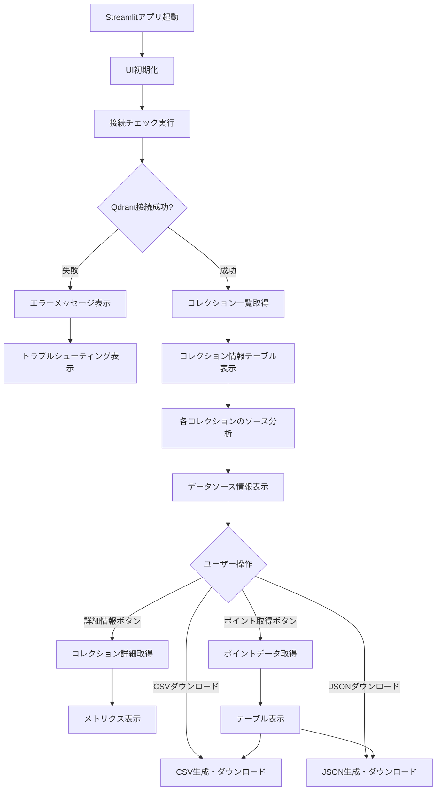

# a40_show_qdrant_data.py - Qdrantデータ表示ツール（Streamlit UI）

## 📋 概要

`a40_show_qdrant_data.py`は、Qdrantベクトルデータベースの状態を監視し、登録されているデータを視覚的に表示するためのStreamlitベースのWebアプリケーションです。コレクション一覧、詳細情報、データソース構成、ポイントデータのエクスポートなど、包括的な管理機能を提供します。

### 主な特徴

- **リアルタイム接続監視**: Qdrantサーバーの接続状態を自動チェック
- **コレクション管理**: 全コレクションの一覧表示と統計情報
- **データソース分析**: qa_output/ディレクトリーとの対応関係を自動分析
- **ポイントデータ表示**: コレクション内のデータをテーブル形式で表示
- **エクスポート機能**: CSV/JSON形式でのデータダウンロード
- **デバッグモード**: 詳細なエラー情報とトラブルシューティング

---

## 📥 INPUT / 📤 OUTPUT

### INPUT（入力データソース）

| データソース | 説明 | 形式 |
|---|---|---|
| **Qdrant Vector Database** | ベクトルデータベース（ポート6333） | REST API |
| └ コレクション | qa_cc_news_a02_llm, qa_cc_news_a03_rule等 | ベクトル + メタデータ |

### OUTPUT（出力）

| 出力先 | 形式 | 内容 |
|---|---|---|
| **Streamlit WebUI** | HTML/CSS | インタラクティブな統計表示 |
| **CSV エクスポート** | CSV | コレクション一覧、ポイントデータ |
| **JSON エクスポート** | JSON | コレクション一覧、ポイントデータ |

---

## 🚀 使用方法

### 基本的な使い方

#### 1. Qdrantサーバーの起動

```bash
# Docker Composeを使用（推奨）
cd docker-compose
docker-compose up -d qdrant

# または単独のDockerコマンド
docker run -d -p 6333:6333 -p 6334:6334 qdrant/qdrant

# または自動セットアップスクリプト
python server.py
```

#### 2. Streamlitアプリの起動

```bash
# デフォルトポート（8501）で起動
streamlit run a40_show_qdrant_data.py

# カスタムポート指定
streamlit run a40_show_qdrant_data.py --server.port=8502

# ブラウザ自動起動を無効化
streamlit run a40_show_qdrant_data.py --server.headless=true
```

#### 3. ブラウザでアクセス

```
http://localhost:8501
```

---

## 💻 UI構成

### サイドバー（左ペイン）

| 機能 | 説明 |
|---|---|
| **⚙️ Qdrant接続状態** | Qdrantサーバーへの接続状態をリアルタイム表示 |
| **🔍 接続チェック実行** | 手動で接続状態を再確認 |
| **🐛 デバッグモード** | 詳細なエラー情報とデバッグ情報を表示 |
| **🔄 自動更新** | 指定間隔で自動的に接続状態を更新 |
| **間隔(秒)** | 自動更新の間隔を設定（5〜300秒） |

### メインエリア（右ペイン）

#### 📚 コレクション一覧

| カラム | 説明 |
|---|---|
| Collection | コレクション名 |
| Vectors Count | ベクトル総数 |
| Points Count | ポイント総数 |
| Indexed Vectors | インデックス済みベクトル数 |
| Status | コレクションの状態（green/yellow/red） |

#### 📂 データソース構成

各コレクションについて、以下の情報を表示：

| 項目 | 説明 |
|---|---|
| ソースファイル | qa_output/ディレクトリー内のCSVファイル名 |
| 推定件数 | サンプリングに基づく推定データ件数 |
| 割合 | 全体に占める割合（%） |
| 生成方法 | a02_make_qa, a03_coverage, a10_hybrid等 |
| ドメイン | cc_news, livedoor等 |

#### 🔍 コレクション詳細データ

| 機能 | 説明 |
|---|---|
| 表示件数 | 取得するポイント数を指定（1〜500件） |
| 📊 詳細情報を表示 | ベクトル設定、ステータスメトリクスを表示 |
| 🔍 ポイントデータを取得 | 実際のポイントデータをテーブル表示 |
| 📥 CSVダウンロード | ポイントデータをCSV形式で保存 |
| 📥 JSONダウンロード | ポイントデータをJSON形式で保存 |

---

## 🎨 画面構成とワークフロー

### 起動直後の画面

```
┌─────────────────────────────────────────────────────────────────┐
│ 🎯 Qdrant データ表示ツール                                      │
│ Qdrant Vector Database の状態監視とデータ表示                   │
├──────────────┬──────────────────────────────────────────────────┤
│ サイドバー   │ メインエリア                                     │
├──────────────┤                                                  │
│ ⚙️ 接続状態  │ 📊 Qdrant データ表示                             │
│              │                                                  │
│ □ 🐛 デバッグ │ 📚 コレクション一覧                              │
│ □ 🔄 自動更新 │ ┌────────────────────────────────────────────┐ │
│              │ │ Collection    | Vectors | Points | Status │ │
│ [🔍 接続チェ │ │ qa_cc_news_.. | 5,042   | 5,042  | green  │ │
│  ック実行]   │ │ qa_livedoor.. | 1,845   | 1,845  | green  │ │
│              │ └────────────────────────────────────────────┘ │
│ ✅ Qdrant    │                                                  │
│ ✅ Connected │ [📥 CSV] [📥 JSON]                               │
│              │                                                  │
│              │ ──────────────────────────────────────────────── │
│              │ 📂 コレクションのデータソース情報                 │
│              │                                                  │
│              │ ▼ 📦 qa_cc_news_a02_llm                          │
│              │   ソースファイル | 推定件数 | 割合 | 生成方法  │ │
│              │   a02_qa_pairs.. | 5,042    | 100% | a02_make  │ │
└──────────────┴──────────────────────────────────────────────────┘
```

---

## 📊 主要機能の詳細

### 1. 接続状態チェック

**処理フロー**:
1. ポートチェック（localhost:6333）
2. Qdrantクライアント接続
3. コレクション一覧取得
4. レスポンスタイム計測

**表示内容**:
- ✅ 接続成功: コレクション数、レスポンスタイム
- ❌ 接続失敗: エラーメッセージ、トラブルシューティング

### 2. データソース分析機能

コレクション内のポイントをサンプリング（デフォルト200件）して、データソースを自動分析します。

**分析項目**:
```python
{
  "total_points": 5042,           # 総ポイント数
  "sources": {
    "a02_qa_pairs_cc_news.csv": {
      "sample_count": 200,        # サンプル内カウント
      "estimated_total": 5042,    # 推定総数
      "percentage": 100.0,        # 割合
      "method": "a02_make_qa",    # 生成方法
      "domain": "cc_news"         # ドメイン
    }
  },
  "sample_size": 200              # サンプルサイズ
}
```

**用途**:
- コレクションとCSVファイルの対応関係を確認
- データの混在状況を把握
- 生成方法別のデータ分布を確認

### 3. ポイントデータ表示

**表示されるフィールド**:
- ID: ポイントの一意識別子
- question: 質問文（QAペアの場合）
- answer: 回答文（QAペアの場合）
- text: テキストデータ（生テキストの場合）
- domain: ドメイン名
- generation_method: 生成方法
- source: ソースファイル名
- created_at: 作成日時
- schema: スキーマバージョン

**制限事項**:
- 長すぎる文字列は200文字で切り詰め（`...`付き）
- リスト/辞書型は文字列化して表示
- ベクトルデータは表示されない（with_vectors=False）

### 4. エクスポート機能

#### CSV形式
```csv
ID,question,answer,domain,generation_method,source,created_at,schema
123456789,"質問文","回答文","cc_news","a02_make_qa","a02_qa_pairs_cc_news.csv","2025-11-01T12:00:00Z","qa:v1"
...
```

#### JSON形式
```json
[
  {
    "ID": 123456789,
    "question": "質問文",
    "answer": "回答文",
    "domain": "cc_news",
    "generation_method": "a02_make_qa",
    "source": "a02_qa_pairs_cc_news.csv",
    "created_at": "2025-11-01T12:00:00Z",
    "schema": "qa:v1"
  }
]
```

---

## 🔄 処理フロー

### 起動からデータ表示までのフロー



---

## 🛠️ トラブルシューティング

### よくある問題と解決方法

#### 1. Qdrantサーバーに接続できない

**症状**:
```
❌ Qdrantサーバーに接続できません
Connection refused
```

**解決方法**:

**方法1: 自動セットアップ（推奨）**
```bash
python server.py
```

**方法2: 手動でDocker起動**
```bash
# ステップ1: Docker Desktopを起動
# macOS: アプリケーションフォルダから起動

# ステップ2: Qdrantを起動
cd docker-compose
docker-compose up -d qdrant

# ステップ3: 動作確認
docker-compose ps
```

**方法3: トラブルシューティング**
```bash
# ポート使用状況を確認
lsof -i :6333

# ログを確認
docker-compose logs qdrant

# 再起動
docker-compose restart qdrant
```

#### 2. コレクションが空/見つからない

**症状**:
```
📂 データソース情報が見つかりません
```

**原因**:
- データが登録されていない
- コレクションが削除された

**解決方法**:
```bash
# データを登録
python a42_qdrant_registration.py --recreate --include-answer
```

#### 3. タイムアウトエラー

**症状**:
```
⏱️ Qdrantサーバーへの接続がタイムアウトしました
```

**解決方法**:
- Qdrantサーバーのログを確認
- ファイアウォール設定を確認
- ポート6333が使用可能か確認

#### 4. データが正しく表示されない

**症状**:
- ポイントデータが空
- 一部のフィールドが表示されない

**解決方法**:
```bash
# データの再登録
python a42_qdrant_registration.py --collection qa_cc_news_a02_llm --recreate

# コレクション情報の確認
python a41_qdrant_truncate.py --stats
```

---

## 📝 設定とカスタマイズ

### Qdrant接続設定（コード内定数）

```python
QDRANT_CONFIG = {
    "name": "Qdrant",
    "host": "localhost",
    "port": 6333,
    "icon": "🎯",
    "url": "http://localhost:6333",
    "health_check_endpoint": "/collections",
    "docker_image": "qdrant/qdrant"
}
```

### サンプリング設定

データソース分析時のサンプルサイズを変更するには、`fetch_collection_source_info`メソッドの`sample_size`引数を変更します：

```python
# デフォルト: 200件
source_info = data_fetcher.fetch_collection_source_info(collection_name, sample_size=200)

# より精度の高い分析: 500件
source_info = data_fetcher.fetch_collection_source_info(collection_name, sample_size=500)
```

---

## 📈 実行例と画面イメージ

### 例1: 正常起動時の表示

**サイドバー**:
```
⚙️ Qdrant接続状態
─────────────────────
□ 🐛 デバッグモード
□ 🔄 自動更新

[🔍 接続チェック実行]

🎯 Qdrant
✅ Connected

詳細情報 ▼
  collection_count: 8
  response_time_ms: 45.23
```

**メインエリア（コレクション一覧）**:
```
📚 コレクション一覧
┌──────────────────────────┬─────────┬─────────┬─────────────┬────────┐
│ Collection               │ Vectors │ Points  │ Indexed Vec │ Status │
├──────────────────────────┼─────────┼─────────┼─────────────┼────────┤
│ qa_cc_news_a02_llm       │ 5,042   │ 5,042   │ 5,042       │ green  │
│ qa_cc_news_a03_rule      │ 2,358   │ 2,358   │ 2,358       │ green  │
│ qa_cc_news_a10_hybrid    │   731   │   731   │   731       │ green  │
│ qa_livedoor_a02_20_llm   │   189   │   189   │   189       │ green  │
│ qa_livedoor_a03_rule     │    80   │    80   │    80       │ green  │
│ qa_livedoor_a10_hybrid   │ 1,845   │ 1,845   │ 1,845       │ green  │
│ raw_cc_news              │ 3,256   │ 3,256   │ 3,256       │ green  │
│ raw_livedoor             │ 2,733   │ 2,733   │ 2,733       │ green  │
└──────────────────────────┴─────────┴─────────┴─────────────┴────────┘

[📥 CSVダウンロード] [📥 JSONダウンロード]
```

**データソース情報**:
```
📂 コレクションのデータソース情報
各コレクションがqa_output/ディレクトリーのどのファイルから構成されているかを表示します

▼ 📦 qa_cc_news_a02_llm

  📂 データソース構成 (qa_output/ディレクトリー)
  サンプル200件から推定 | 総ポイント数: 5,042件

  ┌────────────────────────┬──────────┬───────┬──────────────┬──────────┐
  │ ソースファイル         │ 推定件数 │ 割合  │ 生成方法     │ ドメイン │
  ├────────────────────────┼──────────┼───────┼──────────────┼──────────┤
  │ a02_qa_pairs_cc_news.. │ 5,042件  │ 100%  │ a02_make_qa  │ cc_news  │
  └────────────────────────┴──────────┴───────┴──────────────┴──────────┘

  📊 詳細情報 ▼
    a02_qa_pairs_cc_news.csv
    - パス: qa_output/a02_qa_pairs_cc_news.csv
    - 推定データ数: 5,042件 (100.0%)
    - 生成方法: a02_make_qa
    - ドメイン: cc_news
    - サンプル内カウント: 200件
```

### 例2: エラー時の表示

```
❌ Qdrantサーバーに接続できません

⚠️ 原因: Qdrantサーバーが起動していない可能性があります。

解決方法:

🚀 方法1: 自動セットアップ（推奨）
```bash
python server.py
```

🐳 方法2: 手動でDocker起動
ステップ1: Docker Desktopを起動
- macOS: アプリケーションフォルダからDocker Desktopを起動

ステップ2: Qdrantを起動
```bash
cd docker-compose
docker-compose up -d qdrant
```
```

---

## 🔗 関連ファイル

| ファイル | 役割 | 関係 |
|---|---|---|
| `a42_qdrant_registration.py` | Qdrantへのデータ登録 | 表示するデータの登録元 |
| `a41_qdrant_truncate.py` | Qdrantデータ削除 | データ管理・クリーンアップ |
| `a50_rag_search_local_qdrant.py` | 検索UI | 登録データの検索・検証 |
| `server.py` | Qdrantサーバー管理 | サーバー起動・ヘルスチェック |
| `docker-compose/docker-compose.yml` | Docker設定 | Qdrantコンテナの定義 |

---

## 🎯 主な用途

| 用途 | 説明 |
|---|---|
| **データ確認** | 登録されたデータの件数や構成を確認 |
| **デバッグ** | データ登録後の検証、問題の診断 |
| **エクスポート** | データのバックアップやオフライン分析 |
| **モニタリング** | Qdrantサーバーの稼働状態を監視 |
| **データソース分析** | どのCSVファイルのデータが登録されているか確認 |

---

## 📚 参考情報

- [Streamlit Documentation](https://docs.streamlit.io/)
- [Qdrant Documentation - Collections](https://qdrant.tech/documentation/concepts/collections/)
- [Qdrant Documentation - Points](https://qdrant.tech/documentation/concepts/points/)
- [プロジェクトREADME](../README.md)

---

## 🔐 セキュリティに関する注意

- このツールはローカル環境での使用を想定しています
- 本番環境で使用する場合は、認証機能の追加を検討してください
- エクスポートされたデータには機密情報が含まれる可能性があります
- Streamlitのデフォルト設定では、ローカルネットワークからアクセス可能です

---

*最終更新: 2025年11月12日*