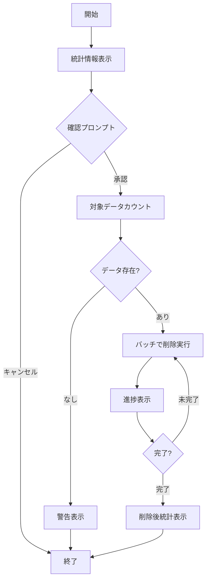
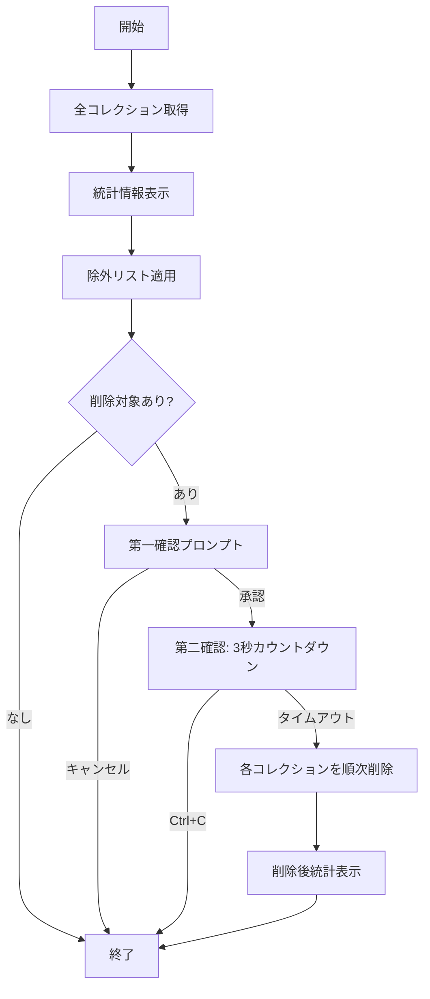

# a41_qdrant_truncate.py - Qdrantコレクション削除ツール

## 📋 概要

`a41_qdrant_truncate.py`は、Qdrantベクトルデータベースに登録されたRAGデータを安全に削除するための管理ツールです。コレクション全体の削除、特定ドメインのみの削除、統計情報の表示など、柔軟なデータ管理機能を提供します。

### 主な特徴

- **段階的削除**: データのみ削除 → コレクション削除 → 全コレクション削除
- **安全機能**: 確認プロンプト、ドライラン、除外リスト
- **詳細統計**: ドメイン別データ数、ベクトル設定、視覚的なグラフ表示
- **バッチ処理**: 大量データの効率的な削除
- **カラー出力**: 視認性の高いコンソール出力

---

## 📥 INPUT / 📤 OUTPUT

### INPUT（入力ファイル）

| ファイルパス | 説明 | オプション | 生成元 |
|---|---|---|---|
| `config.yml` | 設定ファイル（コレクション名、Qdrant URL） | オプション | 手動作成 |

### OUTPUT（出力）

| 出力先 | 形式 | 内容 |
|---|---|---|
| **標準出力（コンソール）** | カラーテキスト | 統計情報、削除進捗、確認プロンプト |
| **Qdrantベクトルデータベース** | 削除操作 | コレクション/データの削除 |

---

## 🚀 使用方法

### 基本的な使い方

#### 1. 統計情報の確認（削除なし）

```bash
# デフォルトコレクションの統計情報を表示
python a41_qdrant_truncate.py --stats

# 特定コレクションの統計情報を表示
python a41_qdrant_truncate.py --collection qa_cc_news_a02_llm --stats

# 全コレクションの統計情報を表示
python a41_qdrant_truncate.py --stats
```

#### 2. ドライラン（削除対象の確認のみ）

```bash
# 全データの削除対象を確認（実行はしない）
python a41_qdrant_truncate.py --all --dry-run

# 特定ドメインの削除対象を確認
python a41_qdrant_truncate.py --domain cc_news --dry-run

# 全コレクションの削除対象を確認
python a41_qdrant_truncate.py --all-collections --dry-run
```

#### 3. 特定ドメインのデータ削除

```bash
# 確認プロンプト付きで削除
python a41_qdrant_truncate.py --domain medical

# 確認をスキップして強制削除
python a41_qdrant_truncate.py --domain cc_news --force
```

#### 4. コレクション内の全データ削除（コレクションは残す）

```bash
# 確認プロンプト付き
python a41_qdrant_truncate.py --all

# 強制削除
python a41_qdrant_truncate.py --all --force

# 特定コレクションのデータ削除
python a41_qdrant_truncate.py --collection qa_cc_news_a03_rule --all --force
```

#### 5. コレクション自体を削除

```bash
# 確認プロンプト付き
python a41_qdrant_truncate.py --drop-collection

# 特定コレクションを強制削除
python a41_qdrant_truncate.py --collection qa_cc_news_a02_llm --drop-collection --force
```

#### 6. 全コレクションの削除（危険！）

```bash
# ⚠️ 警告：全コレクションを削除（2段階確認あり）
python a41_qdrant_truncate.py --all-collections --force

# 特定コレクションを除外して削除
python a41_qdrant_truncate.py --all-collections --exclude qa_corpus --exclude important_data --force
```

---

## 💻 コマンドライン引数

| 引数 | 説明 | デフォルト | 例 |
|---|---|---|---|
| `--collection` | 対象コレクション名 | config.yml または 'qa_corpus' | `--collection qa_cc_news_a02_llm` |
| `--qdrant-url` | QdrantサーバーのURL | http://localhost:6333 | `--qdrant-url http://192.168.1.10:6333` |
| `--domain` | 削除対象のドメイン | なし | `--domain medical` |
| `--all` | 全データを削除（コレクションは保持） | False | `--all` |
| `--all-collections` | 全コレクションを削除（危険！） | False | `--all-collections` |
| `--drop-collection` | コレクション自体を削除 | False | `--drop-collection` |
| `--exclude` | 除外するコレクション（複数指定可） | なし | `--exclude qa_corpus --exclude backup` |
| `--stats` | 統計情報のみ表示（削除なし） | False | `--stats` |
| `--dry-run` | 削除対象を表示するが実行しない | False | `--dry-run` |
| `--force` | 確認プロンプトをスキップ | False | `--force` |
| `--batch-size` | 削除バッチサイズ | 100 | `--batch-size 200` |

### サポートされるドメイン

| ドメイン名 | 説明 |
|---|---|
| `customer` | カスタマーサポート |
| `medical` | 医療 |
| `legal` | 法律 |
| `sciq` | 科学 |
| `trivia` | トリビア |
| `unified` | 統合データ |
| `cc_news_llm` | CC News LLM生成方式 |
| `cc_news_coverage` | CC Newsカバレッジ改良方式 |
| `cc_news_hybrid` | CC Newsハイブリッド生成方式 |
| `cc_news` | CC Newsデータ |
| `livedoor` | Livedoorデータ |

---

## 📊 統計情報の表示例

### 単一コレクションの統計

```bash
python a41_qdrant_truncate.py --collection qa_cc_news_a02_llm --stats
```

**出力例**:
```
================================================================================
 📊 コレクション 'qa_cc_news_a02_llm' の統計情報
================================================================================

総ポイント数:        5,042
ステータス:           green

ドメイン別データ数:
----------------------------------------
  cc_news           5,042 ██████████████████████████████
----------------------------------------

ベクトル設定:
  primary: size=1536, distance=Distance.COSINE
```

### 全コレクションの統計

```bash
python a41_qdrant_truncate.py --stats
```

**出力例**:
```
================================================================================
 📊 全コレクションの統計情報
================================================================================

総コレクション数:     8
総ポイント数:        15,234

コレクション一覧:
------------------------------------------------------------
  名前                            ポイント数   ステータス
------------------------------------------------------------
  qa_cc_news_a02_llm                   5,042      green
  qa_cc_news_a03_rule                  2,358      green
  qa_livedoor_a10_hybrid               1,845      green
  raw_cc_news                          3,256      green
  raw_livedoor                         2,733      green
  qa_cc_news_a10_hybrid                  731      green
  qa_livedoor_a02_20_llm                 189      green
  qa_livedoor_a03_rule                    80      green
------------------------------------------------------------
```

---

## 🔍 削除機能の詳細

### 1. ドメイン別削除

特定ドメインのデータのみを削除し、他のデータは保持します。

```bash
python a41_qdrant_truncate.py --domain cc_news --force
```

**処理フロー**:
1. 対象ドメインのデータ数をカウント
2. バッチサイズ（デフォルト100）でポイントを検索
3. ポイントIDを取得して削除
4. 削除進捗を表示

**出力例**:
```
削除対象: ドメイン 'cc_news' のデータ 5,042 件
  削除進捗: 100 / 5,042 (2.0%)
  削除進捗: 200 / 5,042 (4.0%)
  ...
  削除進捗: 5,042 / 5,042 (100.0%)
✅ 5,042 件のデータを削除しました。
```

### 2. 全データ削除（コレクション保持）

コレクション構造を保持したまま、全データを削除します。

```bash
python a41_qdrant_truncate.py --all --force
```

**用途**:
- コレクション再登録の前処理
- データのリフレッシュ
- テスト環境のクリーンアップ

### 3. コレクション削除

コレクション自体を完全に削除します。

```bash
python a41_qdrant_truncate.py --drop-collection --force
```

**用途**:
- 不要なコレクションの完全削除
- ベクトル設定の変更時の再作成

### 4. 全コレクション削除（危険！）

すべてのコレクションを削除します（2段階確認付き）。

```bash
python a41_qdrant_truncate.py --all-collections --force
```

**安全機能**:
1. **第一確認**: yes/no プロンプト
2. **第二確認**: 3秒カウントダウン（Ctrl+Cで中止可能）
3. **除外リスト**: `--exclude` で重要なコレクションを保護

**除外機能の使用例**:
```bash
# qa_corpusとbackup_dataを除外して、他の全コレクションを削除
python a41_qdrant_truncate.py --all-collections \
  --exclude qa_corpus \
  --exclude backup_data \
  --force
```

---

## 🔄 処理フロー

### ドメイン別削除のフロー



### 全コレクション削除のフロー



---

## 🎨 カラー出力

### 色コードの意味

| 色 | 意味 | 用途 |
|---|---|---|
| 🟣 **HEADER** | ヘッダー | セクション見出し |
| 🔵 **OKBLUE** | 情報 | 統計情報のラベル |
| 🔷 **OKCYAN** | 通知 | ドライラン表示、進捗バー |
| 🟢 **OKGREEN** | 成功 | 完了メッセージ、正常ステータス |
| 🟡 **WARNING** | 警告 | 確認プロンプト、注意事項 |
| 🔴 **FAIL** | エラー | エラーメッセージ、危険な操作 |
| **BOLD** | 強調 | 重要な数値、操作 |

### 出力例

```
================================================================================
 📊 コレクション 'qa_cc_news_a02_llm' の統計情報
================================================================================

総ポイント数:        5,042
ステータス:           green

ドメイン別データ数:
----------------------------------------
  cc_news           5,042 ██████████████████████████████
----------------------------------------

⚠️  ドメイン 'cc_news' のデータを削除します
この操作は取り消せません！

実行しますか？ (yes/no): yes

削除対象: ドメイン 'cc_news' のデータ 5,042 件
  削除進捗: 5,042 / 5,042 (100.0%)
✅ 5,042 件のデータを削除しました。
```

---

## 🛠️ トラブルシューティング

### よくある問題と解決方法

#### 1. Qdrantサーバーに接続できない

```
❌ Qdrant接続エラー: Connection refused
URL: http://localhost:6333
Qdrantが起動していることを確認してください。
```

**解決方法**:
```bash
# Qdrantサーバーを起動
docker run -d -p 6333:6333 -p 6334:6334 qdrant/qdrant

# または docker-compose
docker-compose -f docker-compose/docker-compose.yml up -d
```

#### 2. コレクションが存在しない

```
❌ コレクション 'qa_corpus' が存在しません。
```

**解決方法**:
```bash
# 全コレクションの確認
python a41_qdrant_truncate.py --stats

# 正しいコレクション名を指定
python a41_qdrant_truncate.py --collection qa_cc_news_a02_llm --stats
```

#### 3. 削除権限エラー

```
❌ エラーが発生しました: Permission denied
```

**解決方法**:
- Qdrantサーバーのアクセス権限を確認
- Qdrant URLが正しいか確認
- ファイアウォール設定を確認

#### 4. アクションを指定していない

```
❌ アクションを指定してください（--stats, --domain, --all, --all-collections, --drop-collection）
```

**解決方法**:
- 必ず1つのアクションを指定する
- 複数のアクションを同時に指定しない

---

## 📝 設定ファイル（config.yml）

オプションで`config.yml`を使用してデフォルト設定をカスタマイズできます：

```yaml
rag:
  collection: qa_corpus  # デフォルトのコレクション名

qdrant:
  url: http://localhost:6333  # QdrantサーバーのデフォルトURL
```

**優先順位**:
1. コマンドライン引数（最優先）
2. config.yml設定
3. ハードコードされたデフォルト値

---

## 📈 実行例と結果

### 例1: ドメイン別削除（確認あり）

```bash
python a41_qdrant_truncate.py --domain cc_news
```

**インタラクション**:
```
================================================================================
 🗑️  Qdrantデータ削除ツール
================================================================================

================================================================================
 📊 コレクション 'qa_corpus' の統計情報
================================================================================

総ポイント数:        8,131
ステータス:           green

ドメイン別データ数:
----------------------------------------
  cc_news           8,131 ██████████████████████████████
----------------------------------------

⚠️  ドメイン 'cc_news' のデータを削除します
この操作は取り消せません！

実行しますか？ (yes/no): yes

削除対象: ドメイン 'cc_news' のデータ 8,131 件
  削除進捗: 100 / 8,131 (1.2%)
  削除進捗: 200 / 8,131 (2.5%)
  ...
  削除進捗: 8,131 / 8,131 (100.0%)
✅ 8,131 件のデータを削除しました。

削除後の状態:
================================================================================
 📊 コレクション 'qa_corpus' の統計情報
================================================================================

総ポイント数:        0
ステータス:           green
```

### 例2: 全コレクション削除（除外あり）

```bash
python a41_qdrant_truncate.py --all-collections --exclude qa_corpus --force
```

**出力**:
```
================================================================================
 📊 全コレクションの統計情報
================================================================================

総コレクション数:     8
総ポイント数:        15,234

コレクション一覧:
------------------------------------------------------------
  名前                            ポイント数   ステータス
------------------------------------------------------------
  qa_cc_news_a02_llm                   5,042      green
  qa_cc_news_a03_rule                  2,358      green
  qa_corpus                            8,131      green
  ...
------------------------------------------------------------

━━━━━━━━━━━━━━━━━━━━━━━━━━━━━━━━━━━━━━━━━━━━━━━━━━━━━━━━━━━━━━━━━━━━━━━━━━━━━━
⚠️  警告: 全コレクション削除
━━━━━━━━━━━━━━━━━━━━━━━━━━━━━━━━━━━━━━━━━━━━━━━━━━━━━━━━━━━━━━━━━━━━━━━━━━━━━━

削除予定: 7 コレクション
  - qa_cc_news_a02_llm (5,042 ポイント)
  - qa_cc_news_a03_rule (2,358 ポイント)
  ...

除外: 1 コレクション
  - qa_corpus

本当に削除しますか？ (yes/no): yes

最終確認：3秒後に削除を開始します。中止するにはCtrl+Cを押してください。
3...2...1...

削除を開始します...
  削除中: qa_cc_news_a02_llm... ✓
  削除中: qa_cc_news_a03_rule... ✓
  ...

✅ 7 コレクションを削除しました。
```

---

## 🔗 関連ファイル

| ファイル | 役割 | 関係 |
|---|---|---|
| `a42_qdrant_registration.py` | Qdrantへのデータ登録 | 削除後の再登録に使用 |
| `a40_show_qdrant_data.py` | Qdrantデータ表示UI | 削除前後の確認に使用 |
| `a50_rag_search_local_qdrant.py` | Streamlit検索UI | 削除したデータの検証 |
| `config.yml` | 設定ファイル | デフォルト値の設定 |

---

## ⚠️ 安全機能

### 1. 確認プロンプト

- デフォルトで全ての削除操作に確認プロンプトを表示
- `--force`オプションで確認をスキップ可能
- 全コレクション削除は2段階確認

### 2. ドライラン

- `--dry-run`オプションで削除対象のみ表示
- 実際の削除は実行しない
- テストや確認に最適

### 3. 除外リスト

- `--exclude`オプションで重要なコレクションを保護
- 複数のコレクションを除外可能
- `--all-collections`使用時のみ有効

### 4. カウントダウン

- 全コレクション削除時に3秒カウントダウン
- Ctrl+Cで中止可能
- 誤操作の防止

### 5. 統計情報の表示

- 削除前後の統計情報を自動表示
- 削除対象の明確化
- 削除結果の検証

---

## 📚 参考情報

- [Qdrant Documentation - Collection Management](https://qdrant.tech/documentation/concepts/collections/)
- [Qdrant Documentation - Filtering](https://qdrant.tech/documentation/concepts/filtering/)
- [プロジェクトREADME](../README.md)

---

*最終更新: 2025年11月12日*