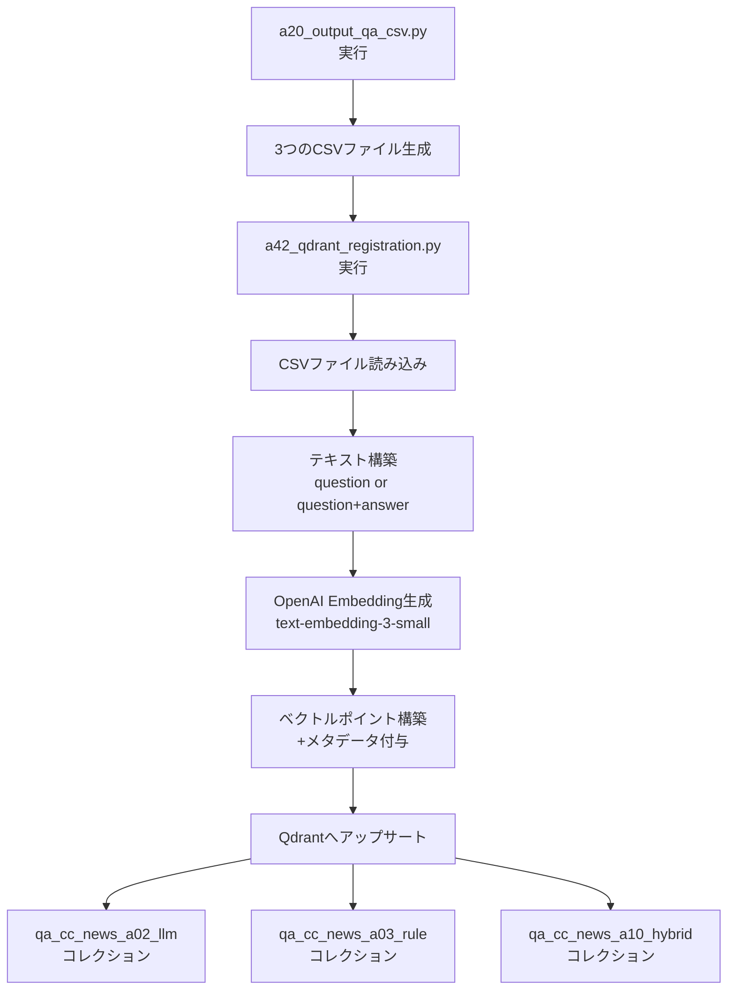

# a42_qdrant_registration.py - 3つの独立コレクションへのQdrant登録ツール

## 📥 INPUT / 📤 OUTPUT

### INPUT（入力ファイル）

| ファイルパス | 説明 | 必須カラム | 生成元 |
|---|---|---|---|
| `qa_output/a02_qa_pairs_cc_news.csv` | LLM生成方式のQ&Aペア | question, answer | a20_output_qa_csv.py |
| `qa_output/a03_qa_pairs_cc_news.csv` | ルールベース生成方式のQ&Aペア | question, answer | a20_output_qa_csv.py |
| `qa_output/a10_qa_pairs_cc_news.csv` | ハイブリッド生成方式のQ&Aペア | question, answer | a20_output_qa_csv.py |
| `config.yml` | 設定ファイル（オプション） | - | 手動作成 |

### OUTPUT（出力）

| 出力先 | 形式 | 内容 |
|---|---|---|
| **Qdrantベクトルデータベース** | コレクション | 3つの独立したベクトルコレクション |
| ├ `qa_cc_news_a02_llm` | ベクトル + メタデータ | LLM生成Q&Aの埋め込みベクトル |
| ├ `qa_cc_news_a03_rule` | ベクトル + メタデータ | ルールベース生成Q&Aの埋め込みベクトル |
| └ `qa_cc_news_a10_hybrid` | ベクトル + メタデータ | ハイブリッド生成Q&Aの埋め込みベクトル |

---

## 📋 概要

`a42_qdrant_registration.py`は、`a20_output_qa_csv.py`で生成された3つのQ&AペアCSVファイルを、それぞれ独立したQdrantコレクションに登録するツールです。各生成方式（LLM、ルールベース、ハイブリッド）のデータを完全に分離して管理します。

### 主な特徴

- **3つの独立コレクション**: 各生成方式のデータを別々のコレクションで管理
- **OpenAI Embedding**: text-embedding-3-smallモデル（1536次元）を使用
- **メタデータ付与**: domain、generation_method、sourceなどの情報を保持
- **バッチ処理対応**: 効率的なAPI呼び出しとデータ登録

---

## 🎯 コレクション構成

| CSVファイル | コレクション名 | 生成方法 | 説明 | 推定件数 |
|---|---|---|---|---|
| `a02_qa_pairs_cc_news.csv` | `qa_cc_news_a02_llm` | a02_make_qa | LLM生成方式（GPT） | 約5,000件 |
| `a03_qa_pairs_cc_news.csv` | `qa_cc_news_a03_rule` | a03_coverage | ルールベース生成方式 | 約2,400件 |
| `a10_qa_pairs_cc_news.csv` | `qa_cc_news_a10_hybrid` | a10_hybrid | ハイブリッド最適化方式 | 約700件 |

---

## 🚀 使用方法

### 基本的な使い方

#### 1. 前提条件の確認

```bash
# OpenAI APIキーの設定
export OPENAI_API_KEY="sk-..."

# Qdrantサーバーの起動
docker run -p 6333:6333 -p 6334:6334 qdrant/qdrant

# CSVファイルの生成（未生成の場合）
python a20_output_qa_csv.py
```

#### 2. 全コレクションへの登録

```bash
# 3つのコレクションすべてにデータを登録（推奨）
python a42_qdrant_registration.py --recreate --include-answer
```

#### 3. 特定コレクションのみの登録

```bash
# LLM生成方式のコレクションのみ
python a42_qdrant_registration.py --collection qa_cc_news_a02_llm --recreate --include-answer

# ルールベース生成方式のコレクションのみ
python a42_qdrant_registration.py --collection qa_cc_news_a03_rule --recreate --include-answer

# ハイブリッド生成方式のコレクションのみ
python a42_qdrant_registration.py --collection qa_cc_news_a10_hybrid --recreate --include-answer
```

---

## 💻 コマンドライン引数

| 引数 | 説明 | デフォルト | 例 |
|---|---|---|---|
| `--recreate` | コレクションを削除して新規作成 | False | `--recreate` |
| `--collection` | 特定コレクションのみ処理 | なし（全コレクション） | `--collection qa_cc_news_a02_llm` |
| `--include-answer` | 埋め込みにanswerも含める | False | `--include-answer` |
| `--qdrant-url` | QdrantサーバーのURL | http://localhost:6333 | `--qdrant-url http://192.168.1.10:6333` |
| `--batch-size` | バッチ処理サイズ | 32 | `--batch-size 64` |
| `--limit` | データ件数制限（開発用） | 0（無制限） | `--limit 100` |
| `--search` | 検索テストのみ実行 | なし | `--search "気候変動"` |
| `--topk` | 検索結果の上位件数 | 5 | `--topk 10` |

---

## 🔍 検索機能

### 検索テストの実行

```bash
# LLMコレクションで検索
python a42_qdrant_registration.py --search "気候変動" --collection qa_cc_news_a02_llm

# ルールベースコレクションで検索
python a42_qdrant_registration.py --search "温暖化" --collection qa_cc_news_a03_rule

# ハイブリッドコレクションで検索
python a42_qdrant_registration.py --search "環境問題" --collection qa_cc_news_a10_hybrid --topk 10
```

### 検索結果の例

```
[Search] collection=qa_cc_news_a02_llm query='気候変動'
score=0.8234  method=a02_make_qa  Q: 気候変動がもたらす影響は？  A: 海面上昇、異常気象の増加、生態系の変化...
score=0.7956  method=a02_make_qa  Q: パリ協定の目標は？  A: 世界の平均気温上昇を産業革命前比で2度未満に...
```

---

## 📊 データ構造

### ベクトルポイントの構造

```json
{
  "id": 123456789,
  "vector": [0.012, -0.034, ...],  // 1536次元
  "payload": {
    "domain": "cc_news",
    "generation_method": "a02_make_qa",
    "collection": "qa_cc_news_a02_llm",
    "question": "質問文",
    "answer": "回答文",
    "source": "a02_qa_pairs_cc_news.csv",
    "created_at": "2025-11-01T12:00:00Z",
    "schema": "qa:v1"
  }
}
```

### Embedding設定

| 項目 | 設定値 |
|---|---|
| **モデル** | text-embedding-3-small |
| **次元数** | 1,536 |
| **距離計算** | Cosine類似度 |
| **入力テキスト** | `question` のみ（デフォルト）<br>`question + "\n" + answer`（--include-answer時） |
| **バッチサイズ** | 32（デフォルト） |

---

## 🔄 処理フロー



---

## 📝 設定ファイル（config.yml）

オプションで`config.yml`を使用して設定をカスタマイズできます：

```yaml
rag:
  include_answer_in_embedding: false  # デフォルトでanswerを含めるか

embeddings:
  primary:
    provider: openai
    model: text-embedding-3-small
    dims: 1536

qdrant:
  url: http://localhost:6333
```

---

## 🛠️ トラブルシューティング

### よくある問題と解決方法

#### 1. CSVファイルが見つからない

```
[WARN] ファイルが見つかりません: qa_output/a02_qa_pairs_cc_news.csv (スキップ)
```

**解決方法**:
```bash
# a20_output_qa_csv.pyを実行してCSVを生成
python a20_output_qa_csv.py
```

#### 2. Qdrantサーバーに接続できない

```
[ERROR] Qdrant接続エラー: Connection refused
```

**解決方法**:
```bash
# Qdrantサーバーを起動
docker run -p 6333:6333 -p 6334:6334 qdrant/qdrant
```

#### 3. OpenAI APIキーエラー

```
[ERROR] OpenAI API key not found
```

**解決方法**:
```bash
export OPENAI_API_KEY="sk-..."
```

---

## 📈 実行例と結果

### 完全な実行例

```bash
# 1. 環境準備
export OPENAI_API_KEY="sk-..."
docker run -d -p 6333:6333 -p 6334:6334 qdrant/qdrant

# 2. CSVファイル生成
python a20_output_qa_csv.py

# 3. Qdrantへの登録
python a42_qdrant_registration.py --recreate --include-answer

# 出力例：
[INFO] 処理対象: 3 コレクション
================================================================================

📦 コレクション: qa_cc_news_a02_llm
   説明: LLM生成方式（a02_make_qa.py）
   ソース: qa_output/a02_qa_pairs_cc_news.csv
--------------------------------------------------------------------------------
   データ件数: 5,042件
   埋め込み生成中: primary (model=text-embedding-3-small)... ✓
   アップサート中... ✓ 5,042件

📦 コレクション: qa_cc_news_a03_rule
   説明: ルールベース生成方式（a03_rag_qa_coverage_improved.py）
   ソース: qa_output/a03_qa_pairs_cc_news.csv
--------------------------------------------------------------------------------
   データ件数: 2,358件
   埋め込み生成中: primary (model=text-embedding-3-small)... ✓
   アップサート中... ✓ 2,358件

📦 コレクション: qa_cc_news_a10_hybrid
   説明: ハイブリッド生成方式（a10_qa_optimized_hybrid_batch.py）
   ソース: qa_output/a10_qa_pairs_cc_news.csv
--------------------------------------------------------------------------------
   データ件数: 731件
   埋め込み生成中: primary (model=text-embedding-3-small)... ✓
   アップサート中... ✓ 731件

================================================================================
✅ 完了: 総登録件数 8,131件

[INFO] 検証検索を実行中...
  qa_cc_news_a02_llm: 5,042件登録済み
    サンプル検索結果: score=0.8234  Q: 気候変動がもたらす影響は？...

  qa_cc_news_a03_rule: 2,358件登録済み
    サンプル検索結果: score=0.7956  Q: 地球温暖化の主な原因は？...

  qa_cc_news_a10_hybrid: 731件登録済み
    サンプル検索結果: score=0.8012  Q: 再生可能エネルギーの種類は？...
```

---

## 🔗 関連ファイル

| ファイル | 役割 | 関係 |
|---|---|---|
| `a02_make_qa.py` | LLMによるQ&A生成 | Q&Aペアの元データ生成 |
| `a03_rag_qa_coverage_improved.py` | カバレージ分析とQ&A生成 | Q&Aペアの元データ生成 |
| `a10_qa_optimized_hybrid_batch.py` | ハイブリッドQ&A生成 | Q&Aペアの元データ生成 |
| `a20_output_qa_csv.py` | 統一フォーマットCSV作成 | **直接の入力元** |
| `a40_show_qdrant_data.py` | Qdrantデータ表示UI | 登録されたデータの確認 |
| `a41_qdrant_truncate.py` | コレクション削除ツール | データのクリーンアップ |

---

## 🎯 主な改良点（a30との違い）

| 項目 | a30_qdrant_registration.py（旧） | a42_qdrant_registration.py（新） |
|---|---|---|
| **コレクション構成** | 単一コレクション（qa_corpus） | 3つの独立コレクション |
| **データ管理** | generation_methodでフィルタ | コレクションレベルで完全分離 |
| **検索効率** | フィルタ条件が必要 | コレクション指定で高速検索 |
| **削除・更新** | 条件付き削除が複雑 | コレクション単位で簡単管理 |
| **拡張性** | 新方式追加時に影響大 | 新コレクション追加で独立管理 |

---

## 📚 参考情報

- [Qdrant Documentation](https://qdrant.tech/documentation/)
- [OpenAI Embeddings Guide](https://platform.openai.com/docs/guides/embeddings)
- [プロジェクトREADME](../README.md)

---

*最終更新: 2025年11月1日*