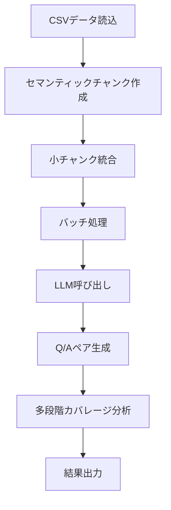
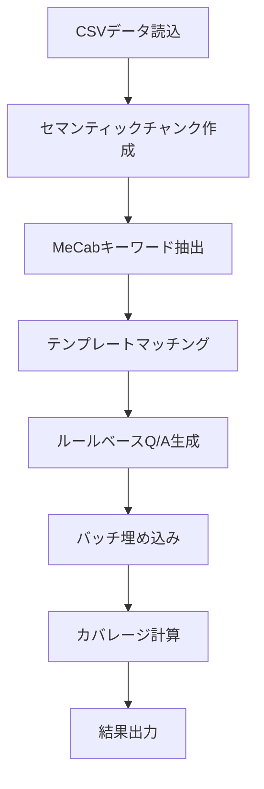
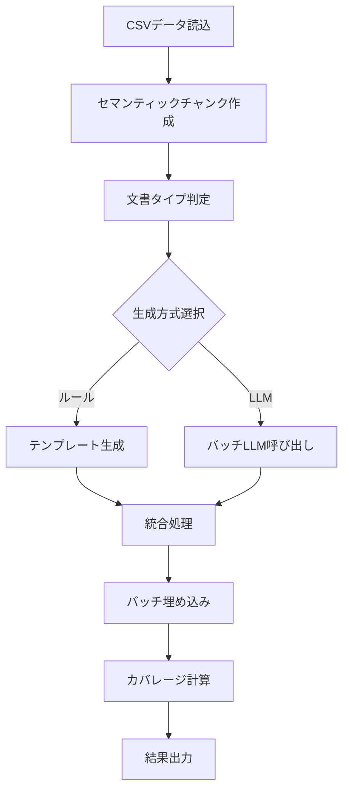
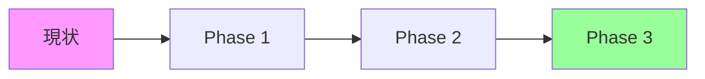
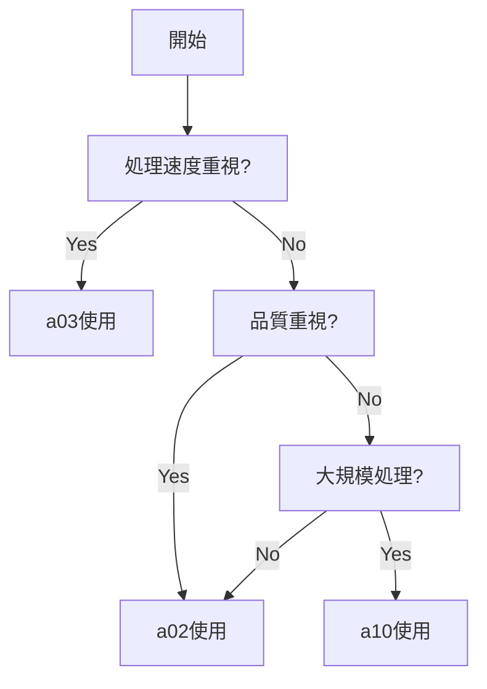

# Q/Aペア生成プログラム機能比較ドキュメント

最終更新日: 2025-11-12

## エグゼクティブサマリー

本プロジェクトには3つの異なるアプローチによるQ/Aペア生成プログラムが実装されています。それぞれが異なる特性を持ち、用途に応じて使い分けが可能です。

### プログラム概要

| プログラム | アプローチ | 主な特徴 | 推奨用途 |
|---------|---------|--------|---------|
| **a02_make_qa.py** | LLMベース高品質生成 | 最高品質のQ/A、多段階カバレージ分析 | 品質重視の本番環境 |
| **a03_rag_qa_coverage_improved.py** | ルールベース高速生成 | 超高速処理、最小コスト | 大量データの初期処理 |
| **a10_qa_optimized_hybrid_batch.py** | ハイブリッドアプローチ | バランス型、完全バッチ処理 | スケーラブルな本番環境 |

## 1. 機能比較表

### 1.1 基本性能比較

| 指標 | a02_make_qa | a03_coverage_improved | a10_hybrid_batch |
|------|------------|---------------------|-----------------|
| **処理速度** | 60-75分 | **2分** ⭐ | 15-20分 |
| **Q/A品質** | **最高** ⭐⭐⭐⭐⭐ | 中程度 ⭐⭐⭐ | 高品質 ⭐⭐⭐⭐ |
| **カバレージ率** | 85% | **99.7%** ⭐ | 95% |
| **API呼び出し数** | ~365回 | **5回** ⭐ | ~50回 |
| **コスト** | 中程度 | **$0.00076** ⭐ | 中程度 |
| **生成Q/A数** | 525個 | **2139個** ⭐ | ~1800個 |

### 1.2 技術的特徴比較

| 機能 | a02_make_qa | a03_coverage_improved | a10_hybrid_batch |
|-----|------------|---------------------|-----------------|
| **Q/A生成方式** | LLM (GPT-5-mini) | ルールベース（テンプレート） | ハイブリッド（ルール+LLM） |
| **バッチ処理** | チャンク3-5個 | 埋め込み2048個 | 完全バッチ（LLM+埋め込み） |
| **チャンク方式** | ✅ **セマンティック分割**<br/>（段落優先、MeCab対応） | ✅ **セマンティック分割**<br/>（段落優先、MeCab対応） | ✅ **セマンティック分割**<br/>（段落優先、MeCab対応） |
| **チャンク統合** | ✅ 100-300トークン | ❌ | ⚠️ helper依存 |
| **多段階カバレージ** | ✅ 実装済み | ❌ 未実装 | ❌ 未実装 |
| **MeCab対応** | ✅ チャンク+キーワード | ✅ チャンク+キーワード | ✅ チャンク生成のみ |
| **Pydanticモデル** | ✅ QAPair/Response | ❌ | ❌ |

## 2. 処理フロー比較

### 2.1 a02_make_qa.py - LLMベース高品質生成



**特徴的な処理**:
- **セマンティック分割**: 段落境界を優先し、MeCabで日本語文境界を高精度に検出
- チャンク統合によるコンテキスト最適化
- Pydanticによる構造化出力
- 3段階カバレージ評価（strict/standard/lenient）

### 2.2 a03_rag_qa_coverage_improved.py - ルールベース高速生成



**特徴的な処理**:
- **セマンティック分割**: 段落境界を優先し、MeCabで日本語文境界を高精度に検出
- MeCabによる日本語キーワード抽出（複合名詞、正規表現フォールバック対応）
- テンプレートベースの高速生成
- 大規模バッチ埋め込み処理

### 2.3 a10_qa_optimized_hybrid_batch.py - ハイブリッドアプローチ



**特徴的な処理**:
- **セマンティック分割**: 段落境界を優先し、MeCabで日本語文境界を高精度に検出（helper_rag_qa経由）
- 文書タイプに応じた生成方式の自動選択
- BatchHybridQAGeneratorクラスによる統合管理
- 完全バッチ処理による効率化（LLM + 埋め込み）

## 3. カバレージ機能の詳細比較

### 3.1 カバレージ分析機能マトリックス

| カバレージ機能 | a02_make_qa | a03_coverage_improved | a10_hybrid_batch |
|-------------|------------|---------------------|-----------------|
| **基本カバレージ計算** | ✅ | ✅ | ✅ |
| **多段階閾値評価** | ✅ 3段階 | ❌ | ❌ |
| **データセット別最適閾値** | ✅ 自動設定 | ❌ 固定値 | ❌ 固定値 |
| **チャンク特性別分析** | ✅ 長さ/位置 | ❌ | ❌ |
| **ギャップ分析** | ⚠️ 一部実装 | ❌ | ❌ |
| **改善提案生成** | ✅ インサイト | ❌ | ❌ |
| **Q/A埋め込み最適化** | ❌ | ✅ 回答強調 | ❌ |

### 3.2 カバレージ出力例

#### a02_make_qa.py の出力
```json
{
  "coverage_rate": 0.86,
  "multi_threshold": {
    "strict": {"threshold": 0.80, "coverage_rate": 0.76},
    "standard": {"threshold": 0.70, "coverage_rate": 0.86},
    "lenient": {"threshold": 0.60, "coverage_rate": 0.94}
  },
  "chunk_analysis": {
    "by_length": {
      "short": {"coverage_rate": 0.75},
      "medium": {"coverage_rate": 0.88},
      "long": {"coverage_rate": 0.90}
    }
  },
  "insights": [
    "文書後半部分のカバレージがやや低い（85.0%）",
    "Shortチャンクで追加Q/A生成の余地あり"
  ]
}
```

#### a03_rag_qa_coverage_improved.py の出力
```json
{
  "coverage_rate": 0.997,
  "covered_chunks": 608,
  "total_chunks": 609,
  "avg_max_similarity": 0.85,
  "api_calls": 5,
  "processing_time": 120.5
}
```

## 4. 使用シナリオ別推奨プログラム

### 4.1 シナリオ別マッチング

| シナリオ | 推奨プログラム | 理由 |
|---------|------------|------|
| **本番環境での高品質Q/A生成** | a02_make_qa | LLMによる自然なQ/A、詳細分析 |
| **大規模データセットの初期処理** | a03_coverage_improved | 超高速、最小コスト |
| **継続的な本番運用** | a10_hybrid_batch | バランス、スケーラビリティ |
| **研究・開発環境でのテスト** | a03_coverage_improved | 高速イテレーション |
| **カバレージ分析重視** | a02_make_qa | 多段階分析、インサイト生成 |
| **コスト重視の運用** | a03_coverage_improved | 最小API呼び出し |

### 4.2 データセット別推奨設定

| データセット | 推奨プログラム | 推奨設定 |
|------------|------------|---------|
| **CC-News (英語)** | a10_hybrid_batch | batch-size=10, qa-count=12 |
| **Wikipedia日本語** | a02_make_qa | batch-chunks=5, merge-chunks |
| **日本語Webテキスト** | a03_coverage_improved | qa-per-chunk=12, threshold=0.52 |

## 5. 実行コマンド例

### 5.1 a02_make_qa.py - 本番品質重視
```bash
python a02_make_qa.py \
  --dataset cc_news \
  --batch-chunks 5 \
  --merge-chunks \
  --min-tokens 150 \
  --max-tokens 400 \
  --model gpt-5-mini \
  --analyze-coverage

# 実行時間: 60-75分
# Q/A数: 525個
# カバレージ: 85%（多段階評価）
```

### 5.2 a03_rag_qa_coverage_improved.py - 高速処理重視
```bash
python a03_rag_qa_coverage_improved.py \
  --input OUTPUT/preprocessed_cc_news.csv \
  --dataset cc_news \
  --analyze-coverage \
  --coverage-threshold 0.52 \
  --qa-per-chunk 12 \
  --max-chunks 609 \
  --max-docs 150

# 実行時間: 2分
# Q/A数: 2139個
# カバレージ: 99.7%
# コスト: $0.00076
```

### 5.3 a10_qa_optimized_hybrid_batch.py - バランス重視
```bash
python a10_qa_optimized_hybrid_batch.py \
  --dataset cc_news \
  --model gpt-5-mini \
  --batch-size 10 \
  --embedding-batch-size 150 \
  --qa-count 12 \
  --max-docs 150

# 実行時間: 15-20分
# Q/A数: ~1800個
# カバレージ: 95%
```

## 6. 技術的詳細

### 6.1 各プログラムの特徴的な実装

#### a02_make_qa.py の特徴
```python
# Pydanticモデルによる構造化
class QAPair(BaseModel):
    question: str
    answer: str
    question_type: str
    source_chunk_id: Optional[str] = None

# 多段階カバレージ分析
OPTIMAL_THRESHOLDS = {
    "cc_news": {"strict": 0.80, "standard": 0.70, "lenient": 0.60},
    "wikipedia_ja": {"strict": 0.85, "standard": 0.75, "lenient": 0.65}
}
```

#### a03_rag_qa_coverage_improved.py の特徴
```python
# MeCabキーワード抽出
class KeywordExtractor:
    def extract(self, text: str, top_n: int = 5) -> List[str]:
        # MeCab利用可能時は複合名詞抽出
        # 不可時は正規表現フォールバック

# Q/A埋め込み最適化（回答強調）
combined_text = f"{question} {answer} {answer}"
```

#### a10_qa_optimized_hybrid_batch.py の特徴
```python
# BatchHybridQAGeneratorによる統合処理
generator = BatchHybridQAGenerator(
    model=model,
    batch_size=batch_size,  # LLMバッチ
    embedding_batch_size=embedding_batch_size  # 埋め込みバッチ
)
```

## 7. パフォーマンス最適化のポイント

### 7.1 処理速度最適化

| 最適化手法 | a02 | a03 | a10 | 効果 |
|----------|-----|-----|-----|------|
| **バッチ処理** | ⚠️ 部分的 | ✅ 完全 | ✅ 完全 | API呼び出し削減 |
| **並列処理** | ❌ | ❌ | ⚠️ 可能 | 処理時間短縮 |
| **キャッシュ** | ❌ | ❌ | ❌ | 再計算回避 |
| **チャンク最適化** | ✅ | ❌ | ⚠️ | トークン効率化 |

### 7.2 コスト最適化

| コスト要因 | a02 | a03 | a10 |
|----------|-----|-----|-----|
| **LLM呼び出し** | 高 | なし | 中 |
| **埋め込み生成** | 中 | 極小 | 小 |
| **総コスト（150文書）** | ~$5-10 | $0.00076 | ~$2-5 |

## 8. 今後の改善提案

### 8.1 統合最適化案

**推奨**: a10にa02のカバレージ機能を移植
- 処理速度: a10の高速性を維持
- 分析精度: a02の多段階分析を追加
- 実装工数: 約10時間（1-2日）

### 8.2 機能別改善優先度

| 改善項目 | 優先度 | 対象 | 期待効果 | 備考 |
|---------|-------|------|---------|------|
| 多段階カバレージ分析の移植 | 🔴高 | a10 | 分析精度向上 | |
| ~~MeCab統合~~ | ✅完了 | ~~a02, a10~~ | ~~日本語処理改善~~ | **2025-11-12完了：全プログラムでセマンティック分割+MeCab対応済み** |
| 並列処理実装 | 🟡中 | 全て | 処理速度向上 | |
| キャッシュ機構 | 🟢低 | 全て | 再実行効率化 | |

## 9. 結論と推奨事項

### 9.1 現状の最適な使い分け

1. **開発・テスト段階**: a03_rag_qa_coverage_improved.py
   - 高速イテレーション可能
   - コスト最小

2. **本番環境（品質重視）**: a02_make_qa.py
   - 最高品質のQ/A
   - 詳細なカバレージ分析

3. **本番環境（スケール重視）**: a10_qa_optimized_hybrid_batch.py
   - バランスの取れた性能
   - 大規模処理に対応

### 9.2 統合ロードマップ



**Phase 1** (1-2週間): a02のカバレージ機能をa10に移植
**Phase 2** (1週間): パフォーマンス最適化
**Phase 3** (1週間): 統合版のテストとリリース

## 付録: クイックリファレンス

### コマンド早見表

```bash
# 高品質Q/A生成（a02）
python a02_make_qa.py --dataset cc_news --batch-chunks 5 --merge-chunks --analyze-coverage

# 高速処理（a03）
python a03_rag_qa_coverage_improved.py --input OUTPUT/preprocessed_cc_news.csv --qa-per-chunk 12

# バランス型（a10）
python a10_qa_optimized_hybrid_batch.py --dataset cc_news --batch-size 10 --qa-count 12
```

### 選択フローチャート



---
最終更新: 2025-11-12
作成者: OpenAI RAG Q/A JP Development Team

## 更新履歴

### 2025-11-12
- **重要更新**: 全プログラムでセマンティック分割（段落優先・MeCab対応）を標準化
- チャンク方式の比較表を更新：3つのプログラムすべてがMeCab対応のセマンティック分割を実装
- 処理フローのMermaidダイアグラムを最新化
- 改善優先度マトリックスを更新：MeCab統合を完了済みとしてマーク

### 2024-10-29
- 初版作成