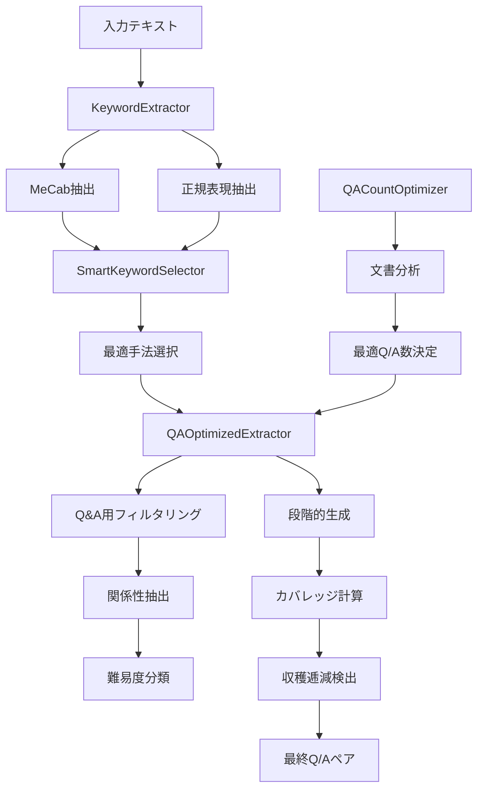

# helper_rag_qa.py ドキュメント

## 概要

`helper_rag_qa.py`は、RAGシステムにおけるQ&Aペア生成のための包括的なユーティリティモジュールです。日本語テキストからの高度なキーワード抽出、文書特性に基づく最適Q/A数の自動決定、段階的生成機能を提供し、高品質なQ&Aデータセットの構築を支援します。

## 主要機能

1. **多手法キーワード抽出** - MeCab、正規表現、統合手法による柔軟な抽出
2. **スマート選択アルゴリズム** - 文書特性に応じた最適な抽出手法の自動選択
3. **Q&A生成最適化** - Q&A生成に特化したフィルタリングと最適化
4. **関係性抽出** - キーワード間の意味的関係を8種類のパターンで分類
5. **最適Q/A数自動決定** - 文書の長さ、複雑度、情報密度に基づく動的決定
6. **段階的生成** - 収穫逓減を検出しながらの効率的なQ/A生成
7. **カバレッジ分析** - テキストカバレッジの計算と最適化
8. **品質スコアリング** - Q/Aペアの品質評価と重複検出

## システムアーキテクチャ



## クラス構成

### 基底クラス

| クラス名 | 説明 | 主要メソッド | 用途 |
| --- | --- | --- | --- |
| `KeywordExtractor` | キーワード抽出の基底クラス | extract_keywords, _split_sentences | 全抽出手法の共通機能 |

### キーワード抽出クラス

| クラス名 | 説明 | 継承元 | 特徴 |
| --- | --- | --- | --- |
| `MecabKeywordExtractor` | MeCab形態素解析による抽出 | KeywordExtractor | 複合名詞、固有名詞抽出に優れる |
| `RegexKeywordExtractor` | 正規表現パターンによる抽出 | KeywordExtractor | MeCab不要、高速処理 |
| `CombinedKeywordExtractor` | 複数手法の統合 | KeywordExtractor | MeCabと正規表現の結果を統合 |

### 最適化クラス

| クラス名 | 説明 | 継承元 | 主要機能 |
| --- | --- | --- | --- |
| `SmartKeywordSelector` | スマート選択エンジン | なし | 3手法の自動選択、評価、比較 |
| `QAOptimizedExtractor` | Q&A生成最適化エンジン | SmartKeywordSelector | Q&A特化フィルタリング、関係性抽出 |
| `QACountOptimizer` | 最適Q/A数決定エンジン | なし | 文書分析、モード別最適化 |

## 主要クラス・メソッドリファレンス

### KeywordExtractor (基底クラス)

| メソッド名 | 説明 | パラメータ | 戻り値 |
| --- | --- | --- | --- |
| `extract_keywords()` | キーワード抽出（抽象メソッド） | text: str, max_keywords: int | List[str] |
| `_split_sentences()` | 文分割 | text: str | List[str] |
| `_calculate_tfidf()` | TF-IDF計算 | text: str, keywords: List[str] | Dict[str, float] |
| `_filter_by_length()` | 長さによるフィルタ | keywords: List[str], min_length: int | List[str] |
| `_remove_stopwords()` | ストップワード除去 | keywords: List[str] | List[str] |

### MecabKeywordExtractor

| メソッド名 | 説明 | パラメータ | 戻り値 |
| --- | --- | --- | --- |
| `extract_keywords()` | MeCabによるキーワード抽出 | text: str, max_keywords: int = 20 | List[str] |
| `_extract_compound_nouns()` | 複合名詞抽出 | parsed_nodes | List[str] |
| `_extract_proper_nouns()` | 固有名詞抽出 | parsed_nodes | List[str] |
| `_extract_noun_patterns()` | 名詞パターン抽出 | parsed_nodes | List[str] |
| `_merge_split_words()` | 分割された単語の結合 | keywords: List[str] | List[str] |

### RegexKeywordExtractor

| メソッド名 | 説明 | パラメータ | 戻り値 |
| --- | --- | --- | --- |
| `extract_keywords()` | 正規表現によるキーワード抽出 | text: str, max_keywords: int = 20 | List[str] |
| `_extract_katakana_terms()` | カタカナ専門用語抽出 | text: str | List[str] |
| `_extract_kanji_compounds()` | 漢字複合語抽出 | text: str | List[str] |
| `_extract_mixed_terms()` | 混合語抽出 | text: str | List[str] |
| `_extract_english_terms()` | 英語/略語抽出 | text: str | List[str] |

### CombinedKeywordExtractor

| メソッド名 | 説明 | パラメータ | 戻り値 |
| --- | --- | --- | --- |
| `extract_keywords()` | 統合キーワード抽出 | text: str, max_keywords: int = 20 | List[str] |
| `_merge_keywords()` | キーワード統合 | mecab_keywords, regex_keywords | List[str] |
| `_score_keywords()` | キーワードスコアリング | keywords, text | Dict[str, float] |

### SmartKeywordSelector

| メソッド名 | 説明 | パラメータ | 戻り値 |
| --- | --- | --- | --- |
| `extract_best_auto()` | 最適手法の自動選択・抽出 | text, mode="auto", min_keywords=5, max_keywords=20 | Dict |
| `evaluate_all_methods()` | 全手法の評価 | text, max_keywords | Dict |
| `compare_methods()` | 手法間の比較 | text, max_keywords | DataFrame |
| `_evaluate_keywords()` | キーワード評価 | keywords, text | Dict[metrics] |
| `_calculate_diversity_score()` | 多様性スコア計算 | keywords | float |
| `_calculate_coverage_score()` | カバレッジスコア計算 | keywords, text | float |

### QAOptimizedExtractor

| メソッド名 | 説明 | パラメータ | 戻り値 |
| --- | --- | --- | --- |
| `extract_for_qa_generation()` | Q&A生成用メイン抽出 | text, qa_count=None, mode="auto", use_progressive=False, difficulty_distribution, return_details=True | Dict |
| `filter_for_qa()` | Q&A用フィルタリング | keywords: List[str] | List[str] |
| `remove_redundant_keywords()` | 冗長キーワード除去 | keywords: List[str] | List[str] |
| `extract_keyword_relations()` | キーワード関係抽出 | text: str, keywords: List[str] | List[Dict] |
| `extract_with_context()` | 文脈付きキーワード抽出 | text: str, keyword: str | Dict |
| `classify_difficulty()` | 難易度分類 | keyword: str, text: str | str |
| `categorize_keyword()` | カテゴリ分類 | keyword: str | str |
| `suggest_qa_templates()` | Q&Aテンプレート生成 | keywords_with_context | List[Dict] |
| `generate_qa_pairs()` | Q&Aペア生成 | extraction_output: Dict | List[Dict] |
| `_progressive_qa_generation()` | 段階的Q&A生成 | text, target_count, mode, batch_size | Dict |
| `_calculate_coverage()` | カバレッジ計算 | text: str, keywords: List[str] | float |
| `_score_qa_quality()` | Q&A品質スコアリング | qa_pair: Dict | float |
| `_detect_duplicate()` | 重複検出 | qa1: Dict, qa2: Dict | bool |

### QACountOptimizer

| メソッド名 | 説明 | パラメータ | 戻り値 |
| --- | --- | --- | --- |
| `calculate_optimal_qa_count()` | 最適Q/A数計算 | document: str, mode: str = "auto" | Dict |
| `_analyze_document_metrics()` | 文書メトリクス分析 | document: str | Dict |
| `_calculate_base_count()` | 基本Q/A数計算 | metrics: Dict | int |
| `_adjust_by_mode()` | モード別調整 | base_count: int, mode: str | int |
| `_adjust_by_information_density()` | 情報密度による調整 | text, base_count, metrics | int |
| `_adjust_by_coverage_target()` | カバレッジ目標による調整 | count: int, mode: str | int |
| `_calculate_complexity_score()` | 複雑度スコア計算 | text: str | float |

## データ構造

### キーワード抽出結果

```python
{
    'keywords': ['自然言語処理', 'トランスフォーマー', 'BERT'],
    'scores': {
        '自然言語処理': 0.95,
        'トランスフォーマー': 0.88,
        'BERT': 0.82
    },
    'metadata': {
        'method': 'MeCab複合名詞',
        'extraction_time': 0.123,
        'total_keywords': 15,
        'filtered_keywords': 10
    }
}
```

### 評価メトリクス

```python
{
    'keyword_count': 10,
    'avg_keyword_length': 5.2,
    'coverage_score': 0.75,
    'diversity_score': 0.82,
    'relevance_score': 0.88,
    'overall_score': 0.81
}
```

### Q&A生成結果

```python
{
    'keywords': [
        {
            'keyword': 'BERT',
            'difficulty': 'advanced',
            'category': 'specific_name',
            'best_context': 'BERTは事前学習済み言語モデルで...',
            'frequency': 3
        }
    ],
    'relations': [
        {
            'from': 'BERT',
            'to': 'トランスフォーマー',
            'relation_type': 'uses',
            'context': 'BERTはトランスフォーマーアーキテクチャを...'
        }
    ],
    'suggested_qa_pairs': [
        {
            'keyword': 'BERT',
            'question_templates': [
                'BERTとは何ですか？',
                'BERTの特徴を説明してください。'
            ],
            'answer_hint': 'BERTは...',
            'suggested_answer_length': '3-5文'
        }
    ],
    'metadata': {
        'qa_count': 5,
        'mode': 'auto',
        'extraction_method': 'MeCab複合名詞',
        'progressive_generation': {
            'batches_processed': 2,
            'final_coverage': 0.85,
            'coverage_history': [...]
        }
    }
}
```

### 最適Q/A数計算結果

```python
{
    'optimal_count': 7,
    'mode': 'evaluation',
    'metrics': {
        'doc_length': 500,
        'sentence_count': 10,
        'token_count': 450,
        'keyword_density': 3.5,
        'complexity_score': 0.75
    },
    'reasoning': 'モード: 評価用 / 文書長: 500文字 / 複雑度: 0.75 / 情報密度により調整'
}
```

## 設定パラメータ

### ストップワード

```python
stopwords = {
    # 一般的な日本語ストップワード
    'こと', 'もの', 'ため', 'これ', 'それ', 'あれ',
    'この', 'その', 'あの', 'ここ', 'そこ', 'あそこ',

    # Q&A生成用追加ストップワード
    '最新', '問題', '実現', '可能', '場合', '結果',
    '方法', '技術', '今後', '現在', '将来', '重要'
}
```

### 抽出パターン

| パターン名 | 正規表現 | 説明 |
| --- | --- | --- |
| カタカナ専門用語 | `[ァ-ヴー]{3,}` | 3文字以上のカタカナ |
| 漢字複合語 | `[一-龥]{2,}` | 2文字以上の漢字 |
| 英数字混合 | `[A-Za-z0-9]+[A-Za-z0-9\-\_]*` | 英数字と記号 |
| 日本語混合 | `(?:[一-龥]+[ァ-ヴー]+)` | 漢字カタカナ混合 |

### 関係性パターン

| パターン | 関係タイプ | 例 |
| --- | --- | --- |
| `(.+?)は(.+?)である` | is_a | AはBである |
| `(.+?)を?使用` | uses | Aを使用する |
| `(.+?)により(.+?)が?可能` | enables | Aにより可能 |
| `(.+?)のため` | for | Aのため |
| `(.+?)から(.+?)へ` | transforms | AからBへ |
| `(.+?)における` | in_context | Aにおける |
| `(.+?)による` | by_means_of | Aによる |
| デフォルト | co_occurs | 共起関係 |

### モード設定

| モード | 説明 | 基本倍率 | 用途 |
| --- | --- | --- | --- |
| auto | 自動決定 | 1.0 | 汎用 |
| evaluation | 評価用 | 0.8 | カバレッジ重視 |
| learning | 学習用 | 1.5 | 理解重視 |
| search_test | 検索テスト | 1.2 | 検索性能評価 |
| faq | FAQ生成 | 0.6 | 要点抽出 |

## パフォーマンス最適化

### キャッシュ機構

```python
# MeCab解析結果のキャッシュ
@lru_cache(maxsize=100)
def _parse_text(self, text):
    return self.tagger.parse(text)

# TF-IDFスコアのキャッシュ
@lru_cache(maxsize=1000)
def _calculate_tfidf(self, text, keyword):
    # TF-IDF計算
```

### 並列処理

```python
# 複数手法の並列評価
from concurrent.futures import ThreadPoolExecutor

with ThreadPoolExecutor(max_workers=3) as executor:
    futures = {
        'mecab': executor.submit(mecab_extractor.extract_keywords, text),
        'regex': executor.submit(regex_extractor.extract_keywords, text),
        'combined': executor.submit(combined_extractor.extract_keywords, text)
    }
```

### メモリ効率化

- 大規模テキストの分割処理
- ジェネレータによる逐次処理
- 不要なオブジェクトの即時削除

## エラー処理

### MeCab関連エラー

```python
try:
    import MeCab
    self.tagger = MeCab.Tagger()
except ImportError:
    print("MeCabが利用できません。正規表現モードで動作します。")
    self.use_fallback = True
```

### エンコーディングエラー

```python
try:
    text = text.encode('utf-8').decode('utf-8')
except UnicodeDecodeError:
    text = text.encode('utf-8', errors='ignore').decode('utf-8')
```

### 空入力処理

```python
if not text or not text.strip():
    return {
        'keywords': [],
        'metadata': {'error': 'Empty input'}
    }
```

## 使用例

### 基本的な使用方法

```python
from helper_rag_qa import QAOptimizedExtractor

# 初期化
extractor = QAOptimizedExtractor(prefer_mecab=True)

# キーワード抽出
result = extractor.extract_for_qa_generation(
    text="自然言語処理の最新技術であるBERTは...",
    qa_count=5
)

# 結果の表示
for keyword in result['keywords']:
    print(f"{keyword['keyword']} ({keyword['difficulty']})")
```

### 最適Q/A数の自動決定

```python
from helper_rag_qa import QACountOptimizer

optimizer = QACountOptimizer()

# 文書分析と最適数決定
result = optimizer.calculate_optimal_qa_count(
    document=text,
    mode="evaluation"
)

print(f"推奨Q/A数: {result['optimal_count']}")
print(f"理由: {result['reasoning']}")
```

### 段階的生成の使用

```python
# 段階的生成を有効化
result = extractor.extract_for_qa_generation(
    text=long_document,
    qa_count=None,  # 自動決定
    mode="auto",
    use_progressive=True  # 段階的生成
)

# 生成履歴の確認
if 'progressive_generation' in result['metadata']:
    history = result['metadata']['progressive_generation']
    print(f"バッチ数: {history['batches_processed']}")
    print(f"最終カバレッジ: {history['final_coverage']:.2%}")
```

### 手法比較

```python
from helper_rag_qa import SmartKeywordSelector

selector = SmartKeywordSelector(prefer_mecab=True)

# 全手法の比較
comparison = selector.compare_methods(text, max_keywords=20)
print(comparison)  # DataFrame形式で表示

# 最適手法の自動選択
best_result = selector.extract_best_auto(
    text,
    mode="coverage"  # カバレッジ重視
)
```

## ベストプラクティス

### 1. 適切な抽出手法の選択

```python
# 技術文書: MeCab優先
extractor = QAOptimizedExtractor(prefer_mecab=True)

# カタカナ用語が多い: 正規表現優先
extractor = QAOptimizedExtractor(prefer_mecab=False)

# バランス重視: 統合手法
result = extractor.extract_best_auto(text, mode="balanced")
```

### 2. Q/A数の適切な設定

```python
# 文書長に応じた自動決定
if len(text) < 500:
    qa_count = None  # 自動決定（3-5個）
elif len(text) < 1000:
    qa_count = 7    # 中程度
else:
    qa_count = None  # 自動決定（最大15個）
```

### 3. 難易度バランスの調整

```python
# 初学者向け
difficulty_distribution = {
    'basic': 0.5,
    'intermediate': 0.3,
    'advanced': 0.2
}

# 専門家向け
difficulty_distribution = {
    'basic': 0.2,
    'intermediate': 0.3,
    'advanced': 0.5
}
```

## トラブルシューティング

### Q: MeCabエラー「dictionary not found」

A: MeCab辞書をインストール
```bash
# macOS
brew install mecab-ipadic

# Ubuntu/Debian
sudo apt-get install mecab-ipadic-utf8
```

### Q: キーワードが少なすぎる

A: 抽出パラメータを調整
```python
# 最小キーワード数を下げる
result = extractor.extract_best_auto(
    text,
    min_keywords=3,  # デフォルト5から変更
    max_keywords=30   # デフォルト20から変更
)
```

### Q: 処理が遅い

A: キャッシュとバッチ処理を活用
```python
# 大量のテキストをバッチ処理
texts = [text1, text2, text3, ...]
results = []

for batch in chunks(texts, batch_size=10):
    batch_results = [extractor.extract_keywords(t) for t in batch]
    results.extend(batch_results)
```

### Q: メモリ使用量が大きい

A: ジェネレータを使用
```python
def process_large_corpus(corpus):
    for document in corpus:
        result = extractor.extract_for_qa_generation(
            document,
            qa_count=5
        )
        yield result
        # メモリ解放
        del result
```

## 拡張可能性

### カスタムパターンの追加

```python
class CustomExtractor(QAOptimizedExtractor):
    def __init__(self):
        super().__init__()
        # カスタムパターンを追加
        self.relation_patterns.append(
            (r'(.+?)に基づく(.+?)', 'based_on')
        )

        # カスタムカテゴリを追加
        self.category_patterns['medical'] = [
            '診断', '治療', '症状', '薬剤'
        ]
```

### 新しい評価メトリクスの追加

```python
def custom_evaluation_metric(keywords, text):
    # カスタムメトリクスの計算
    domain_relevance = calculate_domain_relevance(keywords, text)
    semantic_coherence = calculate_semantic_coherence(keywords)

    return {
        'domain_relevance': domain_relevance,
        'semantic_coherence': semantic_coherence
    }
```

### 外部APIとの連携

```python
class EnhancedExtractor(QAOptimizedExtractor):
    def enhance_with_external_api(self, keywords):
        # 外部APIで追加情報取得
        enhanced = []
        for keyword in keywords:
            # Wikipedia API, WordNet等
            additional_info = fetch_from_api(keyword)
            enhanced.append({
                **keyword,
                'external_info': additional_info
            })
        return enhanced
```

## ライセンス

[プロジェクトのライセンスに準拠]

## 更新履歴

- 2024.10 - 初版作成
- 2024.10 - SmartKeywordSelector実装（3手法の自動選択）
- 2024.10 - QAOptimizedExtractor実装（Q&A生成最適化）
- 2024.10 - 関係性抽出機能追加（8パターン）
- 2024.10 - 難易度・カテゴリ分類システム実装
- 2025.01 - QACountOptimizer実装（最適Q/A数自動決定）
- 2025.01 - 段階的生成機能追加（収穫逓減検出付き）
- 2025.01 - カバレッジ計算機能追加
- 2025.01 - Q/A品質スコアリング・重複検出機能追加
- 2025.01 - モード別最適化（auto/evaluation/learning/faq）実装