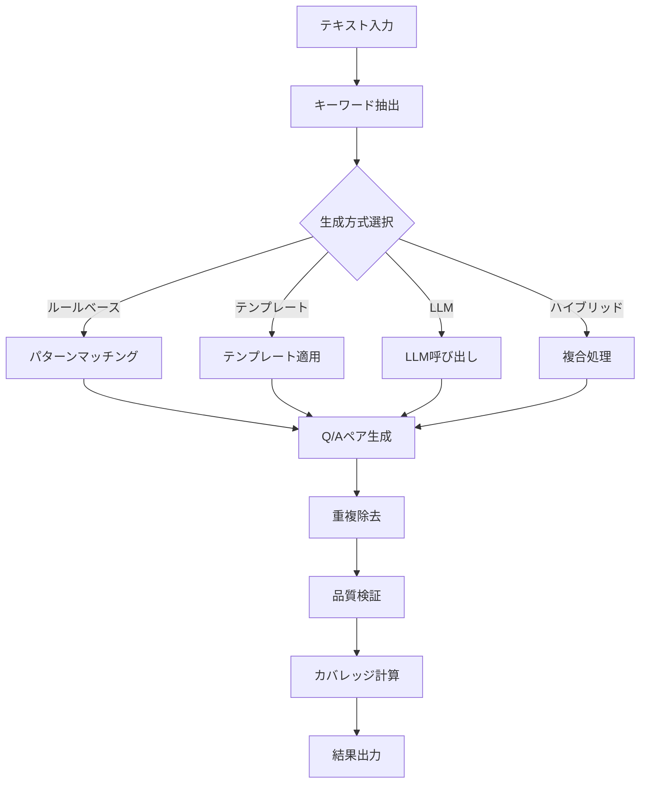
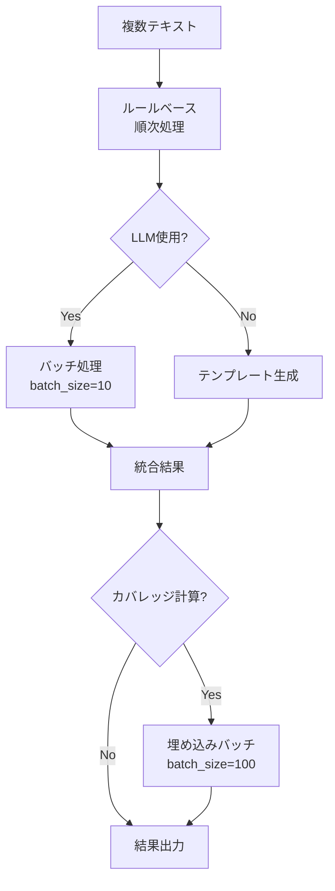

# helper_rag_qa.py 技術仕様書

最終更新日: 2025-11-05

## 概要

RAG Q&A生成のための包括的ユーティリティモジュール。キーワード抽出、Q/A生成、セマンティックカバレッジ分析など、17個の専門クラスを提供。多言語対応（英語・日本語）により、入力言語に応じた適切なQ&A生成が可能。

## ファイル情報

- **ファイル名**: helper_rag_qa.py
- **行数**: 2976行
- **主要機能**: キーワード抽出、Q/A生成、カバレッジ分析、多言語対応
- **クラス数**: 17クラス
- **対応言語**: 英語（en）、日本語（ja）

## クラス一覧

### キーワード抽出関連（4クラス）
1. **BestKeywordSelector** (L57-222) - 3手法比較選択
2. **SmartKeywordSelector** (L224-473) - 自動最適化
3. **QACountOptimizer** (L475-685) - 最適Q/A数決定
4. **QAOptimizedExtractor** (L687-1479) - Q/A特化抽出

### セマンティックカバレッジ関連（2クラス）
5. **SemanticCoverage** (L1481-1666) - 網羅性測定
6. **QAGenerationConsiderations** (L1668-1703) - 生成前チェック

### データモデル（2クラス）
7. **QAPair** (L1705-1712) - Q/Aペアモデル
8. **QAPairsList** (L1714-1716) - Q/Aリスト

### Q/A生成関連（9クラス）
9. **LLMBasedQAGenerator** (L1719-1801) - LLM生成
10. **ChainOfThoughtQAGenerator** (L1803-1857) - CoT生成
11. **RuleBasedQAGenerator** (L1859-1950) - ルール生成
12. **TemplateBasedQAGenerator** (L1952-2032) - テンプレート生成
13. **HybridQAGenerator** (L2034-2123) - ハイブリッド生成
14. **AdvancedQAGenerationTechniques** (L2125-2186) - 高度技術
15. **QAGenerationOptimizer** (L2188-2249) - 最適化
16. **OptimizedHybridQAGenerator** (L2251-2547) - 最適化ハイブリッド
17. **BatchHybridQAGenerator** (L2549-2976) - バッチ処理

## 主要クラス詳細

## 1. キーワード抽出関連クラス

### 1.1 BestKeywordSelector (L57-222)

3つの手法（MeCab/正規表現/統合版）から最良のキーワードを選択。

#### 評価重み付け (L68-74)
```python
self.weights = {
    'coverage': 0.25,      # カバレージ率
    'diversity': 0.15,     # 多様性
    'technicality': 0.25,  # 専門性
    'coherence': 0.20,     # 一貫性
    'length_balance': 0.15 # 長さのバランス
}
```

#### evaluate_keywords() (L76-140)
キーワードセットの品質を5つの指標で評価:
1. **カバレージ率**: キーワードがテキストに存在する割合
2. **多様性**: 文字数の分散（標準偏差2-4文字が理想）
3. **専門性**: カタカナ・英語・漢字複合語の割合
4. **一貫性**: キーワード間の関連性
5. **長さバランス**: 2-8文字の割合

#### extract_best() (L156-202)
```python
def extract_best(
    self,
    text: str,
    top_n: int = 10,
    return_details: bool = False
) -> Dict[str, Any]:
```
- 3手法で抽出し、最良の結果を選択
- 総合スコアが最高の手法を返す

### 1.2 SmartKeywordSelector (L224-473)

テキスト特性に応じた最適なキーワード抽出。

#### モード別デフォルトtop_n (L230-237)
```python
self.mode_defaults = {
    "summary": 5,        # 要約・概要把握用
    "standard": 10,      # 標準的な分析
    "detailed": 15,      # 詳細分析
    "exhaustive": 20,    # 網羅的抽出
    "tag": 3,           # タグ付け用
}
```

#### calculate_auto_top_n() (L239-275)
テキスト特性から最適なtop_nを自動計算:
- < 100文字: 3個
- < 300文字: 5個
- < 500文字: 7個（専門用語密度で+2）
- < 1000文字: 10個（文数で+2）
- < 2000文字: 15個
- ≥ 2000文字: 20個 + log調整（最大30個）

#### find_optimal_by_coverage() (L277-312)
目標カバレージを達成する最小のtop_nを探索

#### extract_smart() (L314-373)
```python
def extract_smart(
    self,
    text: str,
    mode: str = "auto",
    target_coverage: Optional[float] = None,
    return_analysis: bool = False
) -> Dict[str, Any]:
```
モード: auto/summary/standard/detailed/exhaustive/tag/coverage

### 1.3 QACountOptimizer (L475-685)

最適なQ/A生成数を動的に決定。

#### 決定要因 (L482-506)
```python
self.factors = {
    "text_length": {
        "short": (0, 300, 3),
        "medium": (300, 1000, 5),
        "long": (1000, 2000, 8),
        "very_long": (2000, float('inf'), 12)
    },
    "complexity": {
        "simple": 0.8,
        "moderate": 1.0,
        "complex": 1.3
    },
    "information_density": {
        "low": 0.7,
        "medium": 1.0,
        "high": 1.4
    }
}
```

#### calculate_optimal_qa_count() (L508-593)
```python
def calculate_optimal_qa_count(
    self,
    text: str,
    mode: str = "standard"
) -> Dict[str, Any]:
```
- テキスト長、複雑度、情報密度を考慮
- モード別調整: standard/comprehensive/basic/adaptive

### 1.4 QAOptimizedExtractor (L687-1479)

Q/Aペア生成に最適化されたキーワード抽出。

#### extract_for_qa_generation() (L777-905)
```python
def extract_for_qa_generation(
    self,
    text: str,
    qa_count: Optional[int] = None,
    mode: str = "standard"
) -> Dict[str, Any]:
```
- Q/A生成に特化したキーワード抽出
- 関係性抽出、難易度分類、文脈情報付与

#### extract_with_relationships() (L907-1057)
エンティティ間の関係性を抽出:
- 定義関係（is_a）
- 因果関係（causes）
- 使用関係（uses）
- 変換関係（transforms）
- 文脈関係（in_context）
- 手段関係（by_means_of）
- 時系列関係（temporal）
- 共起関係（co_occurs）

#### classify_difficulty() (L1059-1115)
テキストとキーワードから難易度を判定:
- **easy**: 基本的なキーワード
- **medium**: 中程度の専門性
- **hard**: 高度な専門用語

#### generate_context_hints() (L1117-1185)
キーワード周辺の文脈情報を抽出

## 2. セマンティックカバレッジ関連クラス

### 2.1 SemanticCoverage (L1481-1666)

意味的な網羅性を測定。

#### 初期化 (L1488-1508)
```python
def __init__(self, embedding_model: str = "text-embedding-3-small"):
    self.embedding_model = embedding_model
    # APIキーの確認
    api_key = os.getenv('OPENAI_API_KEY')
    if api_key and api_key != 'your-openai-api-key-here':
        self.client = OpenAI()
        self.has_api_key = True
    else:
        self.client = None
        self.has_api_key = False
    self.tokenizer = tiktoken.get_encoding("cl100k_base")

    # MeCab利用可否チェック
    self.mecab_available = self._check_mecab_availability()
```

**更新情報 (2025-11-04)**:
- OpenAI APIキーの有無を確認し、`has_api_key`フラグを設定
- MeCabの利用可能性を自動チェックする`mecab_available`フラグを追加
- MeCab未インストール環境でも正常動作する柔軟な設計

#### _check_mecab_availability() (L1510-1520)
```python
def _check_mecab_availability(self) -> bool:
    """MeCabの利用可能性をチェック"""
    try:
        import MeCab
        # 実際にインスタンス化して動作確認
        tagger = MeCab.Tagger()
        tagger.parse("テスト")
        return True
    except (ImportError, RuntimeError):
        return False
```

MeCabライブラリのインポートと動作確認を実施:
- インポート成功時: Taggerインスタンス化して動作テスト
- 失敗時: 自動的にFalseを返し、正規表現ベース処理にフォールバック

#### create_semantic_chunks() (L1522-1592)
```python
def create_semantic_chunks(
    self,
    text: str,
    max_tokens: int = 200
) -> List[Dict]:
```
- テキストをセマンティックチャンクに分割
- 言語自動判定により、日本語/英語に適した文分割を実行
- 各チャンクが max_tokens を超えないよう調整

#### _split_into_sentences() (L1533-1556)
```python
def _split_into_sentences(self, text: str) -> List[str]:
    """文単位で分割（言語自動判定・MeCab対応）"""

    # 日本語判定（最初の100文字で判定）
    is_japanese = bool(re.search(r'[\u3040-\u309F\u30A0-\u30FF\u4E00-\u9FFF]', text[:100]))

    if is_japanese and self.mecab_available:
        # 日本語の場合、MeCab利用を試みる
        try:
            sentences = self._split_sentences_mecab(text)
            if sentences:
                return sentences
        except Exception:
            pass  # フォールバック

    # 英語 or MeCab失敗時: 正規表現
    sentences = re.split(r'(?<=[。．.!?])\s*', text)
    sentences = [s.strip() for s in sentences if s.strip()]
    return sentences
```

**新機能 (2025-11-04)**: 言語自動判定とMeCab統合
- **日本語判定**: Unicode範囲 (ひらがな・カタカナ・漢字) で判定
- **MeCab優先**: 日本語テキストかつMeCab利用可能な場合は MeCab による高精度な文境界検出を実施
- **自動フォールバック**: MeCab失敗時や英語テキストの場合、正規表現ベースの文分割を実行
- **ロバスト性**: 言語やMeCab環境に依存せず、常に適切な文分割を提供

#### _split_sentences_mecab() (L1558-1591)
```python
def _split_sentences_mecab(self, text: str) -> List[str]:
    """MeCabを使った文分割（日本語用）"""
    import MeCab

    tagger = MeCab.Tagger()
    node = tagger.parseToNode(text)

    sentences = []
    current_sentence = []

    while node:
        surface = node.surface
        features = node.feature.split(',')

        if surface:
            current_sentence.append(surface)

            # 文末判定：句点（。）、疑問符（？）、感嘆符（！）
            if surface in ['。', '．', '？', '！', '?', '!']:
                sentence = ''.join(current_sentence).strip()
                if sentence:
                    sentences.append(sentence)
                current_sentence = []

        node = node.next

    # 最後の文を追加
    if current_sentence:
        sentence = ''.join(current_sentence).strip()
        if sentence:
            sentences.append(sentence)

    return sentences if sentences else []
```

**新機能 (2025-11-04)**: MeCabによる日本語文分割
- **形態素解析**: MeCabで単語単位に分解し、文末記号を検出
- **文境界マーカー**: 。．？！?! を文末として認識
- **高精度**: 正規表現では困難な複雑な日本語文構造も正確に分割
- **エラー安全**: 空文を自動除外し、確実な結果を返す

#### generate_embeddings() (L1572-1593)
チャンクの埋め込みベクトルを生成

#### calculate_coverage() (L1608-1666)
```python
def calculate_coverage(
    self,
    chunks: List[Dict],
    qa_pairs: List[Dict],
    threshold: float = 0.7
) -> Dict:
```
- Q/Aペアによるチャンクカバレージを計算
- カバレージ率、未カバーチャンク、類似度分布を返す

### 2.2 QAGenerationConsiderations (L1668-1703)

Q/A生成前のチェックリスト。

#### チェック項目 (L1675-1702)
- 文書特性（長さ、ドメイン、言語、構造）
- Q/A要件（数、種類、難易度、カバレージ目標）
- 品質基準（回答可能性、具体性、多様性）

## 3. データモデル

### 3.1 QAPair (L1705-1712)

```python
class QAPair(BaseModel):
    question: str
    answer: str
    question_type: str
    difficulty: str
    source_span: str
```

### 3.2 QAPairsList (L1714-1716)

```python
class QAPairsList(BaseModel):
    qa_pairs: List[QAPair]
```

## 4. Q/A生成クラス

### 4.1 LLMBasedQAGenerator (L1719-1801)

LLM（GPT-5-mini）を使用したQ/A生成。

#### generate_basic_qa() (L1726-1762)
```python
def generate_basic_qa(self, text: str, num_pairs: int = 5) -> List[Dict]:
```
- Pydantic構造化出力使用
- 質問種類の多様化（What/Why/How/When/Where）

#### generate_diverse_qa() (L1764-1800)
6種類のQ/A生成:
- factual: 事実確認
- causal: 因果関係
- comparative: 比較
- inferential: 推論
- summary: 要約
- application: 応用

### 4.2 ChainOfThoughtQAGenerator (L1803-1857)

思考の連鎖（CoT）を使った高品質Q/A生成。

#### generate_with_reasoning() (L1815-1856)
5ステップ処理:
1. テキストの主要なトピックと概念を抽出
2. 各トピックについて重要な情報を特定
3. その情報を問う質問を設計
4. テキストから正確な回答を抽出
5. 質問と回答の妥当性を検証

出力形式:
```python
{
    "analysis": {
        "main_topics": [...],
        "key_concepts": [...],
        "information_density": "high/medium/low"
    },
    "qa_pairs": [
        {
            "question": "質問",
            "answer": "回答",
            "reasoning": "なぜこの質問が重要か",
            "confidence": 0.95
        }
    ]
}
```

### 4.3 RuleBasedQAGenerator (L1859-1950)

ルールベースのQ/A生成。

#### extract_definition_qa() (L1865-1894)
パターンマッチング:
- 「〜とは〜である」
- 「〜は〜と呼ばれる」

#### extract_fact_qa() (L1896-1950)
- spaCyを使用した固有表現認識
- エンティティベースのQ/A生成

### 4.4 TemplateBasedQAGenerator (L1952-2032)

テンプレートを使用したQ/A生成。

#### テンプレート種類 (L1958-1985)
- definition: 定義質問
- function: 役割質問
- method: 方法質問
- characteristic: 特徴質問
- comparison: 比較質問
- reason: 理由質問

### 4.5 HybridQAGenerator (L2034-2123)

複数手法の組み合わせ。

#### generate_hybrid_qa() (L2044-2123)
処理フロー:
1. ルールベース抽出
2. テンプレートベース生成
3. LLM生成（オプション）
4. 重複除去
5. 品質検証

### 4.6 OptimizedHybridQAGenerator (L2251-2547)

最適化されたハイブリッドQ/A生成。

#### 初期化 (L2259-2286)
```python
def __init__(
    self,
    model: str = "gpt-5-mini",
    embedding_model: str = "text-embedding-3-small"
):
    # temperature非対応モデルのリスト
    self.no_temperature_models = {
        'gpt-5-mini', 'o1-mini', 'o1-preview',
        'o3-mini', 'o3', 'o4-mini', 'o4'
    }
```

#### generate_optimized_hybrid_qa() (L2288-2395)
```python
def generate_optimized_hybrid_qa(
    self,
    text: str,
    qa_count: int = None,
    use_llm: bool = True,
    calculate_coverage: bool = True,
    document_type: str = "auto"
) -> Dict:
```

処理フロー:
1. キーワード抽出（QAOptimizedExtractor）
2. テンプレートベースQ/A生成
3. LLM品質向上（オプション）
4. カバレッジ計算（オプション）
5. 結果統合

### 4.7 BatchHybridQAGenerator (L2549-2976)

バッチ処理に最適化。

#### 初期化 (L2555-2577)
```python
def __init__(
    self,
    model: str = "gpt-5-mini",
    embedding_model: str = "text-embedding-3-small",
    batch_size: int = 10,
    embedding_batch_size: int = 100
):
```

#### generate_batch_hybrid_qa() (L2639-2729)
```python
def generate_batch_hybrid_qa(
    self,
    texts: List[str],
    qa_count: int = None,
    use_llm: bool = True,
    calculate_coverage: bool = True,
    document_type: str = "auto",
    show_progress: bool = True,
    lang: str = "en"
) -> List[Dict]:
```

**新機能 (2025-11-05)**: 多言語対応パラメータ追加
- **langパラメータ**: Q/A生成言語を明示的に指定
  - `"en"`: 英語でQ&A生成
  - `"ja"`: 日本語でQ&A生成
- **言語別プロンプト**: 言語に応じた最適なプロンプトを自動適用
- **データセット連携**: DATASET_CONFIGSの`lang`フィールドから自動取得可能

処理ステップ:
1. ルールベース抽出（各文書を順次処理）
2. LLMバッチ処理（batch_size=10、言語指定対応）
3. カバレッジ計算（embedding_batch_size=100）
4. 結果統合

#### _batch_enhance_with_llm() (L2731-2798)
```python
def _batch_enhance_with_llm(
    self,
    texts: List[str],
    rule_results: List[Dict],
    doc_type: str,
    show_progress: bool,
    lang: str = "en"
) -> List[Dict]:
```

**新機能 (2025-11-05)**: 言語パラメータ対応
- LLMでバッチ処理
- API呼び出し削減90-96%
- エラー時は個別処理にフォールバック
- 言語パラメータを `_create_batch_prompt()` に伝播

#### _create_batch_prompt() (L2800-2867)
```python
def _create_batch_prompt(
    self,
    texts: List[str],
    rule_results: List[Dict],
    doc_type: str,
    lang: str = "en"
) -> str:
```

**新機能 (2025-11-05)**: 多言語プロンプト生成
- **言語別指示文**: 日本語/英語それぞれに最適化された指示文を生成
- **文書タイプ別指示**:
  - `news`: 5W1H質問（英語）、5W1H質問（日本語）
  - `technical`: How-to質問（英語）、やり方・方法質問（日本語）
  - `academic`: Why/What-if質問（英語）、理由・仮定質問（日本語）
  - `auto`: 多様な質問タイプ

言語別プロンプト例:

**英語版 (lang="en")**:
```
Process these N documents and generate Q&A pairs for each.
Instructions:
1. Focus on 5W1H questions
2. Generate 3-5 Q&A pairs per document
3. Ensure factual accuracy
4. **IMPORTANT**: Generate questions and answers in English.
```

**日本語版 (lang="ja")**:
```
以下のN件の文書を処理し、それぞれについてQ&Aペアを生成してください。
指示:
1. 5W1H（いつ、どこで、誰が、何を、なぜ、どのように）に焦点を当てた質問を生成してください
2. 各文書について3-5個のQ&Aペアを生成
3. 事実の正確性を確保
4. **重要**: 質問と回答は必ず日本語で生成してください。
```

#### _batch_calculate_coverage() (L2808-2891)
- バッチ埋め込み処理
- API呼び出し回数を最小化

## データフロー

### 基本Q/A生成フロー



### バッチ処理フロー



## パフォーマンス最適化

### 1. バッチ処理によるAPI呼び出し削減

**通常処理**:
- 100文書 → 100回のLLM呼び出し
- 100文書 → 100回の埋め込み呼び出し

**バッチ処理**:
- 100文書 → 10回のLLM呼び出し（batch_size=10）
- 100文書 → 1回の埋め込み呼び出し（batch_size=100）

**削減率**: 90-96%

### 2. temperature非対応モデルの処理 (L2268-2280)

```python
if self.model not in self.no_temperature_models:
    api_params["temperature"] = 0.7
```

### 3. キャッシュとメモ化

- 埋め込み結果のキャッシュ
- キーワード抽出結果の再利用
- 重複チェックの効率化

## 使用例

### 例1: 基本的なキーワード抽出

```python
from helper_rag_qa import BestKeywordSelector

selector = BestKeywordSelector()
result = selector.extract_best(text, top_n=10)

print(f"最良手法: {result['best_method']}")
print(f"キーワード: {result['keywords']}")
print(f"理由: {result['reason']}")
```

### 例2: スマートキーワード抽出

```python
from helper_rag_qa import SmartKeywordSelector

smart_selector = SmartKeywordSelector()
result = smart_selector.extract_smart(text, mode="auto")

print(f"自動決定top_n: {result['auto_top_n']}")
print(f"キーワード: {result['keywords']}")
```

### 例3: Q/A生成（ハイブリッド）

```python
from helper_rag_qa import OptimizedHybridQAGenerator

generator = OptimizedHybridQAGenerator(model="gpt-5-mini")
result = generator.generate_optimized_hybrid_qa(
    text,
    qa_count=10,
    use_llm=True,
    calculate_coverage=True
)

print(f"生成数: {len(result['qa_pairs'])}")
print(f"カバレージ: {result['coverage']['coverage_rate']:.1%}")
```

### 例4: バッチQ/A生成（英語）

```python
from helper_rag_qa import BatchHybridQAGenerator

batch_generator = BatchHybridQAGenerator(
    model="gpt-5-mini",
    batch_size=10,
    embedding_batch_size=100
)

# 英語データセットの場合
results = batch_generator.generate_batch_hybrid_qa(
    texts=english_text_list,
    qa_count=12,
    use_llm=True,
    calculate_coverage=True,
    show_progress=True,
    lang="en"  # 英語指定
)

for i, result in enumerate(results):
    print(f"文書{i+1}: {len(result['qa_pairs'])}個のQ/A生成")
```

### 例5: バッチQ/A生成（日本語）

```python
from helper_rag_qa import BatchHybridQAGenerator

batch_generator = BatchHybridQAGenerator(
    model="gpt-5-mini",
    batch_size=10,
    embedding_batch_size=100
)

# 日本語データセットの場合
results = batch_generator.generate_batch_hybrid_qa(
    texts=japanese_text_list,
    qa_count=12,
    use_llm=True,
    calculate_coverage=True,
    show_progress=True,
    lang="ja"  # 日本語指定
)

for i, result in enumerate(results):
    print(f"文書{i+1}: {len(result['qa_pairs'])}個のQ/A生成")
```

## エラー処理

### API呼び出しエラー

```python
try:
    response = self.client.chat.completions.create(...)
except Exception as e:
    # フォールバック処理
    qa_pairs = self._template_to_qa(rule_result)
```

### バッチ処理エラー

```python
try:
    batch_results = self._parse_batch_response(response)
except Exception as e:
    # 個別処理にフォールバック
    for i in range(len(batch_texts)):
        qa_pairs = self._template_to_qa(batch_rules[i])
```

## コスト計算

### モデル別料金 (L2521-2537)

```python
model_pricing = {
    "gpt-5-mini": {"input": 0.00015, "output": 0.0006},
    "gpt-4o": {"input": 0.005, "output": 0.015},
    "gpt-4o-mini": {"input": 0.00015, "output": 0.0006},
}
```

### コスト計算 (L2539-2546)

```python
cost = (input_tokens * pricing["input"] +
        output_tokens * pricing["output"]) / 1_000_000
```

## 依存ライブラリ

```python
from regex_mecab import KeywordExtractor
import re, math, json, os
from collections import defaultdict
import numpy as np
import tiktoken
from openai import OpenAI
from pydantic import BaseModel
import spacy
from tqdm import tqdm
```

## 注意事項

1. **APIキー設定**: 環境変数 OPENAI_API_KEY が必須
2. **モデル選択**: temperature非対応モデルに注意
3. **バッチサイズ**: LLM推奨10-20、埋め込み推奨100-150
4. **日本語処理**: spaCy ja_core_news_lg モデル必須
5. **トークン制限**: 各モデルの最大トークン数を確認

## トラブルシューティング

### 問題1: KeywordExtractor not found
**対処**: regex_mecab.pyが同ディレクトリに存在するか確認

### 問題2: spaCy model not found
**対処**:
```bash
python -m spacy download ja_core_news_lg
```

### 問題3: temperature error
**対処**: モデルがno_temperature_modelsリストにあるか確認

### 問題4: バッチ処理メモリエラー
**対処**: batch_sizeを減らす

## まとめ

helper_rag_qa.pyは、RAG Q/A生成のための包括的なユーティリティモジュールです。

### 主要な特徴

1. **多様なキーワード抽出**: 3手法比較選択、スマート自動調整
2. **柔軟なQ/A生成**: ルール、テンプレート、LLM、ハイブリッド
3. **バッチ処理最適化**: API呼び出し削減90-96%
4. **カバレッジ分析**: セマンティック類似度計算、品質評価
5. **多言語対応 (2025-11-05追加)**: 英語・日本語の自動判定と言語別Q/A生成

### 推奨用途

- 大規模文書のQ/A生成
- カバレッジ重視の分析
- コスト最適化が必要な環境
- バッチ処理による高速化
- 多言語データセットの処理（英語・日本語）

### 更新履歴

**2025-11-05**:
- `BatchHybridQAGenerator.generate_batch_hybrid_qa()` に `lang` パラメータを追加
- `_batch_enhance_with_llm()` に言語パラメータ対応を追加
- `_create_batch_prompt()` に多言語プロンプト生成機能を実装
- 英語・日本語それぞれに最適化されたプロンプトテンプレートを追加
- 文書タイプ別（news/technical/academic）の言語別指示文を実装

**2025-11-04**:
- `SemanticCoverage` にMeCab利用可能性チェック機能を追加
- `_split_into_sentences()` に言語自動判定とMeCab統合を実装
- `_split_sentences_mecab()` による高精度な日本語文分割を追加
- MeCab未インストール環境でも正常動作する自動フォールバック機能を実装

---
最終更新: 2025-11-05
作成者: OpenAI RAG Q/A JP Development Team