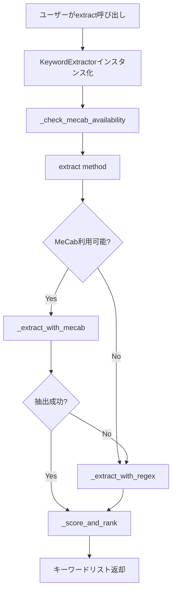
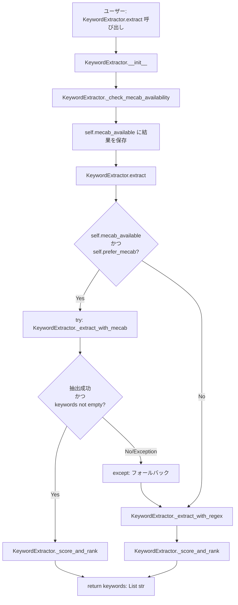
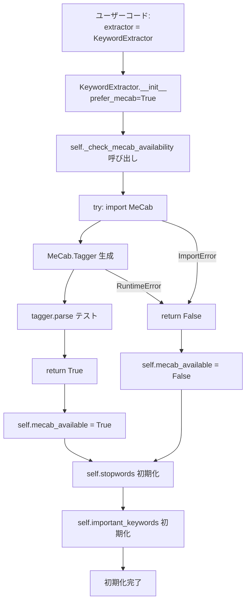
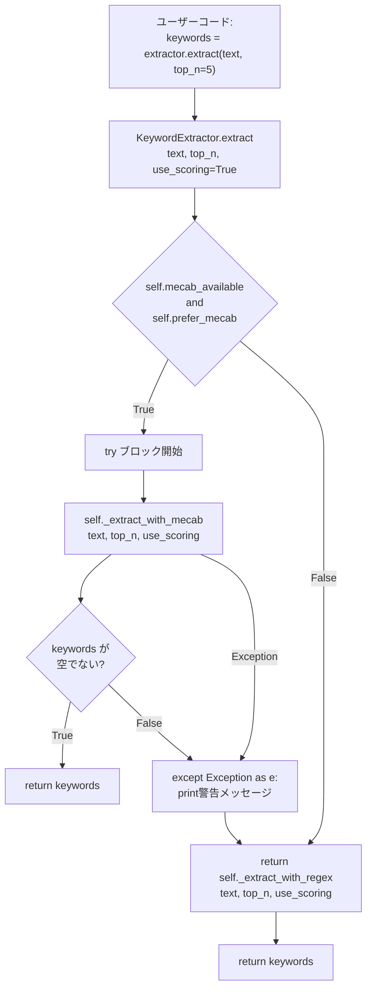
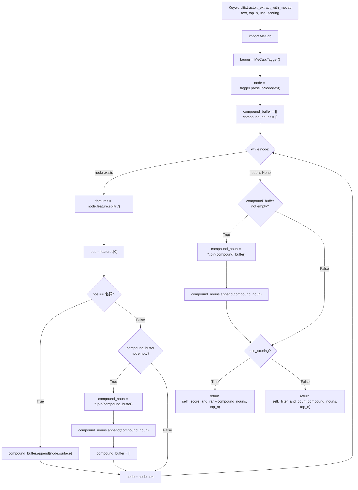
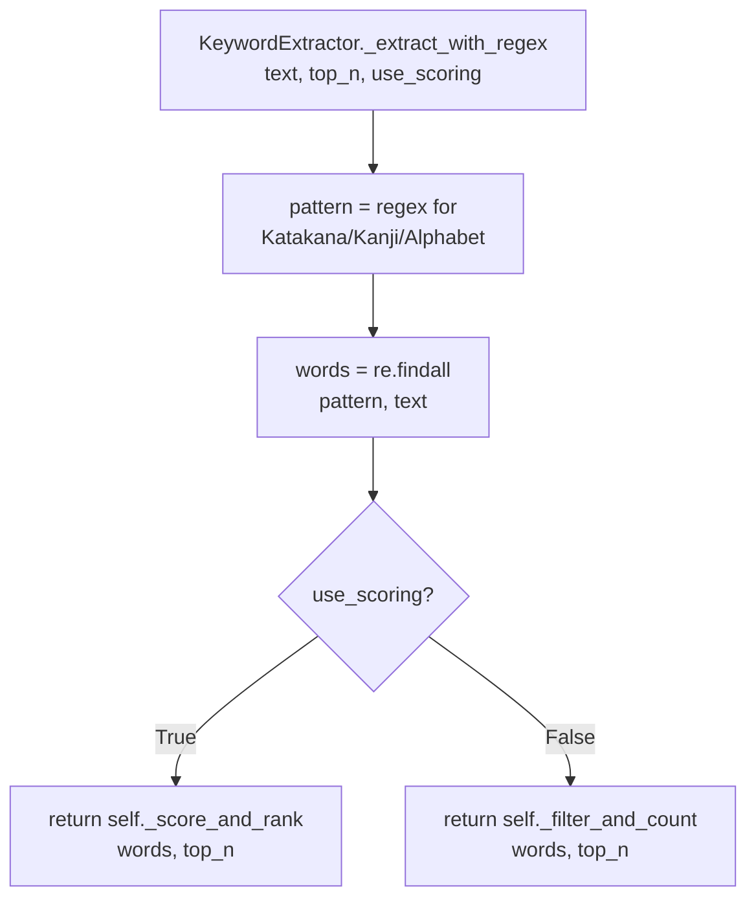
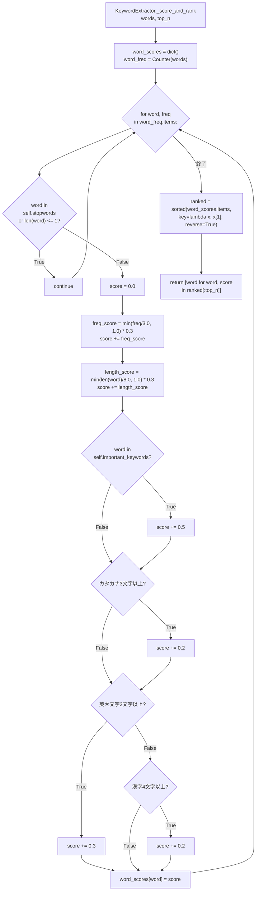
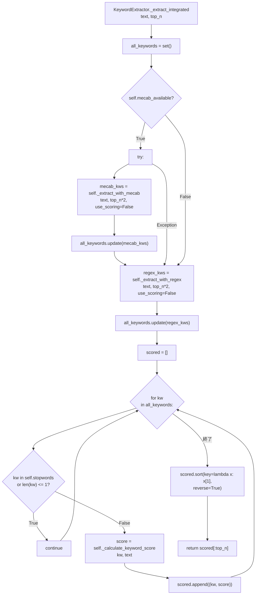
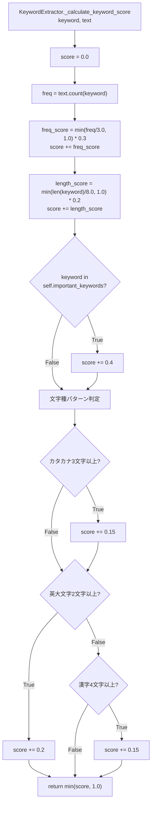

クラス一覧表

| クラス名                           | 行番号     | 概要                   | 主要機能         | 継承元       |
|--------------------------------|---------|----------------------|---------------------------------------------------|-
----------|
| SemanticCoverage               | 13-183  | 意味的な網羅性を測定するクラス      | - 文書のセマンティックチャンク分割-埋め込みベクトル生成- コサイン類似度計算         | なし        |
| QAGenerationConsiderations     | 188-222 | Q/A生成前のチェックリスト       | - 文書特性の分析- Q/A要件の定義-品質基準の設定                      | なし        |
| QAPair                         | 233-240 | Q/Aペアのデータモデル         | Pydanticモデルとしてデータ構造を定義   | BaseModel |
| QAPairsList                    | 241-243 | Q/Aペアのリスト            | Q/Aペアのリスト構造を定義| BaseModel |
| LLMBasedQAGenerator            | 245-326 | LLMを使用したQ/A生成        | - 基本的なQ/A生成- 多様な種類のQ/A生成-OpenAI APIとの統合          | なし        |
| ChainOfThoughtQAGenerator      | 331-375 | 思考の連鎖を使った高品質Q/A生成    | - 推論過程付きのQ/A生成-ステップバイステップの分析- 信頼度スコアの算出          | なし        |
| RuleBasedQAGenerator           | 385-475 | ルールベースのQ/A生成         | - 定義文からのQ/A抽出-事実情報からのQ/A生成- 列挙パターンからのQ/A生成       | なし        |
| TemplateBasedQAGenerator       | 480-554 | テンプレートを使用したQ/A生成     | - 質問テンプレートの管理-エンティティベースのQ/A生成- テンプレートとテキストのマッチング | なし        |
| HybridQAGenerator              | 560-649 | 複数の手法を組み合わせた高度なQ/A生成 | - 包括的なQ/A生成パイプライン-品質検証と改善- 重複除去と最適化              | なし        |
| AdvancedQAGenerationTechniques | 654-714 | 高度なQ/A生成技術           | - 敵対的Q/A生成- マルチホップ推論Q/A-反事実的Q/A生成                | なし        |
| QAGenerationOptimizer          | 719-779 | Q/A生成の最適化            | - カバレッジ最大化戦略- 適応的生成-コスト最適化                       | なし        |

クラスの詳細な特徴

1. SemanticCoverage (中核クラス)

- OpenAI Embeddings APIを活用
- 文書を意味的に一貫したチャンクに分割
- トークン数を考慮した最適化

2. Q/A生成クラス群

- LLMベース: GPT-5-miniを使用した高品質生成
- ルールベース: 正規表現とNLPによる確実な生成
- テンプレートベース: 事前定義パターンによる効率的生成
- ハイブリッド: 各手法の長所を組み合わせた統合アプローチ

3. 高度な技術クラス

- ChainOfThought: 推論過程を明示化した生成
- AdvancedTechniques: 敵対的・マルチホップ・反事実的Q/A
- Optimizer: カバレッジとコストの最適化

4. データモデル

- Pydanticを使用した型安全なデータ構造
- JSONシリアライズ可能な出力形式

このファイルは、RAGシステムにおけるQ/A生成の包括的なフレームワークを提供しており、様々な手法を組み合わせて高品質なQ/Aペ
アを生成できる設計になっています。

### coverage

⏺ 統合版の処理フロー詳細解説

全体像

統合版の処理の流れを利用クラス、関数を用いて分かりやすく説明せよ。

⏺ 統合版の処理フロー詳細解説（クラス・関数名明記版）

全体像

---

詳細処理フロー（関数レベル）

Phase 1: 初期化

関連するクラス・関数:

- KeywordExtractor.__init__(prefer_mecab: bool)
- KeywordExtractor._check_mecab_availability() -> bool
- MeCab.Tagger()
- MeCab.Tagger.parse(str) -> str

  ---

  Phase 2: キーワード抽出開始

関連するクラス・関数:

- KeywordExtractor.extract(text:str, top_n: int, use_scoring: bool) -> List[str]
- KeywordExtractor._extract_with_mecab(text: str, top_n: int, use_scoring: bool) -> List[str]
- KeywordExtractor._extract_with_regex(text: str, top_n: int, use_scoring: bool) -> List[str]

---

Phase 3-A: MeCab版抽出処理

関連するクラス・関数:

- KeywordExtractor._extract_with_mecab(text: str, top_n: int, use_scoring: bool) -> List[str]
- MeCab.Tagger()
- MeCab.Tagger.parseToNode(str) -> Node
- MeCab.Node.feature: str
- MeCab.Node.surface: str
- MeCab.Node.next: Node
- KeywordExtractor._score_and_rank(words: List[str], top_n: int) -> List[str]
- KeywordExtractor._filter_and_count(words: List[str], top_n: int) -> List[str]

---

Phase 3-B: 正規表現版抽出処理

関連するクラス・関数:

- KeywordExtractor._extract_with_regex(text: str, top_n: int, use_scoring: bool) -> List[str]
- re.findall(pattern: str, string: str) -> List[str]
- KeywordExtractor._score_and_rank(words: List[str], top_n: int) -> List[str]
- KeywordExtractor._filter_and_count(words: List[str], top_n: int) -> List[str]

---

Phase 4: スコアリング処理

関連するクラス・関数:

- KeywordExtractor._score_and_rank(words: List[str], top_n: int) -> List[str]
- collections.Counter(words: List[str]) -> Counter
- Counter.items() -> ItemsView
- re.match(pattern: str, string: str) -> Optional[Match]
- sorted(iterable, key, reverse) -> List
- self.stopwords: Set[str]
- self.important_keywords: Set[str]

  ---

  Phase 5: 統合版処理（extract_with_details使用時）

関連するクラス・関数:

- KeywordExtractor._extract_integrated(text: str, top_n: int) -> List[Tuple[str, float]]
- KeywordExtractor._extract_with_mecab(text: str, top_n: int, use_scoring: bool) -> List[str]
- KeywordExtractor._extract_with_regex(text: str, top_n: int, use_scoring: bool) -> List[str]
- set.update(iterable)
- KeywordExtractor._calculate_keyword_score(keyword: str, text: str) -> float
- list.sort(key, reverse)
- self.stopwords: Set[str]

  ---

  Phase 6: 詳細スコア計算

関連するクラス・関数:

- KeywordExtractor._calculate_keyword_score(keyword: str, text: str) -> float
- str.count(sub: str) -> int
- len(obj) -> int
- min(a, b) -> number
- self.important_keywords: Set[str]

  ---

  クラス・関数一覧表

  KeywordExtractorクラスのメソッド

| メソッド名                     | 引数                                       | 戻り値                                |

| 説明                             |                                          |                                    |  |
| -------------------------------- | ---------------------------------------- | ---------------------------------- | - |
| -------                          |                                          |                                    |  |
| __init__                         | prefer_mecab: bool                       | なし                               |  |
| 初期化、MeCab可用性チェック      |                                          |                                    |  |
| _check_mecab_availability        | なし                                     | bool                               |  |
| MeCabのインポート・動作確認      |                                          |                                    |  |
| extract                          | text: str, top_n: int, use_scoring: bool | List[str]                          |  |
| メイン抽出（自動フォールバック） |                                          |                                    |  |
| _extract_with_mecab              | text: str, top_n: int, use_scoring: bool | List[str]                          |  |
| MeCab複合名詞抽出                |                                          |                                    |  |
| _extract_with_regex              | text: str, top_n: int, use_scoring: bool | List[str]                          |  |
| 正規表現抽出                     |                                          |                                    |  |
| _extract_integrated              | text: str, top_n: int                    | List[Tuple[str, float]]            |  |
| 統合版（両手法マージ）           |                                          |                                    |  |
| _score_and_rank                  | words: List[str], top_n: int             | List[str]                          |  |
| スコアリング＋ランキング         |                                          |                                    |  |
| _filter_and_count                | words: List[str], top_n: int             | List[str]                          |  |
| 頻度ベースフィルタ               |                                          |                                    |  |
| _calculate_keyword_score         | keyword: str, text: str                  | float                              |  |
| 個別キーワードのスコア計算       |                                          |                                    |  |
| extract_with_details             | text: str, top_n: int                    | Dict[str, List[Tuple[str, float]]] |  |
| 3手法すべての詳細結果            |                                          |                                    |  |

外部ライブラリの関数・クラス

| クラス/関数                    | 説明                     |
| ------------------------------ | ------------------------ |
| MeCab.Tagger()                 | MeCab形態素解析器の生成  |
| MeCab.Tagger.parseToNode(str)  | テキストをノード列に解析 |
| MeCab.Node.feature             | 品詞情報（CSV形式）      |
| MeCab.Node.surface             | 表層形（単語そのもの）   |
| MeCab.Node.next                | 次のノードへのポインタ   |
| re.findall(pattern, string)    | 正規表現マッチング       |
| re.match(pattern, string)      | 先頭からのパターンマッチ |
| collections.Counter(list)      | リストの要素頻度カウント |
| sorted(iterable, key, reverse) | ソート（降順/昇順）      |

---

この図により、どのクラス・関数が、いつ、どのように呼び出されるかが明確になります。
