# make_qa.py 詳細設計書

## 1. 概要

### 1.1 目的
`make_qa.py`は、日本語文書から自動的にQ&A（質問・回答）ペアを生成し、文書のセマンティックカバレージを評価・改善するためのツールです。

### 1.2 主要機能
- 文書の意味的チャンク分割
- OpenAI GPTモデルを使用した自動Q&Aペア生成
- セマンティックカバレージ分析
- カバレージ自動改善
- 結果の可視化

## 2. システムアーキテクチャ

### 2.1 全体アーキテクチャ図

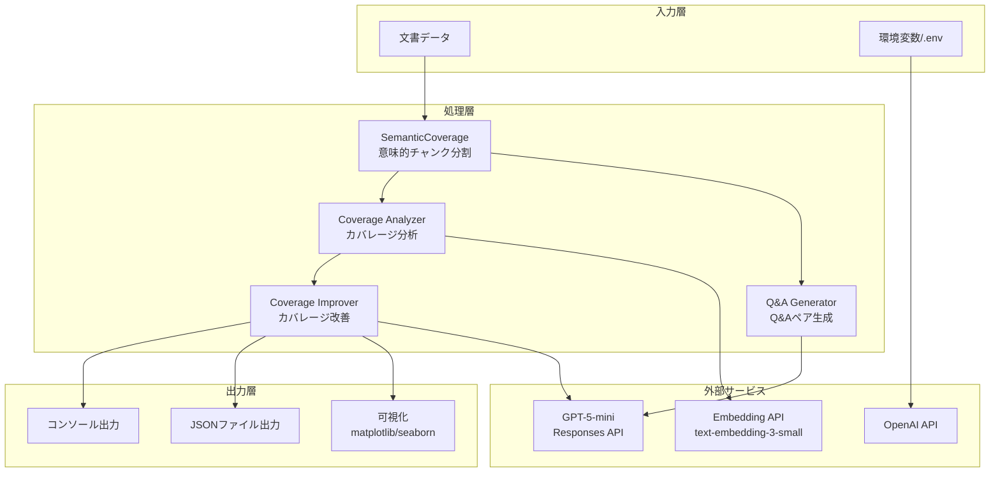

### 2.2 データフロー図

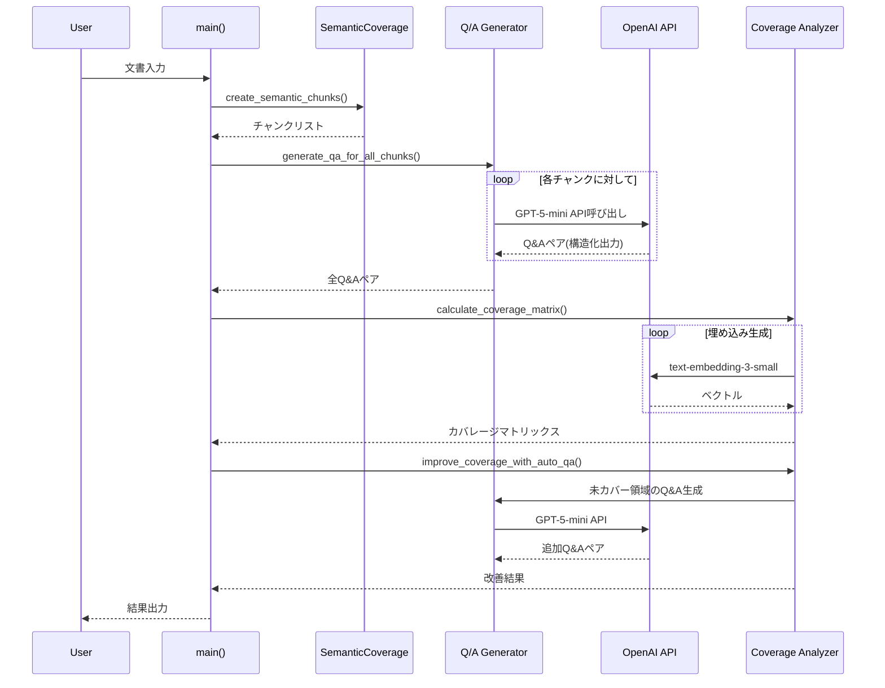

## 3. モジュール設計

### 3.1 モジュール構成図

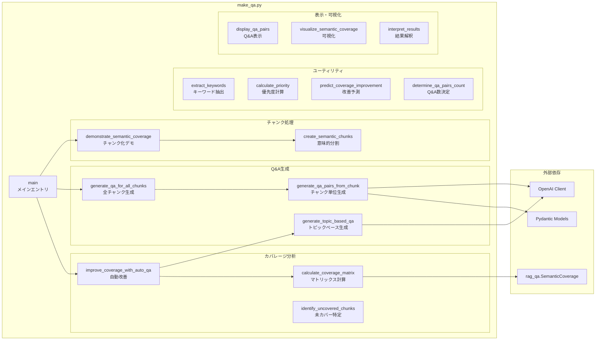

## 4. クラス設計

### 4.1 Pydanticモデル

```python
class QAPair(BaseModel):
    question: str        # 質問文
    answer: str         # 回答文
    question_type: str  # 質問タイプ (fact/reason/comparison/application)

class QAPairsResponse(BaseModel):
    qa_pairs: List[QAPair]  # Q&Aペアのリスト
```

### 4.2 データ構造

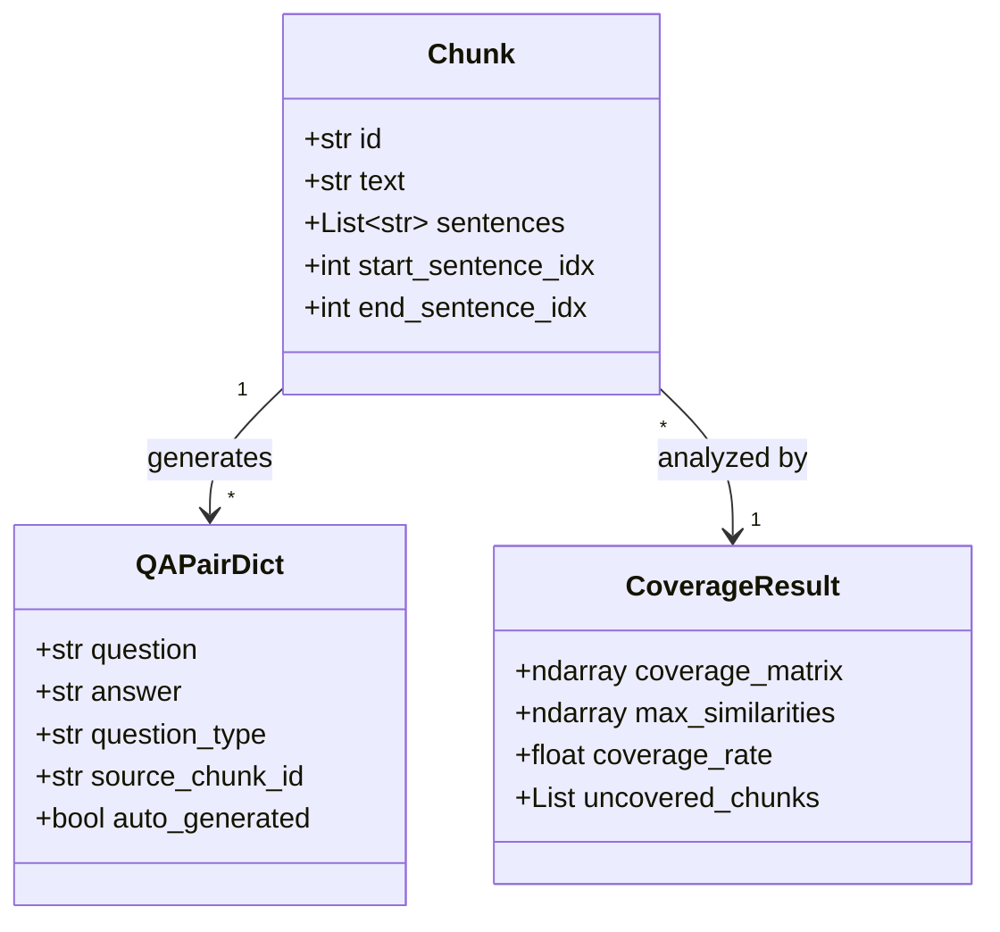

## 5. 主要アルゴリズム

### 5.1 セマンティックチャンク分割アルゴリズム

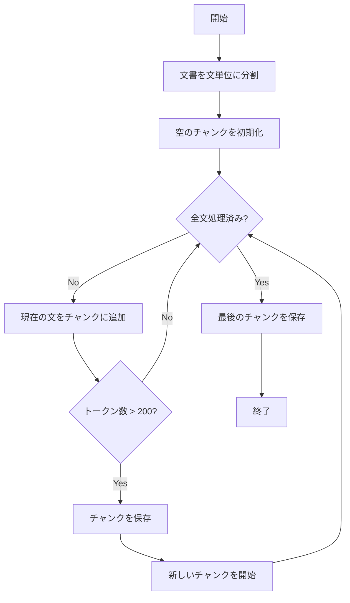

### 5.2 Q&Aペア生成アルゴリズム

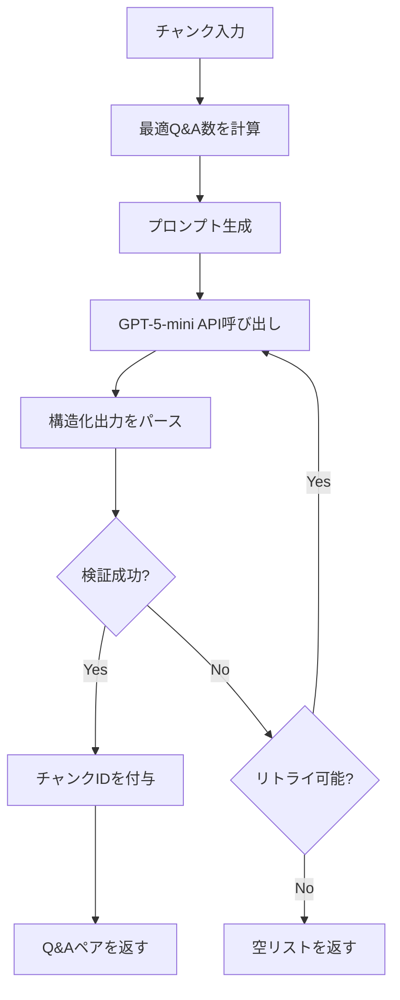

### 5.3 カバレージ改善アルゴリズム

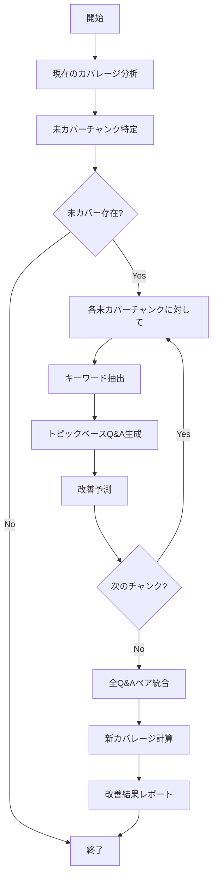

## 6. API仕様

### 6.1 主要関数インターフェース

| 関数名 | 入力 | 出力 | 説明 |
|--------|------|------|------|
| `create_semantic_chunks(text)` | str | List[Dict] | 文書を意味的チャンクに分割 |
| `generate_qa_pairs_from_chunk(chunk, model)` | Dict, str | List[Dict] | チャンクからQ&Aペア生成 |
| `calculate_coverage_matrix(chunks, qa_pairs, analyzer)` | List, List, obj | ndarray, ndarray | カバレージマトリックス計算 |
| `improve_coverage_with_auto_qa(chunks, qa_pairs, analyzer)` | List, List, obj | List, float, float | カバレージ自動改善 |
| `extract_keywords(text, top_n, use_mecab)` | str, int, bool | List[str] | キーワード抽出 |

### 6.2 OpenAI API使用仕様

```yaml
Embedding API:
  model: text-embedding-3-small
  endpoint: embeddings
  用途: テキストのベクトル化

Responses API:
  model: gpt-5-mini
  endpoint: responses.parse
  用途: 構造化Q&Aペア生成
  出力形式: Pydantic Model (QAPairsResponse)
```

## 7. 処理フロー

### 7.1 メイン処理フロー

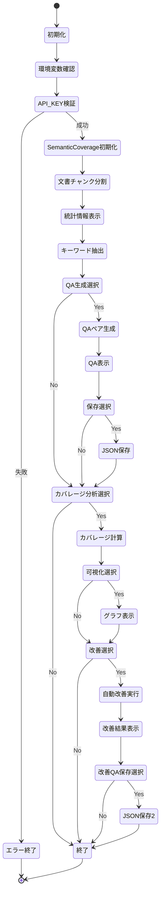

## 8. エラーハンドリング

### 8.1 エラー処理戦略

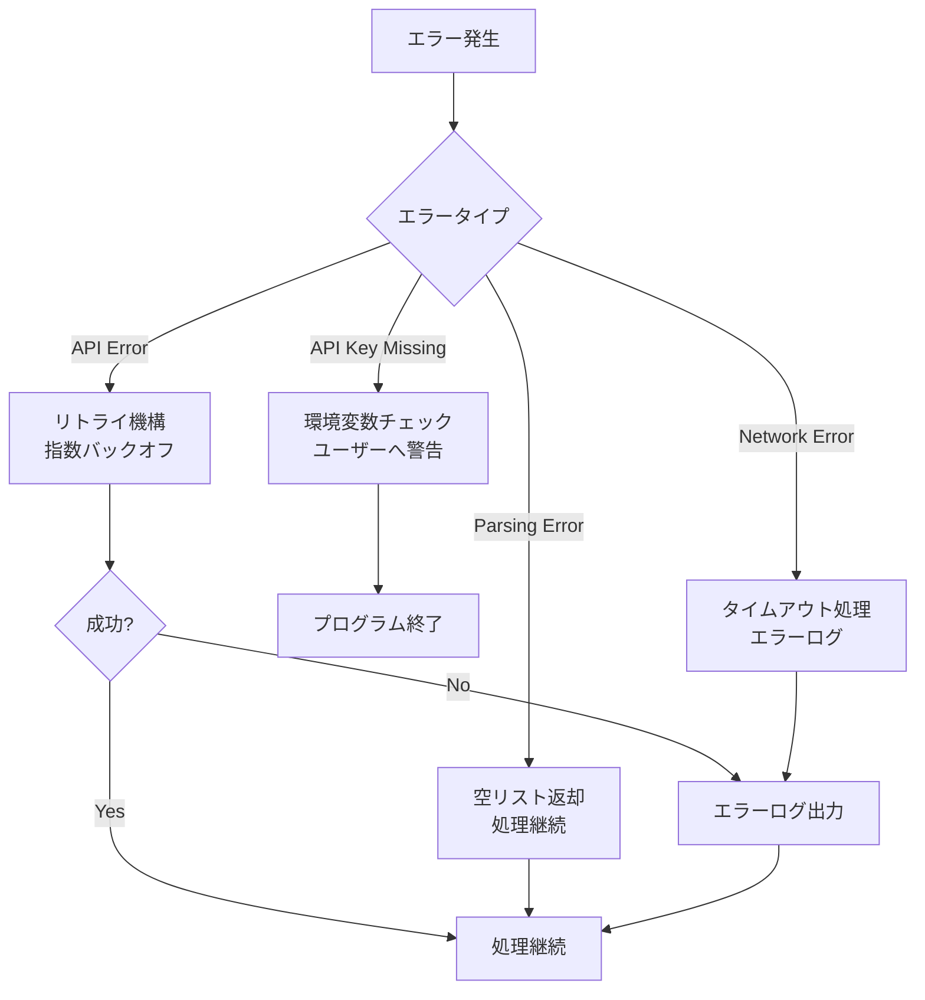

### 8.2 リトライ機構

```python
最大リトライ回数: 3
バックオフ戦略: 指数バックオフ (2^attempt秒)
対象エラー:
  - OpenAI APIタイムアウト
  - レート制限エラー
  - 一時的なネットワークエラー
```

## 9. パフォーマンス最適化

### 9.1 最適化戦略

| 最適化項目 | 実装方法 | 効果 |
|------------|----------|------|
| バッチ処理 | 複数チャンクの並列処理 | API呼び出し回数削減 |
| キャッシュ | 埋め込みベクトルのキャッシュ | 再計算回避 |
| トークン数制限 | チャンクサイズ200トークン | API コスト削減 |
| 早期終了 | カバレージ閾値達成時の処理終了 | 不要な処理削減 |

### 9.2 スケーラビリティ

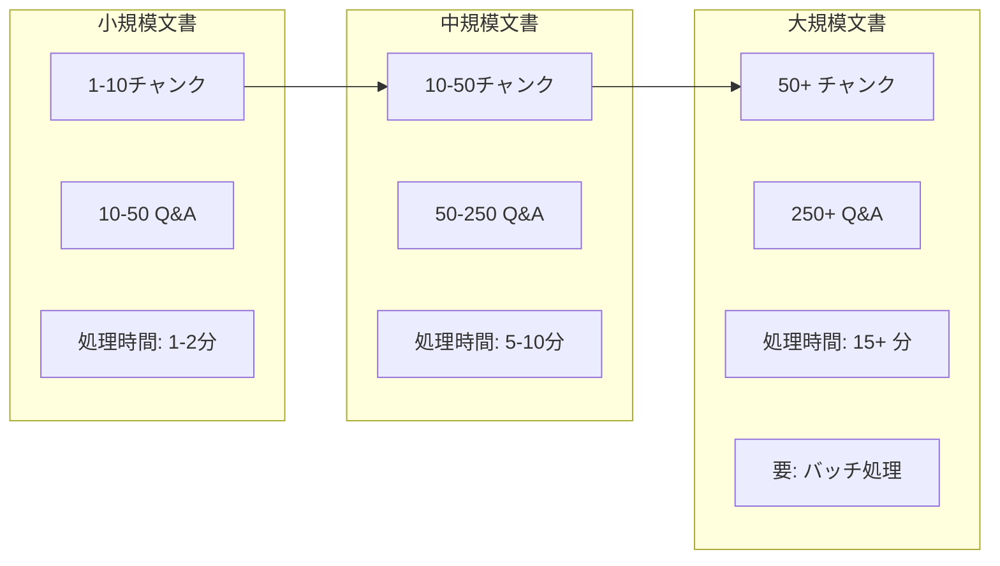

## 10. 設定パラメータ

### 10.1 設定可能パラメータ

```yaml
チャンク分割:
  max_tokens_per_chunk: 200  # チャンクあたり最大トークン数
  tokenizer: cl100k_base      # 使用するトークナイザー

Q&A生成:
  model: gpt-5-mini          # 使用するGPTモデル
  min_qa_pairs: 2            # チャンクあたり最小Q&A数
  max_qa_pairs: 5            # チャンクあたり最大Q&A数
  retry_count: 3             # APIリトライ回数

カバレージ分析:
  similarity_threshold: 0.7   # カバレージ判定閾値
  embedding_model: text-embedding-3-small  # 埋め込みモデル

可視化:
  heatmap_colormap: RdYlGn   # ヒートマップの配色
  figure_size: (12, 10)      # グラフサイズ
```

## 11. 使用例

### 11.1 基本的な使用方法

```python
# 1. 環境設定
export OPENAI_API_KEY="your-api-key"

# 2. スクリプト実行
python make_qa.py

# 3. 対話的オプション選択
# - Q&Aペア生成: y/n
# - カバレージ分析: y/n
# - 結果可視化: y/n
# - 自動改善: y/n
# - 結果保存: y/n
```

### 11.2 出力例

```
【分割結果】
総チャンク数: 3
----------------------------------------
■ チャンク 1 (ID: chunk_0)
  文の数: 2
  トークン数: 45
  内容: 人工知能（AI）は、機械学習と深層学習を基盤として...

【生成されたQ/Aペア】
Q1: トランスフォーマーモデルはどの分野で成果を上げていますか？
A1: 自然言語処理（NLP）の分野で革命的な成果を上げています。
タイプ: fact

【カバレージ改善結果】
初期カバレージ率: 66.7%
最終カバレージ率: 100.0%
改善度: +33.3%
```

## 12. 依存関係

### 12.1 外部ライブラリ

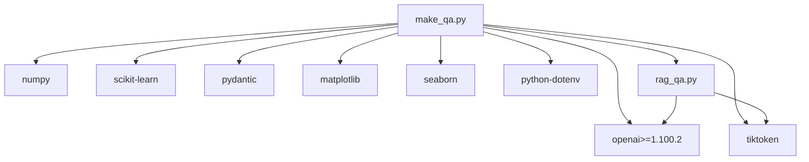

### 12.2 内部モジュール依存

- `rag_qa.py`: SemanticCoverageクラス（チャンク分割、埋め込み生成）
- `example_mecab.py`: 日本語形態素解析（オプション）

## 13. テスト戦略

### 13.1 テスト項目

| テストレベル | 対象 | 検証内容 |
|------------|------|---------|
| 単体テスト | 各関数 | 入出力の正確性 |
| 統合テスト | API連携 | OpenAI API応答処理 |
| E2Eテスト | 全体フロー | チャンク分割→Q&A生成→カバレージ分析 |
| 性能テスト | 大規模文書 | 処理時間、メモリ使用量 |

### 13.2 テストケース例

```python
# チャンク分割テスト
def test_semantic_chunks():
    text = "短い文書。これはテストです。"
    chunks = create_semantic_chunks(text)
    assert len(chunks) == 1
    assert chunks[0]['sentences'] == 2

# Q&A生成テスト
def test_qa_generation():
    chunk = {"id": "test", "text": "AIは重要です。"}
    qa_pairs = generate_qa_pairs_from_chunk(chunk)
    assert len(qa_pairs) >= 2
    assert all('question' in qa for qa in qa_pairs)

# カバレージ計算テスト
def test_coverage_calculation():
    chunks = [...]
    qa_pairs = [...]
    matrix, similarities = calculate_coverage_matrix(chunks, qa_pairs, analyzer)
    assert matrix.shape == (len(chunks), len(qa_pairs))
    assert 0 <= similarities.all() <= 1
```

## 14. 今後の拡張予定

### 14.1 機能拡張ロードマップ

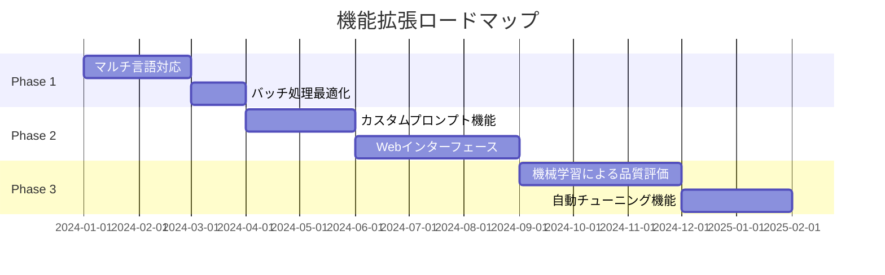

### 14.2 改善項目

1. **パフォーマンス改善**
   - 非同期処理の導入
   - Redis等によるキャッシュ層追加
   - GPUを活用した埋め込み計算

2. **機能拡張**
   - 複数文書の一括処理
   - カスタマイズ可能なQ&Aテンプレート
   - 品質スコアリング機能

3. **ユーザビリティ向上**
   - GUI/Webインターフェース
   - 進捗バー表示
   - 詳細なエラーメッセージ

## 15. ライセンスとコントリビューション

### 15.1 ライセンス
MIT License

### 15.2 コントリビューションガイドライン
- コードスタイル: PEP 8準拠
- ドキュメント: 日本語コメント必須
- テスト: 新機能には単体テスト追加
- プルリクエスト: feature/ブランチから作成

---

*最終更新: 2025年1月*
*バージョン: 1.0.0*