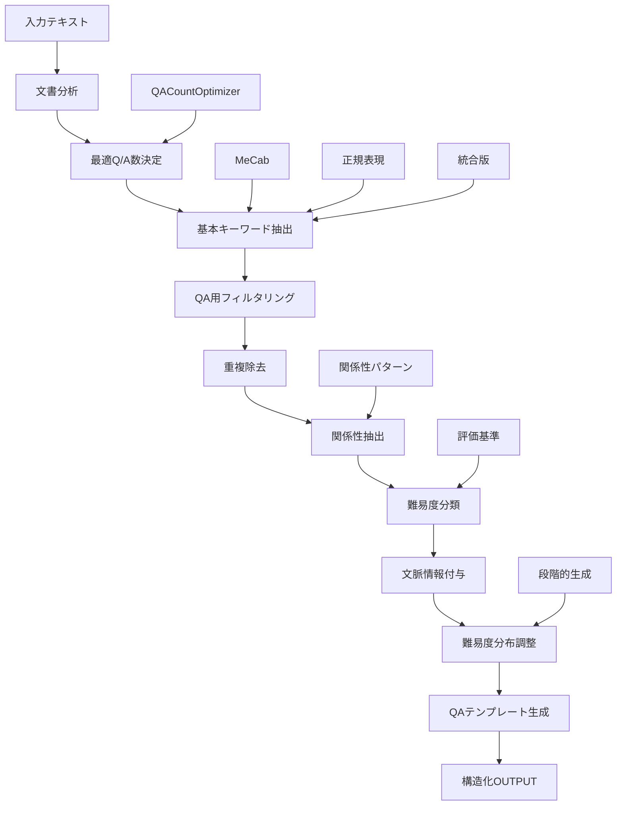

# a10_qa_optimized.py ドキュメント

#### ---------------------------------------------

ハイブリッド版

実装内容

1. helper_rag_qa.pyにOptimizedHybridQAGeneratorクラスを追加

- gpt-5-miniをデフォルトモデルとして設定
- 複数のモデルをサポート（gpt-5, gpt-4o, o1, o3シリーズなど）
- ルールベース → LLM品質向上 → カバレージ計算の3段階処理

2. 新ファイルa10_qa_optimized_hybrid.pyを作成

- ハイブリッドアプローチの完全実装
- コマンドラインオプションでモデル選択可能
- コスト見積もり機能付き

使用方法

# 基本使用（gpt-5-mini使用）

python a10_qa_optimized_hybrid.py --dataset cc_news

# モデル指定

python a10_qa_optimized_hybrid.py --dataset cc_news --model gpt-5-mini

# ルールベースのみ（コスト0円）

python a10_qa_optimized_hybrid.py --dataset cc_news --no-llm

# コスト見積もり

python a10_qa_optimized_hybrid.py --dataset cc_news --estimate-only

改善効果


| 項目              | 従来版 (a10_qa_optimized.py) | ハイブリッド版                   |
| ----------------- | ---------------------------- | -------------------------------- |
| API使用回数       | 0回                          | 497回（LLM） + 994回（埋め込み） |
| コスト（497記事） | $0.00                        | $0.07（gpt-5-mini使用時）        |
| 品質              | テンプレートベース           | 自然な質問文、文脈考慮           |
| カバレージ測定    | なし                         | セマンティック類似度で測定       |
| 柔軟性            | 固定                         | モデル選択可、文書タイプ対応     |

特徴

- 段階的処理: ルールベースで候補生成 → LLMで品質向上
- コスト効率: 必要な部分のみLLMを使用（$0.00014/文書）
- カバレージ保証: 埋め込みベースで網羅性を定量化
- モデル選択: 8種類のモデルから選択可能
- 文書タイプ最適化: news/technical/academicに応じた生成

#### ---------------------------------------------

## 概要

`a10_qa_optimized.py`は、Q&Aペア生成に特化したキーワード抽出システムです。MeCabと正規表現の両手法を統合し、キーワード間の関係性抽出、難易度分類、文脈情報保持を通じて、高品質なQ&A生成を支援します。文書の特性に応じた最適なQ/A数の自動決定機能も備えています。

## 主要機能

1. **Q&A特化型キーワードフィルタリング** - Q&A生成に不適切な一般語を除外
2. **冗長性除去** - 包含関係や同義語の統合
3. **関係性抽出** - キーワード間の意味的関係を8種類のパターンで分類
4. **難易度自動分類** - basic/intermediate/advancedの3段階評価
5. **文脈情報付与** - 各キーワードの最重要出現文を特定・保持
6. **Q&Aテンプレート自動生成** - 難易度別の質問パターン提案
7. **最適Q/A数の自動決定** - 文書特性に基づく適切なQ/A数の計算
8. **段階的生成** - 収穫逓減を検出しながらの効率的なQ/A生成

## システムアーキテクチャ



## 実行フロー

### 1. 初期化フェーズ

```python
# QAOptimizedExtractorクラスの初期化
extractor = QAOptimizedExtractor(prefer_mecab=True)

# Q&A用ストップワード設定
self.qa_stopwords = {
    '最新', '問題', '実現', '可能', '場合', '結果',
    '方法', '技術', '今後', '現在', '将来', '重要'
}
```

### 2. キーワード抽出フェーズ

```python
# 基本キーワード抽出（3手法から最良選択）
base_result = self.extract_best_auto(
    text, mode="auto",
    min_keywords=qa_count,
    max_keywords=qa_count * 3
)

# Q&A用フィルタリング
qa_keywords = self.filter_for_qa(base_result['keywords'])

# 重複除去
qa_keywords = self.remove_redundant_keywords(qa_keywords)
```

### 3. 関係性分析フェーズ

```python
# キーワード間の関係を抽出
relations = self.extract_keyword_relations(text, qa_keywords)

# 関係タイプ: is_a, uses, enables, for, transforms,
#            in_context, by_means_of, co_occurs
```

### 4. 難易度・文脈付与フェーズ

```python
# 各キーワードに詳細情報を付与
for kw in qa_keywords:
    context_info = self.extract_with_context(text, kw)
    # difficulty: basic/intermediate/advanced
    # category: core_concept/technical_term/specific_name/general_term
    # best_context: 最も説明的な文
```

### 5. Q&A生成フェーズ

```python
# Q&Aテンプレート生成
qa_templates = self.suggest_qa_templates(selected_keywords)

# 実際のQ&Aペア生成
qa_pairs = extractor.generate_qa_pairs(result)
```

## 主要クラス・関数リファレンス

### メインクラス


| クラス名               | 説明                    | 継承元               | 主要属性                                           |
| ---------------------- | ----------------------- | -------------------- | -------------------------------------------------- |
| `QAOptimizedExtractor` | Q&A生成最適化抽出クラス | SmartKeywordSelector | qa_stopwords, relation_patterns, category_patterns |
| `QACountOptimizer`     | 最適Q/A数決定クラス     | なし                 | mode_configs, qa_count_limits                      |

### コア機能


| 関数名                         | 説明                                      | パラメータ                                                                                            | 戻り値                                                                  |
| ------------------------------ | ----------------------------------------- | ----------------------------------------------------------------------------------------------------- | ----------------------------------------------------------------------- |
| `extract_for_qa_generation()`  | Q&A生成用のメイン抽出処理                 | text, qa_count=None, mode="auto", use_progressive=False, difficulty_distribution, return_details=True | Dict[keywords, relations, difficulty_map, suggested_qa_pairs, metadata] |
| `filter_for_qa()`              | Q&A生成に適したキーワードのフィルタリング | keywords: List[str]                                                                                   | filtered_keywords: List[str]                                            |
| `remove_redundant_keywords()`  | 包含関係・同義語の除去                    | keywords: List[str]                                                                                   | unique_keywords: List[str]                                              |
| `extract_keyword_relations()`  | キーワード間の関係抽出                    | text: str, keywords: List[str]                                                                        | relations: List[Dict]                                                   |
| `_progressive_qa_generation()` | 段階的Q/A生成                             | text, target_count, mode, batch_size                                                                  | Dict with progressive_generation metadata                               |
| `_calculate_coverage()`        | テキストカバレッジ計算                    | text: str, keywords: List[str]                                                                        | coverage: float (0.0-1.0)                                               |

### 難易度・カテゴリ分類


| 関数名                                 | 説明                     | パラメータ                                        | 戻り値                            |
| -------------------------------------- | ------------------------ | ------------------------------------------------- | --------------------------------- |
| `classify_difficulty()`                | キーワードの難易度判定   | keyword: str, text: str                           | "basic"/"intermediate"/"advanced" |
| `categorize_keyword()`                 | キーワードのカテゴリ分類 | keyword: str                                      | category: str                     |
| `_select_by_difficulty_distribution()` | 難易度分布に基づく選択   | keywords_with_context, target_count, distribution | selected: List[Dict]              |

### 文脈処理


| 関数名                             | 説明                       | パラメータ                   | 戻り値                                                      |
| ---------------------------------- | -------------------------- | ---------------------------- | ----------------------------------------------------------- |
| `extract_with_context()`           | キーワードと周辺文脈を抽出 | text: str, keyword: str      | Dict[keyword, contexts, best_context, difficulty, category] |
| `_calculate_sentence_importance()` | 文の重要度計算             | sentence, keyword, full_text | importance: float (0.0-1.0)                                 |

### Q&A生成


| 関数名                   | 説明                | パラメータ                        | 戻り値                   |
| ------------------------ | ------------------- | --------------------------------- | ------------------------ |
| `suggest_qa_templates()` | Q&Aテンプレート生成 | keywords_with_context: List[Dict] | qa_templates: List[Dict] |
| `generate_qa_pairs()`    | 実際のQ&Aペア生成   | extraction_output: Dict           | qa_pairs: List[Dict]     |

### ユーティリティ


| 関数名                        | 説明                     | パラメータ                  | 戻り値            |
| ----------------------------- | ------------------------ | --------------------------- | ----------------- |
| `_are_synonyms()`             | 同義語判定               | word1: str, word2: str      | is_synonym: bool  |
| `demonstrate_qa_extraction()` | デモンストレーション実行 | なし                        | なし              |
| `export_qa_data()`            | JSON形式でエクスポート   | text: str, output_file: str | export_data: Dict |

## データ構造

### キーワード詳細情報

```python
{
    'keyword': '自然言語処理',
    'contexts': [
        {
            'sentence': '特に自然言語処理（NLP）の分野では...',
            'position': 2,              # キーワード出現位置
            'sentence_index': 1,         # 文番号
            'importance': 0.95          # 重要度スコア
        }
    ],
    'best_context': '特に自然言語処理（NLP）の分野では...',
    'difficulty': 'intermediate',       # basic/intermediate/advanced
    'category': 'technical_term',       # カテゴリ
    'frequency': 3                      # 出現回数
}
```

### 関係性情報

```python
{
    'from': '自然言語処理',
    'to': 'トランスフォーマー',
    'context': '自然言語処理の分野では、トランスフォーマーモデルが...',
    'relation_type': 'uses'     # 8種類の関係タイプ
}
```

### Q&Aテンプレート

```python
{
    'keyword': 'BERT',
    'difficulty': 'advanced',
    'category': 'specific_name',
    'question_templates': [
        'BERTの技術的な詳細を説明してください。',
        'BERTと他の手法との違いは何ですか？'
    ],
    'answer_hint': 'BERTやGPTなどの大規模言語モデルは...',
    'suggested_answer_length': '3-5文'
}
```

### 最終OUTPUT構造

```python
{
    'keywords': [...],           # キーワード詳細情報のリスト
    'relations': [...],          # 関係性情報のリスト
    'difficulty_map': {...},     # キーワード→難易度のマッピング
    'suggested_qa_pairs': [...], # Q&Aテンプレートのリスト
    'metadata': {
        'total_keywords_extracted': 10,
        'total_relations_found': 5,
        'text_length': 325,
        'extraction_method': 'MeCab複合名詞'
    }
}
```

## 設定値

### Q&A用ストップワード

- **一般語**: 最新、問題、実現、可能、場合、結果
- **メタ語**: 方法、技術、今後、現在、将来、重要
- **指示語**: これ、それ、あれ、この、その、あの

### 関係性パターン（8種類）


| パターン    | 関係タイプ | 例文パターン                 |
| ----------- | ---------- | ---------------------------- |
| is_a        | IS-A関係   | 「AはBである」               |
| uses        | 使用関係   | 「AはBを使う」               |
| enables     | 実現関係   | 「AによりBが可能」           |
| for         | 目的関係   | 「AのためBを」               |
| transforms  | 変換関係   | 「AからBへ」                 |
| in_context  | 文脈関係   | 「AにおけるB」               |
| by_means_of | 手段関係   | 「AによるB」                 |
| co_occurs   | 共起関係   | パターン不一致時のデフォルト |

### 難易度判定基準


| 難易度       | 判定条件                                         |
| ------------ | ------------------------------------------------ |
| basic        | 説明あり＋頻度3回以上 or 頻度5回以上             |
| intermediate | 上記以外の標準的なキーワード                     |
| advanced     | 英略語＋説明なし or 複雑語(8文字以上) or 頻度1回 |

### カテゴリ分類


| カテゴリ       | 判定基準             | 例                      |
| -------------- | -------------------- | ----------------------- |
| specific_name  | 固有名詞リスト       | BERT, GPT, CNN          |
| technical_term | 英略語・長いカタカナ | NLP, トランスフォーマー |
| core_concept   | 中核概念語を含む     | 技術、手法、モデル      |
| general_term   | 一般用語を含む       | データ、システム、処理  |

### 文の重要度計算


| 評価項目         | 重み | 説明                       |
| ---------------- | ---- | -------------------------- |
| キーワード位置   | 20%  | 文頭に近いほど高スコア     |
| 他キーワード共起 | 30%  | 他の重要語との共起         |
| 説明的表現       | 30%  | 「とは」「である」等の存在 |
| 文の長さ         | 20%  | 理想長50文字との差         |

## 難易度分布制御

### デフォルト分布

```python
difficulty_distribution = {
    'basic': 0.3,        # 30%
    'intermediate': 0.5,  # 50%
    'advanced': 0.2      # 20%
}
```

### 分布調整アルゴリズム

1. 各難易度から目標割合分を選択
2. 重要度順にソート
3. 不足分は残りから補充
4. 最終的にtarget_count個を確保

## 実行例

### 基本的な使用方法

```bash
python a10_qa_optimized.py
```

### プログラムからの使用

```python
from helper_rag_qa import QAOptimizedExtractor, QACountOptimizer

# 初期化
extractor = QAOptimizedExtractor(prefer_mecab=True)

# 1. 従来の使用方法（Q/A数を指定）
result = extractor.extract_for_qa_generation(
    text,
    qa_count=5,
    difficulty_distribution={'basic': 0.4, 'intermediate': 0.4, 'advanced': 0.2}
)

# 2. 自動Q/A数決定を使用
result = extractor.extract_for_qa_generation(
    text,
    qa_count=None,  # 自動決定
    mode="auto"      # auto/evaluation/learning/faq
)

# 3. 段階的生成を使用
result = extractor.extract_for_qa_generation(
    text,
    qa_count=None,
    mode="evaluation",
    use_progressive=True  # 収穫逓減を検出しながら生成
)

# 4. Q/A数の事前計算
optimizer = QACountOptimizer()
optimal_count = optimizer.calculate_optimal_qa_count(text, mode="auto")
print(f"推奨Q/A数: {optimal_count['optimal_count']}")
print(f"理由: {optimal_count['reasoning']}")

# Q&Aペア生成
qa_pairs = extractor.generate_qa_pairs(result)
```

### 出力例

```
================================================================================
Q&A生成最適化キーワード抽出システム
================================================================================

抽出されたキーワード（文脈付き）:
1. BERT
   難易度: advanced
   カテゴリ: specific_name
   文脈: BERTやGPTなどの大規模言語モデルは...

キーワード間の関係性:
• 自然言語処理 → トランスフォーマー
  関係: uses
  文脈: 自然言語処理の分野では、トランスフォーマーモデルが...

生成されたQ&Aテンプレート:
1. キーワード: BERT (advanced)
   質問例:
   - BERTの技術的な詳細を説明してください。
   - BERTと他の手法との違いは何ですか？
   推奨回答長: 3-5文
```

## エラー処理

### 親クラス属性アクセスエラー

```python
# stopwords属性へのアクセス
parent_stopwords = self.extractor.stopwords if hasattr(self.extractor, 'stopwords') else set()
```

### MeCab未インストール時

- SmartKeywordSelectorの自動フォールバック機能を継承
- 正規表現版で動作継続

### 空のコンテキスト処理

```python
# contextsが空の場合の処理
if contexts:
    best_context = max(contexts, key=lambda x: x['importance'])
else:
    best_context_sentence = ""
```

## パフォーマンス最適化

### キーワード抽出の効率化

- 基本抽出時に`qa_count * 3`まで取得（冗長性除去を考慮）
- 難易度分布調整で最終的に`qa_count`個に絞り込み

### 関係性抽出の最適化

- 同一文内のキーワードペアのみを処理
- 重複関係の除去（seen setで管理）

### 重要度計算のキャッシュ

- 文の重要度は一度計算したら再利用
- best_contextの選択は重要度順

## 拡張可能性

### 1. 関係性パターンの追加

```python
self.relation_patterns.append(
    (r'(.+?)に基づく(.+?)', 'based_on')
)
```

### 2. カテゴリの細分化

```python
self.category_patterns['domain_specific'] = ['医療', '金融', '教育']
```

### 3. 難易度判定の高度化

- ドメイン知識レベルの考慮
- ユーザープロファイルに応じた調整

### 4. 多言語対応

- 言語別のストップワード定義
- 言語特有の関係性パターン

### 5. 質問タイプの多様化

- How-to型質問
- 比較型質問
- 応用型質問

## トラブルシューティング

### Q: AttributeError: 'QAOptimizedExtractor' object has no attribute 'stopwords'

A: 親クラスの属性にアクセスする際は`self.extractor.stopwords`を使用

### Q: キーワードが少なすぎる

A: `qa_count * 3`の値を増やすか、フィルタリング条件を緩和

### Q: 関係性が抽出されない

A: 関係性パターンを追加するか、co_occurs（共起）で補完

### Q: 難易度が偏る

A: difficulty_distributionパラメータで分布を調整

## ベストプラクティス

### 1. テキスト前処理

```python
# 改行・空白の正規化
text = re.sub(r'\s+', ' ', text.strip())
```

### 2. 適切なqa_count設定

- 短文（〜500字）: 3-5個
- 中文（〜1000字）: 5-10個
- 長文（1000字〜）: 10-15個

### 3. 難易度バランス

- 教材用: basic多め（0.5, 0.3, 0.2）
- 評価用: バランス型（0.3, 0.5, 0.2）
- 専門家用: advanced多め（0.2, 0.3, 0.5）

## ライセンス

[プロジェクトのライセンスに準拠]

## 更新履歴

- 2024.10 - 初版作成（a10_qa_optimized.py）
- 2024.10 - Q&A特化型フィルタリング実装
- 2024.10 - 関係性抽出機能（8パターン）追加
- 2024.10 - 難易度分類システム実装
- 2024.10 - 文脈情報付与機能追加
- 2024.10 - Q&Aテンプレート自動生成機能実装
- 2025.01 - QACountOptimizerクラス追加（最適Q/A数自動決定）
- 2025.01 - 段階的生成と収穫逓減検出機能追加
- 2025.01 - カバレッジ計算とQ/A品質スコアリング機能追加
- 2025.01 - モード別Q/A数決定（auto/evaluation/learning/faq）実装
