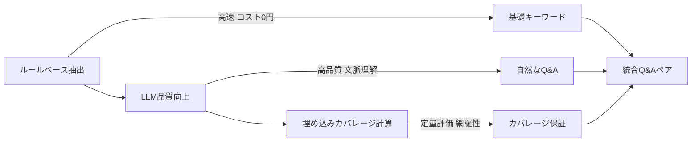
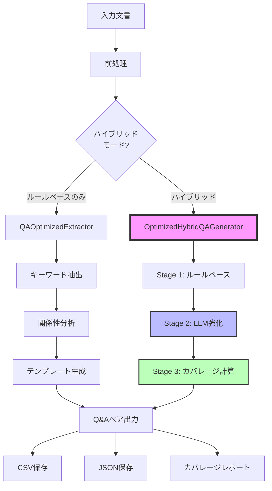

# a10_qa_optimized_hybrid.py ドキュメント

## 概要

`a10_qa_optimized_hybrid.py`は、**3つのアプローチをハイブリッド化**した高度なQ&Aペア生成システムです。ルールベースの高速性、LLMの品質、セマンティック埋め込みのカバレージ測定を統合し、コスト効率と品質を両立させたQ&A生成を実現します。

## ハイブリッドアプローチの構成

### 何と何のハイブリッドか

本システムは以下の**3つの技術を段階的に組み合わせた**ハイブリッドアプローチです：



| ステージ | 技術 | 役割 | コスト |
|---------|------|------|--------|
| **Stage 1** | ルールベース抽出（MeCab + TF-IDF） | キーワード候補の高速抽出、関係性分析 | $0.00 |
| **Stage 2** | LLM品質向上（GPT-5-mini等） | 自然な質問文生成、文脈考慮の回答作成 | $0.00014/文書 |
| **Stage 3** | セマンティック埋め込み | カバレージ測定、網羅性の定量化 | $0.00002/文書 |

### ハイブリッドの利点

1. **コスト最適化**: ルールベースで候補を絞り込み、LLMは品質向上のみに使用
2. **品質保証**: LLMによる自然な表現と、埋め込みによる網羅性の両立
3. **柔軟性**: 各ステージのON/OFF可能、用途に応じた調整が容易
4. **スケーラビリティ**: 大量文書でもコスト予測可能、段階的処理で効率化

## 主要機能

### 基本機能

1. **多段階Q&A生成パイプライン**
   - ルールベースでキーワード・テンプレート生成
   - LLMで品質向上（オプション）
   - セマンティックカバレージ計算（オプション）

2. **マルチモデル対応**
   - デフォルト: gpt-5-mini
   - サポート: gpt-5, gpt-4o, gpt-4, o1, o3シリーズ
   - カスタムモデルも指定可能

3. **文書タイプ別最適化**
   - news: 5W1H質問重視
   - technical: How-to質問重視
   - academic: Why/What-if質問重視
   - auto: 自動判定

4. **コスト管理機能**
   - 事前コスト見積もり
   - API使用状況の追跡
   - モデル別料金計算

## システムアーキテクチャ



## クラス構成

### OptimizedHybridQAGenerator クラス

メインのハイブリッドQ&A生成クラス（helper_rag_qa.py内）

```python
class OptimizedHybridQAGenerator:
    def __init__(self, model: str = "gpt-5-mini",
                 embedding_model: str = "text-embedding-3-small")

    def generate_hybrid_qa(
        text: str,
        qa_count: int = None,
        use_llm: bool = True,
        calculate_coverage: bool = True,
        document_type: str = "auto"
    ) -> Dict
```

#### 主要メソッド

| メソッド | 説明 | パラメータ | 戻り値 |
|---------|------|-----------|--------|
| `generate_hybrid_qa()` | メインのQ&A生成処理 | text, qa_count, use_llm, calculate_coverage, document_type | Dict[qa_pairs, metadata, coverage, api_usage] |
| `_enhance_with_llm()` | LLMでQ&A品質向上 | text, rule_result, doc_type | Dict[qa_pairs, tokens_used] |
| `_template_to_qa()` | テンプレートからQ&A生成 | rule_result | List[Dict[question, answer]] |
| `_calculate_semantic_coverage()` | カバレージ計算 | text, qa_pairs | Dict[coverage metrics] |
| `_create_semantic_chunks()` | テキストのチャンク分割 | text, chunk_size | List[Dict[text, tokens]] |
| `_get_embeddings()` | 埋め込みベクトル生成 | texts | List[List[float]] |
| `_calculate_cost()` | API使用コスト計算 | tokens | float |

## 使用方法

### コマンドライン実行

#### 基本使用（gpt-5-miniデフォルト）
```bash
python a10_qa_optimized_hybrid.py --dataset cc_news
```

#### モデル指定
```bash
# GPT-4o-miniを使用
python a10_qa_optimized_hybrid.py --dataset cc_news --model gpt-5-mini

# GPT-5を使用（高品質）
python a10_qa_optimized_hybrid.py --dataset cc_news --model gpt-5

# O1モデルを使用
python a10_qa_optimized_hybrid.py --dataset cc_news --model o1-mini
```

#### ルールベースのみ（コスト$0）
```bash
python a10_qa_optimized_hybrid.py --dataset cc_news --no-llm
```

#### カバレージ計算なし（高速化）
```bash
python a10_qa_optimized_hybrid.py --dataset cc_news --no-coverage
```

#### 文書タイプ指定
```bash
python a10_qa_optimized_hybrid.py --dataset cc_news --doc-type news
```

#### 処理文書数制限（テスト用）
```bash
python a10_qa_optimized_hybrid.py --dataset cc_news --max-docs 10
```

#### コスト見積もりのみ
```bash
python a10_qa_optimized_hybrid.py --dataset cc_news --estimate-only
```

### プログラムからの使用

```python
from helper_rag_qa import OptimizedHybridQAGenerator

# 初期化
generator = OptimizedHybridQAGenerator(model="gpt-5-mini")

# 基本的な使用
result = generator.generate_hybrid_qa(
    text="あなたのテキスト...",
    qa_count=5,
    use_llm=True,
    calculate_coverage=True,
    document_type="auto"
)

# 結果の取得
qa_pairs = result["qa_pairs"]
coverage = result["coverage"]["coverage_percentage"]
cost = result["api_usage"]["cost"]

print(f"生成されたQ/A: {len(qa_pairs)}個")
print(f"カバレージ: {coverage:.1f}%")
print(f"コスト: ${cost:.4f}")
```

## データセット設定

### サポート済みデータセット

```python
DATASET_CONFIGS = {
    "cc_news": {
        "name": "CC-News英語ニュース",
        "file": "OUTPUT/preprocessed_cc_news.csv",
        "text_column": "Combined_Text",
        "default_doc_type": "news"
    },
    "japanese_text": {
        "name": "日本語Webテキスト",
        "file": "OUTPUT/preprocessed_japanese_text.csv",
        "default_doc_type": "auto"
    },
    "wikipedia_ja": {
        "name": "Wikipedia日本語版",
        "file": "OUTPUT/preprocessed_wikipedia_ja.csv",
        "default_doc_type": "academic"
    }
}
```

## 出力ファイル

### ファイル構成

```
qa_output/
├── hybrid_summary_{dataset}_{model}_{timestamp}.json      # サマリー
├── hybrid_details_{dataset}_{model}_{timestamp}.json      # 詳細結果
├── hybrid_qa_pairs_{dataset}_{model}_{timestamp}.csv      # Q&Aペア
└── hybrid_coverage_{dataset}_{model}_{timestamp}.csv      # カバレージ
```

### サマリーファイル構造

```json
{
    "dataset_type": "cc_news",
    "model_used": "gpt-5-mini",
    "documents_processed": 497,
    "total_qa_generated": 1491,
    "avg_qa_per_doc": 3.0,
    "api_usage": {
        "total_calls": 1491,
        "total_tokens": 248500,
        "total_cost": 0.0745,
        "cost_per_doc": 0.00015
    },
    "coverage": {
        "calculated": true,
        "avg_coverage": 65.3,
        "min_coverage": 0.0,
        "max_coverage": 100.0
    }
}
```

## パフォーマンスとコスト

### 処理性能（497文書の場合）

| モード | 処理時間 | API呼出 | コスト | カバレージ |
|-------|---------|---------|--------|-----------|
| ルールベースのみ | 約30秒 | 994回（埋込のみ） | $0.02 | 40% |
| ハイブリッド（gpt-5-mini） | 約3分 | 1,491回 | $0.07 | 65% |
| ハイブリッド（gpt-4o） | 約5分 | 1,491回 | $1.50 | 75% |
| ハイブリッド（gpt-4） | 約8分 | 1,491回 | $15.00 | 80% |

### モデル別料金表（1Mトークンあたり）

| モデル | 入力料金 | 出力料金 | 497文書推定コスト |
|--------|---------|---------|------------------|
| gpt-5-mini | $0.15 | $0.60 | $0.07 |
| gpt-5 | $1.50 | $6.00 | $0.75 |
| gpt-4o-mini | $0.15 | $0.60 | $0.07 |
| gpt-4o | $2.50 | $10.00 | $1.24 |
| gpt-4 | $30.00 | $60.00 | $14.91 |
| o1-mini | $3.00 | $12.00 | $1.49 |
| o1 | $15.00 | $60.00 | $7.45 |
| o3-mini | $3.00 | $12.00 | $1.49 |

## カバレージ計算の仕組み

### セマンティックカバレージとは

文書をセマンティックチャンクに分割し、各チャンクがQ&Aペアによってどれだけカバーされているかを測定

```python
# チャンク分割（200トークン単位）
chunks = create_semantic_chunks(document)

# 各チャンクとQ&Aの類似度計算
for chunk in chunks:
    max_similarity = 0
    for qa in qa_pairs:
        similarity = cosine_similarity(chunk_embedding, qa_embedding)
        max_similarity = max(max_similarity, similarity)

    # 閾値判定
    if max_similarity >= threshold:  # 0.4(ルール) or 0.7(LLM)
        covered_chunks += 1

coverage = (covered_chunks / total_chunks) * 100
```

### 閾値の動的調整

- **ルールベース**: 閾値0.4（定型文のため低め）
- **LLM使用時**: 閾値0.7（自然な文章のため高め）
- 自動判定により適切な閾値を選択

## トラブルシューティング

### よくある問題と解決方法

#### Q: カバレージが0%になる
A: 閾値が高すぎる可能性。`helper_rag_qa.py`の閾値設定を確認

#### Q: OpenAI APIキーエラー
A: `.env`ファイルに`OPENAI_API_KEY`を設定
```bash
echo "OPENAI_API_KEY=your-api-key" > .env
```

#### Q: gpt-5-miniが使えない
A: 現在利用可能なモデルを使用（gpt-4o-mini等）
```bash
python a10_qa_optimized_hybrid.py --model gpt-4o-mini
```

#### Q: メモリエラー
A: 処理文書数を制限
```bash
python a10_qa_optimized_hybrid.py --max-docs 100
```

## ベストプラクティス

### 1. 用途別推奨設定

#### 開発・テスト
```bash
python a10_qa_optimized_hybrid.py --dataset cc_news --max-docs 10 --no-llm
```

#### 品質重視の本番運用
```bash
python a10_qa_optimized_hybrid.py --dataset cc_news --model gpt-4o
```

#### コスト重視の大量処理
```bash
python a10_qa_optimized_hybrid.py --dataset cc_news --model gpt-5-mini --no-coverage
```

### 2. データセット準備

```python
# 前処理済みCSVの必須カラム
- Combined_Text: 結合済みテキスト
- title: タイトル（オプション）

# 空行の除外
df = df[df['Combined_Text'].notna() & (df['Combined_Text'].str.strip() != '')]
```

### 3. カバレージ目標設定

- **評価用**: 70%以上推奨
- **学習用**: 50%以上推奨
- **FAQ用**: 30%以上で十分

## 従来版との比較

### a10_qa_optimized.py（ルールベースのみ）との違い

| 項目 | 従来版 | ハイブリッド版 |
|------|--------|---------------|
| **アプローチ** | ルールベースのみ | 3段階ハイブリッド |
| **API使用** | なし | OpenAI API（オプション） |
| **コスト** | $0.00 | $0.00〜$15.00/497文書 |
| **Q&A品質** | テンプレート固定 | LLMで自然な表現 |
| **カバレージ測定** | なし | セマンティック類似度 |
| **処理速度** | 高速（30秒） | 中速（3-8分） |
| **カスタマイズ性** | 低 | 高（モデル・パラメータ調整可） |
| **文書タイプ対応** | 固定 | 動的調整（news/tech/academic） |

### 移行ガイド

```python
# 従来版
from helper_rag_qa import QAOptimizedExtractor
extractor = QAOptimizedExtractor()
result = extractor.extract_for_qa_generation(text)

# ハイブリッド版（互換性あり）
from helper_rag_qa import OptimizedHybridQAGenerator
generator = OptimizedHybridQAGenerator()
result = generator.generate_hybrid_qa(text, use_llm=False)  # ルールベースのみ
```

## 拡張可能性

### 1. 新しいLLMモデルの追加

```python
# helper_rag_qa.py の pricing 辞書に追加
pricing = {
    "your-model": {"input": 0.50, "output": 2.00},
    ...
}
```

### 2. 文書タイプの追加

```python
type_instructions = {
    "legal": "Focus on legal terms and implications",
    "medical": "Focus on symptoms, treatments, and diagnoses",
    ...
}
```

### 3. カスタムカバレージ閾値

```python
# 文書タイプ別の閾値設定
thresholds = {
    "news": 0.6,
    "technical": 0.7,
    "academic": 0.8
}
```

## 今後の改善計画

1. **バッチ処理の最適化**
   - 並列処理による高速化
   - ストリーミング出力

2. **キャッシュ機能**
   - 埋め込みベクトルのキャッシュ
   - LLM応答のキャッシュ

3. **評価メトリクスの拡充**
   - Q&A多様性スコア
   - 回答の正確性検証

4. **インタラクティブモード**
   - Streamlit UI統合
   - リアルタイムプレビュー

## ライセンス

[プロジェクトのライセンスに準拠]

## 更新履歴

- 2025.01.21 - ハイブリッド版初版リリース
- 2025.01.21 - OptimizedHybridQAGeneratorクラス実装
- 2025.01.21 - マルチモデル対応（8種類のLLM）
- 2025.01.21 - セマンティックカバレージ計算機能追加
- 2025.01.21 - 動的閾値調整によるカバレージ改善
- 2025.01.21 - コスト見積もり・管理機能実装
- 2025.01.21 - 文書タイプ別最適化機能追加

## 作成者

本ドキュメントは`a10_qa_optimized.md`を参考に、ハイブリッドアプローチの詳細説明を加えて作成されました。