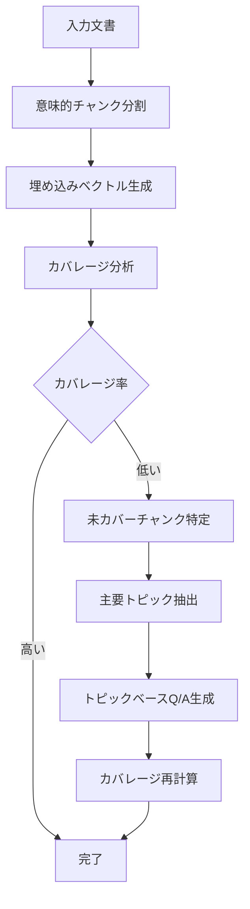

# example.py ドキュメント

## 概要

`example.py`は、日本語文書に対するセマンティックカバレージ分析とQ/Aペア自動生成を行うPythonスクリプトです。文書を意味的にチャンク分割し、Q/Aペアによるカバレージを評価・改善する機能を提供します。

## 主要機能

1. **意味的チャンク分割** - 文書を意味的に関連する単位に分割
2. **セマンティックカバレージ分析** - Q/Aペアによる文書カバレージ率の計算
3. **主要トピック抽出** - MeCab/正規表現による日本語キーワード抽出
4. **Q/Aペア自動生成** - GPTを使用した文書内容からのQ/A生成
5. **カバレージ自動改善** - 未カバー領域への自動Q/A追加

## システムアーキテクチャ



## 実行フロー

### 1. 初期化フェーズ

```python
# 環境変数読み込み
load_dotenv()

# SemanticCoverageクラスの初期化
analyzer = SemanticCoverage()
```

### 2. チャンク分割フェーズ

```python
# 文書を意味的チャンクに分割
chunks = analyzer.create_semantic_chunks(example_document)
```

### 3. カバレージ分析フェーズ

```python
# カバレージマトリックス計算
coverage_matrix, max_similarities = calculate_coverage_matrix(
    doc_chunks, qa_pairs, analyzer
)

# カバレージ率計算（閾値: 0.7）
coverage_rate = sum(s > 0.7 for s in max_similarities) / len(doc_chunks)
```

### 4. 自動改善フェーズ

```python
# 未カバーチャンクに対してQ/A自動生成
improved_qa_pairs, initial_rate, final_rate = improve_coverage_with_auto_qa(
    chunks, existing_qa_pairs, analyzer
)
```

## 主要関数リファレンス

### コア機能


| 関数名                            | 説明                                 | パラメータ                                             | 戻り値                                      |
| --------------------------------- | ------------------------------------ | ------------------------------------------------------ | ------------------------------------------- |
| `demonstrate_semantic_coverage()` | セマンティックカバレージの処理を実演 | なし                                                   | coverage_matrix, max_similarities           |
| `calculate_coverage_matrix()`     | カバレージマトリックスを計算         | doc_chunks, qa_pairs, analyzer                         | coverage_matrix, max_similarities           |
| `identify_uncovered_chunks()`     | 未カバーチャンクを特定               | doc_chunks, max_similarities, threshold=0.7            | uncovered_chunks list                       |
| `improve_coverage_with_auto_qa()` | カバレージを自動改善                 | doc_chunks, existing_qa_pairs, analyzer, threshold=0.7 | improved_qa_pairs, initial_rate, final_rate |

### キーワード抽出


| 関数名                 | 説明                             | パラメータ                     | 戻り値                |
| ---------------------- | -------------------------------- | ------------------------------ | --------------------- |
| `extract_keywords()`   | テキストから重要キーワードを抽出 | text, top_n=5, use_mecab=False | keywords list         |
| `calculate_priority()` | 未カバーチャンクの優先度を計算   | uncovered_chunks               | (chunk, score) tuples |

### Q/Aペア生成


| 関数名                           | 説明                        | パラメータ                                            | 戻り値            |
| -------------------------------- | --------------------------- | ----------------------------------------------------- | ----------------- |
| `determine_qa_pairs_count()`     | 最適なQ/Aペア数を決定       | chunk                                                 | count (2-5)       |
| `generate_qa_pairs_from_chunk()` | チャンクからQ/Aペアを生成   | chunk, model="gpt-5-mini"                             | qa_pairs list     |
| `generate_topic_based_qa()`      | トピックベースでQ/A生成     | chunk_text, keywords, existing_qa, model, num_pairs=3 | qa_pairs list     |
| `generate_qa_for_all_chunks()`   | 全チャンクからQ/Aペアを生成 | chunks, model="gpt-5-mini"                            | all_qa_pairs list |

### 可視化・表示


| 関数名                          | 説明                           | パラメータ                            | 戻り値            |
| ------------------------------- | ------------------------------ | ------------------------------------- | ----------------- |
| `visualize_semantic_coverage()` | カバレージマトリックスの可視化 | coverage_matrix, doc_chunks, qa_pairs | matplotlib figure |
| `display_qa_pairs()`            | 生成されたQ/Aペアを表示        | qa_pairs                              | なし              |
| `interpret_results()`           | 結果の解釈とアクション提案     | coverage_rate, uncovered_chunks       | なし              |

### ユーティリティ


| 関数名                           | 説明                 | パラメータ                    | 戻り値                     |
| -------------------------------- | -------------------- | ----------------------------- | -------------------------- |
| `predict_coverage_improvement()` | カバレージ改善を予測 | chunk, new_qa_pairs, analyzer | predicted_similarity float |

## データ構造

### チャンク（Chunk）

```python
{
    'id': 'chunk_0',               # チャンクID
    'text': '...',                 # テキスト内容
    'sentences': [...],            # 文のリスト
    'start_sentence_idx': 0,       # 開始文インデックス
    'end_sentence_idx': 3,         # 終了文インデックス
}
```

### Q/Aペア

```python
{
    'question': '質問文',
    'answer': '回答文',
    'question_type': 'fact/reason/comparison/application',
    'source_chunk_id': 'chunk_0',  # ソースチャンクID
    'auto_generated': True          # 自動生成フラグ
}
```

### 未カバーチャンク情報

```python
{
    'chunk': {...},                # チャンクデータ
    'index': 0,                    # インデックス
    'similarity': 0.622,           # 現在の類似度
    'gap': 0.078,                  # カバレージギャップ
    'text': '...'                  # テキスト
}
```

## 設定値

### カバレージ判定閾値

- **デフォルト**: 0.7
- **意味**: この値以上の類似度でカバーされたと判定

### チャンクサイズ

- **最大トークン数**: 200
- **最小文数**: 2

### Q/Aペア生成数

- **最小**: 2個/チャンク
- **最大**: 5個/チャンク
- **決定要因**: トークン数、文数

### 使用モデル

- **デフォルト**: gpt-5-mini
- **代替**: gpt-4, gpt-3.5-turbo

## MeCab対応

### インストール

```bash
pip install mecab-python3
pip install unidic-lite
```

### 使用方法

```python
# MeCab版を使用
keywords = extract_keywords(text, top_n=5, use_mecab=True)

# 正規表現版を使用（デフォルト）
keywords = extract_keywords(text, top_n=5, use_mecab=False)
```

### MeCab版の特徴

- 形態素解析による正確な品詞判定
- 複合名詞の自動抽出
- 固有名詞、サ変接続の重み付け
- ストップワードの精密な除外

## 実行例

### 基本的な実行

```bash
python example.py
```

### 処理の流れ

1. 意味的チャンク分割
2. キーワード抽出（MeCab/正規表現）
3. Q/Aペア生成（オプション）
4. セマンティックカバレージ分析（オプション）
5. カバレージ自動改善（オプション）

### 出力例

```
============================================================
主要トピックベースのカバレージ改善
============================================================

初期カバレージ率: 50.0%
未カバーチャンク数: 1

未カバーチャンク 1/1 処理中...
  現在の類似度: 0.622
  カバレージギャップ: 0.078
  主要トピック: AI, NLP, トランスフォーマーモデル, BERT, GPT
  生成Q/A数: 3
  予測カバレージ: 0.622 → 0.85

============================================================
カバレージ改善結果
============================================================
初期カバレージ率: 50.0%
最終カバレージ率: 100.0%
改善度: +50.0%
新規生成Q/A数: 3
総Q/A数: 5
```

## エラー処理

### OpenAI API エラー

- リトライ機能（最大3回）
- 指数バックオフ（2^attempt秒待機）
- エラー時は空のQ/Aペアを返す

### MeCab利用不可時

- 自動的に正規表現版にフォールバック
- エラーメッセージを表示してインストール方法を案内

### 環境変数未設定

```python
if not api_key or api_key == "your-openai-api-key-here":
    print("⚠️ OPENAI_API_KEYが正しく設定されていません。")
    return
```

## パフォーマンス最適化

### 埋め込みベクトルのキャッシュ

- 一度生成した埋め込みは再利用
- numpy配列として効率的に保存

### バッチ処理

- 複数のチャンクを一度に処理
- API呼び出しの最小化

### 並列処理の可能性

- チャンクごとのQ/A生成は独立
- 将来的に並列化可能

## 今後の拡張可能性

1. **多言語対応**

   - 英語、中国語などへの拡張
   - 言語別のキーワード抽出ロジック
2. **カスタムモデル対応**

   - ローカルLLMの利用
   - ファインチューニングモデルの適用
3. **評価メトリクスの追加**

   - ROUGE、BLEUスコアの計算
   - 人間評価との相関分析
4. **インタラクティブモード**

   - WebUI/CLIの実装
   - リアルタイムフィードバック
5. **データベース統合**

   - Q/Aペアの永続化
   - バージョン管理機能

## トラブルシューティング

### Q: MeCabエラーが発生する

A: `pip install mecab-python3 unidic-lite`を実行してください

### Q: OpenAI APIエラーが発生する

A: `.env`ファイルにOPENAI_API_KEYを正しく設定してください

### Q: カバレージが改善されない

A: 閾値を調整するか、Q/A生成数を増やしてください

### Q: メモリエラーが発生する

A: チャンクサイズを小さくするか、処理を分割してください

## ライセンス

[プロジェクトのライセンスに準拠]

## 更新履歴

- 2024.01 - 初版作成
- 2024.01 - MeCab対応追加
- 2024.01 - 主要トピックベースQ/A生成機能追加
- 2024.01 - カバレージ自動改善機能実装
