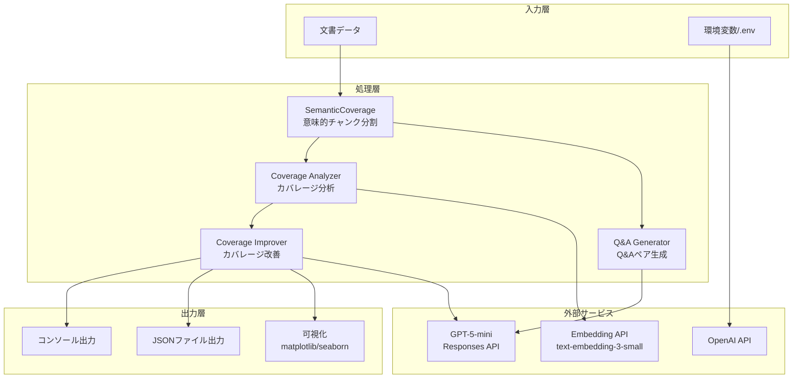

# make_qa.py ドキュメント

## 概要

`make_qa.py`は、日本語文書に対するセマンティックカバレージ分析とQ/Aペア自動生成を実証するデモンストレーションスクリプトです。文書を意味的にチャンク分割し、Q/Aペアによるカバレージを評価・改善する包括的な機能を提供します。

## 主要機能

1. **意味的チャンク分割の実演** - SemanticCoverageクラスを使用した文書の意味的分割
2. **セマンティックカバレージ分析** - Q/Aペアによる文書カバレージ率の詳細な計算と可視化
3. **日本語キーワード抽出** - 正規表現ベースの簡易的なキーワード抽出（MeCab対応可）
4. **Q/Aペア自動生成** - OpenAI GPTモデルを使用した高品質なQ/A生成
5. **カバレージ自動改善** - 未カバー領域の特定と主要トピックベースのQ/A補完
6. **結果の可視化** - matplotlibによるカバレージマトリックスのヒートマップ表示

## システムアーキテクチャ



## 実行フロー

### 1. 初期化フェーズ
```python
# 環境変数の読み込み（.envファイルから）
load_dotenv()

# OpenAI APIキーの検証
api_key = os.getenv("OPENAI_API_KEY")

# SemanticCoverageクラスの初期化
analyzer = SemanticCoverage()
```

### 2. デモンストレーションフェーズ
```python
# 文書のチャンク化実演
demonstrate_semantic_coverage()
├── チャンク化処理
├── 埋め込みベクトル生成
├── カバレージ計算
└── カバレージサマリー表示
```

### 3. メイン処理フェーズ（main関数）
```python
main()
├── 意味的チャンク分割の実行
├── 統計情報の計算・表示
├── キーワード抽出
├── Q/Aペア生成（オプション）
├── カバレージ分析（オプション）
└── カバレージ改善（オプション）
```

## 主要関数リファレンス

### コア機能

| 関数名 | 説明 | パラメータ | 戻り値 |
|--------|------|------------|--------|
| `demonstrate_semantic_coverage()` | セマンティックカバレージの完全な処理を実演 | なし | coverage_matrix: ndarray, max_similarities: ndarray |
| `main()` | メイン処理：意味的チャンク分割とインタラクティブな分析 | なし | なし |
| `calculate_coverage_matrix()` | ドキュメントとQ/A間のカバレージマトリックスを計算 | doc_chunks: List[Dict], qa_pairs: List[Dict], analyzer: SemanticCoverage | coverage_matrix: ndarray, max_similarities: ndarray |
| `identify_uncovered_chunks()` | カバレージ閾値未満のチャンクを特定 | doc_chunks: List[Dict], max_similarities: ndarray, threshold: float=0.7 | uncovered_chunks: List[Dict] |
| `improve_coverage_with_auto_qa()` | 未カバーチャンクに対してQ/Aを自動生成して改善 | doc_chunks: List[Dict], existing_qa_pairs: List[Dict], analyzer: SemanticCoverage, threshold: float=0.7 | improved_qa_pairs: List[Dict], initial_rate: float, final_rate: float |

### キーワード抽出

| 関数名 | 説明 | パラメータ | 戻り値 |
|--------|------|------------|--------|
| `extract_keywords()` | 日本語テキストから重要キーワードを抽出 | text: str, top_n: int=5, use_mecab: bool=False | keywords: List[str] |
| `calculate_priority()` | 未カバーチャンクの優先度スコアを計算 | uncovered_chunks: List[Dict] | priority_scores: List[Tuple[str, float]] |

### Q/Aペア生成

| 関数名 | 説明 | パラメータ | 戻り値 |
|--------|------|------------|--------|
| `determine_qa_pairs_count()` | チャンクサイズに基づく最適なQ/A数を決定 | chunk: Dict | count: int (2-5) |
| `generate_qa_pairs_from_chunk()` | 単一チャンクからQ/Aペアを生成（GPT API使用） | chunk: Dict, model: str="gpt-5-mini" | qa_pairs: List[Dict] |
| `generate_topic_based_qa()` | 主要トピックに焦点を当てたQ/A生成 | chunk_text: str, keywords: List[str], existing_qa: List[Dict], model: str="gpt-5-mini", num_pairs: int=3 | qa_pairs: List[Dict] |
| `generate_qa_for_all_chunks()` | 全チャンクに対するバッチQ/A生成 | chunks: List[Dict], model: str="gpt-5-mini" | all_qa_pairs: List[Dict] |

### 可視化・表示

| 関数名 | 説明 | パラメータ | 戻り値 |
|--------|------|------------|--------|
| `visualize_semantic_coverage()` | カバレージマトリックスのヒートマップ生成 | coverage_matrix: ndarray, doc_chunks: List[Dict], qa_pairs: List[Dict] | fig: matplotlib.figure.Figure |
| `display_qa_pairs()` | Q/Aペアをチャンクごとにグループ化して表示 | qa_pairs: List[Dict] | なし |
| `interpret_results()` | カバレージ率の評価とアクション提案 | coverage_rate: float, uncovered_chunks: List[str] | なし |

### ユーティリティ

| 関数名 | 説明 | パラメータ | 戻り値 |
|--------|------|------------|--------|
| `predict_coverage_improvement()` | 新Q/Aペアによるカバレージ改善を予測 | chunk: Dict, new_qa_pairs: List[Dict], analyzer: SemanticCoverage | predicted_similarity: float |

## SemanticCoverage クラスの詳細

本プロジェクトのカバレッジ分析は、SemanticCoverageが担う「意味的チャンク分割・埋め込み・類似度計算」を中核に成り立ちます。ここでは役割、主要メソッド、実運用上の注意点をまとめます。

### 概要と責務
- 文書を文境界を尊重してチャンク化（文脈の断絶を避ける）
- チャンクおよび任意テキストをOpenAI Embeddingsでベクトル化（L2正規化）
- 正規化ベクトルのコサイン類似度を提供（高速な内積計算に対応）

実装は`a03_rag_qa_coverage.py`にあり、`make_qa.py`からは`SemanticCoverage`インスタンス（`analyzer`）として利用します。

### make_qa.py での利用ポイント
- デモ実演（`demonstrate_semantic_coverage()`）
  - チャンク分割 → チャンク埋め込み → Q/A埋め込み → 類似度行列 → 最大類似度とカバー判定（しきい値0.7）
- メイン処理（`main()`）
  - 分割結果の詳細（文数・トークン数・開始/終了インデックス）を表示
  - その後のカバレッジ分析・改善の基盤としてベクトル化/類似度計算を提供

### 主なメソッド
- `create_semantic_chunks(document: str, verbose: bool=True) -> List[Dict]`
  - 文末記号（`。．.!?`）で分割し、最大約200トークン/チャンクを目安にまとめる。
  - 短すぎる末尾チャンクは直前とマージ（合計が約300トークン未満なら結合）し、トピック連続性を担保。
  - 返却チャンクは`{'id','text','sentences','start_sentence_idx','end_sentence_idx'}`構造。

- `generate_embeddings(doc_chunks: List[Dict]) -> np.ndarray`
  - 複数チャンクをバッチ（既定20件）でEmbeddings APIに投げ、各ベクトルをL2正規化して返す（後述に詳細）。

- `generate_embedding(text: str) -> np.ndarray`
  - 単一テキストの埋め込み生成。Q/Aペア側のベクトル化に使用。

- `cosine_similarity(doc_emb: np.ndarray, qa_emb: np.ndarray) -> float`
  - 正規化済みベクトルなら内積で高速に算出。未正規化時はフルのコサイン計算を実施。

### 設計上のポイント
- チャンク分割は「意味の塊」を維持することを重視（文単位、サイズ上限、短チャンクの結合）。
- ベクトルは正規化して保存・使用することで、スケール差の影響を排除し、類似度計算を高速化。
- カバレッジ判定の標準しきい値は0.7（用途により0.6/0.8等に調整可）。

### カスタマイズ例
- 埋め込みモデル: `SemanticCoverage(embedding_model="text-embedding-3-small")` → 例えば`...-large`に変更可。
- チャンクサイズ: 200/300トークン閾値を要件に合わせて調整（トピックの粒度とレイテンシのトレードオフ）。

### 注意点 / 落とし穴
- モデル次元の不一致: フォールバック（ゼロベクトル）の次元は実装上1536固定。モデル変更時は整合性に注意。
- API失敗時の扱い: バッチ失敗はそのバッチ全件をゼロベクトルで埋めるため、該当チャンクの類似度が0になりやすい（再試行やログ監視を推奨）。

## generate_embeddings(doc_chunks) の詳細

SemanticCoverageにおける「複数チャンクのベクトル化」中核処理です。入力/出力仕様、アルゴリズム、正規化、エラー処理を以下に整理します。

### 役割とI/O
- 役割: `doc_chunks`（各要素に`text`を持つ辞書）をEmbeddings APIで一括ベクトル化し、行方向に整列した`numpy.ndarray`で返却。
- 入力: `List[Dict]`（例: `[{"id":"chunk_0","text":"..."}, ...]`）
- 出力: `np.ndarray`（形状`(len(doc_chunks), D)`、`text-embedding-3-small`では`D=1536`）

### 処理フロー
1. バッチ分割
   - 既定`batch_size = 20`で`doc_chunks`を分割し順次処理。
   - 各バッチから`texts = [chunk["text"] for chunk in batch]`を抽出。
2. Embeddings API呼び出し
   - `self.client.embeddings.create(model=self.embedding_model, input=texts)`
   - レスポンス`data`配列の各`embedding`を`np.array`化。
3. L2正規化
   - 各ベクトルを`embedding / ||embedding||`で正規化。
   - これにより`cosine_similarity`側で内積のみで高速に類似度計算が可能。
4. エラーハンドリング
   - 例外時はバッチ単位で捕捉し、エラーログを出力。
   - そのバッチ件数分のゼロベクトル`np.zeros(1536)`を詰めて継続（安全重視）。
5. 結果整形
   - 収集したリストを`np.array(embeddings)`にして返却。

### 正規化の意義
- 文長や強度の差に由来するスケール影響を除去し、「方向」のみで比較可能にする。
- 正規化済み同士は内積=コサイン類似度となるため、類似度行列の計算を高速化できる（行列積での一括計算にも拡張しやすい）。

### パフォーマンスとスケーリング
- バッチ処理によりAPI呼び出し回数を削減し、スループットを最適化。
- 返却は`np.ndarray`のため、そのままカバレッジ行列計算に投入可能（`calculate_coverage_matrix()`）。
- 大量データ時はバッチサイズの調整や、ベクトルキャッシュ（ディスク/メモリ）の併用を検討。

### よくある課題と対策
- 維持管理: モデル変更時は埋め込み次元の差異に注意（ゼロベクトル次元の固定化を改善する、初回成功レスポンスの次元を記録する等）。
- フェイルセーフ: API失敗の一時的増加でゼロベクトルが多発しうる。指数バックオフ/リトライをラッパー側で導入すると堅牢性が上がる。
- 品質: 文脈保持のためチャンクが長すぎる/短すぎる場合は類似度に悪影響。トークン閾値の調整が有効。

### 連携箇所の確認
- `demonstrate_semantic_coverage()`と`calculate_coverage_matrix()`で、本処理の出力をQ/A側埋め込みと組み合わせて類似度行列を構築。
- Q/A側は`generate_embedding(text)`で個別ベクトル化（同様に正規化済み）。

## データ構造

### Pydanticモデル
```python
class QAPair(BaseModel):
    question: str          # 質問文
    answer: str           # 回答文
    question_type: str    # 質問タイプ

class QAPairsResponse(BaseModel):
    qa_pairs: List[QAPair]  # Q/Aペアのリスト
```

### チャンク構造
```python
{
    'id': 'chunk_0',               # チャンクID
    'text': '...',                 # テキスト内容
    'sentences': [...],            # 文のリスト
    'start_sentence_idx': 0,       # 開始文インデックス
    'end_sentence_idx': 3          # 終了文インデックス
}
```

### Q/Aペア構造
```python
{
    'question': '質問文',
    'answer': '回答文',
    'question_type': 'fact/reason/comparison/application',
    'source_chunk_id': 'chunk_0',  # ソースチャンクID
    'auto_generated': True          # 自動生成フラグ（オプション）
}
```

### 未カバーチャンク情報
```python
{
    'chunk': {...},                # チャンクデータ
    'index': 0,                    # インデックス
    'similarity': 0.622,           # 現在の最大類似度
    'gap': 0.078,                  # カバレージギャップ（閾値との差）
    'text': '...'                  # チャンクのテキスト
}
```

## 設定値と定数

### カバレージ判定パラメータ
- **カバレージ閾値**: 0.7（70%以上の類似度でカバー判定）
- **最大カバレージ閾値**: 0.8（優秀判定）
- **良好カバレージ閾値**: 0.6
- **改善必要閾値**: 0.4

### チャンク分割パラメータ
- **最大トークン数**: 200トークン/チャンク
- **最小文数**: 2文/チャンク
- **トークンエンコーディング**: "cl100k_base"

### Q/Aペア生成パラメータ
- **最小Q/A数**: 2個/チャンク
- **最大Q/A数**: 5個/チャンク
- **判定基準**:
  - <50トークン: 2個
  - 50-100トークン: 3個
  - 100-150トークン: 4個
  - >150トークン: 5個

### API設定
- **デフォルトモデル**: "gpt-5-mini"
- **リトライ回数**: 最大3回
- **バックオフ戦略**: 指数バックオフ（2^attempt秒）

### 優先度計算の重み
```python
# calculate_priority()関数内
- 文字数スコア: 30%
- 専門用語密度: 40%
- 数字・記号: 各15%
- キーワードマッチ: 30%
```

## サンプルデータ

### example_document
```python
# AIに関する技術文書のサンプル
- 人工知能、機械学習、深層学習の基盤
- NLP分野でのトランスフォーマーモデル
- BERT、GPTなどの大規模言語モデル
- 画像認識：CNN、Vision Transformer
- AIの応用：医療診断、自動運転
- AIの倫理的課題とバイアス問題
```

### example_qa_pairs
```python
[
    {
        "question": "トランスフォーマーモデルはどの分野で成果を上げていますか？",
        "answer": "自然言語処理（NLP）の分野で革命的な成果を上げています。"
    },
    {
        "question": "AIの応用分野にはどのようなものがありますか？",
        "answer": "医療診断から自動運転まで幅広い分野で応用されています。"
    }
]
```

## 実行例

### コマンドライン実行
```bash
python make_qa.py
```

### 対話型処理フロー
```
========================================================
意味的チャンク分割デモンストレーション
========================================================

✅ OPENAI_API_KEYが設定されています (長さ: 51文字)

SemanticCoverageクラスを初期化中...
✅ 初期化成功

【意味的チャンク分割の実行】
総チャンク数: 2
----------------------------------------

■ チャンク 1 (ID: chunk_0)
  文の数: 3
  トークン数: 85
  内容:
    人工知能（AI）は、機械学習と深層学習を基盤として...

各チャンクからQ/Aペアを生成しますか？ (y/n): y

【Q/Aペア生成】
使用モデル: gpt-5-mini
----------------------------------------

チャンク 1/2 を処理中...
  ✅ 3個のQ/Aペアを生成

完全なセマンティックカバレージ分析を実行しますか？ (y/n): y

============================================================
カバレージ改善結果
============================================================
初期カバレージ率: 50.0%
最終カバレージ率: 100.0%
改善度: +50.0%
新規生成Q/A数: 3
総Q/A数: 5
```

## エラー処理

### OpenAI APIエラー
```python
try:
    completion = client.responses.parse(...)
except Exception as e:
    print(f"⚠️ Q/A生成エラー: {e}")
    # リトライロジック実行（最大3回）
    # 指数バックオフで待機
```

### 環境変数エラー
```python
if not api_key or api_key == "your-openai-api-key-here":
    print("⚠️ OPENAI_API_KEYが正しく設定されていません。")
    print(".envファイルまたは環境変数を確認してください。")
    return
```

### SemanticCoverage初期化エラー
```python
try:
    analyzer = SemanticCoverage()
except Exception as e:
    print(f"❌ 初期化エラー: {e}")
    traceback.print_exc()
    return
```

## 出力ファイル

### Q/Aペアの保存
- **形式**: JSON
- **ファイル名**: `generated_qa_pairs_YYYYMMDD_HHMMSS.json`
- **内容**: 生成されたQ/Aペアの完全なリスト

### 改善後Q/Aペアの保存
- **形式**: JSON
- **ファイル名**: `improved_qa_pairs_YYYYMMDD_HHMMSS.json`
- **内容**: 既存と新規生成を統合した全Q/Aペア

## パフォーマンス最適化

### メモリ効率
- numpy配列による効率的なベクトル演算
- sklearn.metrics.pairwise.cosine_similarityの活用
- 必要最小限のデータのみメモリに保持

### API呼び出し最適化
- バッチ処理による呼び出し回数削減
- エラー時のリトライロジック
- 指数バックオフによる負荷分散

### 計算効率
- ベクトル化された類似度計算
- キャッシュ可能な埋め込みベクトル
- 事前計算された優先度スコア

## 依存関係

### 必須ライブラリ
```python
numpy               # 数値計算
typing              # 型ヒント
openai             # GPT API
pydantic           # データモデル
tiktoken           # トークン計算
sklearn            # コサイン類似度
re                 # 正規表現
os                 # 環境変数
json               # データ保存
time               # タイミング制御
dotenv             # 環境変数管理
matplotlib         # 可視化
seaborn            # ヒートマップ
collections        # データ構造
```

### オプショナル（MeCab版）
```python
mecab-python3      # 形態素解析
unidic-lite        # 辞書データ
```

### 外部依存
```python
from rag_qa import SemanticCoverage  # コアクラス
from example_mecab import extract_keywords_mecab  # MeCab版（オプション）
```

## トラブルシューティング

### Q: ImportError: SemanticCoverageが見つからない
A: `rag_qa.py`が同じディレクトリにあることを確認してください

### Q: OpenAI APIエラー: Invalid API key
A: `.env`ファイルにOPENAI_API_KEYを正しく設定してください

### Q: Q/A生成が失敗する
A: APIクォータやレート制限を確認し、モデル名が正しいか検証してください

### Q: カバレージが改善されない
A: 閾値を0.6や0.5に下げるか、生成Q/A数を増やしてください

### Q: メモリ不足エラー
A: チャンクサイズを100トークンに減らすか、処理を分割してください

### Q: 可視化が表示されない
A: matplotlibのバックエンドを確認し、必要に応じてGUIサポートを有効化してください

## 今後の拡張可能性

1. **並列処理の実装**
   - チャンクごとのQ/A生成を並列化
   - マルチスレッド/非同期処理の導入

2. **キャッシュ機能**
   - 埋め込みベクトルのディスク永続化
   - 生成済みQ/Aの再利用

3. **評価メトリクスの拡充**
   - BLEU、ROUGEスコアの追加
   - 人間評価との相関分析

4. **インタラクティブUI**
   - StreamlitやGradioによるWeb UI
   - リアルタイムフィードバック機能

5. **バッチ処理対応**
   - 複数文書の一括処理
   - CSVエクスポート機能

## ライセンス

[プロジェクトのライセンスに準拠]

## 更新履歴

- 2025.01 - 初版作成
- 2025.01 - デモンストレーション機能実装
- 2025.01 - 主要トピックベースQ/A生成機能追加
- 2025.01 - カバレージ自動改善機能実装
- 2025.01 - 可視化機能とインタラクティブモード追加

---

*最終更新: 2025年1月*
*バージョン: 1.0.0*
