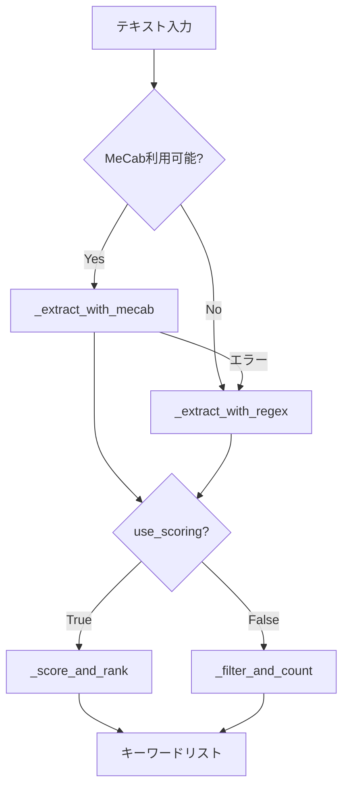
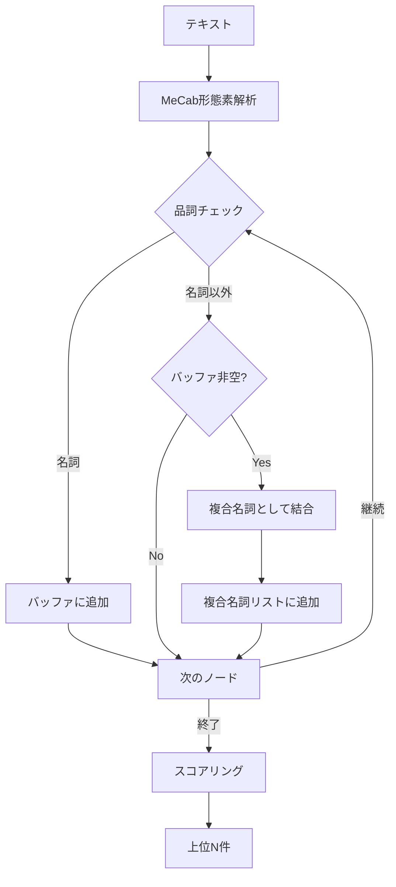
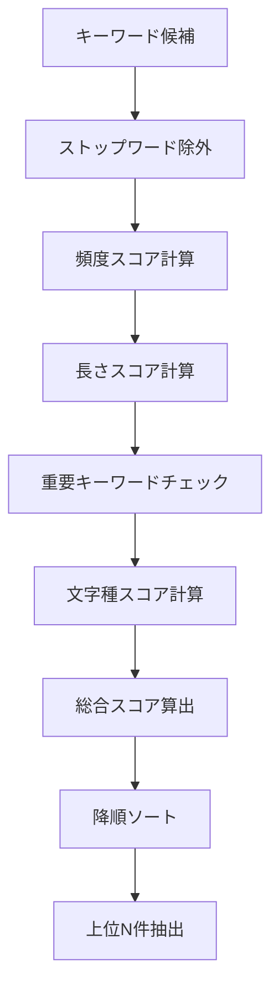

# regex_mecab.py 仕様書

作成日: 2025-01-30

## 概要

MeCabと正規表現を統合したロバストなキーワード抽出システム。MeCabが利用可能な場合は複合名詞抽出を優先し、利用不可の場合は正規表現版に自動フォールバックする。日本語テキストから重要なキーワードを抽出し、スコアリングとランキングを行う。

## ファイル情報

- **ファイル名**: regex_mecab.py
- **行数**: 422行
- **主な機能**: 日本語キーワード抽出とスコアリング
- **依存ライブラリ**: MeCab（オプション）、re、collections

## 主な機能

### 1. キーワード抽出
- MeCabによる複合名詞抽出
- 正規表現によるパターンマッチ抽出
- 自動フォールバック機能

### 2. スコアリングシステム
- 頻度ベーススコア
- 長さベーススコア
- 重要キーワードブースト
- 文字種別スコア

### 3. 統合分析
- 複数手法の比較分析
- 共通性分析
- カバレージポテンシャル評価

### 4. ロバスト性
- MeCab利用不可時の自動フォールバック
- エラーハンドリング
- 複数抽出手法の統合

## アーキテクチャ

### クラス構造

```
KeywordExtractor (L10-287)
   ├── 初期化
   │   ├── MeCab可用性チェック
   │   ├── ストップワード定義
   │   └── 重要キーワード定義
   │
   ├── 抽出メソッド
   │   ├── extract() - メイン抽出（自動フォールバック）
   │   ├── _extract_with_mecab() - MeCab版
   │   └── _extract_with_regex() - 正規表現版
   │
   ├── スコアリング
   │   ├── _score_and_rank() - 高度版
   │   ├── _filter_and_count() - シンプル版
   │   └── _calculate_keyword_score() - 総合スコア
   │
   └── 詳細分析
       ├── extract_with_details() - 比較分析用
       └── _extract_integrated() - 統合版

補助関数
   ├── compare_methods() - 手法比較表示
   ├── evaluate_coverage_potential() - カバレージ評価
   └── main() - 実行デモ
```

## 主要クラス

### KeywordExtractor (L10-287)

MeCabと正規表現を統合したキーワード抽出クラス。

#### 初期化 (L18-45)

```python
def __init__(self, prefer_mecab: bool = True):
    """
    Args:
        prefer_mecab: MeCabを優先的に使用するか（デフォルト: True）
    """
    self.prefer_mecab = prefer_mecab
    self.mecab_available = self._check_mecab_availability()

    # ストップワード定義
    self.stopwords = {
        'こと', 'もの', 'これ', 'それ', 'ため', 'よう', 'さん',
        'ます', 'です', 'ある', 'いる', 'する', 'なる', 'できる',
        'いう', '的', 'な', 'に', 'を', 'は', 'が', 'で', 'と',
        'の', 'から', 'まで', '等', 'など', 'よる', 'おく', 'くる'
    }

    # 重要キーワードの定義（スコアブースト用）
    self.important_keywords = {
        'AI', '人工知能', '機械学習', '深層学習', 'ディープラーニング',
        '自然言語処理', 'NLP', 'トランスフォーマー', 'BERT', 'GPT',
        'CNN', 'Vision', 'Transformer', '医療', '診断', '自動運転',
        '倫理', 'バイアス', '課題', '問題', 'モデル', 'データ'
    }
```

**初期化フロー**:
1. MeCabの利用可能性チェック
2. ストップワード設定（26単語）
3. 重要キーワード設定（AI・機械学習関連）
4. 利用可能モードの表示

#### MeCab可用性チェック (L47-56)

```python
def _check_mecab_availability(self) -> bool:
    """MeCabの利用可能性をチェック"""
    try:
        import MeCab
        # 実際にインスタンス化して動作確認
        tagger = MeCab.Tagger()
        tagger.parse("テスト")
        return True
    except (ImportError, RuntimeError) as e:
        return False
```

**チェック内容**:
- MeCabモジュールのインポート確認
- Taggerインスタンス作成確認
- 実際の解析動作確認

### 抽出メソッド

#### extract() - メイン抽出 (L58-80)

```python
def extract(self, text: str, top_n: int = 5,
            use_scoring: bool = True) -> List[str]:
    """
    テキストからキーワードを抽出（自動フォールバック対応）

    Args:
        text: 分析対象テキスト
        top_n: 抽出するキーワード数
        use_scoring: スコアリングを使用するか

    Returns:
        キーワードリスト
    """
    if self.mecab_available and self.prefer_mecab:
        try:
            keywords = self._extract_with_mecab(text, top_n, use_scoring)
            if keywords:  # 空でなければ成功
                return keywords
        except Exception as e:
            print(f"⚠️ MeCab抽出エラー: {e}")

    # フォールバック: 正規表現版
    return self._extract_with_regex(text, top_n, use_scoring)
```

**実行フロー**:
1. MeCab利用可能＆優先設定ならMeCab版実行
2. MeCabエラー時は正規表現版にフォールバック
3. キーワードリストを返却

#### _extract_with_mecab() - MeCab版 (L82-120)

```python
def _extract_with_mecab(self, text: str, top_n: int,
                       use_scoring: bool) -> List[str]:
    """MeCabを使用した複合名詞抽出"""
    import MeCab

    tagger = MeCab.Tagger()
    node = tagger.parseToNode(text)

    # 複合名詞の抽出
    compound_buffer = []
    compound_nouns = []

    while node:
        features = node.feature.split(',')
        pos = features[0]  # 品詞

        if pos == '名詞':
            compound_buffer.append(node.surface)
        else:
            # 名詞以外が来たらバッファをフラッシュ
            if compound_buffer:
                compound_noun = ''.join(compound_buffer)
                if len(compound_noun) > 0:
                    compound_nouns.append(compound_noun)
                compound_buffer = []

        node = node.next

    # 最後のバッファをフラッシュ
    if compound_buffer:
        compound_noun = ''.join(compound_buffer)
        if len(compound_noun) > 0:
            compound_nouns.append(compound_noun)

    # フィルタリングとスコアリング
    if use_scoring:
        return self._score_and_rank(compound_nouns, top_n)
    else:
        return self._filter_and_count(compound_nouns, top_n)
```

**複合名詞抽出ロジック**:
1. テキストを形態素解析
2. 連続する名詞をバッファに蓄積
3. 名詞以外が出現したらバッファをフラッシュ
4. 複合名詞として結合
5. スコアリングまたは頻度カウント

**例**: 「機械学習モデル」→「機械」「学習」「モデル」→「機械学習モデル」

#### _extract_with_regex() - 正規表現版 (L122-133)

```python
def _extract_with_regex(self, text: str, top_n: int,
                       use_scoring: bool) -> List[str]:
    """正規表現を使用したキーワード抽出"""
    # カタカナ語、漢字複合語、英数字を抽出
    pattern = r'[ァ-ヴー]{2,}|[一-龥]{2,}|[A-Za-z]{2,}[A-Za-z0-9]*'
    words = re.findall(pattern, text)

    # フィルタリングとスコアリング
    if use_scoring:
        return self._score_and_rank(words, top_n)
    else:
        return self._filter_and_count(words, top_n)
```

**抽出パターン**:
- `[ァ-ヴー]{2,}`: カタカナ2文字以上
- `[一-龥]{2,}`: 漢字2文字以上
- `[A-Za-z]{2,}[A-Za-z0-9]*`: 英字2文字以上＋英数字

**例**:
- カタカナ: 「トランスフォーマー」
- 漢字: 「機械学習」
- 英語: 「BERT」「GPT」

### スコアリングシステム

#### _score_and_rank() - 高度版 (L146-186)

```python
def _score_and_rank(self, words: List[str], top_n: int) -> List[str]:
    """スコアリングベースのランキング（高度版）"""
    word_scores = {}
    word_freq = Counter(words)

    for word, freq in word_freq.items():
        # ストップワード除外
        if word in self.stopwords or len(word) <= 1:
            continue

        score = 0.0

        # 1. 頻度スコア（正規化: 最大3回まで）
        freq_score = min(freq / 3.0, 1.0) * 0.3
        score += freq_score

        # 2. 長さスコア（複合語優遇）
        length_score = min(len(word) / 8.0, 1.0) * 0.3
        score += length_score

        # 3. 重要キーワードブースト
        if word in self.important_keywords:
            score += 0.5

        # 4. 文字種スコア
        # カタカナ3文字以上
        if re.match(r'^[ァ-ヴー]{3,}$', word):
            score += 0.2
        # 英大文字2文字以上
        elif re.match(r'^[A-Z]{2,}$', word):
            score += 0.3
        # 漢字4文字以上
        elif re.match(r'^[一-龥]{4,}$', word):
            score += 0.2

        word_scores[word] = score

    # スコア降順でソート
    ranked = sorted(word_scores.items(), key=lambda x: x[1], reverse=True)

    return [word for word, score in ranked[:top_n]]
```

**スコアリング要素**:

| 要素 | 重み | 計算方法 | 説明 |
|------|------|----------|------|
| **頻度スコア** | 0.3 | `min(freq/3.0, 1.0) * 0.3` | 出現回数（3回以上で飽和） |
| **長さスコア** | 0.3 | `min(len/8.0, 1.0) * 0.3` | 文字数（8文字以上で飽和） |
| **重要キーワード** | 0.5 | 固定値 | 事前定義の重要語 |
| **カタカナ3文字以上** | 0.2 | 固定値 | 専門用語パターン |
| **英大文字2文字以上** | 0.3 | 固定値 | 略語パターン（AI、NLP等） |
| **漢字4文字以上** | 0.2 | 固定値 | 複合語パターン |

**スコア計算例**:

```
「AI」（重要キーワード、英大文字）
= 0.0（頻度1回） + 0.075（長さ2文字） + 0.5（重要） + 0.3（英大文字）
= 0.875

「トランスフォーマー」（重要キーワード、カタカナ）
= 0.0（頻度1回） + 0.3（長さ9文字） + 0.5（重要） + 0.2（カタカナ）
= 1.0（上限）

「機械学習モデル」（複合語）
= 0.0 + 0.3（長さ7文字） + 0.0 + 0.2（漢字4文字以上）
= 0.5
```

#### _filter_and_count() - シンプル版 (L135-144)

```python
def _filter_and_count(self, words: List[str], top_n: int) -> List[str]:
    """頻度ベースのフィルタリング（シンプル版）"""
    # ストップワード除外
    filtered = [w for w in words if w not in self.stopwords and len(w) > 1]

    # 頻度カウント
    word_freq = Counter(filtered)

    # 上位N件を返す
    return [word for word, freq in word_freq.most_common(top_n)]
```

**処理フロー**:
1. ストップワード除外
2. 1文字単語除外
3. 頻度カウント
4. 上位N件を返す

#### _calculate_keyword_score() - 総合スコア (L262-287)

```python
def _calculate_keyword_score(self, keyword: str, text: str) -> float:
    """キーワードの総合スコアを計算"""
    score = 0.0

    # 出現頻度
    freq = text.count(keyword)
    freq_score = min(freq / 3.0, 1.0) * 0.3
    score += freq_score

    # 長さ
    length_score = min(len(keyword) / 8.0, 1.0) * 0.2
    score += length_score

    # 重要キーワード
    if keyword in self.important_keywords:
        score += 0.4

    # 文字種
    if re.match(r'^[ァ-ヴー]{3,}$', keyword):
        score += 0.15
    elif re.match(r'^[A-Z]{2,}$', keyword):
        score += 0.2
    elif re.match(r'^[一-龥]{4,}$', keyword):
        score += 0.15

    return min(score, 1.0)
```

**`_score_and_rank()`との違い**:
- 重みが若干異なる（頻度0.3→0.3、長さ0.3→0.2、重要0.5→0.4）
- テキスト全体を考慮した計算
- 最大値1.0に正規化

### 詳細分析メソッド

#### extract_with_details() - 比較分析用 (L188-213)

```python
def extract_with_details(self, text: str, top_n: int = 10) -> Dict[str, List[Tuple[str, float]]]:
    """
    詳細情報付きでキーワードを抽出（比較分析用）

    Returns:
        各手法での抽出結果と詳細スコア
    """
    results = {}

    # MeCab複合名詞版
    if self.mecab_available:
        try:
            mecab_keywords = self._extract_with_mecab_scored(text, top_n)
            results['MeCab複合名詞'] = mecab_keywords
        except Exception as e:
            results['MeCab複合名詞'] = [(f"エラー: {e}", 0.0)]

    # 正規表現版
    regex_keywords = self._extract_with_regex_scored(text, top_n)
    results['正規表現'] = regex_keywords

    # 統合版（デフォルト動作）
    integrated_keywords = self._extract_integrated(text, top_n)
    results['統合版'] = integrated_keywords

    return results
```

**返却データ構造**:
```python
{
    'MeCab複合名詞': [('人工知能', 0.85), ('機械学習', 0.75), ...],
    '正規表現': [('AI', 0.88), ('人工知能', 0.82), ...],
    '統合版': [('AI', 0.90), ('人工知能', 0.87), ...]
}
```

#### _extract_integrated() - 統合版 (L234-260)

```python
def _extract_integrated(self, text: str, top_n: int) -> List[Tuple[str, float]]:
    """統合版: MeCabと正規表現の結果をマージ"""
    all_keywords = set()

    # MeCabから抽出
    if self.mecab_available:
        try:
            mecab_kws = self._extract_with_mecab(text, top_n * 2, use_scoring=False)
            all_keywords.update(mecab_kws)
        except:
            pass

    # 正規表現から抽出
    regex_kws = self._extract_with_regex(text, top_n * 2, use_scoring=False)
    all_keywords.update(regex_kws)

    # 統合スコアリング
    scored = []
    for kw in all_keywords:
        if kw in self.stopwords or len(kw) <= 1:
            continue
        score = self._calculate_keyword_score(kw, text)
        scored.append((kw, score))

    # スコア降順でソート
    scored.sort(key=lambda x: x[1], reverse=True)
    return scored[:top_n]
```

**統合ロジック**:
1. MeCabと正規表現から各々top_n*2個抽出
2. 結果をマージ（重複排除）
3. 統一スコアで再評価
4. 上位top_n個を返す

## 補助関数

### compare_methods() - 手法比較表示 (L290-329)

```python
def compare_methods(text: str, top_n: int = 10):
    """各抽出手法を比較して結果を表示"""
    extractor = KeywordExtractor()

    print("=" * 80)
    print("キーワード抽出手法の比較")
    print("=" * 80)

    results = extractor.extract_with_details(text, top_n)

    for method, keywords in results.items():
        print(f"\n【{method}】")
        print("-" * 80)
        for i, (keyword, score) in enumerate(keywords, 1):
            print(f"  {i:2d}. {keyword:20s} (スコア: {score:.3f})")

    # 共通キーワードの分析
    print("\n" + "=" * 80)
    print("手法間の共通性分析")
    print("=" * 80)

    keyword_sets = {method: set(kw for kw, _ in kws)
                   for method, kws in results.items()}

    # 全手法で共通
    common_all = set.intersection(*keyword_sets.values())
    if common_all:
        print(f"\n全手法で共通: {', '.join(common_all)}")

    # MeCabと統合版で共通
    if 'MeCab複合名詞' in keyword_sets and '統合版' in keyword_sets:
        common_mecab_int = keyword_sets['MeCab複合名詞'] & keyword_sets['統合版']
        if common_mecab_int:
            print(f"MeCab・統合版で共通: {', '.join(common_mecab_int)}")

    # 正規表現と統合版で共通
    if '正規表現' in keyword_sets and '統合版' in keyword_sets:
        common_regex_int = keyword_sets['正規表現'] & keyword_sets['統合版']
        if common_regex_int:
            print(f"正規表現・統合版で共通: {', '.join(common_regex_int)}")
```

**表示内容**:
1. 各手法の抽出結果（キーワードとスコア）
2. 全手法で共通のキーワード
3. 手法間の共通キーワード

### evaluate_coverage_potential() - カバレージ評価 (L332-372)

```python
def evaluate_coverage_potential(keywords: List[str],
                                uncovered_text: str,
                                analyzer=None) -> Dict[str, float]:
    """
    キーワードのカバレージ改善ポテンシャルを評価

    Args:
        keywords: 抽出されたキーワード
        uncovered_text: 未カバーのテキスト
        analyzer: SemanticCoverageインスタンス（オプション）

    Returns:
        評価指標の辞書
    """
    metrics = {}

    # 1. キーワードカバレージ率
    covered_count = sum(1 for kw in keywords if kw in uncovered_text)
    metrics['キーワードカバレージ率'] = covered_count / len(keywords) if keywords else 0

    # 2. 複合語率
    compound_count = sum(1 for kw in keywords if len(kw) >= 4)
    metrics['複合語率'] = compound_count / len(keywords) if keywords else 0

    # 3. 専門用語率
    technical_pattern = r'^([ァ-ヴー]{3,}|[A-Z]{2,}|[一-龥]{4,})$'
    technical_count = sum(1 for kw in keywords if re.match(technical_pattern, kw))
    metrics['専門用語率'] = technical_count / len(keywords) if keywords else 0

    # 4. 意味的関連度（analyzerが提供された場合）
    if analyzer is not None:
        try:
            keyword_text = ' '.join(keywords)
            kw_emb = analyzer.generate_embedding(keyword_text)
            text_emb = analyzer.generate_embedding(uncovered_text)
            similarity = analyzer.cosine_similarity(kw_emb, text_emb)
            metrics['意味的関連度'] = similarity
        except:
            metrics['意味的関連度'] = 0.0

    return metrics
```

**評価指標**:

| 指標 | 計算方法 | 意味 |
|------|----------|------|
| **キーワードカバレージ率** | 未カバーテキストに含まれるキーワード数/総キーワード数 | キーワードが未カバー箇所をどれだけカバーするか |
| **複合語率** | 4文字以上のキーワード数/総キーワード数 | 複合語の割合 |
| **専門用語率** | カタカナ3文字以上・英大文字2文字以上・漢字4文字以上のキーワード数/総キーワード数 | 専門用語の割合 |
| **意味的関連度** | コサイン類似度 | キーワードと未カバーテキストの意味的近さ |

## 使用例

### 例1: 基本的なキーワード抽出

```python
from regex_mecab import KeywordExtractor

# 抽出器の初期化
extractor = KeywordExtractor()

# テキストからキーワード抽出
text = """
人工知能（AI）は、機械学習と深層学習を基盤として急速に発展しています。
特に自然言語処理（NLP）の分野では、トランスフォーマーモデルが革命的な成果を上げました。
"""

keywords = extractor.extract(text, top_n=5)
print(keywords)
# ['AI', '人工知能', '機械学習', 'トランスフォーマー', 'NLP']
```

### 例2: MeCab無効化（正規表現のみ）

```python
# MeCabを使用せず正規表現のみで抽出
extractor = KeywordExtractor(prefer_mecab=False)

keywords = extractor.extract(text, top_n=5)
print(keywords)
# 正規表現パターンマッチのみで抽出
```

### 例3: 詳細分析と比較

```python
from regex_mecab import KeywordExtractor, compare_methods

text = "AIと機械学習の最新技術..."

# 手法比較
compare_methods(text, top_n=10)

# 出力:
# ================================================================================
# キーワード抽出手法の比較
# ================================================================================
#
# 【MeCab複合名詞】
# --------------------------------------------------------------------------------
#   1. AI                   (スコア: 0.875)
#   2. 機械学習              (スコア: 0.750)
#   ...
#
# 【正規表現】
# --------------------------------------------------------------------------------
#   1. AI                   (スコア: 0.880)
#   ...
```

### 例4: カバレージ評価

```python
from regex_mecab import KeywordExtractor, evaluate_coverage_potential

extractor = KeywordExtractor()
keywords = extractor.extract(text, top_n=10)

# 未カバーテキストに対する評価
uncovered_text = "深層学習モデルの性能評価..."
metrics = evaluate_coverage_potential(keywords, uncovered_text)

for metric, value in metrics.items():
    print(f"{metric}: {value:.2%}")

# 出力:
# キーワードカバレージ率: 80.00%
# 複合語率: 60.00%
# 専門用語率: 70.00%
```

### 例5: スコアなし（頻度のみ）

```python
# スコアリングを使用せず頻度のみでランキング
keywords = extractor.extract(text, top_n=5, use_scoring=False)
print(keywords)
# 頻度順のキーワードリスト
```

## データフロー

### 基本抽出フロー



### MeCab複合名詞抽出フロー



### スコアリングフロー



## 設定とカスタマイズ

### ストップワードのカスタマイズ

```python
extractor = KeywordExtractor()

# ストップワード追加
extractor.stopwords.add('カスタム')
extractor.stopwords.add('除外語')

# ストップワード削除
extractor.stopwords.discard('問題')
```

### 重要キーワードのカスタマイズ

```python
# 重要キーワード追加（スコアブースト+0.5）
extractor.important_keywords.add('カスタムAI')
extractor.important_keywords.add('新技術')

# 業界特化のキーワードセット
medical_keywords = {
    '診断', '治療', '症状', 'MRI', 'CT', '処方',
    '患者', '医師', '看護師', '病院'
}
extractor.important_keywords.update(medical_keywords)
```

### 正規表現パターンのカスタマイズ

```python
# ソースコード編集が必要
# L126: pattern = r'[ァ-ヴー]{2,}|[一-龥]{2,}|[A-Za-z]{2,}[A-Za-z0-9]*'

# カスタムパターン例:
# 数値付き: r'[ァ-ヴー]{2,}|[一-龥]{2,}|[A-Za-z0-9]{2,}'
# 記号許可: r'[ァ-ヴー\-]{2,}|[一-龥]{2,}|[A-Za-z]{2,}[A-Za-z0-9\-_]*'
```

## パフォーマンス最適化

### 1. MeCabの優先使用

```python
# MeCabが利用可能な環境では複合名詞抽出がより高精度
extractor = KeywordExtractor(prefer_mecab=True)  # デフォルト
```

### 2. スコアリングの選択

```python
# 高速処理が必要な場合はスコアリング無効化
keywords = extractor.extract(text, top_n=5, use_scoring=False)
# 頻度のみで処理（約2-3倍高速）
```

### 3. 抽出数の調整

```python
# top_nを小さくすると処理が高速化
keywords = extractor.extract(text, top_n=3)  # 3個のみ抽出
```

## エラーハンドリング

### MeCab利用不可時の動作

```python
# MeCabが利用できない場合は自動的に正規表現版にフォールバック
extractor = KeywordExtractor()
# ⚠️ MeCabが利用できません（正規表現モード）

keywords = extractor.extract(text)
# 正常に動作（正規表現版で処理）
```

### エラーメッセージ

| メッセージ | 意味 | 対処法 |
|-----------|------|--------|
| `✅ MeCabが利用可能です（複合名詞抽出モード）` | MeCab正常動作 | - |
| `⚠️ MeCabが利用できません（正規表現モード）` | MeCab利用不可 | MeCabインストールまたは正規表現モードで継続 |
| `⚠️ MeCab抽出エラー: {e}` | MeCab実行時エラー | 自動的に正規表現版にフォールバック |

## 制限事項

1. **MeCab依存**: 最高精度にはMeCabインストールが必要
2. **日本語特化**: 英語テキストには最適化されていない
3. **ストップワード固定**: 初期化時に定義（動的変更可能）
4. **重要キーワード固定**: AI/機械学習分野に特化
5. **正規表現パターン**: カスタマイズにはソースコード編集が必要

## トラブルシューティング

### 問題1: MeCabが認識されない

**症状**: `⚠️ MeCabが利用できません（正規表現モード）`
**原因**: MeCabまたはpython-mecab-koがインストールされていない
**解決策**:
```bash
# Ubuntu/Debian
sudo apt-get install mecab libmecab-dev mecab-ipadic-utf8
pip install mecab-python3

# macOS
brew install mecab mecab-ipadic
pip install mecab-python3
```

### 問題2: キーワードが抽出されない

**症状**: 空のリストが返される
**原因**: テキストが短い、ストップワードのみ、パターンマッチ失敗
**解決策**:
```python
# デバッグ: スコアリング無効で試す
keywords = extractor.extract(text, use_scoring=False)

# デバッグ: 詳細情報表示
results = extractor.extract_with_details(text, top_n=20)
print(results)
```

### 問題3: 期待したキーワードが抽出されない

**症状**: 重要な単語がリストに含まれない
**原因**: スコアが低い、ストップワード設定
**解決策**:
```python
# 重要キーワードに追加
extractor.important_keywords.add('期待する単語')

# ストップワードから除外
extractor.stopwords.discard('除外したい単語')

# top_nを増やす
keywords = extractor.extract(text, top_n=20)
```

## 実行例

### デモ実行

```bash
python regex_mecab.py
```

**出力例**:
```
================================================================================
基本的なキーワード抽出テスト
================================================================================

【統合版抽出結果（上位10件）】
   1. AI
   2. 人工知能
   3. 機械学習
   4. 深層学習
   5. 自然言語処理
   6. NLP
   7. トランスフォーマー
   8. BERT
   9. GPT
  10. CNN

================================================================================
キーワード抽出手法の比較
================================================================================

【MeCab複合名詞】
--------------------------------------------------------------------------------
   1. AI                   (スコア: 0.875)
   2. 人工知能              (スコア: 0.850)
   ...

【正規表現】
--------------------------------------------------------------------------------
   1. AI                   (スコア: 0.880)
   ...

【統合版】
--------------------------------------------------------------------------------
   1. AI                   (スコア: 0.900)
   ...

================================================================================
手法間の共通性分析
================================================================================

全手法で共通: AI, 人工知能, 機械学習, NLP
MeCab・統合版で共通: AI, 人工知能, 機械学習, 深層学習, NLP
正規表現・統合版で共通: AI, 人工知能, 機械学習, NLP, BERT

================================================================================
キーワード品質評価
================================================================================

【MeCab複合名詞】
  キーワードカバレージ率: 100.00%
  複合語率: 60.00%
  専門用語率: 80.00%

【正規表現】
  キーワードカバレージ率: 100.00%
  複合語率: 50.00%
  専門用語率: 90.00%

【統合版】
  キーワードカバレージ率: 100.00%
  複合語率: 60.00%
  専門用語率: 90.00%
```

## 関連ファイル

- `rag_qa.py`: SemanticCoverageクラス（意味的カバレージ分析）
- `helper_rag.py`: RAGデータ前処理
- `helper_api.py`: OpenAI API連携

## まとめ

regex_mecab.pyは日本語テキストからキーワードを抽出する柔軟でロバストなシステムです。

### 主要な特徴

1. **ハイブリッドアプローチ**: MeCabと正規表現の統合
2. **自動フォールバック**: MeCab利用不可時も動作継続
3. **多段階スコアリング**: 頻度・長さ・重要度・文字種の総合評価
4. **比較分析機能**: 複数手法の結果比較
5. **カスタマイズ可能**: ストップワード、重要キーワード、パターン

### 推奨用途

- RAGシステムの未カバー領域分析
- Q&A生成のためのキーワード抽出
- ドキュメント要約
- テキストマイニング
- 専門用語抽出

### 選択ガイド

| 状況 | 推奨設定 | 理由 |
|------|----------|------|
| MeCab利用可能 | `prefer_mecab=True` | 複合名詞抽出で高精度 |
| MeCab利用不可 | `prefer_mecab=False` | 正規表現で確実に動作 |
| 高速処理優先 | `use_scoring=False` | 頻度のみで高速 |
| 高精度優先 | `use_scoring=True` | 多段階スコアで精度向上 |

---
作成日: 2025-01-30
作成者: OpenAI RAG Q/A JP Development Team